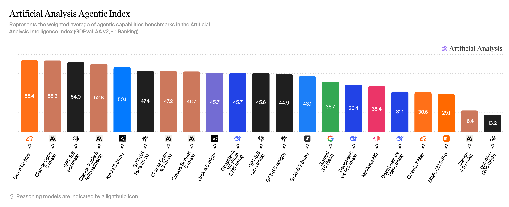

# AI Coding Plan 平台评测与对比

> 更新日期 2026.8.16 | GLM-5.3、DeepSeek-V4-Flash-0731 正式版平台支持更新

## 📖 简介

31 大平台 智谱AI、Kimi、MiniMax、阿里·百炼、字节·方舟、小米·MiMo、OpenCode、Codex、Claude Code、百度·千帆、华为云、腾讯云、京东云，Coding Plan / Token Plan 全面对比。 涵盖DeepSeek-V4-Flash-0731，GLM-5.3，GLM-5.2，Qwen-3.8-Max，Kimi-K3，MiniMax-M3，Doubao-Seed-2.0，MiMo-V2.5-Pro，GPT-5.6等模型

快速选出当下最适合的平台和使用方式。[加群](https://api.dreamfree.space/c/s/cpfeishulink)参与讨论和获取最新消息

### 在线访问

直接访问：[https://www.codingplan.fyi](https://www.codingplan.fyi)

## 延伸阅读

- [2026年8月主流大模型能力对比：Kimi K3 综合国产第一，Qwen3.8 Max Agentic 全球第一，DeepSeek V4 Flash 正式版越级打Pro，国产阵营全面突破](articles/model_comparisons/20260806/index.html)
基于 Artificial Analysis 2026年8月5日基准测试，围绕 Intelligence Index 与 Agentic Index 对 21 款主流大模型横向评测，附选型建议。

- [2026年8月10日 Coding Plan平台全面对比](articles/plan_comparisons/20260810/index.html)
8 月主线是「定价再平衡」：智谱新套餐涨价、Kimi 限购、DeepSeek 新模型上线、字节·方舟 2.5 折持续。覆盖主流平台能力、价格、限购状态与选型建议。
- [全部文章](articles/index.html)

## 平台推荐

### 综合推荐

各维度综合评估，最值得入手的几家。智谱和Kimi暂时不开放了，暂时不推荐了

1. [MiniMax](https://api.dreamfree.space/c/s/cpyqminimax) ⭐️⭐️⭐️⭐️⭐️
    - 性价比依然是所有平台最高
    - 支持MiniMax-M3模型，支持多模态
    - 适合自动化、Agent、酒馆、高强度Coding等高强度场景
2. [智谱国际版](https://api.dreamfree.space/c/s/cpyqzai) ⭐️⭐️⭐️⭐️⭐️
    - 无需抢购
    - 支持GLM-5.2，国内最强的代码模型之一
    - 用量与国内版完全一致，价格大约为国内版两倍左右。使用[邀请链接](https://api.dreamfree.space/c/s/cpyqzai)可享额外9折。有成品号出售，加入[飞书群](https://api.dreamfree.space/c/s/cpfeishulink)查看群公告了解详情。
3. [OpenCode](https://api.dreamfree.space/c/s/cpyqopencode) ⭐️⭐️⭐️⭐️⭐️
    - 支持Kimi-K3、GLM-5.2、DeepSeek-V4-Flash-0731、Gpt-5.6-Luna等最新模型
    - 首月半价$5。但只有go这一种套餐，不够重度使用
    - 无需抢购，可支付宝付款
4. [字节·方舟](https://api.dreamfree.space/c/s/cpyqfangzhou) ⭐️⭐️⭐️⭐️⭐️
    - 已解除限购，开放购买，无需抢购
    - 支持GLM-5.3、DeepSeek-V4，MiniMax-M3，Kimi-K3

### 包含 GLM-5.3

1. [智谱AI](https://api.dreamfree.space/c/s/cpyqzhipu) ⭐️⭐️⭐️⭐️⭐️
    - 在售新 Token Plan 支持 GLM-5.3，国内领先的代码模型之一
    - 新套餐无需抢购
    - 官方服务，模型与套餐信息透明
2. [OpenCode](https://api.dreamfree.space/c/s/cpyqopencode) ⭐️⭐️⭐️⭐️⭐️
    - 支持 GLM-5.3、Kimi-K3、DeepSeek-V4-Pro/Flash 等最新模型
    - Go 套餐首月半价 $5，无需抢购
    - 可支付宝付款，调用抵扣透明
3. [字节·方舟](https://api.dreamfree.space/c/s/cpyqfangzhou) ⭐️⭐️⭐️⭐️⭐️
    - 在售 Coding Plan / Token Plan 均支持 GLM-5.3
    - 同时支持 DeepSeek-V4、MiniMax-M3、Kimi-K3 等模型
    - 已解除限购，开放购买
4. [共绩算力](https://api.dreamfree.space/c/s/cpyqgongji) ⭐️⭐️⭐️⭐️⭐️
    - 按量调用，支持 GLM-5.3、DeepSeek-V4-Pro、Kimi-K3
    - 平台不拥挤，稳定性高
    - 通过**[邀请链接](https://api.dreamfree.space/c/s/cpyqgongji)**进入注册，可以锁定专属8折折扣与额外￥20额度

### 包含 DeepSeek-V4-Flash-0731 正式版

1. [DeepSeek](https://platform.deepseek.com/) ⭐️⭐️⭐️⭐️⭐️
    - 官方 DeepSeek-V4-Flash-0731 正式版，推理与代码能力处于国产第一梯队
    - 按量标价透明，适合不想抢套餐的用户
    - 高峰翻倍后成本优势会收窄
2. [OpenCode](https://api.dreamfree.space/c/s/cpyqopencode) ⭐️⭐️⭐️⭐️⭐️
    - 支持 DeepSeek-V4-Flash-0731 正式版、Kimi-K3、GLM-5.2 等最新模型
    - 首月半价$5。但只有go这一种套餐，够尝鲜，不够重度使用
    - 无需抢购，可支付宝付款
3. [字节·方舟](https://api.dreamfree.space/c/s/cpyqfangzhou) ⭐️⭐️⭐️⭐️⭐️
    - Coding Plan / Token Plan 均支持 DeepSeek-V4-Flash-0731 正式版
    - 同时支持 GLM-5.2、DeepSeek-V4-Pro、DeepSeek-V4-Flash-0731、MiniMax-M3，是国内模型最全的全家桶平台。
    - 已解除限购，开放购买
4. [优云智算](https://api.dreamfree.space/c/s/cpyqyyzs) ⭐️⭐️⭐️⭐️
    - 全档位支持 DeepSeek-V4-Flash-0731 正式版和 GLM-5.2
    - 按照真实接口调用量计费，模型倍率透明
    - 用量较少，适合作为低成本补充

### 包含 Kimi-3

Kimi-K3，7.16日发布的目前最强模型，但费用较贵，按需使用。官方需要抢购

1. [Kimi](https://api.dreamfree.space/c/s/cpyqkimi) ⭐️⭐️⭐️⭐️⭐️
    - 官方原生平台，模型体验最稳定，老会员推荐使用。需要抢购，目前无法新购买了
    - 发布 Kimi-K3 之后，会员停售了，之后应该会启用新的Coding套餐
2. [OpenCode](https://api.dreamfree.space/c/s/cpyqopencode) ⭐️⭐️⭐️⭐️⭐️
    - 支持Kimi-K3、GLM-5.2、DeepSeek-V4-Pro等最新模型
    - 首月半价$5。但只有go这一种套餐，够尝鲜，不够重度使用
    - 无需抢购，可支付宝付款
3. [共绩算力](https://api.dreamfree.space/c/s/cpyqgongji) ⭐️⭐️⭐️⭐️⭐️
    - 按量调用，支持 Kimi-K3、GLM-5.2、DeepSeek-V4-Pro
    - 平台不拥挤，稳定性高
    - 通过**[邀请链接](https://api.dreamfree.space/c/s/cpyqgongji)**进入注册，可以锁定专属8折折扣与额外￥20额度
4. [字节·方舟](https://api.dreamfree.space/c/s/cpyqfangzhou) ⭐️⭐️⭐️⭐️⭐️
    - Token Plan 全档位支持 Kimi-K3；Coding Plan暂不支持 Kimi-K3
    - 同时支持 GLM-5.2、DeepSeek-V4-Pro/Flash、MiniMax-M3，是国内模型最全的全家桶平台。
    - Coding Plan 需抢购；Token Plan 现货。

## 🗂️ 平台对比表

| 平台 | 综合评分 | 购买状态 | 标签 | 性价比 | 模型 | 稳定性 | 简介 |
|------|---------|---------|------|-------|------|-------|------|
| 智谱AI | ⭐️⭐️⭐️⭐️⭐️ | 开放购买 | - | ⭐️⭐️⭐️⭐️ 新套餐价格翻倍，性价比有所下降，[查看套餐用量](index.html?view=plans)。 | ⭐️⭐️⭐️⭐️⭐️ GLM-5.3 代码能力 **T0 级别**，尤其适合编程场景，是 Opus 平替优选。 | ⭐️⭐️⭐️⭐️ 官方服务，稳定性强。高峰时段可能会有繁忙，整体可用性尚可。 | 涨价后新套餐无需抢购。 |
| OpenCode | ⭐️⭐️⭐️⭐️⭐️ | 开放购买 | - | ⭐️⭐️⭐️⭐️⭐️ Go 套餐 $10/月（首月 $5），可使用$15~$60额度。DeepSeek-V4-Flash-0731 每月可达约 15.8 万次请求，量大价低，细节可见[官方文档](https://opencode.ai/docs/go/)。 | ⭐️⭐️⭐️⭐️⭐️ 聚合 Kimi-K3、GLM-5.3、MiniMax-M3、Qwen-3.7-Max、DeepSeek-V4-Pro、DeepSeek-V4-Flash-0731 等模型，新模型上线及时。 | ⭐️⭐️⭐️⭐️⭐️ 各模型基本都是官方通道，稳定性强，较少出现不可用。 | 模型支持全，调用抵扣透明，性价比高，可直接支付宝付款，无需抢购。 |
| 字节·方舟 | ⭐️⭐️⭐️⭐️⭐️ | 开放购买 | - | ⭐️⭐️⭐️⭐️⭐️ 开放购买，无需抢购；具体套餐折扣和模型用量活动以官方公告为准。 | ⭐️⭐️⭐️⭐️⭐️ 支持 GLM-5.3、DeepSeek-V4-Pro、DeepSeek-V4-Flash-0731、MiniMax-M3、Kimi-K2.7-Code、Kimi-K3，模型覆盖全面。 | ⭐️⭐️⭐️⭐️ 火山引擎大厂背书，稳定性强。高峰时段可能会有繁忙，整体可用性尚可。 | 已解除限购，开放购买。支持智谱 GLM-5.3、DeepSeek-V4-Flash-0731、DeepSeek-V4-Pro、MiniMax、Kimi各家模型，模型覆盖全面。 |
| MiniMax | ⭐️⭐️⭐️⭐️⭐️ | 开放购买 | - | ⭐️⭐️⭐️⭐️⭐️ 所有平台额度最慷慨的，日常低难度任务和日常编程助手场景性价比突出。 | ⭐️⭐️⭐️⭐️ 最新 MiniMax-M3，支持多模态图像输入。 | ⭐️⭐️⭐️⭐️⭐️ 官方服务，稳定性强。 | 额度高、随时可买，支持多模态，日常编程助手与轻量任务性价比突出。 |
| 智谱国际版 | ⭐️⭐️⭐️⭐️⭐️ | 开放购买 | - | ⭐️⭐️⭐️⭐️ 用量与国内版一致，新套餐价格也基本一致。 | ⭐️⭐️⭐️⭐️⭐️ GLM-5.3 代码能力 **T0 级别**，尤其适合编程场景，是 Opus 平替优选。 | ⭐️⭐️⭐️⭐️⭐️ 官方服务，稳定性强。 | 国内版的替代，无需抢购。 |
| Kimi | ⭐️⭐️⭐️⭐️ | 暂停销售 | - | ⭐️⭐️⭐️ Kimi-K3 发布后，用量有所下降，Allegretto和Allegro套餐性价相对较高，入门Andante套餐性价比低。新Coding会员体系上天一天后又撤回，估计后续要调价，性价比进一步降低。 | ⭐️⭐️⭐️⭐️⭐️ 支持 Kimi-K3 国产最强模型，适合编程场景。 | ⭐️⭐️⭐️⭐️ 官方服务，稳定性强。Kimi-K3发布后高峰时段可能会有繁忙，整体可用性尚可。 | 拥有 Kimi-K3 国产最强模型。已暂停新用户套餐购买。发布后 Kimi-K3 后，变得比较拥挤且用量有所下降。新会员体系上天一天后又撤回，估计后续要调价。 |
| DeepSeek | ⭐️⭐️⭐️⭐️⭐️ | 开放购买 | - | ⭐️⭐️⭐️⭐️ 第一梯队模型中，最便宜的之一；按量标价透明；高峰翻倍后成本优势会收窄。 | ⭐️⭐️⭐️⭐️⭐️ DeepSeek-V4-Flash-0731、DeepSeek-V4-Pro，推理与代码能力处于国产第一梯队。 | ⭐️⭐️⭐️⭐️⭐️ 官方通道，稳定性强。 | 官方 DeepSeek 按量通道，适合不想抢套餐，和想主要使用DeepSeek模型的用户。 |
| 共绩算力 | ⭐️⭐️⭐️⭐️⭐️ | 开放购买 | - | ⭐️⭐️⭐️⭐️⭐️ DeepSeek 官方约 8 折，高峰涨价后相对优势更明显。 | ⭐️⭐️⭐️⭐️⭐️ 支持 Kimi-K3、DeepSeek-V4-Pro、GLM-5.3，以及 千问、混元 等常见模型。 | ⭐️⭐️⭐️⭐️⭐️ 当前用户规模不大，实测稳定性较强。 | DeepSeek 等模型官方约 8 折按量，人少时更稳，适合灵活充值调用。 |
| 优云智算 | ⭐️⭐️⭐️⭐️ | 开放购买 | - | ⭐️⭐️⭐️⭐️ 按照真实接口调用量计费。GLM-5.2限时优惠倍率。但各个套餐的包含的调用量都较少。 | ⭐️⭐️⭐️⭐️ 全档位支持 GLM-5.2 和 DeepSeek-V4-Flash-0731 正式版，支持的 Kimi、MiniMax 模型较老。 | ⭐️⭐️⭐️⭐️⭐️ 新兴平台，算力充足，很少遇到拥挤。 | 支持GLM-5.2和DeepSeek-V4-Flash-0731正式版。按照真实接口调用量计费，且模型倍率透明，但包含的调用量较少。 |
| Codex | ⭐️⭐️⭐️⭐️⭐️ | 开放购买 | 外币支付 | ⭐️⭐️⭐️⭐️⭐️ 性价比很高，尤其Pro x20夯爆了。并且取消了5小时限制，只有周限制，使用更加灵活。并且还经常重置额度和给充值机会。如使用GPT-5.6-Terra更有x2的额度。 | ⭐️⭐️⭐️⭐️⭐️ GPT-5.6-Sol，模型顶尖。 | ⭐️⭐️⭐️⭐️⭐️ OpenAI 官方基础设施，稳定性行业标杆。 | OpenAI 官方会员，性价比很高，用量很大。美中不足是需要外币信用卡或者Paypal，不能直接支付宝/微信付款。 |
| Claude | ⭐️⭐️⭐️⭐️ | 开放购买 | 外币支付 | ⭐️⭐️⭐️⭐️⭐️ 用量很大 | ⭐️⭐️⭐️⭐️⭐️ Fable-5, Opus-5, Sonnect-5 等 Claude 系列模型，模型顶尖。 | ⭐️⭐️⭐️ Anthropic 官方 API，本身稳定性没问题。但需要境外网络环境，从中国大陆访问限制比较多。 | Anthropic 官方会员，性价比高，支持多模型。国内使用限时比较多，除需要外币信用卡或者Paypal外，还需要境外手机号，和境外网络环境。 |
| Ollama | ⭐️⭐️⭐️⭐️ | 开放购买 | 外币支付 | ⭐️⭐️⭐️⭐️⭐️ 性价比很高，[查看模型用量对比](index.html?view=plans) | ⭐️⭐️⭐️⭐️⭐️ 模型强覆盖广，支持 Kimi、GLM、DeepSeek、Qwen、Gemini 等各家开源模型，即将支持Kimi-K3。 | ⭐️⭐️⭐️⭐️ 稳定性尚可。高峰时段可能略拥挤，整体可用性尚可。 | Ollama 官方推出的云端模型会员，支持模型全，性价比很高。但需要外币信用卡或者Paypal，不能直接支付宝/微信付款。 |
| 阿里·百炼 | ⭐️⭐️⭐️⭐️ | 开放购买 | - | ⭐️⭐️⭐️⭐️ Coding Plan 性价比比肩Minimax，但不放量；Token Plan开放购买，性价比尚可。Qwen3.8-Max有限时1折活动。夜间有额外2折优惠。 | ⭐️⭐️⭐️⭐️ TokenPlan 支持自家最新 Qwen-3.8-Max，Qwen-3.7-Max/Plus 模型。CodingPlan支持Qwen-3.7-Plus等模型。除了自家Qwen模型，对其他家模型支持稍差。 | ⭐️⭐️⭐️⭐️⭐️ 官方服务，稳定性强。 | Coding Plan 性价比高但不放量；Token Plan 开放购买，性价比尚可。除了自家Qwen模型，对其他家模型支持稍差。 |
| 小米·MiMo | ⭐️⭐️⭐️⭐️ | 开放购买 | - | ⭐️⭐️⭐️⭐️⭐️ 购买TokenPlan套餐，价格比DeepSeek直接调用的价格还要便宜一些，性价比高。 | ⭐️⭐️⭐️⭐️ Mimo-V2.5-Pro/Mimo-V2.5对比DeepSeek-V4-Pro/Flash，Coding能力基本相当，Agent能力略低一些。 | ⭐️⭐️⭐️⭐️⭐️ 官方服务，稳定性强。用户量没那么大，高峰期稳定性好。 | 定价、模型定位、模型能力都和DeepSeek相似。价格比DeepSeek略低一些，能力也略低一点。 |
| 百度·千帆 | ⭐️⭐️⭐️ | 开放购买 | - | ⭐️⭐️⭐️ Token Plan 个人版首购 4.9 元起，额度统一抵扣且取消原 Coding Plan 三层限流，性价比更突出。 | ⭐️⭐️⭐️⭐️⭐️ 接入 GLM-5.2、DeepSeek-V4、Kimi-K2.6、ERNIE-5.1 等主流模型。 | ⭐️⭐️⭐️⭐️ 百度智能云官方通道，稳定性符合大厂预期。 | Coding Plan 下线，Token Plan 个人版新上线，首月半价活动中。搬家入手勉强还行，但是有其他更好的选择 |
| 华为云 | ⭐️⭐️⭐️ | 定时放量 | - | ⭐️⭐️ 性价比较低。 | ⭐️⭐️⭐️ 覆盖 GLM、Kimi、DeepSeek 系列，但模型更新节奏略慢于头部 Coding Plan。 | ⭐️⭐️⭐️⭐️⭐️ 华为云基础设施成熟，企业级稳定性有保障。 | - |
| 腾讯云 | ⭐️⭐️⭐️ | 开放购买 | - | ⭐️⭐️⭐️ Coding Plan 已下线，Token Plan性价比中等甚至较差。 | ⭐️⭐️ HY 系列加 GLM、Kimi、MiniMax 接入，不跟踪最新模型。如使用混元模型，可以选择腾讯平台。 | ⭐️⭐️⭐️⭐️⭐️ 腾讯云基础设施成熟，企业级稳定性有保障。 | 中规中矩，如果不是要使用混元模型，不推荐。 |
| 京东云 | ⭐️⭐️ | 定时放量 | - | ⭐️⭐️⭐️ 有首月优惠，但是用量证据不足，不予评价。 | ⭐️⭐️ 模型更新明显较慢，应该基本没更新过，覆盖 Kimi、GLM、MiniMax、DeepSeek、Qwen 等 | ⭐️⭐️⭐️⭐️ 京东云官方运营，证据不足，但推测稳定性尚可。 | 已经很久不更新，模型较差 |
| GitHub | ⭐️⭐️⭐️ | 开放购买 | - | ⭐️⭐️ 现在按使用量计费，额度非常少，已经完全无性价比。 | ⭐️⭐️⭐️⭐️⭐️ 聚合 GPT、Claude、Grok、Gemini 等多厂商模型，模型更新及时，涵盖广。 | ⭐️⭐️⭐️⭐️⭐️ GitHub 官方服务，与 IDE 深度集成，稳定性出色。 | GitHub 官方会员，支持多模型，但性价比低，不推荐。 |
| 讯飞·星火 | ⭐️⭐️⭐️ | 开放购买 | - | ⭐️⭐️⭐️ 已下架低价套餐，只剩下高效版（199元）和速通版（699元），199比较有性价比但限购，699元套餐性价比低。 | ⭐️⭐️⭐️⭐️ GLM-5.2(500K上下文)、 DeepSeek-V4-Pro等旗舰模型。 | ⭐️⭐️⭐️ 高效版（199元）拥挤，速通版（699元）套餐高峰期拥挤，整体可用性一般。 | 曾经的高性价比平台，现已陨落。   仅剩高效版（199元）和速通版（699元）套餐，199元套餐限购且高峰期拥挤，699元套餐性价比低。 |
| 联通云 | ⭐️⭐️ | 开放购买 | - | ⭐️⭐️⭐️ 性价比一般 | ⭐️ 接入 DeepSeek-V4-Flash、MiniMax-M2.5 模型。 | ⭐️⭐️⭐️⭐️ 证据不足。但运营商云品牌，推测稳定性尚可。 | Coding Plan已经下线。仅剩TokenPlan，模型差。 |
| 移动云 | ⭐️⭐️ | 开放购买 | - | ⭐️⭐️⭐️ 证据不足 | ⭐️ 目前以 MiniMax-M2.5 为主，旗舰模型覆盖明显不足。 | ⭐️⭐️⭐️⭐️ 证据不足。但推测运营商云平台，稳定性应该尚可。 | - |
| 阶跃星辰 | ⭐️⭐️ | 开放购买 | - | ⭐️⭐️⭐️ 证据不足 | ⭐️ step-3.7-flash 等自研模型有特色，但第三方 SOTA 覆盖有限。 | ⭐️⭐️⭐️⭐️ 稳定性尚可。 | - |
| TaoToken | ⭐️⭐️⭐️ | 开放购买 | - | ⭐️⭐️⭐️ 证据不足 | ⭐️⭐️⭐️⭐️ 专注 GLM-5.2 单一模型，深度够用但广度不足。但怀疑有不同供应商，不排除存在模型性能差异。 | ⭐️⭐️ 新平台，证据不足。且看起来像是中专站，并且怀疑有不同供应商，稳定性存疑。 | CSDN推出的平台，专注 GLM-5.2，定价合理但当前套餐已售罄。 |
| 超算 | ⭐️⭐️ | 暂停销售 | - | ⭐️⭐️⭐️ 证据不足 | ⭐️ 仅 MiniMax-M2.5 与 Qwen-3-235B 等少量模型，选择面窄。 | ⭐️⭐️⭐️ 证据不足 | 已停售，证据不足。 |
| 商汤·日日新 | ⭐️⭐️ | 开放购买 | - | ⭐️⭐️⭐️⭐️⭐️ 目前只有免费会员 | ⭐️⭐️ 以 SenseNova 自研系列加 DeepSeek-V4-Flash 为主，编程向模型选择少。 | ⭐️⭐️⭐️ 商汤官方运营，基础服务稳定但编程社区声量较小。 | - |
| 摩尔线程 | ⭐️⭐️ | 定时放量 | - | ⭐️⭐️⭐️⭐️⭐️ 目前只有免费会员，不定时放量 | ⭐️ 目前以 GLM-4.7 为主。 | ⭐️⭐️⭐️ 证据不足。 | - |

## 📋 套餐对比表

| 平台 | 套餐 | 类型 | 链接 | 评分 | 标签 | 首月价格 | 连续包月 | 连续包季 | 连续包年 | 5小时请求数 | 每周请求数 | 每月总请求数 | 实测5h Token | 实测周Token | 实测月Token | Token上限 | 支持模型 | 其他权益 | 状态 | 备注 |
|------|------|------|------|------|------|---------|---------|---------|---------|-----------|-----------|-----------|-------------|------------|------------|-----------|---------|---------|------|------|
| 智谱国际版 | 新Lite | Token Plan | [跳转](https://api.dreamfree.space/c/s/cpyqzai) | ⭐️⭐️⭐️⭐️ | 模型强 | $16.2 | $18 | $43 ~~54~~ / 季 | $151 ~~216~~ / 年 | 未公开 | 未公开 | 未公开 | 13M Tokens | 65M Tokens | 260M Tokens | - | GLM-5.1, GLM-5.2, GLM-5.3, GLM-5-Turbo | - | 在售 | • 中值约 0.65 亿 Token/周（官方区间 0.43～0.87 亿），Quarterly -20%，Yearly -30% |
| 智谱国际版 | 新Pro | Token Plan | [跳转](https://api.dreamfree.space/c/s/cpyqzai) | ⭐️⭐️⭐️⭐️ | 模型强 | $72 | $80 | $192 ~~240~~ / 季 | $672 ~~960~~ / 年 | 未公开 | 未公开 | 未公开 | 79M Tokens | 395M Tokens | 1,580M Tokens | - | GLM-5.1, GLM-5.2, GLM-5.3, GLM-5-Turbo, GLM-5 | - | 在售 | • 6 倍 Lite 用量，中值约 3.95 亿 Token/周，Quarterly -20%，Yearly -30% |
| 智谱国际版 | 新Max | Token Plan | [跳转](https://api.dreamfree.space/c/s/cpyqzai) | ⭐️⭐️⭐️⭐️ | 模型强 | $151.2 | $168 | $403 ~~504~~ / 季 | $1411 ~~2016~~ / 年 | 未公开 | 未公开 | 未公开 | 184M Tokens | 920M Tokens | 3,680M Tokens | - | GLM-5.1, GLM-5.2, GLM-5.3, GLM-5-Turbo, GLM-5 | - | 在售 | • 14 倍 Lite 用量，中值约 9.20 亿 Token/周，Quarterly -20%，Yearly -30% |
| 智谱AI | 新Lite | Token Plan | [跳转](https://api.dreamfree.space/c/s/cpyqzhipu) | ⭐️⭐️⭐️⭐️⭐️ | 模型强 / 性价比高 | - | ¥118 | ¥283 ~~354~~ / 季 | ¥991 ~~1416~~ / 年 | 未公开 | 未公开 | 未公开 | 13M Tokens | 65M Tokens | 260M Tokens | - | GLM-5.1, GLM-5.2, GLM-5.3, GLM-5-Turbo | - | 在售 | • 中值约 0.65 亿 Token/周（官方区间 0.43～0.87 亿），连续包月 8 折，连续包年 7 折 |
| 智谱AI | 新Pro | Token Plan | [跳转](https://api.dreamfree.space/c/s/cpyqzhipu) | ⭐️⭐️⭐️⭐️⭐️ | 模型强 / 性价比高 | - | ¥538 | ¥1291 ~~1614~~ / 季 | ¥4519 ~~6456~~ / 年 | 未公开 | 未公开 | 未公开 | 79M Tokens | 395M Tokens | 1,580M Tokens | - | GLM-5.1, GLM-5.2, GLM-5.3, GLM-5-Turbo, GLM-5 | - | 在售 | • 6 倍 Lite 用量，中值约 3.95 亿 Token/周，连续包月 8 折，连续包年 7 折 |
| 智谱AI | 新Max | Token Plan | [跳转](https://api.dreamfree.space/c/s/cpyqzhipu) | ⭐️⭐️⭐️⭐️⭐️ | 模型强 / 性价比高 | - | ¥1078 | ¥2587 ~~3234~~ / 季 | ¥9055 ~~12936~~ / 年 | 未公开 | 未公开 | 未公开 | 184M Tokens | 920M Tokens | 3,680M Tokens | - | GLM-5.1, GLM-5.2, GLM-5.3, GLM-5-Turbo, GLM-5 | - | 在售 | • 14 倍 Lite 用量，中值约 9.20 亿 Token/周，连续包月 8 折，连续包年 7 折 |
| MiniMax | 新Plus | Token Plan | [跳转](https://api.dreamfree.space/c/s/cpyqminimax) | ⭐️⭐️⭐️⭐️⭐️ | 模型强 / 性价比高 | ¥44.1 | ¥49 | - / 季 | ¥490 ~~588~~ / 年 | 1,500 | 15,000 | 60,000 | - | - | 600M Tokens | - | MiniMax-M3, MiniMax-M2.7, MiniMax-M2.5 | - | 在售 | - |
| MiniMax | 新Max | Token Plan | [跳转](https://api.dreamfree.space/c/s/cpyqminimax) | ⭐️⭐️⭐️⭐️⭐️ | 模型强 / 性价比高 | ¥107.1 | ¥119 | - / 季 | ¥1190 ~~1428~~ / 年 | 4,500 | 45,000 | 180,000 | - | - | 1,800M Tokens | - | MiniMax-M3, MiniMax-M2.7, MiniMax-M2.5 | - | 在售 | - |
| MiniMax | 新Ultra | Token Plan | [跳转](https://api.dreamfree.space/c/s/cpyqminimax) | ⭐️⭐️⭐️⭐️⭐️ | 模型强 / 性价比高 | ¥422.1 | ¥469 | - / 季 | ¥4690 ~~5628~~ / 年 | 15,000 | 150,000 | 600,000 | - | - | 7,100M Tokens | - | MiniMax-M3, MiniMax-M2.7, MiniMax-M2.5 | - | 在售 | - |
| OpenCode | Go | Token Plan | [跳转](https://api.dreamfree.space/c/s/cpyqopencode) | ⭐️⭐️⭐️⭐️⭐️ | 模型强 / 性价比高 | $5 | $10 | - / 季 | - / 年 | 未公开 | 未公开 | 未公开 | - | - | 146M Tokens | - | GLM-5.2, GLM-5.3, GLM-5.1, GLM-5, Kimi-K2.7-Code, Kimi-K3, Kimi-K2.6, MiMo-V2.5-Pro, MiMo-V2.5, Qwen-3.8-Max, Qwen-3.7-Max, Qwen-3.7-Plus, Qwen-3.6-Plus, MiniMax-M3, MiniMax-M2.7, MiniMax-M2.5, DeepSeek-V4-Pro-0813, DeepSeek-V4-Flash-0731 | - | 在售 | • 套餐额度按美元 Credits 计：基础 12 美元、周额度 30 美元、月额度 60 美元   • 实际计费按 token 消耗。用量按照GLM-5.2, 90%缓存命中率计算 |
| 字节·方舟 | Lite | Coding Plan | [跳转](https://api.dreamfree.space/c/s/cpyqfangzhou) | ⭐️⭐️⭐️⭐️⭐️ | 模型强 | ¥9.4 | ¥40 | - / 季 | - / 年 | 1,200 | 9,000 | 18,000 | 17M Tokens | 125M Tokens | 250M Tokens | - | Doubao-Seed-2.0系列, Doubao-Seed-Code, GLM-5.1, GLM-5.2, GLM-5.3, MiniMax-M2.7, MiniMax-M3, Kimi-K2.6, Kimi-K2.7-Code, DeepSeek-V3.2, DeepSeek-V4-Flash-0731, DeepSeek-V4-Pro-0813 | - | 在售 | • 官方6.8-8.8期间2.5折活动（首两个月），可与9.5折邀请活动叠加（5.19-11.19）   • DeepSeek-V4-Pro、GLM-5.1，Kimi-K2.6限时用量2.5倍，GLM-5.2限时4倍用量 |
| 字节·方舟 | Pro | Coding Plan | [跳转](https://api.dreamfree.space/c/s/cpyqfangzhou) | ⭐️⭐️⭐️⭐️⭐️ | 模型强 | ¥47.4 | ¥200 | - / 季 | - / 年 | 6,000 | 45,000 | 90,000 | 83M Tokens | 624M Tokens | 1,249M Tokens | - | Doubao-Seed-2.0系列, Doubao-Seed-Code, GLM-5.1, GLM-5.2, GLM-5.3, MiniMax-M2.7, MiniMax-M3, Kimi-K2.6, Kimi-K2.7-Code, DeepSeek-V3.2, DeepSeek-V4-Flash-0731, DeepSeek-V4-Pro-0813 | - | 在售 | • 官方6.8-8.8期间2.5折活动（首两个月），可与9.5折邀请活动叠加（5.19-11.19）   • DeepSeek-V4-Pro、GLM-5.1，Kimi-K2.6限时用量2.5倍，GLM-5.2限时4倍用量 |
| 字节·方舟 | Small | Token Plan | [跳转](https://api.dreamfree.space/c/s/cpyqfangzhout) | ⭐️⭐️⭐️ | 模型强 | ¥9.9 | ¥40 | - / 季 | - / 年 | 200 | 700 | 2,000 | - | - | 22M Tokens | - | Doubao-Seed-2.0系列, DeepSeek-V4-Pro-0813, DeepSeek-V4-Flash-0731, DeepSeek-V3.2, GLM-5.1, GLM-5.2, GLM-5.3, MiniMax-M2.7, MiniMax-M3, Kimi-K2.6, Kimi-K2.7-Code, Kimi-K3, Doubao-Seedream-5.0-lite | - | 在售 | • 积分制 AFP 计费，见https://www.volcengine.com/docs/82379/2366394。   • 按照最优模型9倍系数计算，1AFP=1111Token。   • 有5小时、周、月的Token限制，没有请求次数限制，表格里按照最优模型，每次请求11KToken计算。 |
| 字节·方舟 | Medium | Token Plan | [跳转](https://api.dreamfree.space/c/s/cpyqfangzhout) | ⭐️⭐️⭐️ | 模型强 | ¥49.9 | ¥200 | - / 季 | - / 年 | 1,000 | 3,500 | 10,000 | - | - | 111M Tokens | - | Doubao-Seed-2.0系列, DeepSeek-V4-Pro-0813, DeepSeek-V4-Flash-0731, DeepSeek-V3.2, GLM-5.1, GLM-5.2, GLM-5.3, MiniMax-M2.7, MiniMax-M3, Kimi-K2.6, Kimi-K2.7-Code, Kimi-K3, Doubao-Seedream-5.0-lite, Doubao-Seedance-2.0 | - | 在售 | • 积分制 AFP 计费，见https://www.volcengine.com/docs/82379/2366394。   • 按照最优模型9倍系数计算，1AFP=1111Token。   • 有5小时、周、月的Token限制，没有请求次数限制，表格里按照最优模型，每次请求11KToken计算。 |
| 字节·方舟 | Large | Token Plan | [跳转](https://api.dreamfree.space/c/s/cpyqfangzhout) | ⭐️⭐️⭐️ | 模型强 | - | ¥500 | - / 季 | - / 年 | 2,500 | 8,750 | 25,000 | - | - | 278M Tokens | - | Doubao-Seed-2.0系列, DeepSeek-V4-Pro-0813, DeepSeek-V4-Flash-0731, DeepSeek-V3.2, GLM-5.1, GLM-5.2, GLM-5.3, MiniMax-M2.7, MiniMax-M3, Kimi-K2.6, Kimi-K2.7-Code, Kimi-K3, Doubao-Seedream-5.0-lite, Doubao-Seedance-2.0 | - | 在售 | • 积分制 AFP 计费，见https://www.volcengine.com/docs/82379/2366394。   • 按照最优模型9倍系数计算，1AFP=1111Token。   • 有5小时、周、月的Token限制，没有请求次数限制，表格里按照最优模型，每次请求11KToken计算。 |
| 字节·方舟 | Max | Token Plan | [跳转](https://api.dreamfree.space/c/s/cpyqfangzhout) | ⭐️⭐️⭐️ | 模型强 | - | ¥1000 | - / 季 | - / 年 | 5,000 | 17,500 | 50,000 | - | - | 556M Tokens | - | Doubao-Seed-2.0系列, DeepSeek-V4-Pro-0813, DeepSeek-V4-Flash-0731, DeepSeek-V3.2, GLM-5.1, GLM-5.2, GLM-5.3, MiniMax-M2.7, MiniMax-M3, Kimi-K2.6, Kimi-K2.7-Code, Kimi-K3, Doubao-Seedream-5.0-lite, Doubao-Seedance-2.0 | - | 在售 | • 积分制 AFP 计费，见https://www.volcengine.com/docs/82379/2366394。   • 按照最优模型9倍系数计算，1AFP=1111Token。   • 有5小时、周、月的Token限制，没有请求次数限制，表格里按照最优模型，每次请求11KToken计算。 |
| Kimi | Andante | Coding Plan | [跳转](https://api.dreamfree.space/c/s/cpyqkimi) | ⭐️⭐️⭐️⭐️ | 模型强 | - | ¥49 | - / 季 | ¥468 ~~588~~ / 年 | 未公开 | 未公开 | 未公开 | 5M Tokens | 7M Tokens | 28M Tokens | - | Kimi-K3, Kimi-K2.7-Code, Kimi-K2.6, Kimi-K2.5, Kimi-K2 | - | 在售 | Agent 4 倍速 |
| Kimi | Moderato | Coding Plan | [跳转](https://api.dreamfree.space/c/s/cpyqkimi) | ⭐️⭐️⭐️⭐️ | 模型强 | - | ¥99 | - / 季 | ¥948 ~~1188~~ / 年 | 未公开 | 未公开 | 未公开 | 6M Tokens | 27M Tokens | 108M Tokens | - | Kimi-K3, Kimi-K2.7-Code, Kimi-K2.6, Kimi-K2.5, Kimi-K2 | - | 在售 | 4 倍额度, Agent 多任务并行 |
| Kimi | Allegretto | Coding Plan | [跳转](https://api.dreamfree.space/c/s/cpyqkimi) | ⭐️⭐️⭐️⭐️ | 模型强 / 性价比高 | - | ¥199 | - / 季 | ¥1908 ~~2388~~ / 年 | 未公开 | 未公开 | 未公开 | 27M Tokens | 135M Tokens | 540M Tokens | - | Kimi-K3, Kimi-K2.7-Code, Kimi-K2.6, Kimi-K2.5, Kimi-K2 | 免费Kimi-Claw | 在售 | 20 倍额度 |
| Kimi | Allegro | Coding Plan | [跳转](https://api.dreamfree.space/c/s/cpyqkimi) | ⭐️⭐️⭐️⭐️ | 模型强 / 性价比高 | - | ¥699 | - / 季 | ¥6708 ~~8388~~ / 年 | 未公开 | 未公开 | 未公开 | 80M Tokens | 400M Tokens | 1,600M Tokens | - | Kimi-K3, Kimi-K2.7-Code, Kimi-K2.6, Kimi-K2.5, Kimi-K2 | 免费Kimi-Claw | 在售 | 60 倍额度 |
| 优云智算 | Mini | Coding Plan | [跳转](https://api.dreamfree.space/c/s/cpyqyyzs) | ⭐️⭐️⭐️⭐️ | 模型强 | - | ¥49 | - / 季 | - / 年 | 300 | 750 | 1,900 | 10M Tokens | 25M Tokens | 65M Tokens | - | GLM-5.2, GLM-5.1, Kimi-K2.6, MiniMax-M2.7, DeepSeek-V4-Flash-0731, DeepSeek-V3.2 | - | 在售 | • 倍率：DeepSeek-V4-Flash-0731 x1，MiniMax-M2.7 x2，Kimi-K2.6 x5，GLM-5.2 x2（限时），GLM-5.1 x6   • 限流：3 并发   • 价格较贵，但费率明确，无隐藏倍率 |
| 优云智算 | Lite | Coding Plan | [跳转](https://api.dreamfree.space/c/s/cpyqyyzs) | ⭐️⭐️⭐️⭐️ | 模型强 | - | ¥99 | - / 季 | - / 年 | 600 | 1,500 | 3,800 | 20M Tokens | 50M Tokens | 130M Tokens | - | GLM-5.2, GLM-5.1, Kimi-K2.6, MiniMax-M2.7, DeepSeek-V4-Flash-0731, DeepSeek-V3.2 | - | 在售 | • 倍率：DeepSeek-V4-Flash-0731 x1，MiniMax-M2.7 x2，Kimi-K2.6 x5，GLM-5.2 x2（限时），GLM-5.1 x6   • 限流：5 并发   • 价格较贵，但费率明确，无隐藏倍率 |
| 优云智算 | Basic | Coding Plan | [跳转](https://api.dreamfree.space/c/s/cpyqyyzs) | ⭐️⭐️⭐️⭐️ | 模型强 | - | ¥199 | - / 季 | - / 年 | 1,200 | 3,000 | 7,600 | 40M Tokens | 100M Tokens | 260M Tokens | - | GLM-5.2, GLM-5.1, Kimi-K2.6, MiniMax-M2.7, DeepSeek-V4-Flash-0731, DeepSeek-V3.2 | - | 在售 | • 倍率：DeepSeek-V4-Flash-0731 x1，MiniMax-M2.7 x2，Kimi-K2.6 x5，GLM-5.2 x2（限时），GLM-5.1 x6   • 限流：10 并发   • 价格较贵，但费率明确，无隐藏倍率 |
| 优云智算 | Pro | Coding Plan | [跳转](https://api.dreamfree.space/c/s/cpyqyyzs) | ⭐️⭐️⭐️⭐️ | 模型强 | - | ¥499 | - / 季 | - / 年 | 3,000 | 7,500 | 19,000 | 100M Tokens | 250M Tokens | 650M Tokens | - | GLM-5.2, GLM-5.1, Kimi-K2.6, MiniMax-M2.7, DeepSeek-V4-Flash-0731, DeepSeek-V3.2 | - | 在售 | • 倍率：DeepSeek-V4-Flash-0731 x1，MiniMax-M2.7 x2，Kimi-K2.6 x5，GLM-5.2 x2（限时），GLM-5.1 x6   • 限流：10 并发   • 价格较贵，但费率明确，无隐藏倍率 |
| 优云智算 | Max | Coding Plan | [跳转](https://api.dreamfree.space/c/s/cpyqyyzs) | ⭐️⭐️⭐️⭐️ | 模型强 | - | ¥799 | - / 季 | - / 年 | 4,800 | 12,000 | 31,000 | 160M Tokens | 400M Tokens | 1,040M Tokens | - | GLM-5.2, GLM-5.1, Kimi-K2.6, MiniMax-M2.7, DeepSeek-V4-Flash-0731, DeepSeek-V3.2 | - | 在售 | • 倍率：DeepSeek-V4-Flash-0731 x1，MiniMax-M2.7 x2，Kimi-K2.6 x5，GLM-5.2 x2（限时），GLM-5.1 x6   • 限流：10 并发   • 价格较贵，但费率明确，无隐藏倍率 |
| 优云智算 | Ultra | Coding Plan | [跳转](https://api.dreamfree.space/c/s/cpyqyyzs) | ⭐️⭐️⭐️⭐️ | 模型强 | - | ¥999 | - / 季 | - / 年 | 6,000 | 15,000 | 39,000 | 200M Tokens | 500M Tokens | 1,300M Tokens | - | GLM-5.2, GLM-5.1, Kimi-K2.6, MiniMax-M2.7, DeepSeek-V4-Flash-0731, DeepSeek-V3.2 | - | 在售 | • 倍率：DeepSeek-V4-Flash-0731 x1，MiniMax-M2.7 x2，Kimi-K2.6 x5，GLM-5.2 x2（限时），GLM-5.1 x6   • 限流：10 并发   • 价格较贵但费率明确，无隐藏倍率 |
| Codex | Plus | Token Plan | [跳转](https://api.dreamfree.space/c/s/cpyqchatgpt) | ⭐️⭐️⭐️⭐️⭐️ | 模型强 / 性价比高 | - | $20 | - / 季 | - / 年 | 无限制 | 无限制 | 无限制 | 120M Tokens | 120M Tokens | 480M Tokens | - | GPT-5.6, GPT-5.5, GPT-5.4, GPT-5.3-Codex, GPT-5.2, GPT-5.4-mini, GPT-Image-2.0 | - | 在售 | • 无5h限制，只有周限制 |
| Codex | Pro *5 | Token Plan | [跳转](https://api.dreamfree.space/c/s/cpyqchatgpt) | ⭐️⭐️⭐️⭐️⭐️ | 模型强 / 性价比高 | - | $100 | - / 季 | - / 年 | 无限制 | 无限制 | 无限制 | 600M Tokens | 600M Tokens | 2,400M Tokens | - | GPT-5.6, GPT-5.5, GPT-5.4, GPT-5.3-Codex, GPT-5.2, GPT-5.4-mini, GPT-Image-2.0 | - | 在售 | • 无5h限制，只有周限制 |
| Codex | Pro *20 | Token Plan | [跳转](https://api.dreamfree.space/c/s/cpyqchatgpt) | ⭐️⭐️⭐️⭐️⭐️ | 模型强 / 性价比高 | - | $200 | - / 季 | - / 年 | 无限制 | 无限制 | 无限制 | 2,400M Tokens | 2,400M Tokens | 9,600M Tokens | - | GPT-5.6, GPT-5.5, GPT-5.4, GPT-5.3-Codex, GPT-5.2, GPT-5.4-mini, GPT-Image-2.0 | - | 在售 | • 无5h限制，只有周限制 |
| Claude | Pro | Token Plan | [跳转](https://api.dreamfree.space/c/s/cpyqclaudeup) | ⭐️⭐️⭐️⭐️ | 模型强 | - | $20 | - / 季 | - / 年 | Pro 基准 | Pro 基准 | 未公开 | 23M Tokens | 104M Tokens | 416M Tokens | - | Claude Sonnet 4.6, Claude Sonnet 4.5, Claude Opus 4.7, Claude Opus 4.6, Claude Opus 4.5, Claude Haiku 4.5 | 原生 Claude 体验 | 在售 | • 部分用户订阅时可能被要求实名认证   • 套餐额度不可用于 OpenClaw、Hermes 等第三方编程 Agent |
| Claude | Max *5 | Token Plan | [跳转](https://api.dreamfree.space/c/s/cpyqclaudeup) | ⭐️⭐️⭐️⭐️ | 模型强 | - | $100 | - / 季 | - / 年 | Pro 的 5 倍 | Pro 的 5 倍 | 未公开 | 115M Tokens | 520M Tokens | 2,080M Tokens | - | Claude Sonnet 4.6, Claude Sonnet 4.5, Claude Opus 4.7, Claude Opus 4.6, Claude Opus 4.5, Claude Haiku 4.5 | 原生 Claude 体验 | 在售 | • 部分用户订阅时可能被要求实名认证   • 套餐额度不可用于 OpenClaw、Hermes 等第三方编程 Agent |
| Claude | Max *20 | Token Plan | [跳转](https://api.dreamfree.space/c/s/cpyqclaudeup) | ⭐️⭐️⭐️⭐️ | 模型强 | - | $200 | - / 季 | - / 年 | Pro 的 20 倍 | Pro 的 20 倍 | 未公开 | 460M Tokens | 2,080M Tokens | 8,320M Tokens | - | Claude Sonnet 4.6, Claude Sonnet 4.5, Claude Opus 4.7, Claude Opus 4.6, Claude Opus 4.5, Claude Haiku 4.5 | 原生 Claude 体验 | 在售 | • 部分用户订阅时可能被要求实名认证   • 套餐额度不可用于 OpenClaw、Hermes 等第三方编程 Agent |
| Ollama | Pro | Coding Plan | [跳转](https://api.dreamfree.space/c/s/cpyqollama) | ⭐️⭐️⭐️ | 模型强 | - | $20 | - / 季 | $200 ~~240~~ / 年 | 未公开 | 未公开 | 未公开 | - | 125M Tokens | 500M Tokens | - | GLM-5.2, GLM-5.1, Kimi-K2.6-Code, Kimi-K2.6, DeepSeek-V4-Pro-0813, DeepSeek-V4-Flash-0731, MiniMax-M3, Qwen-3.5, Gemini-3-Flash-Preview | 3 个并发任务 | 在售 | • 支持 GLM-5.2、Kimi-K2.6、MiniMax-M3、DeepSeek-V4-Pro，模型丰富   • 倍率大约x10，用量按照GLM-5.2估计， |
| Ollama | Max | Coding Plan | [跳转](https://api.dreamfree.space/c/s/cpyqollama) | ⭐️⭐️⭐️ | 模型强 | - | $100 | - / 季 | - / 年 | 未公开 | 未公开 | 未公开 | - | 625M Tokens | 2,500M Tokens | - | GLM-5.2, GLM-5.1, Kimi-K2.6-Code, Kimi-K2.6, DeepSeek-V4-Pro-0813, DeepSeek-V4-Flash-0731, MiniMax-M3, Qwen-3.5, Gemini-3-Flash-Preview | 10 个并发任务 | 在售 | • 暂时停售 • 支持 GLM-5.2、Kimi-K2.6、MiniMax-M3、DeepSeek-V4-Pro，模型丰富   • 用量按照GLM-5.2估计 |
| 阿里·百炼 | Pro | Coding Plan | [跳转](https://api.dreamfree.space/c/s/cpyqbailianc) | ⭐️⭐️⭐️⭐️ | 模型强 / 性价比高 | - | ¥200 | - / 季 | - / 年 | 6,000 | 45,000 | 90,000 | 200M Tokens | 1,500M Tokens | 3,000M Tokens | - | Qwen-3.7-Plus, Qwen-3.6-Plus, Qwen-3.5-Plus, MiniMax-M2.5, GLM-5, Kimi-K2.5 | - | 在售 | 开始限量购买了，不确定每天放不放，放多少 |
| 阿里·百炼 | 标准 | Token Plan | [跳转](https://api.dreamfree.space/c/s/cpyqbailiant) | ⭐️⭐️⭐️ | 模型强 | - | ¥198 | - / 季 | - / 年 | 无限制 | 无限制 | 无限制 | - | - | 375M Tokens | - | Qwen-3.8-Max, Qwen-3.7-Max, Qwen-3.7-Plus, Qwen-3.6-Plus, Qwen-3.6-Flash, Qwen-3.5-Plus, MiniMax-M2.5, DeepSeek-V3.2, GLM-5.1, Kimi-K2.6 | - | 在售 | • Qwen-3.6-Plus，输入5K Token/Credit，输入命中25K Token/Credit，输出0.83K Token/Credit。合输入¥1.58/MToken，缓存¥0.32/MToken，输出¥9.54/MToken   • 按缓存命中率90%、输入输出99:1算：100 Token 约消耗 99×10%/5000 + 99×90%/25000 + 1/830 = 0.00675 Credit，即 1 Credit≈14.82K Token。表格按15K Token/Credit算 |
| 阿里·百炼 | 高级 | Token Plan | [跳转](https://api.dreamfree.space/c/s/cpyqbailiant) | ⭐️⭐️⭐️ | 模型强 | - | ¥698 | - / 季 | - / 年 | 无限制 | 无限制 | 无限制 | - | - | 1,500M Tokens | - | Qwen-3.8-Max, Qwen-3.7-Max, Qwen-3.7-Plus, Qwen-3.6-Plus, Qwen-3.6-Flash, Qwen-3.5-Plus, MiniMax-M2.5, DeepSeek-V3.2, GLM-5.1, Kimi-K2.6 | - | 在售 | • Qwen-3.6-Plus，输入5K Token/Credit，输入命中25K Token/Credit，输出0.83K Token/Credit。合输入¥1.40/MToken，缓存¥0.28/MToken，输出¥8.41/MToken   • 按缓存命中率90%、输入输出99:1算：100 Token 约消耗 99×10%/5000 + 99×90%/25000 + 1/830 = 0.00675 Credit，即 1 Credit≈14.82K Token。表格按15K Token/Credit算 |
| 阿里·百炼 | 尊享 | Token Plan | [跳转](https://api.dreamfree.space/c/s/cpyqbailiant) | ⭐️⭐️⭐️ | 模型强 | - | ¥1398 | - / 季 | - / 年 | 无限制 | 无限制 | 无限制 | - | - | 3,750M Tokens | - | Qwen-3.8-Max, Qwen-3.7-Max, Qwen-3.7-Plus, Qwen-3.6-Plus, Qwen-3.6-Flash, Qwen-3.5-Plus, MiniMax-M2.5, DeepSeek-V3.2, GLM-5.1, Kimi-K2.6 | - | 在售 | • Qwen-3.6-Plus，输入5K Token/Credit，输入命中25K Token/Credit，输出0.83K Token/Credit。合输入¥1.12/MToken，缓存¥0.22/MToken，输出¥6.74/MToken   • 按缓存命中率90%、输入输出99:1算：100 Token 约消耗 99×10%/5000 + 99×90%/25000 + 1/830 = 0.00675 Credit，即 1 Credit≈14.82K Token。表格按15K Token/Credit算 |
| 小米·MiMo | Lite | Token Plan | [跳转](https://api.dreamfree.space/c/s/cpyqmimo) | ⭐️⭐️⭐️ | 模型强 | ¥34.32 | ¥39 | - / 季 | ¥412 ~~468~~ / 年 | 无限制 | 无限制 | 无限制 | - | - | 108M Tokens | - | MiMo-V2.5-Pro, MiMo-V2.5, MiMo-V2.5-TTS, MiMo-V2-Pro, MiMo-V2-Omni | TTS限时免费 | 在售 | • 4.1B Credits，无5小时限额，支持集中消耗   • MiMo-V2.5-Pro：缓存 2.5 Credits/Token，输入 300 Credits/Token，输出 600 Credits/Token   • 按缓存命中率90%、输入输出99:1算：100 Token 约消耗 99×10%×300 + 99×90%×2.5 + 1×600 = 3792.75 Credits，即 1B Credits≈26.37M Token。表格按 MiMo-V2.5-Pro 口径算，MiMo-V2.5 实际更高 |
| 小米·MiMo | Standard | Token Plan | [跳转](https://api.dreamfree.space/c/s/cpyqmimo) | ⭐️⭐️⭐️ | 模型强 | ¥87.12 | ¥99 | - / 季 | ¥1045 ~~1188~~ / 年 | 无限制 | 无限制 | 无限制 | - | - | 290M Tokens | - | MiMo-V2.5-Pro, MiMo-V2.5, MiMo-V2.5-TTS, MiMo-V2-Pro, MiMo-V2-Omni | TTS限时免费 | 在售 | • 11B Credits，无5小时限额，支持集中消耗   • MiMo-V2.5-Pro：缓存 2.5 Credits/Token，输入 300 Credits/Token，输出 600 Credits/Token   • 按缓存命中率90%、输入输出99:1算：100 Token 约消耗 99×10%×300 + 99×90%×2.5 + 1×600 = 3792.75 Credits，即 1B Credits≈26.37M Token。表格按 MiMo-V2.5-Pro 口径算，MiMo-V2.5 实际更高 |
| 小米·MiMo | Pro | Token Plan | [跳转](https://api.dreamfree.space/c/s/cpyqmimo) | ⭐️⭐️⭐️ | 模型强 | ¥289.52 | ¥329 | - / 季 | ¥3474 ~~3948~~ / 年 | 无限制 | 无限制 | 无限制 | - | - | 1,002M Tokens | - | MiMo-V2.5-Pro, MiMo-V2.5, MiMo-V2.5-TTS, MiMo-V2-Pro, MiMo-V2-Omni | TTS限时免费 | 在售 | • 38B Credits，无5小时限额，支持集中消耗   • MiMo-V2.5-Pro：缓存 2.5 Credits/Token，输入 300 Credits/Token，输出 600 Credits/Token   • 按缓存命中率90%、输入输出99:1算：100 Token 约消耗 99×10%×300 + 99×90%×2.5 + 1×600 = 3792.75 Credits，即 1B Credits≈26.37M Token。表格按 MiMo-V2.5-Pro 口径算，MiMo-V2.5 实际更高 |
| 小米·MiMo | Max | Token Plan | [跳转](https://api.dreamfree.space/c/s/cpyqmimo) | ⭐️⭐️⭐️ | 模型强 | ¥579.92 | ¥659 | - / 季 | ¥6959 ~~7908~~ / 年 | 无限制 | 无限制 | 无限制 | - | - | 2,162M Tokens | - | MiMo-V2.5-Pro, MiMo-V2.5, MiMo-V2.5-TTS, MiMo-V2-Pro, MiMo-V2-Omni | TTS限时免费 | 在售 | • 82B Credits，无5小时限额，支持集中消耗   • MiMo-V2.5-Pro：缓存 2.5 Credits/Token，输入 300 Credits/Token，输出 600 Credits/Token   • 按缓存命中率90%、输入输出99:1算：100 Token 约消耗 99×10%×300 + 99×90%×2.5 + 1×600 = 3792.75 Credits，即 1B Credits≈26.37M Token。表格按 MiMo-V2.5-Pro 口径算，MiMo-V2.5 实际更高 |
| 百度·千帆 | Mini | Token Plan | [跳转](https://api.dreamfree.space/c/s/cpyqqianfan) | ⭐️⭐️⭐️ | - | ¥4.9 | ¥9.9 | - / 季 | - / 年 | 无限制 | 无限制 | 无限制 | - | - | 10M Tokens | - | GLM-5.2, GLM-5.1, Kimi-K2.6, DeepSeek-V4-Flash-0731, DeepSeek-V4-Pro-0813, ERNIE-5.1 | - | 在售 | • 限时首购 5 折（每日限量）   • 1000 万 Token 额度，统一抵扣不区分模型倍率与输入/输出   |
| 百度·千帆 | Lite | Token Plan | [跳转](https://api.dreamfree.space/c/s/cpyqqianfan) | ⭐️⭐️⭐️ | - | ¥19.9 | ¥40 | - / 季 | - / 年 | 无限制 | 无限制 | 无限制 | - | - | 42M Tokens | - | GLM-5.2, GLM-5.1, Kimi-K2.6, DeepSeek-V4-Flash-0731, DeepSeek-V4-Pro-0813, ERNIE-5.1 | - | 在售 | • 限时首购 5 折（每日限量）   • 4200 万 Token 额度，统一抵扣不区分模型倍率与输入/输出   |
| 百度·千帆 | Pro | Token Plan | [跳转](https://api.dreamfree.space/c/s/cpyqqianfan) | ⭐️⭐️⭐️ | - | ¥99.9 | ¥200 | - / 季 | - / 年 | 无限制 | 无限制 | 无限制 | - | - | 230M Tokens | - | GLM-5.2, GLM-5.1, Kimi-K2.6, DeepSeek-V4-Flash-0731, DeepSeek-V4-Pro-0813, ERNIE-5.1 | - | 在售 | • 限时首购 5 折（每日限量）   • 2.3 亿 Token 额度，统一抵扣不区分模型倍率与输入/输出   |
| 百度·千帆 | Max | Token Plan | [跳转](https://api.dreamfree.space/c/s/cpyqqianfan) | ⭐️⭐️⭐️ | - | ¥299.9 | ¥600 | - / 季 | - / 年 | 无限制 | 无限制 | 无限制 | - | - | 700M Tokens | - | GLM-5.2, GLM-5.1, Kimi-K2.6, DeepSeek-V4-Flash-0731, DeepSeek-V4-Pro-0813, ERNIE-5.1 | - | 在售 | • 限时首购 5 折（每日限量）   • 7 亿 Token 额度，统一抵扣不区分模型倍率与输入/输出   |
| 华为云 | Lite | Token Plan | [跳转](https://console.huaweicloud.com/modelarts/?region=cn-southwest-2#/model-studio/resourcePlanManagement) | ⭐️⭐️⭐️ | - | - | ¥59 | - / 季 | - / 年 | 无限制 | 无限制 | 无限制 | - | - | 50M Tokens | - | GLM-5.1, GLM-5, Kimi-K2.6, DeepSeek-V4-Flash-0731 | - | 在售 | • 限个人用户购买，每个用户限购 1 套   • 订阅后不支持退订   • 订阅后开通 Token Plan 专属 URL 直接接入 Coding / Agent 工具，无需单独开通模型服务   • 仅限 AI Coding 与 Agent 工具使用，违规使用可能导致 Plan 被中止 |
| 华为云 | Standard | Token Plan | [跳转](https://console.huaweicloud.com/modelarts/?region=cn-southwest-2#/model-studio/resourcePlanManagement) | ⭐️⭐️⭐️ | - | - | ¥149 | - / 季 | - / 年 | 无限制 | 无限制 | 无限制 | - | - | 130M Tokens | - | GLM-5.1, GLM-5, Kimi-K2.6, DeepSeek-V4-Flash-0731 | - | 在售 | • 限个人用户购买，每个用户限购 1 套   • 订阅后不支持退订   • 订阅后开通 Token Plan 专属 URL 直接接入 Coding / Agent 工具，无需单独开通模型服务   • 仅限 AI Coding 与 Agent 工具使用，违规使用可能导致 Plan 被中止   • 页面标"最受欢迎"档 |
| 华为云 | Pro | Token Plan | [跳转](https://console.huaweicloud.com/modelarts/?region=cn-southwest-2#/model-studio/resourcePlanManagement) | ⭐️⭐️⭐️ | - | - | ¥399 | - / 季 | - / 年 | 无限制 | 无限制 | 无限制 | - | - | 380M Tokens | - | GLM-5.1, GLM-5, Kimi-K2.6, DeepSeek-V4-Flash-0731 | - | 在售 | • 限个人用户购买，每个用户限购 1 套   • 订阅后不支持退订   • 订阅后开通 Token Plan 专属 URL 直接接入 Coding / Agent 工具，无需单独开通模型服务   • 仅限 AI Coding 与 Agent 工具使用，违规使用可能导致 Plan 被中止 |
| 华为云 | Max | Token Plan | [跳转](https://console.huaweicloud.com/modelarts/?region=cn-southwest-2#/model-studio/resourcePlanManagement) | ⭐️⭐️⭐️ | - | - | ¥799 | - / 季 | - / 年 | 无限制 | 无限制 | 无限制 | - | - | 880M Tokens | - | GLM-5.1, GLM-5, Kimi-K2.6, DeepSeek-V4-Flash-0731 | - | 在售 | • 限个人用户购买，每个用户限购 1 套   • 订阅后不支持退订   • 订阅后开通 Token Plan 专属 URL 直接接入 Coding / Agent 工具，无需单独开通模型服务   • 仅限 AI Coding 与 Agent 工具使用，违规使用可能导致 Plan 被中止 |
| 腾讯云 | Lite | Token Plan | [跳转](https://api.dreamfree.space/c/s/cpyqtengxunt) | ⭐️⭐️ | 模型强 | - | ¥39 | - / 季 | - / 年 | 无限制 | 无限制 | 无限制 | - | - | 35M Tokens | - | HY-2.0, GLM-5.1, MiniMax-M2.7, Kimi-K2.5 | - | 在售 | 注意此为TokenPlan，而非CodingPlan。35M(3500万) Tokens 额度，约 70 轮问答 |
| 腾讯云 | Standard | Token Plan | [跳转](https://api.dreamfree.space/c/s/cpyqtengxunt) | ⭐️⭐️ | 模型强 | - | ¥99 | - / 季 | - / 年 | 无限制 | 无限制 | 无限制 | - | - | 100M Tokens | - | HY-2.0, GLM-5.1, MiniMax-M2.7, Kimi-K2.5 | - | 在售 | 注意此为TokenPlan，而非CodingPlan。100M(1亿) Tokens 额度，可执行约 200 轮问答 |
| 腾讯云 | Pro | Token Plan | [跳转](https://api.dreamfree.space/c/s/cpyqtengxunt) | ⭐️⭐️ | 模型强 | - | ¥299 | - / 季 | - / 年 | 无限制 | 无限制 | 无限制 | - | - | 320M Tokens | - | HY-2.0, GLM-5.1, MiniMax-M2.7, Kimi-K2.5 | - | 在售 | 注意此为TokenPlan，而非CodingPlan。320M(3.2亿) Tokens 额度 |
| 腾讯云 | Max | Token Plan | [跳转](https://api.dreamfree.space/c/s/cpyqtengxunt) | ⭐️⭐️ | 模型强 | - | ¥599 | - / 季 | - / 年 | 无限制 | 无限制 | 无限制 | - | - | 650M Tokens | - | HY-2.0, GLM-5.1, MiniMax-M2.7, Kimi-K2.5 | - | 在售 | 注意此为TokenPlan，而非CodingPlan。650M(6.5亿) Tokens 额度 |
| 京东云 | Lite | Coding Plan | [跳转](https://api.dreamfree.space/c/s/cpyqjingdong) | ⭐️⭐️⭐️ | - | ¥19.9 | ¥40 | - / 季 | - / 年 | 1,200 | 9,000 | 18,000 | - | - | - | - | Kimi-K2.5, GLM-5, MiniMax-M2.5, DeepSeek-V3.2, Qwen-3-Coder | - | 在售 | - |
| 京东云 | Pro | Coding Plan | [跳转](https://api.dreamfree.space/c/s/cpyqjingdong) | ⭐️⭐️⭐️ | - | ¥99.9 | ¥200 | - / 季 | - / 年 | 6,000 | 45,000 | 90,000 | - | - | - | - | Kimi-K2.5, GLM-5, MiniMax-M2.5, DeepSeek-V3.2, Qwen-3-Coder | - | 在售 | - |
| GitHub | 学生 | Token Plan | [跳转](https://api.dreamfree.space/c/s/cpyqghstudent) | ⭐️⭐️⭐️⭐️⭐️ | 模型强 / 性价比高 | $0 | $0 | - / 季 | - / 年 | 未公开 | 未公开 | 未公开 | - | - | - | - | GPT-4o, GPT-4.1, GPT-5-mini, GPT-5.2-Codex, Gemini 3.1 Pro, Claude Haiku 4.5, Grok Code Fast 1 | 学生认证免费 | 在售 | • 学生认证免费，高级模型可对话 300 次   • 存在周限额和 session 限额，不同模型有不同扣减倍率   • 学生版可通过 Auto 模式路由至 GPT-5.3-Codex |
| GitHub | Pro | Token Plan | [跳转](https://api.dreamfree.space/c/s/cpyqghcopilot) | ⭐️⭐️⭐️ | 模型强 | - | $10 | - / 季 | - / 年 | 未公开 | 未公开 | 未公开 | - | - | - | - | GPT-5.3-Codex, GPT-5.4, Claude Sonnet 4.6, Gemini 3.1 Pro, Grok Code Fast 1 | 1000 积分 | 在售 | • 存在周限额和 session 限额；不同模型有不同高级模型扣减倍率   • 已改为用 token 计费模式 |
| GitHub | Pro+ | Token Plan | [跳转](https://api.dreamfree.space/c/s/cpyqghcopilotp) | ⭐️⭐️⭐️ | 模型强 | - | $39 | - / 季 | - / 年 | 未公开 | 未公开 | 未公开 | - | - | - | - | GPT-5.5, GPT-5.4, GPT-5.3-Codex, Claude Opus 4.7, Claude Sonnet 4.6, Gemini 3.1 Pro | 3900 积分 | 在售 | • 存在周限额和 session 限额；不同模型有不同高级模型扣减倍率   • 已改为用 token 计费模式 |
| 讯飞·星火 | 高效版 | Coding Plan | [跳转](https://api.dreamfree.space/c/s/cpyqxunfei) | ⭐️⭐️⭐️ | 模型强 | - | ¥199 | - / 季 | - / 年 | 6,000 | 45,000 | 90,000 | - | - | - | - | DeepSeek-V4-Pro-0813, DeepSeek-V4-Flash-0731, GLM-5.1, GLM-5.2, Kimi-K2.6, Qwen3.6-35B-A3B, GLM-5, MiniMax-M2.5, Kimi-K2.5, DeepSeek-V3.2 | - | 在售 | • 高效版已支持 GLM-5.2   • 讯飞实际可用量比较多，按调用量计数，明示调用量 |
| 讯飞·星火 | 速通版 | Coding Plan | [跳转](https://api.dreamfree.space/c/s/cpyqxunfei) | ⭐️⭐️⭐️ | 模型强 | - | ¥699 | - / 季 | - / 年 | - | - | - | - | - | - | - | GLM-5.2, DeepSeek-V4-Pro-0813, Kimi-K2.7-Code | - | 在售 | • 价格比较贵，据宣传无需等待 |
| 联通云 | 个人 Lite | Token Plan | [跳转](https://api.dreamfree.space/c/s/cpyqunicomtp) | ⭐️ | - | - | ¥15 | - / 季 | - / 年 | 无限制 | 无限制 | 无限制 | - | - | 6M Tokens | - | DeepSeek-V4-Flash-0731, MiniMax-M2.5 | - | 在售 | • 参考文档https://support.cucloud.cn/document/127/591/2357.html?id=2357&arcid=7080   • 上下文窗口目前仅支持 200K   |
| 联通云 | 个人 Pro | Token Plan | [跳转](https://api.dreamfree.space/c/s/cpyqunicomtp) | ⭐️ | - | - | ¥30 | - / 季 | - / 年 | 无限制 | 无限制 | 无限制 | - | - | 12M Tokens | - | DeepSeek-V4-Flash-0731, MiniMax-M2.5 | - | 在售 | • 参考文档https://support.cucloud.cn/document/127/591/2357.html?id=2357&arcid=7080   • 上下文窗口目前仅支持 200K   |
| 联通云 | 个人 Max | Token Plan | [跳转](https://api.dreamfree.space/c/s/cpyqunicomtp) | ⭐️ | - | - | ¥45 | - / 季 | - / 年 | 无限制 | 无限制 | 无限制 | - | - | 18M Tokens | - | DeepSeek-V4-Flash-0731, MiniMax-M2.5 | - | 在售 | • 参考文档https://support.cucloud.cn/document/127/591/2357.html?id=2357&arcid=7080   • 上下文窗口目前仅支持 200K   |
| 联通云 | 团队 Lite | Token Plan | [跳转](https://api.dreamfree.space/c/s/cpyqunicomtp) | ⭐️⭐️⭐️ | 模型强 | - | ¥198 | - / 季 | - / 年 | 无限制 | 无限制 | 无限制 | - | - | 200M Tokens | - | DeepSeek-V4-Pro-0813, DeepSeek-V4-Flash-0731, MiniMax-M2.5 | - | 在售 | • 参考文档https://support.cucloud.cn/document/127/591/2357.html?id=2357&arcid=7080   • 上下文窗口目前仅支持 200K   • 以 DeepSeek-V4-Pro 为例 25,000 credits约为 2亿tokens |
| 联通云 | 团队 Pro | Token Plan | [跳转](https://api.dreamfree.space/c/s/cpyqunicomtp) | ⭐️⭐️⭐️ | 模型强 | - | ¥698 | - / 季 | - / 年 | 无限制 | 无限制 | 无限制 | - | - | 800M Tokens | - | DeepSeek-V4-Pro-0813, DeepSeek-V4-Flash-0731, MiniMax-M2.5 | - | 在售 | • 参考文档https://support.cucloud.cn/document/127/591/2357.html?id=2357&arcid=7080   • 上下文窗口目前仅支持 200K   • 以 DeepSeek-V4-Pro 为例 25,000 credits约为 2亿tokens |
| 联通云 | 团队 Max | Token Plan | [跳转](https://api.dreamfree.space/c/s/cpyqunicomtp) | ⭐️⭐️⭐️ | 模型强 | - | ¥1398 | - / 季 | - / 年 | 无限制 | 无限制 | 无限制 | - | - | 2,000M Tokens | - | DeepSeek-V4-Pro-0813, DeepSeek-V4-Flash-0731, MiniMax-M2.5 | - | 在售 | • 参考文档https://support.cucloud.cn/document/127/591/2357.html?id=2357&arcid=7080   • 上下文窗口目前仅支持 200K   • 以 DeepSeek-V4-Pro 为例 25,000 credits约为 2亿tokens |
| 移动云 | Lite | Coding Plan | [跳转](https://api.dreamfree.space/c/s/cpyqmobilecp) | ⭐️⭐️⭐️ | - | ¥7.9 | ¥40 | - / 季 | - / 年 | 1,200 | 9,000 | 18,000 | - | - | - | - | MiniMax-M2.5 | - | 在售 | • 模型较弱   • 活动价首月 7.9 元，标准价 40 元/月，仅购买一个月时建议购买，不建议长期使用 |
| 移动云 | Pro | Coding Plan | [跳转](https://api.dreamfree.space/c/s/cpyqmobilecp) | ⭐️⭐️⭐️ | - | ¥39.9 | ¥200 | - / 季 | - / 年 | 6,000 | 45,000 | 90,000 | - | - | - | - | MiniMax-M2.5 | - | 在售 | • 模型较弱   • 活动价首月 7.9 元，标准价 40 元/月，仅购买一个月时建议购买，不建议长期使用 |
| 阶跃星辰 | Flash Mini | Coding Plan | [跳转](https://api.dreamfree.space/c/s/cpyqstepfun) | ⭐️⭐️ | - | - | ¥49 | - / 季 | - / 年 | 1,500 | 6,000 | 24,000 | - | - | - | - | step-3.7-flash, step-3.5-flash-2603, step-3.5-flash, step-router-v1 | - | 在售 | • 当前主打 Step 自有模型，模型较弱   • 官方以 prompt 计数，这里按 1 prompt≈15 次请求换算   • 官方只有周限量无月限量，这里按照 1 月=4 周计算 |
| 阶跃星辰 | Flash Plus | Coding Plan | [跳转](https://api.dreamfree.space/c/s/cpyqstepfun) | ⭐️⭐️ | - | - | ¥99 | - / 季 | - / 年 | 6,000 | 24,000 | 96,000 | - | - | - | - | step-3.7-flash, step-3.5-flash-2603, step-3.5-flash, step-router-v1 | - | 在售 | • 当前主打 Step 自有模型，模型较弱   • 官方以 prompt 计数，这里按 1 prompt≈15 次请求换算   • 官方只有周限量无月限量，这里按照 1 月=4 周计算 |
| 阶跃星辰 | Flash Pro | Coding Plan | [跳转](https://api.dreamfree.space/c/s/cpyqstepfun) | ⭐️⭐️ | - | - | ¥199 | - / 季 | - / 年 | 22,500 | 90,000 | 360,000 | - | - | - | - | step-3.7-flash, step-3.5-flash-2603, step-3.5-flash, step-router-v1 | - | 在售 | • 当前主打 Step 自有模型，模型较弱   • 官方以 prompt 计数，这里按 1 prompt≈15 次请求换算   • 官方只有周限量无月限量，这里按照 1 月=4 周计算 |
| 阶跃星辰 | Flash Max | Coding Plan | [跳转](https://api.dreamfree.space/c/s/cpyqstepfun) | ⭐️⭐️ | - | - | ¥699 | - / 季 | - / 年 | 75,000 | 300,000 | 1,200,000 | - | - | - | - | step-3.7-flash, step-3.5-flash-2603, step-3.5-flash, step-router-v1 | - | 在售 | • 当前主打 Step 自有模型，模型较弱   • 官方以 prompt 计数，这里按 1 prompt≈15 次请求换算   • 官方只有周限量无月限量，这里按照 1 月=4 周计算 |
| TaoToken | Pro | Coding Plan | [跳转](https://api.dreamfree.space/c/s/cpyqtaotoken) | ⭐️⭐️⭐️ | - | - | ¥149 | - / 季 | - / 年 | 2,000 | 15,000 | - | - | - | - | - | GLM-5.2 | - | 在售 | - |
| TaoToken | Max | Coding Plan | [跳转](https://api.dreamfree.space/c/s/cpyqtaotoken) | ⭐️⭐️⭐️ | - | - | ¥388 | - / 季 | - / 年 | 6,000 | 35,000 | - | - | - | - | - | GLM-5.2 | - | 在售 | - |
| 超算 | Lite | Coding Plan | [跳转](https://api.dreamfree.space/c/s/cpyqscnetcp) | ⭐️⭐️ | - | - | ¥20 | - / 季 | - / 年 | 1,200 | 9,000 | 18,000 | - | - | - | - | MiniMax-M2.5, Qwen-3-235B-A22B | - | 在售 | • 模型较弱 |
| 超算 | Pro | Coding Plan | [跳转](https://api.dreamfree.space/c/s/cpyqscnetcp) | ⭐️⭐️ | - | - | ¥100 | - / 季 | - / 年 | 6,000 | 45,000 | 90,000 | - | - | - | - | MiniMax-M2.5, Qwen-3-235B-A22B | - | 在售 | • 模型较弱 |
| 商汤·日日新 | Free·公测 | Coding Plan | [跳转](https://api.dreamfree.space/c/s/cpyqsensenova) | ⭐️⭐️⭐️ | 性价比高 | ¥0 | ¥0 | - / 季 | - / 年 | 1,500 | 未公开 | 未公开 | - | - | - | - | SenseNova 6.7 Flash-Lite, SenseNova U1 Fast, DeepSeek-V4-Flash-0731 | 256K 上下文 | 在售 | • 模型较弱   • 免费公测，Lite / Pro 未上线   • 日额度：SenseNova 6.7 Flash-Lite 1500 次、SenseNova U1 Fast 1500 次、DeepSeek-V4-Flash 150 次 |
| 摩尔线程 | Free Trial | Coding Plan | [跳转](https://api.dreamfree.space/c/s/cpyqmoorefree) | ⭐️⭐️⭐️ | 性价比高 | ¥0 | ¥0 | - / 季 | - / 年 | 未公开 | 未公开 | 未公开 | - | - | - | - | GLM-4.7 | - | 在售 | • 模型较弱   • Free Trial 每天上午 10:00 发放，限量 100 名，30 天有效   • 京东购买兑换码后需到卡券兑换页面兑换 |

💡 **说明**

- 包季/包年价格中的划线数字表示原始价格（包月×3 或 包月×12），未划线的为实际优惠价格。
- 使用表格邀请链接，部分平台可享优惠
- 综合单价 = 连续包月价（美元按汇率折算人民币）÷ 实测月 Token，单位为 ￥/M Token；缺数时显示「-」，仅供横向对比。
- 本页面数据仅供参考，价格及权益最终以平台官方公布为准，建议在选择套餐前仔细阅读各平台的官方条款和服务协议

## 📝 更新日志

### 2026.8.16

- DeepSeek-V4-Flash-0731 正式版同步更新 DeepSeek、OpenCode、字节·方舟、优云智算支持
- 智谱国内&国际版、OpenCode、字节·方舟在售套餐追加支持 GLM-5.3

### 2026.8.6

- 阿里发布Qwen-3.8-Max

### 2026.7.30

- 智谱国内&国际版更新新套餐
- 更新Ollama预估用量

### 2026.7.27

- 百度·千帆上线 Token Plan 个人版：Mini / Lite / Pro / Max 四档，限时首购 5 折（4.9 / 19.9 / 99.9 / 299.9 元起）；原 Coding Plan（Lite / Pro）标为已下线
- 百度·千帆 Token Plan 模型为 GLM-5.2、GLM-5.1、Kimi-K2.6、DeepSeek-V4-Flash、DeepSeek-V4-Pro、ERNIE-5.1

### 2026.7.25

- 站点换新，V2新站点上线，可通过右上方设置切换至旧站点

### 2026.7.20

- 平台目录新增按量调用平台：DeepSeek 官方、共绩算力；价格统一纳入额度/价格对比与平台详情
- 筛选标签新增「按量调用」；API 价格与订阅套餐分开呈现

### 2026.7.19

- 字节·方舟 Token Plan（Small / Medium / Large / Max）追加支持 Kimi-K3 模型
- Kimi Coding Plan（Andante / Moderato / Allegretto / Allegro）追加支持 Kimi-K3 模型
- OpenCode Go 追加支持 Kimi-K3 模型

### 2026.7.15

- 首页改版：新增平台目录与标签筛选（默认「无需抢购」），页头叙事调整为「选平台」
- 推荐分组精简为「综合推荐」「按量计费推荐」，「高性价比」「不抢购」等场景改由目录标签承担
- Codex（Plus / Pro *5 / Pro *20）追加支持 GPT-5.6 模型

### 2026.7.10

- 讯飞·星火 速通版（699元/月）上线，专注 GLM-5.2 / DeepSeek-V4-Pro / Kimi-K2.7-Code 三大顶级模型
- 讯飞·星火 专业版（39元）已下架

### 2026.7.6

- 首页小改版：DeepSeek 涨价应对分组精简为 2 个平台（DeepSeek / 共绩算力）
- 推荐卡片支持独立 action 链接：即使平台不在 plans.json，也可配置跳转

### 2026.7.1

- 新增 TaoToken 平台（GLM-5.2 Coding Plan 三档套餐，当前已售罄）

### 2026.6.29

- 讯飞·星火 高效版 追加支持 GLM-5.2 模型

### 2026.6.26

- 优云智算 Coding Plan（Mini / Lite / Basic / Pro / Max / Ultra）追加支持 GLM-5.2 模型（限时倍率 x2）

### 2026.6.18

- 新增 华为云 Token Plan（Lite / Standard / Pro / Max），覆盖 GLM / Kimi / DeepSeek 系列，限个人用户购买且每个用户限购 1 套

### 2026.6.17

- 字节·方舟 Coding Plan / Token Plan 支持 Kimi-K2.7-Code，GLM-5.2

### 2026.6.16

- 新增 DeepSeek 虚拟套餐，方便对比

### 2026.6.13

- 智谱AI（国内版 / 国际版）Coding Plan 追加支持 GLM-5.2 模型
- 阶跃星辰 Coding Plan 追加支持 step-3.7-flash 模型
- 阿里·百炼 Coding Plan（Lite / Pro）追加 Qwen-3.7-Plus；Token Plan（标准 / 高级 / 尊享）追加 Qwen-3.7-Plus
- Kimi Coding Plan（Andante / Moderato / Allegretto / Allegro）追加支持 Kimi-K2.7-Code 模型

### 2026.6.10

- 字节·方舟 Coding Plan折扣，用量更新

### 2026.6.8

- 字节·方舟 Coding Plan模型、权益更新，解除限购

### 2026.6.3

- DeepSeek-V4-Flash / DeepSeek-V4-Pro 同步永久降价口径；Codex 相关说明改为当前 Token 计费表述

### 2026.6.2

- MiniMax 同步最新套餐口径：新增 Ultra（469 元/月），Starter 与 Plus-极速标记为老用户保留档，Max-极速标记为停售迁移；类型仍按站内规则归类为 Coding Plan

### 2026.6.1

- MiniMax 套餐增加 MiniMax-M3 / MiniMax-M3-highspeed；同步阿里·百炼 Token Plan 的 Qwen-3.7-Max 展示

### 2026.5.27

- 更新小米Mimo价格 https://platform.xiaomimimo.com/docs/zh-CN/news/v2.5-price-update

### 2026.5.26

- 讯飞·星火增加Kimi-K2.6模型

### 2026.5.23

- 百度·千帆新增 GLM-5.1、DeepSeek-V4-Flash、DeepSeek-V4-Pro；阿里·百炼 Token Plan 新增 GLM-5.1、Kimi-K2.6、Qwen-3.6-Flash、Qwen-3.7-Max

### 2026.5.18

- 字节·方舟 Coding Plan Pro 套餐不再赠送 ArkClaw（5.18 12:00 起下线新购/续费/升配的赠送权益）https://www.volcengine.com/docs/82379/2406398

### 2026.5.15

- 增加15个新平台，字节添加DeepseekV4

### 2026.5.8

- 字节方舟上线AgentPlan，CodingPlan开始限购

### 2026.4.30

- 更新腾讯TokenPlan模型

### 2026.4.23

- 更新小米MiMo V2.5模型和倍率

### 2026.4.22

- 更新字节方舟&Kimi CodingPlan支持的模型

### 2026.4.21

- 阿里上线TokenPlan

### 2026.4.20

- 腾讯下线CodingPlan，仅保留TokenPlan

### 2026.4.16

- 去除讯飞·星火Lite套餐，因为其不包含主流SOTA模型

### 2026.4.15

- 添加讯飞·星火套餐数据

### 2026.4.14

- 增加类型列，区分CodingPlan和TokenPlan

### 2026.4.12

- 更新智谱AI国际版价格，智谱国际版大幅度涨价

### 2026.4.10

- 添加Qwen-3.6-Plus

### 2026.4.4

- 添加腾讯TokenPlan（非CodingPlan）

### 2026.4.3

- 添加小米·MiMo 及 京东·JoyBuilder

### 2026.3.28

- 更新智谱AI GLM-5.1 模型信息

## 🤝 贡献

欢迎提交 Issue 或 Pull Request 来完善本项目的数据和功能。

---

> 由扣子编程开发
