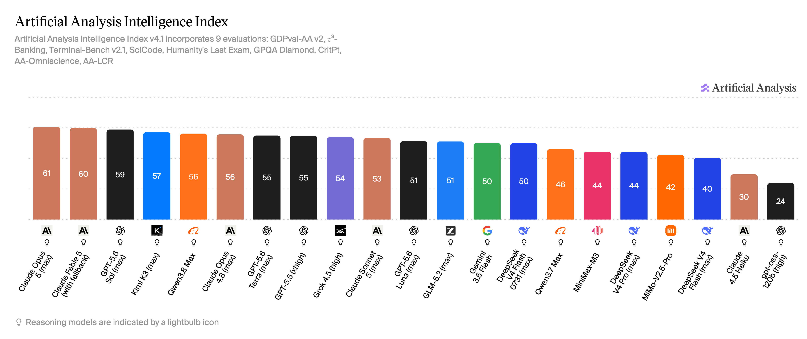
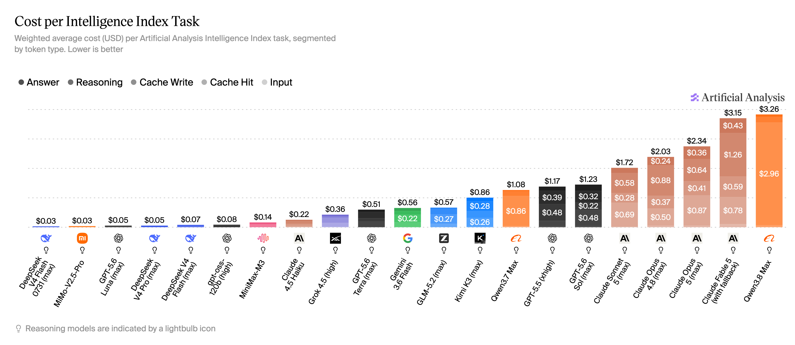

# 2026年8月主流大模型能力对比：Kimi K3 综合国产第一，Qwen3.8 Max Agentic 全球第一，DeepSeek V4 Flash 正式版越级打Pro，国产阵营全面突破

**更新日期 2026.8.6**　数据来源 [https://vibecoding.dreamfree.space](https://vibecoding.dreamfree.space)

基于独立评测机构 Artificial Analysis 发布的最新 AI 模型基准测试结果（数据统计时间：2026 年 8 月 5 日），本文围绕 **Intelligence Index**（v4.1）和 **Agentic Index**（GDPval-AA v2 + τ³-Banking）两大核心指标，对 21 款主流大模型进行横向评测，并附成本参考。

本期不单独列出 Coding Index，因 Artificial Analysis 主对比页当前未为本期模型名单提供独立 Coding 横比视图。

**本期关键变化（相较 2026 年 6 月榜单）：**

1. **Claude Opus 5** 以 Intelligence 61 登顶全榜，同时 Agentic 55.3 达到第二；Anthropic 旗舰全面改写格局
2. **Qwen3.8 Max** Agentic 55.4 拿下本期第一，Intelligence 56 同列第五；国产旗舰首次在 Agentic 指数夺冠
3. **GPT-5.6 Sol** 以 Intelligence 59、Agentic 54.0 成为 OpenAI 本期旗舰；GPT-5.6 系列同时提供 Terra、Luna 两个梯度
4. **Kimi K3** Intelligence 57、Agentic 50.1，两项均为国产第二，是本期最值得关注的国产综合能力型号
5. **DeepSeek V4 Flash 0731** vs **0420**：Intelligence 50 vs 40（+10），Agentic 45.7 vs 31.1（+14.6），成本约 \$0.03/任务——同代型号中性价比最突出
6. **GLM-5.2** Intelligence 51、Agentic 43.1，为国产均衡选型代表；DeepSeek V4 Pro 正式版**预计 8 月发布**
7. Agentic 指数口径已升级为 **GDPval-AA v2 + τ³-Banking**，与 6 月旧口径不可直接比较绝对分值

---

## 一、快速对比总览

下表汇总 19 款主要模型关键指标（GPT-OSS-120B、Claude Haiku 4.5 仅作分布参照，不在本文单独展开）：

| 模型 | 上下文 | 多模态 | Intelligence | Agentic |
|------|:---:|:---:|---:|---:|
| Claude Opus 5 | ✅ 1M | ✅ 文本+图像 | 61 | 55.3 |
| Claude Fable 5 | ✅ 1M | ✅ 文本+图像 | 60 | 52.8 |
| GPT-5.6 Sol | ✅ 1M | ✅ 文本+图像 | 59 | 54.0 |
| Kimi K3 | ✅ 1M | ✅ 文本+图像+视频 | 57 | 50.1 |
| Qwen3.8 Max | ✅ 1M | ❌ 纯文本 | 56 | 55.4 |
| Claude Opus 4.8 | ✅ 1M | ✅ 文本+图像 | 56 | 47.2 |
| GPT-5.6 Terra | ✅ 1M | ✅ 文本+图像 | 55 | 47.4 |
| GPT-5.5 | ✅ 922k | ✅ 文本+图像 | 55 | 44.9 |
| Grok 4.5 | ❌ 500k | ✅ 文本+图像 | 54 | 45.7 |
| Claude Sonnet 5 | ✅ 1M | ✅ 文本+图像 | 53 | 46.7 |
| GPT-5.6 Luna | ✅ 1M | ✅ 文本+图像 | 51 | 45.6 |
| GLM-5.2 | ✅ 1M | ❌ 纯文本 | 51 | 43.1 |
| Gemini 3.6 Flash | ✅ 1M | ✅ 文本+图像+语音+视频 | 50 | 38.7 |
| DeepSeek V4 Flash 0731 | ✅ 1M | ❌ 纯文本 | 50 | 45.7 |
| Qwen3.7 Max | ✅ 1M | ❌ 纯文本 | 46 | 30.6 |
| MiniMax-M3 | ✅ 1M | ✅ 文本+图像+视频 | 44 | 35.4 |
| DeepSeek V4 Pro | ✅ 1M | ❌ 纯文本 | 44 | 36.4 |
| MiMo-V2.5-Pro | ✅ 1M | ❌ 纯文本 | 42 | 29.1 |
| DeepSeek V4 Flash（0420） | ✅ 1M | ❌ 纯文本 | 40 | 31.1 |

---

## 二、Intelligence Index：Opus 5 登顶，GPT-5.6 全线升级

数据来源：[Artificial Analysis - Intelligence Index](https://artificialanalysis.ai/?models=mimo-v2-5-pro%2Cgpt-5-5%2Cclaude-sonnet-5%2Cminimax-m3%2Cgpt-5-6-luna%2Cqwen3-7-max%2Cgemini-3-6-flash%2Cgrok-4-5%2Cclaude-opus-4-8%2Cclaude-4-5-haiku-reasoning%2Cclaude-opus-5%2Cgpt-5-6-terra%2Cdeepseek-v4-pro%2Cclaude-fable-5%2Cdeepseek-v4-flash-0420%2Cgpt-5-6-sol%2Cgpt-oss-120b%2Cglm-5-2%2Ckimi-k3%2Cdeepseek-v4-flash%2Cqwen3-8-max&capability-index=economics&capability-models=mimo-v2-5-pro%2Cclaude-sonnet-5%2Cminimax-m3%2Cgpt-5-6-luna%2Cqwen3-7-max%2Cgemini-3-6-flash%2Cgrok-4-5%2Cclaude-opus-4-8%2Cclaude-4-5-haiku-reasoning%2Cclaude-opus-5%2Cgpt-5-6-terra%2Cclaude-fable-5%2Cgpt-5-6-sol%2Cgpt-oss-120b%2Cglm-5-2%2Ckimi-k3%2Cdeepseek-v4-flash%2Cdeepseek-v4-pro%2Cgpt-5-5%2Cdeepseek-v4-flash-0420#intelligence-tabs)

Intelligence Index v4.1 综合 9 项评测：GDPval-AA v2、τ³-Banking、Terminal-Bench v2.1、SciCode、HLE、GPQA Diamond、CritPt、AA-Omniscience、AA-LCR。

**Claude Opus 5** 以 61 分独占榜首，比第二名 Claude Fable 5（60）领先 1 分，比 GPT-5.6 Sol（59）领先 2 分。这是 Anthropic 首次在 Intelligence 指数上同时击败 OpenAI 与自家上代旗舰。

OpenAI 本期以 GPT-5.6 系列全面替代 GPT-5.5：Sol（59）定位顶端；Terra（55）定位中端，达到和上代 GPT-5.5（55）并列的成绩；Luna（51）定位低价档，以极低成本（约 \$0.05/任务）填补轻量档。

国产阵营中，**Kimi K3** 以 57 分创下本期国产 Intelligence 最高分，超过 Qwen3.8 Max（56）。**GLM-5.2** 以 51 分与 GPT-5.6 Luna 并列。**DeepSeek V4 Flash 0731** 以 50 分跻身中段，与 Gemini 3.6 Flash 持平，且单任务成本约 \$0.03，远低于同分位的其他型号。

---

## 三、Agentic Index：Qwen3.8 Max 夺冠，国产创下历史高点

数据来源：[Artificial Analysis - Agentic Index](https://artificialanalysis.ai/?models=mimo-v2-5-pro%2Cgpt-5-5%2Cclaude-sonnet-5%2Cminimax-m3%2Cgpt-5-6-luna%2Cqwen3-7-max%2Cgemini-3-6-flash%2Cgrok-4-5%2Cclaude-opus-4-8%2Cclaude-4-5-haiku-reasoning%2Cclaude-opus-5%2Cgpt-5-6-terra%2Cdeepseek-v4-pro%2Cclaude-fable-5%2Cdeepseek-v4-flash-0420%2Cgpt-5-6-sol%2Cgpt-oss-120b%2Cglm-5-2%2Ckimi-k3%2Cdeepseek-v4-flash%2Cqwen3-8-max&capability-index=economics&capability-models=mimo-v2-5-pro%2Cclaude-sonnet-5%2Cminimax-m3%2Cgpt-5-6-luna%2Cqwen3-7-max%2Cgemini-3-6-flash%2Cgrok-4-5%2Cclaude-opus-4-8%2Cclaude-4-5-haiku-reasoning%2Cclaude-opus-5%2Cgpt-5-6-terra%2Cclaude-fable-5%2Cgpt-5-6-sol%2Cgpt-oss-120b%2Cglm-5-2%2Ckimi-k3%2Cdeepseek-v4-flash%2Cdeepseek-v4-pro%2Cgpt-5-5%2Cdeepseek-v4-flash-0420&intelligence=agentic-index#intelligence-tabs)

本期 Agentic Index 采用 GDPval-AA v2 + τ³-Banking 口径，评估模型在真实世界多步骤任务与工具调用中的表现。与 6 月旧口径（GDPval-AA + τ²-Bench Telecom）不同，本期绝对分不宜直接与 6 月对比。

**Qwen3.8 Max** 以 55.4 分拿下 Agentic 第一，仅以 0.1 分的差距超过 Claude Opus 5（55.3），成为国产阵营首次登顶 Agentic 榜首的型号。这一结果意味着，在衡量自主多步骤任务执行能力的场景下，国产旗舰已达到全球顶尖水平。

Claude Opus 5（55.3）、GPT-5.6 Sol（54.0）、Claude Fable 5（52.8）紧随其后，共同构成 Agentic 指数前四。**Kimi K3** 以 50.1 分位列国产第二，在自主任务调度与复杂流程驱动方面领先其余国产型号。

**DeepSeek V4 Flash 0731** Agentic 45.7，比旧版 0420（31.1）提升 14.6 分，与 Grok 4.5 持平，跻身中段第一梯队。

---

## 四、成本对比：Flash 0731 性价比最高，Fable/Opus 成本最高

数据来源：[Artificial Analysis - Cost per Task](https://artificialanalysis.ai/?models=mimo-v2-5-pro%2Cgpt-5-5%2Cclaude-sonnet-5%2Cminimax-m3%2Cgpt-5-6-luna%2Cqwen3-7-max%2Cgemini-3-6-flash%2Cgrok-4-5%2Cclaude-opus-4-8%2Cclaude-4-5-haiku-reasoning%2Cclaude-opus-5%2Cgpt-5-6-terra%2Cdeepseek-v4-pro%2Cclaude-fable-5%2Cdeepseek-v4-flash-0420%2Cgpt-5-6-sol%2Cgpt-oss-120b%2Cglm-5-2%2Ckimi-k3%2Cdeepseek-v4-flash%2Cqwen3-8-max&capability-index=economics&capability-models=mimo-v2-5-pro%2Cclaude-sonnet-5%2Cminimax-m3%2Cgpt-5-6-luna%2Cqwen3-7-max%2Cgemini-3-6-flash%2Cgrok-4-5%2Cclaude-opus-4-8%2Cclaude-4-5-haiku-reasoning%2Cclaude-opus-5%2Cgpt-5-6-terra%2Cclaude-fable-5%2Cgpt-5-6-sol%2Cgpt-oss-120b%2Cglm-5-2%2Ckimi-k3%2Cdeepseek-v4-flash%2Cdeepseek-v4-pro%2Cgpt-5-5%2Cdeepseek-v4-flash-0420#intelligence-efficiency-tabs)

成本差距在本期格外悬殊：Claude Fable 5 的每任务成本约 \$3.15，Qwen3.8 Max 约 \$3.26，同属高端付费段；而 DeepSeek V4 Flash 0731 约 \$0.03、GPT-5.6 Luna 约 \$0.05、DeepSeek V4 Pro 约 \$0.05，同属极低成本段。

**Flash 0731 的性价比最为突出**：Intelligence 50、Agentic 45.7，每任务成本约 \$0.03，是 Grok 4.5（同 Agentic 分，\$0.36）成本的不到 1/10，也是 Gemini 3.6 Flash（同 Intelligence 分，\$0.56）成本的约 1/19。

**GPT-5.6 Luna**：经历了一轮骨折降价后，以约 \$0.05 的成本实现 Intelligence 51，与 GLM-5.2 持平，是 OpenAI 模型中面向成本敏感场景的最佳选择。

---

## 五、国产深度解析

### Qwen3.8 Max（阿里）：Agentic 全球登顶，但注意纯文本限制

Qwen3.8 Max 是本期最大惊喜：**Agentic 55.4 全榜第一**，Intelligence 56 位列国产第二（仅次于 Kimi K3），单任务成本约 \$3.26。

在自主多步骤任务、工具调用与复杂流程驱动场景下，Qwen3.8 Max 已超越 Claude Opus 5，成为本期 Agentic 基准测试的新标杆。对于以 Agent 自动化为核心需求的团队，Qwen3.8 Max 值得优先测试。

需注意：Qwen3.8 Max 是**纯文本模型**，不支持图像等多模态输入。需要多模态能力时，可考虑 Qwen3.7 Plus 或 MiniMax-M3。

另外，Qwen3.8 Max 的单任务成本接近 Fable 5，与 Flash 0731 相差约 100 倍，预算问题需要考虑。

国内接入可通过阿里云百炼 API（[百炼 Token Plan](https://api.dreamfree.space/c/s/cpyqbailianc)）按量使用。

### Kimi K3（月之暗面）：国产 Intelligence 最高，但新购受限

**Kimi K3** Intelligence 57 为国产第一（Agentic 仅次于 Qwen3.8 Max），在综合能力方面依然是本期国产最值得关注的型号之一。支持 1M 上下文和文本+图像+视频多模态，覆盖了代码、长文档与多模态任务。

但需注意：K3 发布后，**Kimi 官方会员已暂停新购**，目前存量资源较拥挤。若需要稳定访问，可通过[OpenCode](https://api.dreamfree.space/c/s/cpyqopencode)或[共绩算力](https://api.dreamfree.space/c/s/cpyqgongji)（官方价格的8折）等第三方平台接入。

### DeepSeek V4 Flash 0731 vs 0420：升级明显

| 型号 | Intelligence | Agentic | Cost/Task（约） |
|---|---:|---:|---:|
| DeepSeek V4 Flash 0731 | 50 | 45.7 | \$0.03 |
| DeepSeek V4 Flash（0420） | 40 | 31.1 | \$0.07 |

Flash 0731 相对 0420，Intelligence +10，Agentic +14.6，成本还略低。且以更低成本（约 \$0.03/任务）越级超过 DeepSeek V4 Pro（Intelligence 44，Agentic 36.4，成本约 \$0.05/任务），成为国产阵营中性价比最高的型号。

**DeepSeek V4 Pro 正式版预计 8 月发布**，届时模型能力与定价可能有进一步变化，建议关注 DeepSeek 官方公告。现阶段可通过 [DeepSeek 官方平台](https://platform.deepseek.com) 或[共绩算力](https://api.dreamfree.space/c/s/cpyqgongji)（官方价格的8折）按量使用 V4 Flash 0731 或 V4 Pro。

### GLM-5.2（智谱 AI）：均衡国产旗舰，代码场景稳定

GLM-5.2 Intelligence 51、Agentic 43.1，是本期国产阵营中综合能力最均衡的旗舰之一。全面开源，多平台接入广泛（智谱国内/国际版、OpenCode、共绩、方舟等）。对于代码开发场景，GLM-5.2 的稳定性与生态覆盖度值得信赖，[GLM Coding Plan](https://api.dreamfree.space/c/s/cpyqzhipu) 可作为稳定订阅入口。

---

## 六、选型建议

### 最高综合智能

- 首选 **GPT-5.6 Sol**（Intelligence 59）、**Kimi K3**（57）、**Qwen3.8 Max**（56）、**Claude Opus 5**（61）

### Agent 自动化为主

- **Qwen3.8 Max**（Agentic 55.4，全榜第一）适合复杂多步骤自动化，纯文本场景优先
- **Claude Opus 5**（Agentic 55.3）与 **GPT-5.6 Sol**（Agentic 54.0）在多模态 Agent 场景更全面
- **Kimi K3**（Agentic 50.1）是国产多模态 Agent 最佳选择，注意当前购买渠道受限

### 成本优先 / 高频调用

- **DeepSeek V4 Flash 0731**：Intelligence 50 + Agentic 45.7，约 \$0.03/任务，性价比全榜最高
- **GPT-5.6 Luna**：Intelligence 51，约 \$0.05/任务，OpenAI 生态下的成本友好选择
- **DeepSeek V4 Pro**：Intelligence 44 + Agentic 36.4，约 \$0.05/任务，开源+按量的均衡选项。待正式版发布后可关注定价与能力变化。

### 国产均衡优先

- **Qwen3.8 Max**：Agentic 第一，纯文本场景下的国产首选
- **Kimi K3**：综合能力最强，但购买渠道受限，建议通过第三方平台使用
- **GLM-5.2**：稳定均衡，生态覆盖广，适合企业级代码与 Agent 场景

### 多模态需求

- **MiniMax-M3**：文本+图像+视频，国产中多模态覆盖最广，套餐额度相对宽松，可通过 [MiniMax](https://api.dreamfree.space/c/s/cpyqminimax) 订阅
- **Kimi K3**：支持多模态但价格较高，且购买渠道受限，谨慎选择

---

## 七、本期变化总结

1. **Claude Opus 5** 以 Intelligence 61 登顶，同时 Agentic 55.3 居第二；Anthropic 全面确立新旗舰
2. **Qwen3.8 Max** Agentic 55.4 首次让国产型号登顶 Agentic 榜首
3. **GPT-5.6 Sol / Terra / Luna** 全线替代上代 GPT-5.4，三个档位覆盖从高性能到超低成本
4. **Kimi K3** 国产 Intelligence 57 最高，Agentic 50.1 国产第二
5. **DeepSeek V4 Flash 0731** 以 +10 / +14.6 的双项大幅提升全面超越 0420 旧版

> 注意
> 1. Agentic 指数升级口径（GDPval-AA v2 + τ³-Banking），本期绝对分与 6 月不可直接比较
> 2. 本期不列 Coding Index；Intelligence Index 已综合含 Terminal-Bench v2.1（代码相关能力）在内的 9 项评测

---

原文：[https://vibecoding.dreamfree.space](https://vibecoding.dreamfree.space/articles/model_comparisons/20260806/)
