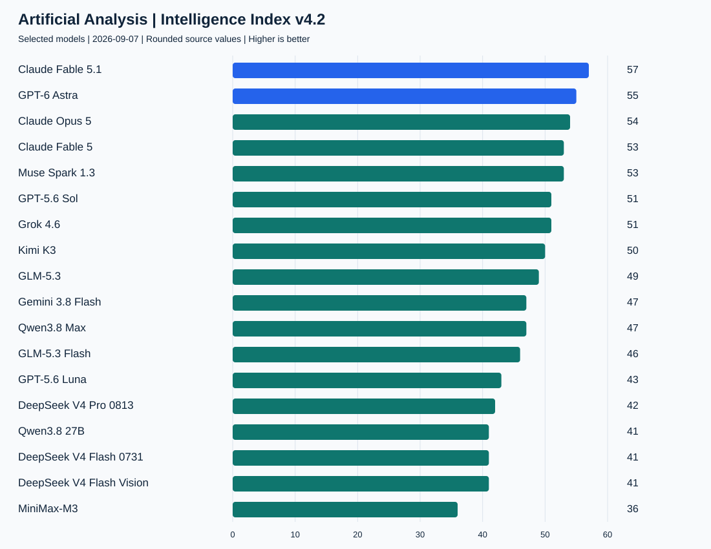
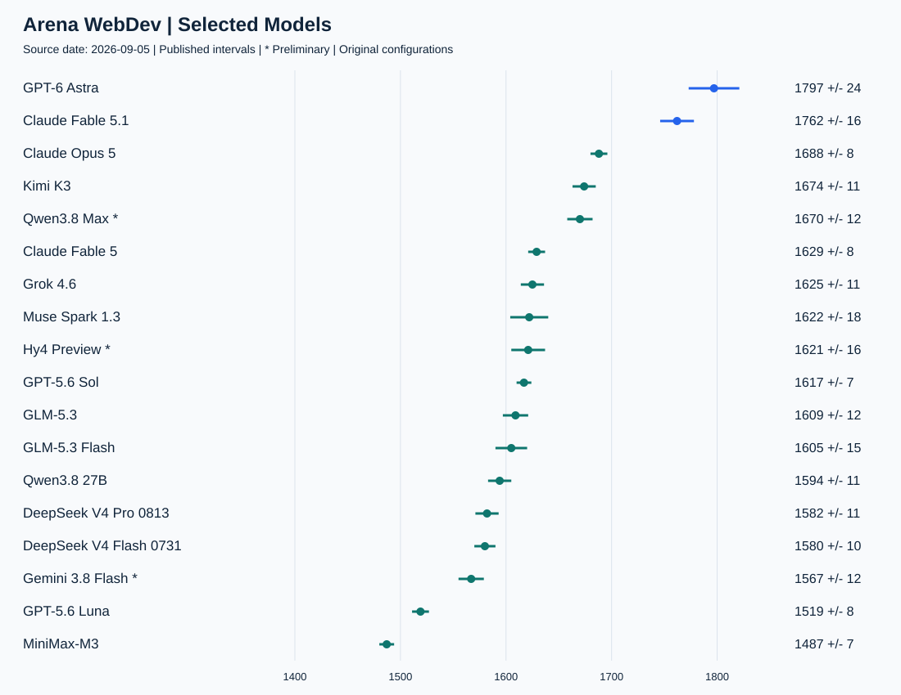
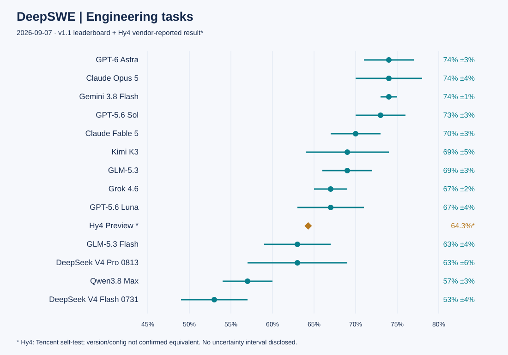
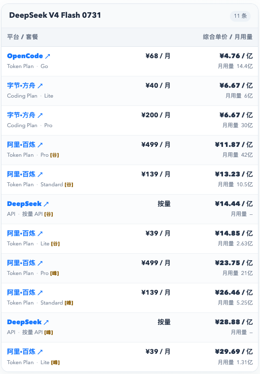
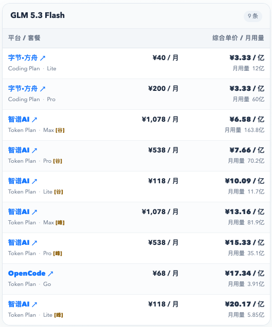
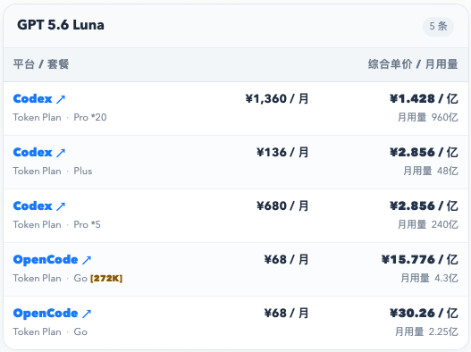

# 2026年9月主流大模型能力对比：Fable 5.1 综合领先，GPT-6 Astra 编码突出，GLM Flash 与 Luna 如何选

**更新日期：2026.9.7**　数据来源：[Artificial Analysis](https://artificialanalysis.ai/?models=glm-5-3-flash%2Cminimax-m3%2Cgpt-6-astra%2Cclaude-fable-5-1%2Cgpt-5-6-luna%2Cmuse-spark-1-3%2Cdeepseek-v4-pro%2Cgemini-3-8-flash%2Cqwen3-8-27b%2Cclaude-opus-5%2Cgrok-4-6%2Cclaude-fable-5%2Cglm-5-3%2Cgpt-5-6-sol%2Ckimi-k3%2Cqwen3-8-max%2Cdeepseek-v4-flash%2Cdeepseek-v4-flash-vision&intelligence-category=country-analysis)、[Arena WebDev](https://arena.ai/leaderboard/code/webdev/overall)、[DeepSWE](https://deepswe.datacurve.ai/)

过去一个月，Fable 5.1、GPT-6 Astra、GLM-5.3 Flash 等模型陆续进入选型名单。综合能力、网页开发和仓库工程的榜首并不完全相同，日常大量调用时，还要考虑完成任务的成本。

本期比较 19 款模型。AA 采用截至 9 月 7 日的 **Intelligence Index v4.2**；Arena 页面更新于 9 月 5 日；DeepSWE v1.1 页面更新于 9 月 3 日。三类成绩分别反映综合能力、网页开发偏好和长程工程任务表现，不能相加为一个总分。AA 已更换评测口径，本期分数也不与 8 月旧稿直接计算涨跌。

**本期关键变化（相较 2026 年 8 月）：**

1. **Claude Fable 5.1 与 GPT-6 Astra** 成为本期综合能力前两名，AA v4.2 分别为 57、55 分；上期领跑的 Opus 5 本期为 54 分，排在两者之后。
2. **GPT-6 Astra** 在 Arena WebDev 排名第一，DeepSWE 以 74% 与 Opus 5、Gemini 3.8 Flash 同处领先组，网页开发与仓库工程都有成绩支撑。
3. **GLM-5.3 接替上期 GLM-5.2** 成为国产重点型号：AA 49 分紧跟 Kimi K3 的 50 分，DeepSWE 两者同为 69%；Kimi 支持图像输入，GLM 的工程任务成本更低。
4. **GLM-5.3 Flash** 进入低成本重点候选：AA 46 分，WebDev 1605 分接近 GLM-5.3 的 1609 分，DeepSWE 平均成本为 0.24 美元/任务，适合日常页面与截图迭代。
5. **GPT-5.6 Luna** 在工程任务上更值得关注：DeepSWE 67%、平均成本 0.61 美元/任务；WebDev 则落后于 GLM Flash，低成本模型也需要按任务选择。
6. **Qwen3.8 Max** 的 WebDev 基础条目排第 6，0902 新条目暂列第 4；DeepSWE 为 57%，网页开发表现不能直接等同于复杂工程能力。
7. **AA 已从 v4.1 升级到 v4.2**，本期结合 Arena WebDev 与 DeepSWE 判断编程能力；AA 新旧分数不直接计算涨跌，两项 Coding 榜单也不等同于上期 Agentic 指数。

## 一、快速对比

总表按 AA 页面展示的整数分排列，同分不强行区分高低。上下文是模型规格，不代表每个榜单实际使用了同样长度；“输入”一栏列出模型能接收的材料类型，不代表图像或视频生成能力。

| 模型 | 上下文 | 输入 | AA v4.2 | WebDev 分数 | DeepSWE |
|---|---|---|---:|---:|---:|
| Claude Fable 5.1 | 1M | 文本、图像 | 57 | 1762 | — |
| GPT-6 Astra | 1.05M | 文本、图像 | 55 | 1797 | 74% |
| Claude Opus 5 | 1M | 文本、图像 | 54 | 1688 | 74% |
| Claude Fable 5 | 1M | 文本、图像 | 53 | 1629 | 70% |
| Muse Spark 1.3 | 1M | 文本、图像、视频 | 53 | 1622 | — |
| GPT-5.6 Sol | 1.05M | 文本、图像 | 51 | 1617 | 73% |
| Grok 4.6 | 500k | 文本、图像 | 51 | 1625 | 67% |
| Kimi K3 | 1M | 文本、图像 | 50 | 1674 | 69% |
| GLM-5.3 | 1M | 文本 | 49 | 1609 | 69% |
| Gemini 3.8 Flash | 1M | 文本、图像、语音、视频 | 47 | 1567 | 74% |
| Qwen3.8 Max | 1M | 文本、图像、视频 | 47 | 1670 | 57% |
| GLM-5.3 Flash | 1M | 文本、图像 | 46 | 1605 | 63% |
| GPT-5.6 Luna | 1.05M | 文本、图像 | 43 | 1519 | 67% |
| DeepSeek V4 Pro 0813 | 1M | 文本 | 42 | 1582 | 63% |
| Qwen3.8 27B | 262,144¹ | 文本、图像、视频 | 41 | 1594 | — |
| DeepSeek V4 Flash 0731 | 1M | 文本 | 41 | 1580 | 53% |
| DeepSeek V4 Flash Vision | 1M | 文本、图像 | 41 | — | — |
| MiniMax-M3 | 1M² | 文本、图像、视频 | 36 | 1487 | — |
| Hy4 Preview | 1M | 未确认 | — | 1621 | 64.3%* |

“—”表示对应榜单暂无可列成绩，不代表零分。* Hy4 的 64.3% 为腾讯官方自测；其余成绩来自 DeepSWE v1.1，两者评测口径尚未确认一致。¹ Qwen3.8 27B 官方模型卡列原生 262,144、可扩展至 1M；AA 简写为 256k。² MiniMax-M3 的 AA 规格为 1M，Arena 该条目列 524.3K，接入时应核对具体服务。

AA 的 Fable 5.1/Fable 5 包含页面标注的 fallback 配置；GPT-6、Opus 5、Muse 1.3、Sol、Kimi、GLM-5.3、Luna、DeepSeek 系列取所选 max 版本，Grok 取 high、Gemini 取 high、Qwen 27B 取 xhigh，其余保留页面默认版本。WebDev 与 DeepSWE 的具体档位见下文，跨榜比较需连同配置一起看。

## 二、AA Intelligence Index：Fable 5.1 与 GPT-6 Astra 领先

AA Intelligence Index 可以理解成模型的综合考试：把推理、知识、代码和工作任务等多项测试汇总成一个分数。先看它，是为了判断整体能力、缩小候选范围，再用下面的编程专项榜判断是否适合自己的工作。

数据来源：[AA Intelligence Index](https://artificialanalysis.ai/?models=glm-5-3-flash%2Cminimax-m3%2Cgpt-6-astra%2Cclaude-fable-5-1%2Cgpt-5-6-luna%2Cmuse-spark-1-3%2Cdeepseek-v4-pro%2Cgemini-3-8-flash%2Cqwen3-8-27b%2Cclaude-opus-5%2Cgrok-4-6%2Cclaude-fable-5%2Cglm-5-3%2Cgpt-5-6-sol%2Ckimi-k3%2Cqwen3-8-max%2Cdeepseek-v4-flash%2Cdeepseek-v4-flash-vision&intelligence-category=country-analysis)。图为本期所选模型对比，非全站全部模型排名。

Fable 5.1 和 GPT-6 Astra 位居本期前两名，Opus 5 紧随其后，Muse Spark 1.3 与 Fable 5 同分。综合能力优先时，可以先从这几款中筛选；编程用途还要结合 WebDev 和 DeepSWE 的表现。

国产型号中，Kimi K3 略高于 GLM-5.3，Qwen3.8 Max 随后。GLM-5.3 Flash 与 Qwen3.8 Max 的综合分相近，对预算敏感的开发者尤其值得比较。Qwen3.8 27B、DeepSeek V4 Flash 和 Flash Vision 的页面整数分相同，但模型体量、部署方式与视觉输入能力并不相同。

**AA 在 9 月 4 日升级到 v4.2**，调整了任务组成与权重，加入更复杂的工作任务和文档推理。因此，同一模型在发布报道和本期榜单中的分数可能不同。例如，Fable 5.1 发布分析中为 66 分，本期为 57 分，两者采用不同评测口径，不代表模型能力下降。

## 三、Coding 对比

### 1. Arena WebDev：看网页开发成品，也看投票的不确定性

Arena WebDev 让不同模型根据需求生成网页，再由用户在不知道模型身份的情况下对比成品、投票选出更喜欢的结果。它更接近“做出来的页面好不好用、合不合心意”，适合给前端开发和 Vibe Coding 选型作参考。

数据来源：[Arena WebDev Overall](https://arena.ai/leaderboard/code/webdev/overall)。图中分数以点和区间展示，横轴从 1400 起；不是成功率。

GPT-6 Astra max 和 Fable 5.1 max 分列榜单前两名。Astra 分数更高，但两者的误差区间仍有重叠，实际任务中不一定总是 Astra 更好。

| 本期模型 | 榜单原始名次 | 分数 | 页面配置 |
|---|---:|---:|---|
| GPT-6 Astra | 1 | 1797 | max |
| Claude Fable 5.1 | 2 | 1762 | max |
| Claude Opus 5 | 3 | 1688 | max |
| Kimi K3 | 5 | 1674 | max |
| Qwen3.8 Max | 6 | 1670 | 默认 * |
| Claude Fable 5 | 8 | 1629 | 默认 |
| Grok 4.6 | 10 | 1625 | high |
| Muse Spark 1.3 | 11 | 1622 | xhigh |
| Hy4 Preview | 12 | 1621 | 默认 * |
| GPT-5.6 Sol | 13 | 1617 | xhigh / codex-harness |
| GLM-5.3 | 14 | 1609 | max |
| GLM-5.3 Flash | 15 | 1605 | 默认 |
| Qwen3.8 27B | 16 | 1594 | 默认 |
| DeepSeek V4 Pro 0813 | 19 | 1582 | high-20260813 |
| DeepSeek V4 Flash 0731 | 20 | 1580 | high |
| Gemini 3.8 Flash | 21 | 1567 | high * |
| GPT-5.6 Luna | 36 | 1519 | xhigh / codex-harness |
| MiniMax-M3 | 45 | 1487 | 默认 |

星号表示初步结果（Preliminary）。另有 **qwen3.8-max-0902** 条目，1686±16、原始名次第 4，同样属于初步结果，与基础版 qwen3.8-max（1670 分）分开统计。DeepSeek Flash Vision 暂无本期可列的 WebDev 成绩。

GLM-5.3 与 Flash 的分数接近，可以用相同的前端需求试用两者。除了页面外观，还要检查功能是否完成、交互是否合理，以及修改后原有功能是否仍然正常。

### 2. DeepSWE：真实仓库里的长程工程任务

DeepSWE 看模型能否在真实代码仓库中完成较长、较复杂的工程任务：用统一的 Agent 框架执行，再通过人工编写的测试检查结果。它能补上网页成品榜看不到的工程能力，对需要 Agent 持续读代码、修改和验证的人更有参考价值。

数据来源：[DeepSWE](https://deepswe.datacurve.ai/)。当前 v1.1 为 113 个任务，页面显示采用 mini-swe-agent；下表保留各模型 Best 视图中的推理档位与平均任务成本。

| 模型 | 推理档位 | 成绩 | 平均成本（美元/任务） |
|---|---|---:|---:|
| GPT-6 Astra | xhigh | 74% ±3% | 6.52 |
| Claude Opus 5 | max | 74% ±4% | 11.84 |
| Gemini 3.8 Flash | high | 74% ±1% | 2.36 |
| GPT-5.6 Sol | max | 73% ±3% | 6.46 |
| Claude Fable 5 | xhigh | 70% ±3% | 13.41 |
| Kimi K3 | max | 69% ±5% | 4.65 |
| GLM-5.3 | max | 69% ±3% | 3.99 |
| Grok 4.6 | medium | 67% ±2% | 3.45 |
| GPT-5.6 Luna | max | 67% ±4% | 0.61 |
| Hy4 Preview * | 未披露 | 64.3% | — |
| GLM-5.3 Flash | max | 63% ±4% | 0.24 |
| DeepSeek V4 Pro 0813 | max | 63% ±6% | 1.67 |
| Qwen3.8 Max | xhigh | 57% ±3% | 3.73 |
| DeepSeek V4 Flash 0731 | max | 53% ±4% | 0.46 |

GPT-6 Astra、Gemini 3.8 Flash 和 Opus 5 的显示成绩同为 74%，不能从相同的四舍五入值判出唯一冠军。Kimi K3 和 GLM-5.3 同为 69%；低成本候选里，Luna 成绩更高，GLM Flash 的任务成本更低。不同基准会给出不同取舍，WebDev 排名不能直接替代工程任务表现。

* Hy4 Preview 的成绩来自腾讯官方自测。附录使用 mini-swe-agent，但未说明评测版本与统计配置是否和当前 v1.1 一致，也未公布任务成本及误差区间；该成绩仅供参考，不作为同榜排名依据。

[查看腾讯原始评测附录](https://github.com/Tencent-Hunyuan/Hy4-preview/blob/main/assets/benchmark-appendix.jpg)。DeepSWE Best 页面未展示 Fable 5.1、Muse Spark 1.3、Qwen3.8 27B、MiniMax-M3 和 Flash Vision 对应成绩，不同型号或评测框架的结果不能直接混用。

## 四、重点模型解析

以下建议基于本期榜单与模型规格，不代表所有项目中的实际效果。

### 1. Claude Fable 5.1：追求综合上限，值得为难题付溢价

**复杂分析、方案推敲等任务，可以优先考虑 Fable 5.1。** 它的 AA 57 分位居本期所选模型第一，WebDev 也排在第二，综合能力和网页开发表现都靠前。

它的 AA 综合任务成本为 6.12 美元，约为 Astra 的 2.4 倍（2.57 美元）。因此，更适合留给难题和重要任务，大量常规修改可以交给低成本模型。若主要用途是编程，Astra 在两项专项榜上都有成绩；Fable 5.1 暂无本期 DeepSWE 成绩，其复杂工程能力还缺少这项评测作为参考。

资料：[Fable 5.1 官方发布](https://www.anthropic.com/claude-fable-and-mythos-5-1)、[AA 当前模型页](https://artificialanalysis.ai/models/claude-fable-5-1)。

### 2. GPT-6 Astra：兼顾网页开发与仓库工程的高端主力

**如果只选一款高端编程主力，本期优先推荐 Astra。** 它在 WebDev 排第一，在 DeepSWE 进入 74% 的领先组，AA 综合分仅落后 Fable 5.1 两分，适合同时需要网页开发和仓库工程能力的用户。

与 Opus 5 相比，两者 DeepSWE 显示值同为 74%，Astra 的平均任务成本为 6.52 美元，低于 Opus 的 11.84 美元；与 Sol 相比，DeepSWE 只高 1 个百分点、成本也接近，真正拉开距离的是 WebDev。因此，已经用 Sol 稳定处理仓库任务的人不用急着全面切换，常做网页、又要兼顾复杂工程的人更值得升级 Astra。若只关心这套工程任务的成本，还应留意 Gemini 3.8 Flash：同为 74%，平均成本只有 2.36 美元。

资料：[OpenAI GPT-6 Astra 文档](https://developers.openai.com/api/docs/models/gpt-6-astra)、[DeepSWE](https://deepswe.datacurve.ai/)。

### 3. Kimi K3：国产综合首选，优势在覆盖面

**Kimi K3 是本期国产模型中的综合首选。** AA 50 分高于 GLM-5.3 的 49 分和 Qwen3.8 Max 的 47 分；WebDev 1674 分、DeepSWE 69%，两类开发任务表现也都较好。它支持图像输入，适合既要看截图，又要写代码和讨论方案的用户。

不过，在 DeepSWE 中，GLM-5.3 同样达到 69%，平均任务成本为 3.99 美元，低于 Kimi 的 4.65 美元。选择 Kimi，多付的成本主要换来更高的综合分和图像输入能力。如果输入几乎全是代码、日志和文字需求，GLM-5.3 更划算。

资料：[Kimi K3 官方模型卡](https://huggingface.co/moonshotai/Kimi-K3)、[AA 当前模型页](https://artificialanalysis.ai/models/kimi-k3)。

### 4. Qwen3.8：Max 更值得用于前端，27B 的价值在自部署

**Qwen3.8 Max 的亮点是网页开发，选它做高难仓库任务则要更谨慎。** WebDev 1670 分接近 Kimi 的 1674，明显高于 GLM-5.3 的 1609；但 DeepSWE 57% 落后于两者的 69%，任务成本 3.73 美元也没有比 GLM-5.3 的 3.99 便宜很多。因此，前端页面和视觉材料驱动的开发可以优先考虑 Max，复杂后端修改、跨文件工程任务则优先考虑 GLM-5.3 或 Kimi K3。Max 当前规格还列有视频输入，能覆盖它们未明确支持的材料类型。

Qwen3.8 27B 的主要价值在于自部署。它的 AA 为 41 分、WebDev 为 1594 分，能力与 Max 有差距，但可以根据自己的硬件和数据要求部署。原生上下文为 262,144 token，扩展到 1M 需要额外配置与资源；没有自部署需求时，不必仅因参数规模较小就选择它。Max-0902、普通 Max 与 27B 是不同条目，成绩需分别看待。

资料：[Qwen3.8 Max 当前规格](https://artificialanalysis.ai/models/qwen3-8-max)、[Qwen3.8 27B 官方模型卡](https://huggingface.co/Qwen/Qwen3.8-27B)。

### 5. GLM-5.3：没有多模态要求，国产 Coding 优先它

**输入以代码、日志、配置和文字需求为主时，国产模型优先推荐 GLM-5.3。** 它的 AA 为 49 分，紧跟 Kimi；DeepSWE 为 69%，与 Kimi 相同。AA 和 DeepSWE 的任务成本分别为 1.26、3.99 美元，均低于 Kimi 的 1.58、4.65 美元，适合主要在代码仓库里工作的用户。

不过，它只接收文本，不能直接看截图。WebDev 1609 与 Flash 的 1605 也没有拉开差距，所以普通页面开发没有必要一律上 GLM-5.3。更合理的分工是：常规页面和简单修改用 Flash，复杂逻辑与工程任务升级 5.3；一旦任务需要直接理解图片，就转向 Flash、Kimi 或其他视觉模型。

资料：[GLM-5.3 当前规格](https://artificialanalysis.ai/models/glm-5-3)、[DeepSWE](https://deepswe.datacurve.ai/)。

### 6. GLM-5.3 Flash：日常页面开发的低成本首选

**日常页面开发和小功能修改，推荐先试 GLM-5.3 Flash。** AA 46 分只比 GLM-5.3 低 3 分，综合任务成本却是 0.18 对 1.26 美元；WebDev 1605 与 5.3 的 1609 非常接近。再加上图像输入，做页面、看截图、反复改小功能，都有理由先用 Flash，把高端模型留作升级选项。

较难的工程任务更能体现两者差距：DeepSWE 63% 低于 5.3 的 69%，但平均任务成本也从 3.99 降到 0.24 美元。任务容易验收、可以接受多轮修改时，先用 Flash；问题涉及复杂依赖、已经反复修不好时，直接升 5.3 或 Astra，别靠无止境重试省钱。两者成绩区间有重叠，6 个百分点也不意味着你的每一类项目都有同样差距。

资料：[GLM-5.3 Flash 官方模型卡](https://huggingface.co/zai-org/GLM-5.3-Flash)、[DeepSWE](https://deepswe.datacurve.ai/)。

### 7. GPT-5.6 Luna：适合高频仓库任务，网页开发稍弱

**Luna 更适合放进高频仓库工作流。** 它的 AA 综合任务成本为 0.10 美元，是本期所列型号最低；DeepSWE 67% 接近 GLM-5.3 的 69%，平均成本却是 0.61 对 3.99 美元。若经常让 Agent 读代码、改局部逻辑、补测试，Luna 很值得先用起来。

Luna 的 DeepSWE 成绩高于 GLM Flash，成本也更高，两者误差区间有重叠；WebDev 则是 GLM Flash 领先。因此，仓库任务先试 Luna，网页和界面迭代先用 GLM Flash。Luna 支持图像并不等于它在网页成品上也占优，更不能把低成本理解成旗舰能力完全平替。

资料：[OpenAI GPT-5.6 Luna 文档](https://developers.openai.com/api/docs/models/gpt-5.6-luna)、[DeepSWE](https://deepswe.datacurve.ai/)。

## 五、选择建议

### 最高智能：综合上限选 Fable 5.1，Coding 主力选 Astra

预算充足、追求综合能力上限，优先 **Fable 5.1**；主要用途是编程，需要兼顾网页开发和复杂工程，优先 **GPT-6 Astra**。已有 Sol 的用户，如果工作主要是仓库修改，可以继续用，遇到更难任务再升级。

### 国产最高智能：Kimi K3 综合领先，纯文本 Coding 选 GLM-5.3

**国产综合能力优先考虑 Kimi K3，但要留意订阅渠道。** 截至 9 月 7 日，Dreamfree 渠道对比页仍标注其官方订阅新购受限，另列有第三方服务入口。该限制不代表 Kimi API 或所有渠道均不可用，购买前请核对对应平台的实时状态。[查看 Kimi 与其他模型的渠道对比](https://vibecoding.dreamfree.space/?view=usage)。

如果 Coding 场景没有多模态要求，**优先 GLM-5.3**：工程成绩接近 Kimi，任务成本更低。有截图输入、又希望国产综合能力尽量高，选 Kimi；更偏网页成品与视频材料，可考虑 Qwen3.8 Max。

### 最高性价比：日常页面选 Flash，仓库任务试 Luna

**日常页面开发先用 GLM-5.3 Flash，高频仓库任务先试 GPT-5.6 Luna。** 已经接好 DeepSeek、文本任务完成得稳定，可以继续用 V4 Flash 0731；需要给这套流程加图像输入，再考虑 Flash Vision。Flash Vision 尚缺少本期两项 Coding 榜单成绩，编程表现需要进一步试用。

| 模型 | AA 综合任务成本（美元/任务） | 推荐用途 |
|---|---:|---|
| GPT-5.6 Luna | 0.10 | 高频仓库任务、批量修改 |
| DeepSeek V4 Flash 0731 | 0.14 | 已有 DeepSeek 流程中的日常文本任务 |
| GLM-5.3 Flash | 0.18 | 页面开发、截图驱动的日常迭代 |
| DeepSeek V4 Flash Vision | 0.19 | 为 DeepSeek 流程补充图像输入 |

来源：[AA 模型成本对比](https://artificialanalysis.ai/?models=glm-5-3-flash%2Cminimax-m3%2Cgpt-6-astra%2Cclaude-fable-5-1%2Cgpt-5-6-luna%2Cmuse-spark-1-3%2Cdeepseek-v4-pro%2Cgemini-3-8-flash%2Cqwen3-8-27b%2Cclaude-opus-5%2Cgrok-4-6%2Cclaude-fable-5%2Cglm-5-3%2Cgpt-5-6-sol%2Ckimi-k3%2Cqwen3-8-max%2Cdeepseek-v4-flash%2Cdeepseek-v4-flash-vision&intelligence-category=country-analysis)，2026-09-07 所选配置。这里是评测任务成本，不是每百万 token 报价；DeepSWE 的工程任务成本另见前表。

**每天用量较大且稳定时，Coding Plan / Token Plan 订阅可能更省钱。** 同一个模型，在不同平台和套餐下的额度、折算单价可能差很多。选好模型后，建议再打开 [AI Coding Plan 额度／价格对比](https://vibecoding.dreamfree.space/?view=usage)，直接看 DeepSeek Flash、GLM Flash 和 Luna 的三个快速对比列表，按自己的月预算和用量挑套餐。

**DeepSeek V4 Flash 0731 订阅对比**

**GLM 5.3 Flash 订阅对比**

**GPT 5.6 Luna 订阅对比**

截图来源：[Dreamfree Coding Plan 额度／价格对比](https://vibecoding.dreamfree.space/?view=usage)。

综合单价按网站的工作负载与额度口径折算，包含约 95% 缓存命中率、0.5% 输出占比及部分估算数据，不是平台承诺的通用 token 单价；部分优惠有期限。用不满额度的人，订阅未必比按量便宜，购买时也要看五小时、周额度和所选模型的抵扣倍率。

### 多模态：看截图与看视频，分开选

需要看截图做日常开发，优先 **GLM-5.3 Flash**；希望获得更高的综合能力，选 **Astra、Fable 5.1 或 Kimi K3**。需要直接输入视频，则先从明确列有视频能力的 **Qwen3.8 Max、Qwen3.8 27B、Gemini 3.8 Flash、Muse Spark 1.3** 中筛选；音频输入可优先看 Gemini 3.8 Flash 的具体接口。

支持某种输入，只说明模型能接收这类材料；图像、音频和视频的理解质量，仍需用自己的任务试用。

## 六、总结

**综合能力优先选 Fable 5.1，高端编程主力选 Astra；国产模型中，兼顾图像输入选 Kimi K3，纯文本工程选 GLM-5.3；低成本日常开发则按任务在 GLM Flash 与 Luna 之间选择。**

选定模型后，再按实际用量比较订阅和按量付费。常规任务用低成本模型，遇到反复解决不了的问题再升级。判断是否划算时，除了调用费，也要算上重试和人工检查花费的时间。
