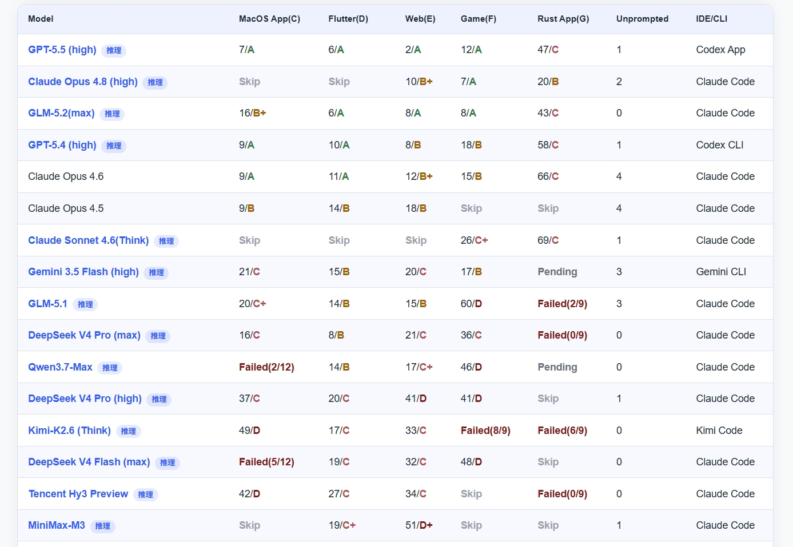

# GLM-5.2 全量开放 Coding Plan：1M 上下文登场，Code V3 私有评测跃居第三

**更新日期 2026.6.13** 数据来源 [https://vibecoding.dreamfree.space](https://vibecoding.dreamfree.space)

> 本次核心更新：6 月 13 日 17:21 起 **GLM-5.2** 面向 **GLM Coding Plan 全量用户**开放；官方称 **1M 可用上下文**；**API 与 MIT 开源**计划下周上线；智谱**尚未公布** SWE-bench 等官方榜单；**LLM Benchmark Code V3** 中 **GLM-5.2(max)** 综合第 **3**，公开 5 工程中获 **3 个 A 档**，维护者称可用性**持平 Opus 4.8**、**大幅领先其他国产模型**。

2026 年 6 月 13 日，**智谱**正式发布 **GLM-5.2**，并向 **GLM Coding Plan** 存量用户全量开放。官方 benchmark 尚空，但 Code V3 榜单维护者 **toyama nao**（知乎 llm2014 /「玩具匠」）在同日发布的解读中给出判断：**GLM-5.2 把 Coding 能力推到世界一流模型的门口，并在国产模型中首次拉开代差**。本文结合其解读与公开 CSV 数据，说明 GLM-5.2 相对 GLM-5.1 与同梯队模型意味着什么。

## 一、GLM-5.2 核心升级：从 200K 到 1M

### 1. 真正可用的 1M 上下文

GLM-5.2 将可用上下文从 GLM-5.1 的约 **200K** 提升到 **1,000,000 tokens**（开发者侧常见标识 **`glm-5.2[1m]`**）。Code V3 维护者指出，GLM-5.1 在超过 **100K** 后注意力快速散失，是此前「榜单不差、实战却拉胯」的主因之一；1M 窗口的目标，正是让 Agent **少压缩、少遗忘**。

### 2. High / Max 双档 Thinking Effort

GLM-5.2 引入 **High / Max** 两档思考强度。复杂 Coding 与架构级 Debug 建议使用 **Max**；Claude Code 内可通过 `/effort` → **max** 切换。

### 3. 与 GLM-5.1 高速版并存

**GLM-5.1 高速版**（2026 年 5 月，约 **400 tokens/s**）仍适用于低延迟补全；**GLM-5.2** 定位长上下文旗舰，二者按场景切换即可。

## 二、Code V3 私有评测：官方榜单空缺下的参考坐标

### 1. 榜单来源

智谱尚未发布 GLM-5.2 官方 benchmark 时，可参考维护者 **toyama nao**（llm2014）的 [**LLM Benchmark Code V3**](https://llm2014.github.io/llm_benchmark/#category=code_v3&dataset=code_v3%7C2026-06%7C0)——个人私有题库、Agent 实装向，维护者亦提醒「不可盲信任何评测」。GLM-5.2 以 **`GLM-5.2(max)` + Claude Code** 入榜；下图为 **2026-06 月榜**截图，下文结合 CSV 与维护者解读展开。



### 2. 综合排序：GLM-5.2(max) 暂列总榜第三

按该 CSV 当前行序（维护者按综合表现排序），**GLM-5.2(max) 位列第 3**，仅次于 **GPT-5.5 (high)** 与 **Claude Opus 4.8 (high)**，领先于 **GPT-5.4 (high)**、**Claude Opus 4.6** 等主流闭源模型。在**国产 / 可经由 Coding Plan 使用的模型**中，GLM-5.2 为**本轮 Code V3 最高分**；同榜 **GLM-5.1** 排在第 9 位，**DeepSeek V4 Pro (max)**、**MiniMax-M3** 等亦在榜，但综合位次低于 GLM-5.2。

**需再次强调**：这是**单一维护者、私有题目、小样本**的 Agent 实装测试，**不能**等价为 SWE-bench Verified / Terminal-Bench 官方结果；但在智谱尚未发布 GLM-5.2 官方 benchmark 的窗口期，它是目前**可核对原始 CSV、可复现查询路径**的重要参考。

### 3. 与 GLM-5.1 的代际跃迁：从「过不了 5 关」到「3 个 A」

维护者在解读中回顾：**GLM-5.1** 曾是国产模型中第一个真正冲过 Sonnet 把持的「编程基本可用线」，但超过 **100K** 后注意力快速散失，真实 Agent 环境下可用性明显下滑——若非这一短板，5.1 当时会更接近 Opus 4.5（非推理模式）。此后约两个月里，DeepSeek V4、Qwen3.7-Max、Kimi K2.6 等多次挑战国产 Coding SOTA 均未超越 GLM-5.1；而北美侧 GPT-5.5、Opus 4.8 继续抬升天花板。

**GLM-5.2** 的核心修复点，正是 **1M 上下文 + 后训练** 对长链路的托底。公开 CSV 对比如下：

| 场景 | GLM-5.1 | GLM-5.2 (max) | 变化解读 |
|------|---------|---------------|----------|
| MacOS App | 20 / **C+** | 16 / **B+** | 效率与等级双提升 |
| Flutter | 14 / **B** | 6 / **A** | 跃升至 A 档 |
| Web | 15 / **B** | 8 / **A** | 跃升至 A 档 |
| Game | 60 / **D** | 8 / **A** | 此前最弱项大幅修复 |
| Rust App | **Failed (2/9)** | 43 / **C** | 由失败变为可完成 |

维护者强调：**GLM-5.1 无法完成全部 5 个公开工程**；GLM-5.2 则在其中拿下 **3 个 A 档**（Flutter / Web / Game）。**A 档**在其体系里表示「几乎不犯错、需求理解一步到位」——这是比 CSV 数字更关键的可用性定义。

### 4. 与 Opus 4.8：持平还是略输？

按 CSV 行序，**GLM-5.2(max) 总榜第 3**，仅次于 GPT-5.5 与 Claude Opus 4.8。维护者认为：在公开 5 工程中，GLM-5.2 的可用性**可与 Opus 4.8 持平**；Mac、Rust 等小众场景略弱，但仍能**不经深度人工干预**完成项目。

读表时需注意 **Opus 4.8 的 Skip**：

| 模型 | MacOS | Flutter | Web | Game | Rust |
|------|-------|---------|-----|------|------|
| **Claude Opus 4.8 (high)** | Skip | Skip | 10/B+ | **7/A** | **20/B** |
| **GLM-5.2 (max)** | 16/B+ | **6/A** | 8/A | 8/A | 43/C |

维护者解释：Opus 4.8 在 MacOS / Flutter 未复测，是因为**前代已在对应场景拿到 A**，新版默认沿用 A，不再跑题——因此不宜把 Skip 简单理解成「未测 = 弱项」。在 **Game** 场景，二者均为 **A 档**，且维护者给出了一组消耗对比（**维护者自述，未写入 CSV**）：

- **Opus 4.8 (high)**：**564** 次 tool calls，输出约 **260K** tokens
- **GLM-5.2 (max)**：**557** 次 tool calls，输出约 **170K** tokens

成绩相近时，GLM-5.2 的调用与输出更省；但需注明这是 **max 对 high** 的错位对比，不能当作同档位公平赛。

与 **GPT-5.5** 相比，GLM-5.2 在 **Web（8/A vs 2/A）** 等路径上仍有差距；**Flutter 6/A** 则与 GPT-5.5 **同级**，为本轮亮点。

### 5. 隐藏工程与国产横向对比

除公开 5 题外，维护者还测试了 **2 个复杂度更高的隐藏工程**（**未公开题目，未写入 CSV**）：

- **GLM-5.2** 首次参与，均以 **C 档**通过，高难度环节通常只需 **2～3 轮**修正
- **GLM-5.1** 与 **DeepSeek** 在该隐藏题上**无法完成**

在公开 CSV 的国产横向对比中：

| 模型 | MacOS | Flutter | Web | Game | Rust |
|------|-------|---------|-----|------|------|
| DeepSeek V4 Pro (max) | 16/C | 8/B | 21/C | 36/C | Failed |
| MiniMax-M3 | Skip | 19/C+ | 51/D+ | Skip | Skip |
| Kimi-K2.6 (Think) | 49/D | 17/C | 33/C | Failed | Failed |

维护者的总结性判断（**评测者观点，非第三方共识**）：GLM-5.2 **大幅领先其他国产模型**，国产 Coding 能力第一次在国内拉开「代差」；是否与 Opus / GPT「持平」则因任务而异。

### 6. 1M 上下文在实测里体现在哪？

维护者从工程行为归纳了几点（与官方「1M 可用」叙事相互印证）：

- **架构规范性**：跨技术栈能遵循「好实践」（未必是最佳实践），倾向**多写代码、填实细节**；5 个公开工程平均代码量比在测模型**高约 30%**
- **少漏细节**：代码量更高的情况下，仍较少出现「看漏已有代码」导致的 Bug——被归因于 1M 窗口能装下更多上下文
- **UI 审美**：前端直出较**朴素克制**，不擅自动效炫技；但**交互可用性**高（隐藏题 E2 需在极小手势空间里做 clip 转场，此前模型多翻车，GLM-5.2 通过）
- **Rust / 新库短板**：G 类工程需大量较新三方库 API 时，GLM 更依赖试错推理，不如 GPT 主动检索官方文档；**补充文档与背景知识**后表现会明显改善

### 7. 如何正确理解这份榜单？

1. **定位**：私有 Code V3 ≠ 行业标准；维护者 README 亦提醒「不可盲信任何评测」。
2. **数据来源分层**：**CSV 可核对**；隐藏题、tool call 统计、代码量 +30% 等来自**维护者知乎解读**，非独立第三方复现。
3. **条件**：GLM-5.2 为 **max + Claude Code + Think**；换客户端或 effort 档位，结果会变。
4. **下一步**：智谱官方 SWE-bench 落地后以厂商表格为准；可关注 Code V3 后续月榜是否纳入 GLM-5.2 其他变体。

## 三、开放节奏：Coding Plan 今起可用，API 与权重下周

据智谱官方消息（经 IT之家、第一财经等媒体报道），**2026 年 6 月 13 日 17:21** 起，GLM-5.2 已向 **GLM Coding Plan** 用户全量开放（Lite / Pro / Max / 团队版）。**API** 与 **MIT 开源权重**计划**下周**上线。

| 用户类型 | 当前 | 下周预期 |
|----------|------|----------|
| Coding Plan 订阅用户 | 套餐内直接可用 GLM-5.2 | 持续可用 |
| API / 第三方集成 | 等待 API | OpenAI 兼容端点 |
| 本地部署 | 等待权重 | MIT 协议 |

「全量开放模型」≠ Coding Plan **不限购**——新用户仍需按平台规则抢购套餐。

## 四、GLM Coding Plan：价格未变，GLM-5.2 直接纳入

| 套餐 | 连续包月 | 5 小时请求 | 月请求 | 核心定位 |
|------|----------|------------|--------|----------|
| Lite | ¥49 | 1,200 | 24,000 | 入门 |
| Pro | ¥149 | 6,000 | 120,000 | 个人主力 |
| Max | ¥469 | 24,000 | 480,000 | 团队 / 高强度 Agent |

三档 + 团队版均可调用 GLM-5.2；**1M 上下文长会话**更消耗 Token 计量，重度用户优先 **Pro 以上**。订阅入口：[智谱 AI GLM Coding Plan](https://api.dreamfree.space/c/s/cpyqzhipu)

## 五、接入指南：Claude Code 与 OpenClaw

### Claude Code

```json
{
  "env": {
    "CLAUDE_CODE_AUTO_COMPACT_WINDOW": "1000000",
    "ANTHROPIC_DEFAULT_HAIKU_MODEL": "glm-4.5-air",
    "ANTHROPIC_DEFAULT_SONNET_MODEL": "glm-5.2[1m]",
    "ANTHROPIC_DEFAULT_OPUS_MODEL": "glm-5.2[1m]"
  }
}
```

会话内 `/effort` → **max**，与 Code V3 榜单中 **GLM-5.2(max)** 的测试条件对齐。

### OpenClaw

在 `models.providers.zai.models` 中配置 `contextWindow: 1000000`、`maxTokens: 131072`（以官方文档为准），`agents.defaults.model.primary` 设为 `zai/glm-5.2` 后重启 Gateway。

## 六、与国产同梯队对比（综合 Code V3 + 订阅体验）

- **智谱 GLM-5.2**：Code V3 本轮**综合第三**；Coding Plan **限购**，但模型升级**不额外加价**；1M + 下周 MIT 权重预期。
- **[MiniMax-M3](https://vibecoding.dreamfree.space/articles/news/20260602_minimax_m3/)**：**不限购**，多模态 + 1M；Code V3 本轮 Web **51/D+**，与 GLM-5.2 差距较大（部分场景 Skip）。
- **DeepSeek V4 Pro**：按量灵活；Code V3 (max) 弱于 GLM-5.2，Rust 仍 Failed。
- **字节·方舟**：多模型聚合 + 活动价；GLM-5.2 需等智谱 API 或 Coding Plan 直连。

## 七、选型建议

### 已订阅 GLM Coding Plan

- **立刻切换** GLM-5.2(max) 跑真实仓库；优先在之前 GLM-5.1 吃力的 **Game / Rust / 大 Web 项目** 上验证。
- 对照 [Code V3 榜单](https://llm2014.github.io/llm_benchmark/#category=code_v3&dataset=code_v3%7C2026-06%7C0) 关注后续月份是否维持领先。

### 尚未订阅

- 能抢到套餐：**Pro（¥149）** 为多数个人甜点；1M 重度用户看 **Max（¥469）**。
- 抢不到：短期用 MiniMax-M3 等不限购方案；下周关注 MIT 权重本地部署。

## 八、总结

GLM-5.2 发布在**官方 benchmark 空白期**，但 Code V3 给出了迄今最可跟进的一条线：**CSV 上综合第三、五场景全面碾压 GLM-5.1、公开工程 3 个 A 档**；维护者 toyama nao 进一步判断其**可用性接近 Opus 4.8、国产 Coding 首次拉开代差**——后者含隐藏题与消耗统计等**维护者自述**，需与 CSV 分层看待。

对**已持有 Coding Plan** 的开发者：值得立即以 **max effort** 切换 GLM-5.2，并在 Game / Rust / 大 Web 仓库上复验。对**观望者**：等 MIT 权重与官方 SWE-bench 双落地；在此之前，Code V3 + 维护者解读已是判断 GLM-5.2 是否「能干活」的最佳公开材料之一。

> 数据来源 [https://vibecoding.dreamfree.space](https://vibecoding.dreamfree.space)
>
> 原文链接 [https://vibecoding.dreamfree.space/articles/news/20260613_glm_5_2/](https://vibecoding.dreamfree.space/articles/news/20260613_glm_5_2/)
