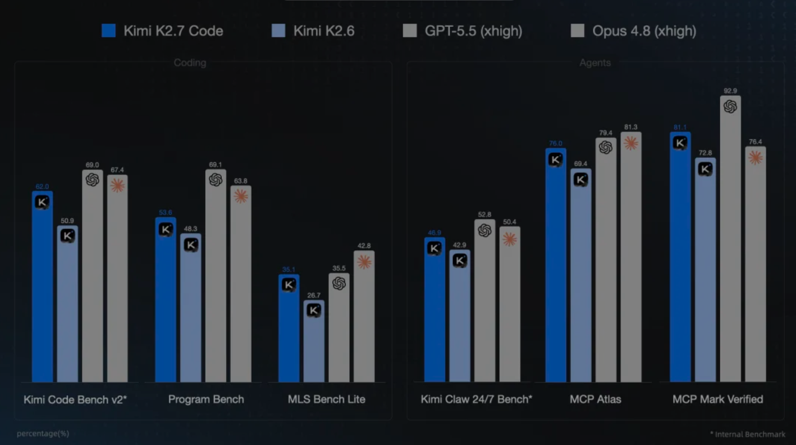

# Kimi K2.7 Code 发布并开源：编程专项大升级，高速版今日上线

**更新日期 2026.6.15** 数据来源 [https://vibecoding.dreamfree.space](https://vibecoding.dreamfree.space)

> 本次核心更新：**6 月 12 日**月之暗面发布并开源 **Kimi K2.7 Code**（Modified MIT）；**Kimi Code Plan** 默认模型同步升级；开放平台 API **不涨按量价**；**6 月 15 日** **高速版** `kimi-k2.7-code-highspeed` 上线（约 **5–6×** 输出速度、**2×** 价格）；相对 K2.6 官方称长程编程与指令遵循提升，思考 token 平均 **-30%**；非编程任务仍推荐 **K2.6**。

2026 年 6 月中旬，国产大模型在 **Coding** 赛道继续加速。**月之暗面 Kimi** 于 **6 月 12 日**发布并开源编程专用模型 **Kimi K2.7 Code**，**6 月 15 日**又上线同权重的高速推理版本。与一周前 **GLM-5.2** 全量开放 Coding Plan 形成呼应，Kimi 这次走的是另一条路：名字里就写着 **Code**，官方明确建议「纯对话、办公用 K2.6，编程用 K2.7」——在人人都想讲 AGI 的语境里，这种主动划边界、集中力量做编程的做法相当克制。下面从能力、定价、社区实测和怎么接入手把手说清楚。

## 一、K2.7 Code 是什么：不是大改版，而是「编程专项后训练」

### 1. 架构与定位

Kimi K2.7 Code 基于 **K2.6** 构建，Hugging Face Model Card 给出的核心规格与 K2.6 一脉相承：

| 项目 | 参数 |
|------|------|
| 架构 | MoE（1T 总参 / **32B** 激活） |
| 上下文 | **256K** |
| 视觉编码 | **MoonViT**（400M） |
| 开源协议 | **Modified MIT** |
| 量化 | **Native INT4** 原生量化 |

社区技术解读将其类比为 **GPT-5.3-Codex** 一类路线：**核心 MoE 与 K2.6 基本一致**，更像在 K2.6 之上做 **coding-focused agentic tuning**——强化长上下文编程、长程 Agent 工具调用与工程任务完成率，而不是推倒重来。MoonViT、图像与视频输入能力均保留；**强制 Thinking + preserve_thinking**，不支持 Instant 模式。

官方口径很直白：**非编程任务请继续用 K2.6**。在通用对话、办公写作等场景，专用 Coding 模型反而可能倒退——这与「大语言模型正在变成大编程模型」的行业趋势一致：厂商把算力与后训练预算 increasingly 押在 ROI 更清晰的编程场景上。

### 2. 开源权重：改了什么，普通人怎么用

**6 月 12 日**起，完整权重已在 **Hugging Face**（`moonshotai/Kimi-K2.7-Code`）以 **Modified MIT** 协议公开。Model Card 写明：**1T MoE、32B 激活、256K 上下文**，并采用与 Kimi-K2-Thinking 相同的 **Native INT4** 原生量化。在闭源顶流越来越贵、接入限制越来越多的背景下，月之暗面把 Coding 专用版权重摊开，至少让研究与生态跟进有据可查。

对个人开发者，主路径是 **Kimi 开放平台 API** 与 **Kimi Code 会员**——普通版按量价与 K2.6 一致，需要更快响应可上高速版。下文套餐与接入均按 API / 会员展开。

## 二、官方能力与 benchmark：长程编程跃升，但要看清榜单性质

### 1. 相对 K2.6 的三条主线

月之暗面内外部评估给出的相对 K2.6 提升幅度如下：

| 基准 | 相对 K2.6 提升 |
|------|----------------|
| Kimi Code Bench v2 | **+21.8%** |
| Program-Bench | **+11%** |
| MLS Bench Lite | **+31.5%** |
| Kimi Claw 24/7 / MCP Atlas / MCP Mark Verified | 约 **+10%** |

同时，官方强调在长程任务中**大幅改善过度思考**，平均 **token 消耗减少约 30%**（主要来自 thinking-token 的下降）——这对 Claude Code、OpenClaw 等长会话 Agent 的直接意义是：**同样任务可能更省额度、更少等待**。

### 2. 绝对分数：接近 Opus 4.8，仍落后 GPT-5.5

Hugging Face Model Card 公布的绝对分如下（Thinking 模式，temperature=1.0，top_p=0.95）。下图与下表数据一致，图注标注 **Internal Benchmark**——其中多项为 Kimi 自研或厂商参与设计的基准，**不能**直接等同于 SWE-bench Verified 等行业通用榜。

| 基准 | K2.6 | **K2.7 Code** | GPT-5.5 | Claude Opus 4.8 |
|------|------|---------------|---------|-----------------|
| Kimi Code Bench v2 | 50.9 | **62.0** | 69.0 | 67.4 |
| Program Bench | 48.3 | **53.6** | 69.1 | 63.8 |
| MLS Bench Lite | 26.7 | **35.1** | 35.5 | 42.8 |
| Kimi Claw 24/7 Bench | 42.9 | **46.9** | 52.8 | 50.4 |
| MCP Atlas | 69.4 | **76.0** | 79.4 | 81.3 |
| MCP Mark Verified | 72.8 | **81.1** | 92.9 | 76.4 |

读表要点：

- **Kimi Code Bench v2** 上 K2.7（62.0）已**逼近 Opus 4.8（67.4）**，但仍明显低于 **GPT-5.5（69.0）**；
- **Program Bench / MLS** 上与北美顶流仍有差距；
- **MCP Mark Verified** 上 K2.7（81.1）已超过 Opus 4.8（76.4），Agent 工具链场景值得实测。

### 3. Code V3、DeepSWE 这些榜还没跟上

自家 benchmark 涨得猛，但第三方工程榜这边，**K2.7 的名字暂时还看不到**：

| 榜单 | 现状 |
|------|------|
| **LLM Benchmark Code V3** | 只有 K2.6 的老数据，K2.7 还没入榜 |
| **DeepSWE** 等 Agent 工程榜 | 官方、社区都没放出 K2.7 分数 |
| **SWE-bench Verified** 等通用榜 | 月之暗面没公布 K2.7 成绩 |

所以眼下判断 K2.7 到底能不能改写国产 Coding 格局，还得靠官方表 + 社区小样本；等 Code V3 维护者把 K2.7 跑进去，对比会更有说服力。

## 三、社区实测：C++ 代码审查小样本里的信号

知乎用户 **杞鋂** 做了一组 **C++ 单文件代码审查**个人评测（**7 个真实历史 bug**，来自 bitcoin / godot / fmt 三个大型项目；**Opus 4.8 盲评**；环境以 Claude Code 为主）。**样本极小，仅作个人开发参考，不可推广为通用 Coding 能力排名。**

### 1. 综合位次

在其自定义六项等权评分体系下（时效、性价比、低误报、精度、召回、克制，越低越好）：

- **GPT-5.5 (xhigh)** 综合第 1；
- **Kimi K2.7 Code** 综合第 **4**（Qwen 3.7 第 3）；
- 七个样本中 **n02 全员漏检**——C++ 对各家仍是硬骨头。

### 2. K2.7 相对 K2.6 的变化（同一评测者）

| 维度 | 变化 |
|------|------|
| 精度 | 真 bug 占比更高，废话更少 |
| 克制 | 报告总量约少 **30%**，不再「凑数」 |
| 误报 | 高危假警更少 |
| 单次成本 | 约 **¥0.139 → ¥0.103** / 次审查 |
| 耗时 | **变长** |

若你主要做 **C++ / 后端代码审查**（而非从零生成 UI），这组数据说明 K2.7 在「少废话、少误报、更准」上有可感知进步——但**速度变慢**，交互体验需自己权衡。作者亦提醒：C++ 审查比代码生成更少人工干扰，反而更适合做自动化对比。

## 四、使用体验：思考方式变了，简单任务可能「人狠话少」

开发者 **waterwu** 的体感与官方「减 thinking-token」叙事相互印证：

- **K2.6**：习惯 **先 think、再调工具**；
- **K2.7**：倾向 **先读文件、再思考**；
- 虽 API 层 **强制 Thinking**，但任务简单、信息明确时，K2.7 可能 **不显式长思考、直接开干**——整体更快、token 更少，但也有人反馈「经常不思考」会缺乏安全感。

这与「减少过度思考」并不矛盾：K2.7 更像在**该想的时候想、该干的时候干**。长程复杂任务仍依赖 preserve_thinking 与多步工具链；短平快补全则受益于更克制的推理开销。

### 展望（仅为推测）

若对照 K2.6 当年的节奏——先发布 **Code** 专项版、再经后训练推出不带 Code 后缀的正式全量版——**有人推测**月之暗面后续还可能发布 **正式 K2.7** 并逐步接替 K2.7 Code 的命名。**这仅是社区猜测，官方尚未公布任何路线图，请勿当作既定计划。**

另外，Cursor 基于 Kimi 基座训练的 **Composer 2.5** 在业界口碑不错，也侧面说明 Kimi 在 **INT4 原生量化**与 Coding 后训练上仍有挖掘空间；K2.7 Code 可视为这条产品线的又一次落地。

## 五、多模态与 Agent 工具链

K2.7 Code 继续支持 **图像 + 视频**输入（**Kimi 官方 API** 完整支持）。典型场景：

- 设计图 → 前端代码；
- 报错截图 → 定位与修复；
- 长仓库 + 多文件 Agent 会话。

工具调用方面须遵守 K2 系列约束：`tool_choice` 仅 **auto / none**；多轮 Agent 必须在上下文中保留 assistant 的 **`reasoning_content`**，否则 API 报错。

**推荐搭配**：

- 官方 **Kimi Code CLI**（`https://www.kimi.com/code`）；
- 第三方：**Claude Code、Roo Code、OpenCode、OpenClaw** 等，通过 Kimi Code 会员 API Key 接入。

开放平台 Base URL：`https://api.moonshot.cn/v1`；Kimi Code 订阅端点为 `https://api.kimi.com/coding/v1`（OpenAI 兼容）。

## 六、API 定价：普通版不涨，高速版 2× 价换 5–6× 速

### 1. 开放平台按量（每百万 tokens）

| 项目 | 普通版 K2.7 Code | 高速版 K2.7 Code |
|------|------------------|------------------|
| 标准输入 | **¥6.5** | **¥13** |
| 标准输出 | **¥27** | **¥54** |
| 缓存命中输入 | **¥1.3** | **¥2.6** |

普通版价格与 **K2.6 完全一致**；高速版为 **2 倍价**，输出速度约为普通版 **5–6 倍**——常规编程场景（输入长度中位数）约 **180 tokens/s**，短上下文可达 **260 tokens/s**。

**6 月 15 日起**，高速版已向 **Kimi Code Beta 成员、Kimi API 开发者、Kimi Business 用户**开放。模型 ID：`kimi-k2.7-code`、`kimi-k2.7-code-highspeed`。普通 **Kimi Code 会员**能不能默认切到高速版、什么时候开放，官方还没说清楚，得再等等公告。

对 **交互密集、补全频繁** 的场景，2× 价换 6× 速往往划算；对 **长程 Agent 一次性跑完** 的任务，仍应优先看 **总 token** 而非峰值速度。

### 2. Kimi Code 会员套餐

Kimi Code 权益包含在 **Kimi 会员**中，**不限购**，额度每 **7 天**刷新，另有 **5 小时**滚动频控。默认模型已升级为 **K2.7 Code**；手动关闭 Thinking 时 API 报错，Kimi Code 会回退 **K2.6**。

| 套餐 | 连续包月 | Kimi Code 额度倍数 | 核心权益 |
|------|----------|-------------------|----------|
| Andante | **¥49** | 1× | Agent 4 倍速 |
| Moderato | **¥99** | 4× | Agent 多任务并行 |
| Allegretto | **¥199** | 20× | 免费 Kimi-Claw |
| Allegro | **¥699** | 60× | 更高 Agent 集群额度 |

社区反馈中，**¥49 / ¥99 档**对重度 Coding 往往偏紧，**¥199** 对个人又略过剩——**高速版按量 API** 恰好适合「用量不大但想要快」的开发者：理论上 **2× 价 × 6× 速** 可接近 **12× 的 token 吞吐效率**（仍受频控与套餐月额度约束）。

订阅入口：[Kimi 会员与 Kimi Code](https://api.dreamfree.space/c/s/cpyqkimi)

## 七、与 K2.6、GLM-5.2 及国产梯队

### 1. 相对 K2.6：代际跃迁，而非小修小补

官方 benchmark 上，K2.7 Code 相对 K2.6 是**全面抬升**；token 效率还有 **-30%** 的额外红利。对 **已订阅 Kimi Code** 的用户，这是**默认免费升舱**，无需改套餐。

### 2. 相对 Code V3 上的 K2.6（历史参照）

在 [GLM-5.2 解读](https://vibecoding.dreamfree.space/articles/news/20260613_glm_5_2/) 所引用的 **Code V3（2026-05）** 中，**Kimi-K2.6 (Think)** 表现为 Mac **49/D**、Flutter **17/C**、Web **33/C**、Game / Rust **Failed**——明显弱于同期 **GLM-5.1**，更遑论 **GLM-5.2**。K2.7 官方分的大幅跃升说明月之暗面确实在 Coding 上押了重注，但是否能在 Code V3 等新一期榜单上改写国产格局，**仍需等待维护者复测**。

### 3. 与 GLM-5.2：不同叙事，不宜硬比一张表

- **GLM-5.2**：1M 上下文 + Coding Plan 全量开放；Code V3 暂列综合第三。
- **Kimi K2.7 Code**：256K 编程专项 + **权重已开源** + API 不涨价 + 今日高速版上线。

二者都是国产 Coding 第一梯队的重要变量：**智谱**在长上下文与榜单实测上先声夺人；**Kimi** 则在**开源权重**、多模态 Agent 与**会员不限购**上保持差异化。选型应看你是 **Coding Plan 限购环境下的 GLM 用户**，还是 **Kimi Code 存量 / 多模态 Agent** 用户。

## 八、选型建议

### 已订阅 Kimi Code

- **立刻默认使用 K2.7 Code**；非编程对话手动切回 **K2.6**（或接受 Code 回退逻辑）。
- 长 Agent 会话关注 **token 是否下降**；交互式编码可试 **高速版 API**（2× 价）。
- C++ / 后端审查场景可参考社区小样本结论，在真实仓库上做 **审查而非生成** 验证。

### 尚未订阅、考虑按量

- 开放平台 **普通版不涨**：适合已有 `MOONSHOT_API_KEY`、想接产品集成的团队。
- **高速版**适合「脑子跟得上、机器也要跟得上」的短任务；长任务仍盯总账单。

### 与 GLM-5.2 / MiniMax-M3 如何选

- 能抢到 **GLM Coding Plan** 且需要 **1M + Code V3 已验证的 A 档工程能力**：GLM-5.2 仍是当前国产 Coding 的硬参考。
- 需要 **不限购 + 多模态 + Kimi-Claw**：Kimi **Allegretto（¥199）** 等档位仍值得对比。
- 更在意 **按量速度**、会员额度又不够用：可优先关注 **高速版 API**（2× 价、约 5–6× 输出速度）。

### 明确不推荐

- **纯办公、写作、通用对话**：请用 **K2.6**，不要用 K2.7 Code 硬撑。

## 九、总结

Kimi K2.7 Code 不是「又一个更大的通用模型」，而是月之暗面在 **Coding** 上 **断其一指** 的专项产品：**6 月 12 日**发布并开源权重，**6 月 15 日**高速版补齐速度短板，**存量 Kimi Code 用户默认升舱且 API 不涨价**。官方 benchmark 与社区 C++ 审查小测共同指向一个方向——**更准、更克制、更省 token**。

对开发者而言，若你关心的是「在国内还能稳定用什么写代码」，K2.7 Code 走的 **API + 会员** 路线，和 GLM-5.2 那条 **1M Coding Plan** 路线，算是 2026 年国产 Coding 的两条主线。**高速版今天已经能用了**（目前主要是 API / Beta 等指定渠道）——建议拿自己的仓库跑一轮，再决定续 **Kimi Code 会员** 还是单独开 **高速版按量**。

> 数据来源 [https://vibecoding.dreamfree.space](https://vibecoding.dreamfree.space)
>
> 原文链接 [https://vibecoding.dreamfree.space/articles/news/20260615_kimi_k27_code/](https://vibecoding.dreamfree.space/articles/news/20260615_kimi_k27_code/)
