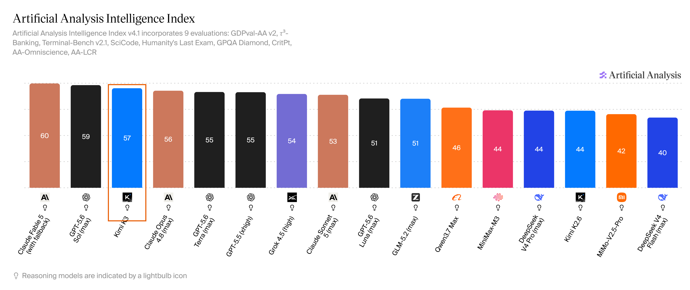
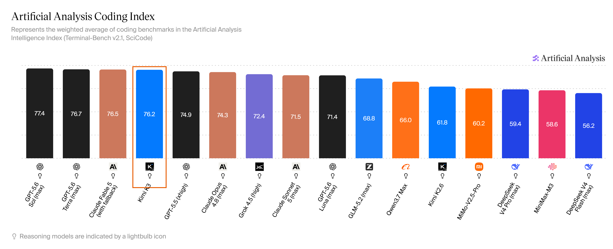
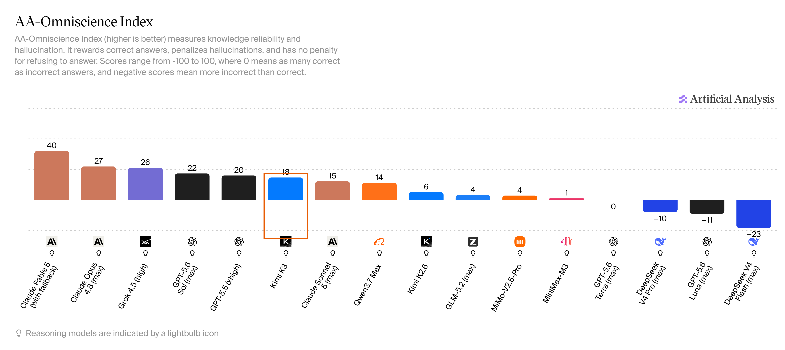
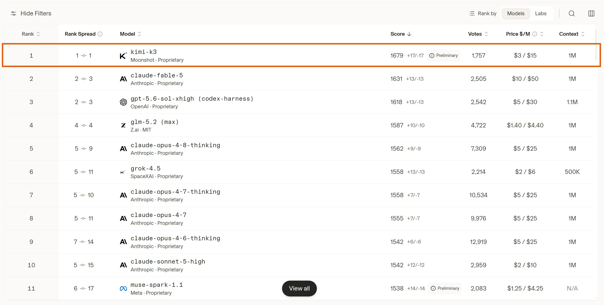
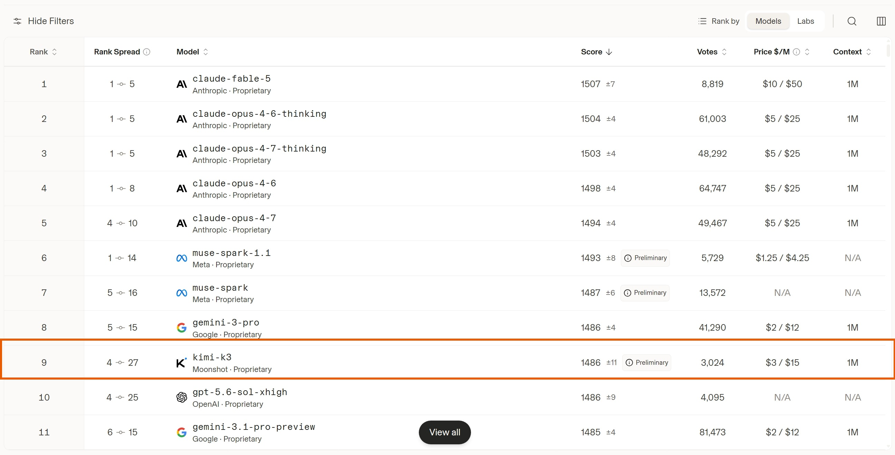
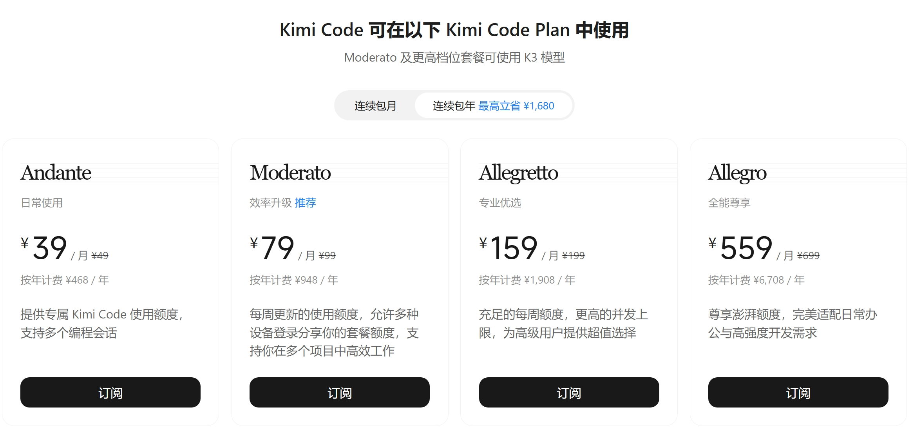

# Kimi K3 来了：2.8 万亿参数旗舰

**更新日期 2026.7.18** 数据来源 [https://vibecoding.dreamfree.space](https://vibecoding.dreamfree.space)

> 本次核心更新：月之暗面发布旗舰模型 **Kimi K3**（约 **2.8 万亿 / 2.8T / 2800B** 参数、**100 万**上下文、原生看图/看视频）；独立评测 Artificial Analysis 智能指数约 **57**，综合约第三，紧贴 Claude Fable 5 与 GPT-5.6 Sol；Arena **WebDev** 盲测投票榜 **登顶**（约 **1679** 分）；API 价为缓存命中 **¥2** / 未命中 **¥20** / 输出 **¥100**（每百万 tokens）；完整权重计划于 **2026 年 7 月 27 日前**开放。

2026 年 **7 月 16 日**，月之暗面甩出迄今最强的一张牌：**Kimi K3**。它不再是「编程专项」小步迭代，而是冲着长程写代码、做研究、剪片子、搭前端的全能旗舰来的。官方自己说得很诚实——整体仍略逊于当前最强的闭源双子星 **Claude Fable 5** 与 **GPT-5.6 Sol**，但在自家整套评测里，已经稳定压过其余选手。独立实验室与投票榜也大致印证了同一画面：离天花板只差半步，价格却比海外旗舰友好一截。下面讲清：它是什么、能干嘛、强到哪、会员怎么选、怎么接入、API 多少钱。

## 一、K3 是什么：更大、更长、更能「看见」

可以把 K3 理解成月之暗面的新一代「总控大脑」：

| 项目 | 要点 |
|------|------|
| 参数规模 | 约 **2.8 万亿**（**2.8T / 2800B**）；MoE：896 个专家里每次激活 **16** 个 |
| 上下文 | **100 万** tokens，一次塞进超大代码库或长文档更从容 |
| 多模态 | **原生**支持图像、视频理解（输出为文本） |
| 架构关键词 | Kimi Delta Attention、注意力残差等——让信息在长文本、深层网络里流动更顺 |
| 开源计划 | 完整权重计划 **7 月 27 日前**放出 |

相对更早的 K2 / K2.6 / K2.7 Code 系列，K3 是代际旗舰：官方称整体扩展效率大约提升到 K2 的 **2.5 倍**——同样算力，更能转化为可用能力。一句话概括：**更大、记得更长、能看图看视频一起干活**。

接入方面，即日起可在 **kimi.com**、最新版手机 App、**Kimi Work** 桌面端（建议 **3.1.0** 及以上）、终端里的 **Kimi Code**（`/model` 选 K3），以及开放平台 API 模型名 **`kimi-k3`** 上体验。

## 二、它到底能干嘛：编程、办公 Agent、创作一条龙

### 1. 长程编程与「看见界面再改」

K3 的强项之一，是少人盯着也能把工程任务往下推：啃大仓库、调终端工具、对着截图改前端或游戏。官方演示过从手绘草图到可玩小游戏、长时间内核优化、甚至搭出类 Triton 编译器流水线等案例；社区实测里，也常提到「审美在线、前端一次成型率高」。

更直观的画面是：丢一张草图或设计图，它能读懂你要什么，再自己试玩、修 bug——这比「只会吐代码块」的模型好用得多。

### 2. 知识工作：调研、图表、持续看板

在 Kimi Work 里，K3 更像能开工的同事：行业研究、交互报告、多 Agent 并行分析，都能做成带图表、时间线的成品。官方还上了 **小组件（Widgets）** 和 **看板（Dashboard）**，把常用结果钉在一个长期视图里，而不是聊完就散。

### 3. 视频与动效

因为原生多模态，K3 也能做讲解风动画、从几十段素材剪品牌片这类「又看又剪」的活。官方称高密度短片，熟练剪辑师可能要一两天，它能压到更短周期——当然成品仍要人眼把关。

## 三、强到什么程度：实验室分 + 投票榜

### 1. Artificial Analysis：综合约第三

独立评测机构 Artificial Analysis 给出的 **Intelligence Index** 约 **57**：整体与 **Opus 4.8 / GPT-5.5** 同档或更强，仍落后 **Fable 5** 与 **GPT-5.6 Sol**——和官方自我定位一致，综合排名约第三。

图片来源：[Artificial Analysis · Intelligence Index](https://artificialanalysis.ai/?intelligence=artificial-analysis-intelligence-index&omniscience=omniscience-index&models=mimo-v2-5-pro%2Ckimi-k2-6%2Cgpt-5-5%2Cclaude-sonnet-5%2Cminimax-m3%2Cgpt-5-6-luna%2Cqwen3-7-max%2Cgrok-4-5%2Cclaude-opus-4-8%2Cgpt-5-6-terra%2Cdeepseek-v4-pro%2Cclaude-fable-5%2Cdeepseek-v4-flash%2Cgpt-5-6-sol%2Cglm-5-2%2Ckimi-k3#intelligence-tabs)

编程相关的 **Coding Index** 约 **76.2**，紧贴 Sol / Fable / Terra，大约第四——和「长程编程、前端」体感一致。

图片来源：[Artificial Analysis · Coding Index](https://artificialanalysis.ai/?intelligence=coding-index&omniscience=omniscience-index&models=mimo-v2-5-pro%2Ckimi-k2-6%2Cgpt-5-5%2Cclaude-sonnet-5%2Cminimax-m3%2Cgpt-5-6-luna%2Cqwen3-7-max%2Cgrok-4-5%2Cclaude-opus-4-8%2Cgpt-5-6-terra%2Cdeepseek-v4-pro%2Cclaude-fable-5%2Cdeepseek-v4-flash%2Cgpt-5-6-sol%2Cglm-5-2%2Ckimi-k3#intelligence-tabs)

分项里更值得看的是：

- 真实工作 Agent（GDPval）Elo 约 **1668**，明显高于前代 K2.6；
- 长程知识工作（AA-Briefcase）约 **1547**，仅次于 Fable；
- 一类 SaaS 自动化评测上拿到靠前甚至第一的位置；
- 相对 K2.6，完成同类评测用的输出 token 大约少 **两成**，更「聪明也更省字」。

知识可靠性上，**AA-Omniscience**（答对加分、乱编扣分）约 **18**，明显高于前代 K2.6（约 6），仍低于 Fable、Sol；另一侧的「幻觉率」指标里，K3 又好于 Fable / Sol——两套尺子看的不是同一件事，别混着比。

图片来源：[Artificial Analysis · Omniscience Index](https://artificialanalysis.ai/?intelligence=coding-index&omniscience=omniscience-index&models=mimo-v2-5-pro%2Ckimi-k2-6%2Cgpt-5-5%2Cclaude-sonnet-5%2Cminimax-m3%2Cgpt-5-6-luna%2Cqwen3-7-max%2Cgrok-4-5%2Cclaude-opus-4-8%2Cgpt-5-6-terra%2Cdeepseek-v4-pro%2Cclaude-fable-5%2Cdeepseek-v4-flash%2Cgpt-5-6-sol%2Cglm-5-2%2Ckimi-k3#omniscience-tabs)

### 2. Arena：前端盲测第一，对话国产第一

[Arena](https://arena.ai/leaderboard) 是真人盲测投票的实测榜（非实验室跑分），和跑分榜互补：

| 榜单 | Kimi K3 | 备注 |
|------|---------|------|
| **WebDev（前端网页）** | 约 **1679**，**第一**（高于 Fable 约 1631、Sol 约 1618） | 初步分，票数仍在积累 |
| **Text（综合对话）** | 约 **1486**，大约第 **9** | 全球前十，**国产模型第一** |

图片来源：[Arena · WebDev 榜](https://arena.ai/leaderboard/code/webdev)

图片来源：[Arena · Text 榜](https://arena.ai/leaderboard/text)

前端盲测登顶、综合对话挤进全球前十且国产第一，是当前最显眼的两张成绩单；其余分榜还在继续投票，名次也会跟着动。

## 四、Kimi 会员与 Kimi Code

Kimi Code 权益目前包含在 **[Kimi 会员](https://api.dreamfree.space/c/s/cpyqkimi)** 里，常见连续包月档位如下（额度倍数、刷新规则以当期官网为准）：

| 套餐 | 连续包月 | Kimi Code 额度倍数 | 适合谁 |
|------|----------|---------------------------|--------|
| Andante | **¥49** | 1× | 轻度试用 |
| Moderato | **¥99** | 4× | 轻度编程 |
| Allegretto | **¥199** | 20× | 重度编程 |
| Allegro | **¥699** | 60× | 多项目重度编程 / 多 Agent |

图片来源：[Kimi 会员套餐页](https://api.dreamfree.space/c/s/cpyqkimi)

**使用 K3**：从 **Moderato（¥99）及更高档位**起可用 K3；Andante 档不含。上图为官网连续包年视图（折合月价更低），**正文表格以连续包月标价为准**。

性价比上看，**Allegretto、Allegro 更高**，Andante、Moderato 偏低。K3 更费额度，**重度使用至少建议 Allegretto**；多项目或长时间多 Agent，可考虑 Allegro。额度不够时可搭配按量 API，或把简单任务分给更便宜的模型。

抽奖小提示：未注册用户可用 [邀请链接](https://api.dreamfree.space/c/s/cpyqkimiinvite) 注册，并在 **3 小时内**下载 App，可参与抽奖，至少 **3 天**会员；已注册用 [订阅链接](https://api.dreamfree.space/c/s/cpyqkimisub)，**24 小时内**订阅也可参与抽奖。

更全 Coding Plan 对比：[https://vibecoding.dreamfree.space](https://vibecoding.dreamfree.space)

### 新会员体系即将上线

官方已提示：**新会员体系即将上线**。届时 **Kimi 权益将与 Kimi Code 权益拆分**，可按需分别购买，灵活度更高。

- **订阅中用户不受影响**；
- 若仍想继续使用当前「合并权益」，可在新体系上线前购买现有套餐；
- 上线后也可再升级到新套餐（以官方最终规则为准）。

若你看重当前「合并权益」、用量又大，可以考虑**[先订阅/续一期锁定现有套餐](https://api.dreamfree.space/c/s/cpyqkimi)**，等新会员体系上线后再观察规则与额度是否合适，再决定要不要换新档。

## 五、选型、接入与 API 价格

### 1. 和主流模型对照

海外价按约 **1 美元 ≈ 7 元人民币**折合，方便横比；**Kimi K3 用官方人民币标价**。

| 模型 | 一句话定位 | AA 智能指数 | Arena WebDev | API 输入/输出（约元/百万 tokens） | 获取方式 |
|------|------------|-------------------|--------------|-----------------------------------|----------|
| Claude Fable 5 | 当前综合天花板之一 | ~60 | 1631（第 2） | 约 **70 / 350** | 闭源 |
| GPT-5.6 Sol | 执行型编程极稳的另一极 | ~59 | 1618（第 3） | 约 **35 / 210** | 闭源 |
| **Kimi K3** | **紧贴两大旗舰的国产全能旗舰** | **~57** | **1679（第 1）** | **20 / 100** | 即将开源 |
| Claude Opus 4.8 | 上一代顶尖 Claude，仍很强 | ~56 | 1562（第 5） | 约 **35 / 175** | 闭源 |
| GLM-5.2 | 开源权重里的强力选手 | ~51 | 1587（第 4） | 约 **10 / 31** | 开源 |
| DeepSeek V4 Pro | 更便宜的开源主力 | ~44 | 明显靠后 | 约 **3 / 6** | 开源 |

- **对 Fable / GPT-5.6 Sol**：综合智能仍略逊，但前端盲测榜 K3 反超；单价明显更低，做长任务时「总花费」往往更有竞争力。
- **对 Opus 4.8**：实验室综合与真实工作 Agent 分项上，K3 已整体略反超。
- **对 GLM-5.2 / DeepSeek V4 Pro**：K3 更强也更贵——要的是「贴近海外旗舰的体验」，不是「最便宜能跑」。

**要极致体验且预算够 → Fable/Sol；要国产第一梯队全能 → K3；要开源自托管且够用 → GLM；要极致性价比 → DeepSeek。**

### 2. API 价格与限时充赠

| 计费项 | 价格（每百万 tokens） |
|--------|----------------------|
| 输入（缓存命中） | **¥2** |
| 输入（缓存未命中） | **¥20** |
| 输出 | **¥100** |
| 上下文窗口 | **100 万（1M）** tokens |

编程场景里，若系统提示词、仓库前缀长期不变，**缓存命中**会让实际输入成本大幅下降——官方称自家 API 在编程负载下缓存命中率可很高，具体项目仍取决于提示是否稳定。

国内新用户常见的 **15 元代金券，不能用来体验 K3**，请充值后使用。

**2026 年 7 月 16 日～8 月 12 日**，开放平台单笔充值满 **¥99** 起有阶梯赠券（约 **10%～30%**）。充赠**仅限 Kimi API 开放平台按量付费**，不适用于 Kimi 客户端、Kimi Code 等产品。

### 3. 目前接入方法

**网页 / App / Work**  
打开kimi网站、升级手机 App，或下载 **Kimi Work**，直接用 K3 聊天、改文档、做研究看板。

**Kimi Code**  
在终端跑 **Kimi Code**，用 `/model` 切到 K3。官方强调自家模型配自家框架更稳；需要图形界面时，也可按官方说明启动 Web 界面。多轮 Agent 请尽量回传完整历史，避免中途换模型导致质量不稳。

**按量 API（`kimi-k3`）**  
适合接入自建工具、第三方 Coding 客户端。个人写代码、日常交互更建议走会员；按量 API 由于价格更贵，更适合接到自己的系统里用。

分场景：

- **聊天、研究、剪片子** → App / Work；
- **写代码、接 IDE / CLI** → [Kimi Code 会员](https://api.dreamfree.space/c/s/cpyqkimi)（重度至少 Allegretto）；
- **预算极紧、用量又大** → 先看 [MiniMax](https://api.dreamfree.space/c/s/cpyqminimax) / [DeepSeek](https://api.dreamfree.space/c/s/cpyqdeepseek)，目前仍属最便宜一档，不必强上 K3。

## 六、谁适合立刻试，谁可以再等等

**适合现在就上手**

- 需要国产第一梯队全能模型，且能接受「旗舰档定价、相对海外顶尖仍更划算」；
- 前端、小游戏、看图改界面、长文档/大仓库分析等刚需用户；
- 当前已在 Kimi 生态（Code / Work）里，直接切换模型即可体验、使用。

**可以先观望**

- **已有 Codex / Claude Code 等订阅**：工作流已经跑顺，不必为尝鲜立刻换栈；
- **对价格敏感、用量又大**：K3 不是最便宜那一档——更省心先看 **[MiniMax](https://api.dreamfree.space/c/s/cpyqminimax) / [DeepSeek](https://api.dreamfree.space/c/s/cpyqdeepseek)**，目前仍属最便宜一档；
- **代码创作等场景，要求不算特别高**：够用即可时，不必追 K3 这档旗舰；
- **想本地私有化部署**：等 **7 月 27 日前**权重与许可落地，并评估有没有扛 2.8T 级推理的机器（多数场景继续用云端更现实）。

## 七、总结

Kimi K3 把国产公开旗舰又往前推了一大步：**智能贴近全球前二，前端盲测实测榜登顶，价格相对海外旗舰更友好，同时官方也承认整体体验还没追上最顶尖的两家。** 它不是「免费午餐」，而是一辆更贵、也明显更能跑的车。

1. **能力**：全能旗舰，长程编程 + 多模态 + 知识工作；
2. **位置**：实验室综合约第三，Arena 前端登顶、对话国产第一；
3. **上车**：App/Work 体验，Code/API 干活；人民币价看清缓存与会员档，别用 15 元券幻想白嫖 K3。

接下来几周，权重是否如期开放、**新会员体系是否上线**、投票榜是否稳住、各家 Coding Plan 怎么调价，都会继续改写选型——欢迎收藏站内对比页，跟着更新走。

> 数据来源 [https://vibecoding.dreamfree.space](https://vibecoding.dreamfree.space)
>
> 原文链接 [https://vibecoding.dreamfree.space/articles/news/20260718_kimi_k3/](https://vibecoding.dreamfree.space/articles/news/20260718_kimi_k3/)
>
> Kimi 新用户注册 [https://api.dreamfree.space/c/s/cpyqkimiinvite](https://api.dreamfree.space/c/s/cpyqkimiinvite)
>
> Kimi 订阅套餐 [https://api.dreamfree.space/c/s/cpyqkimisub](https://api.dreamfree.space/c/s/cpyqkimisub)
