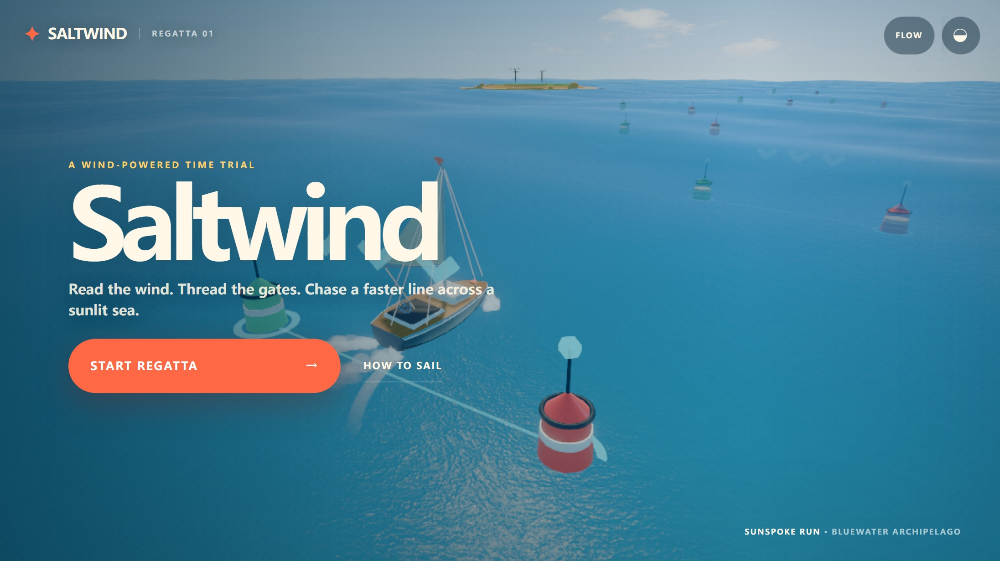
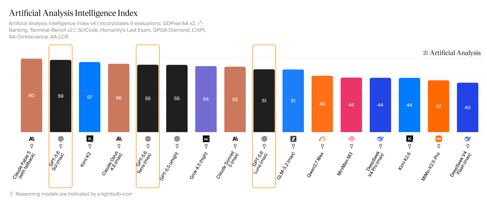
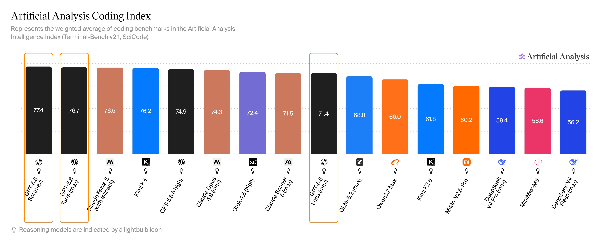
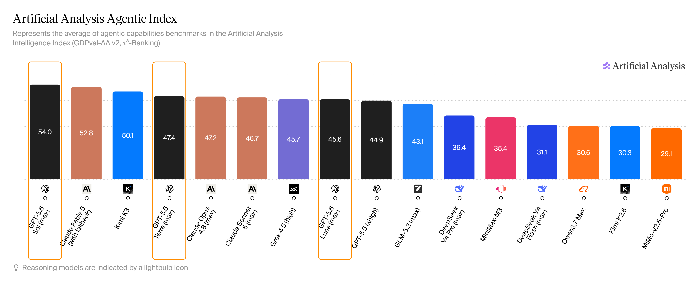
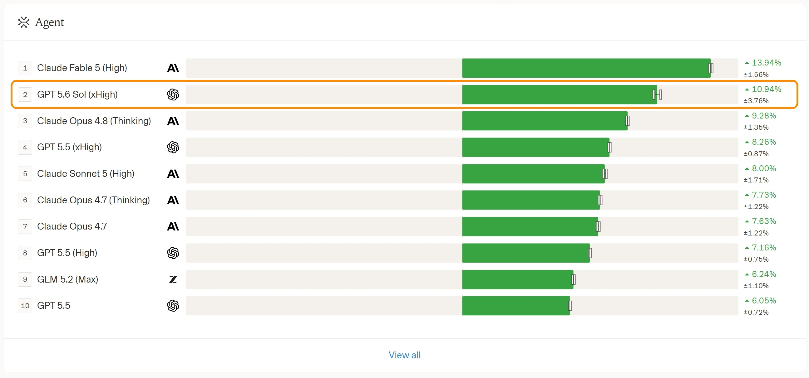
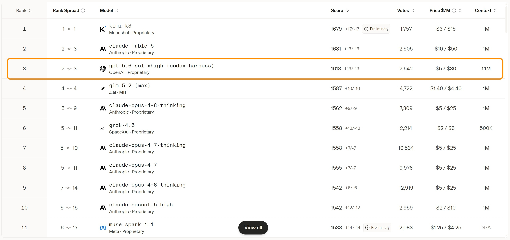
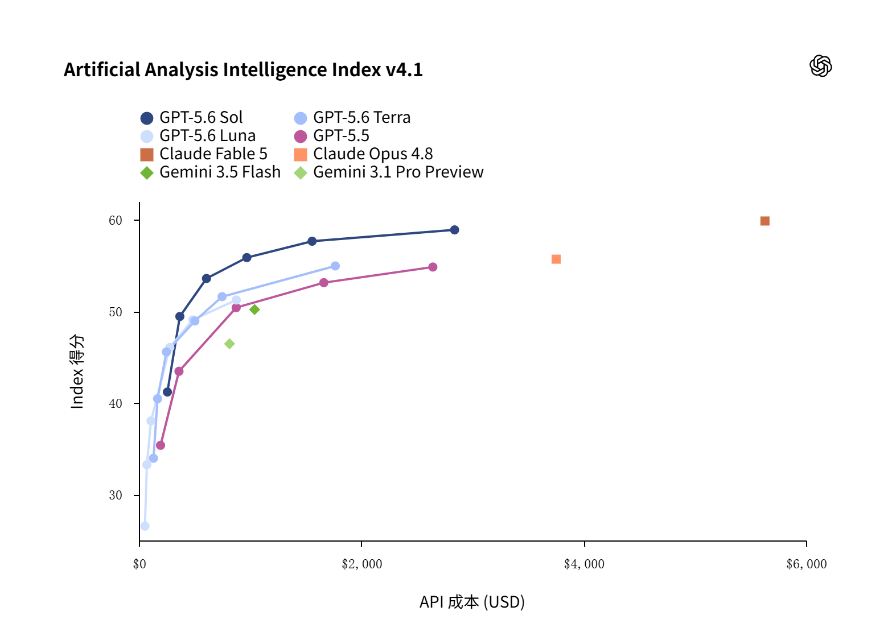
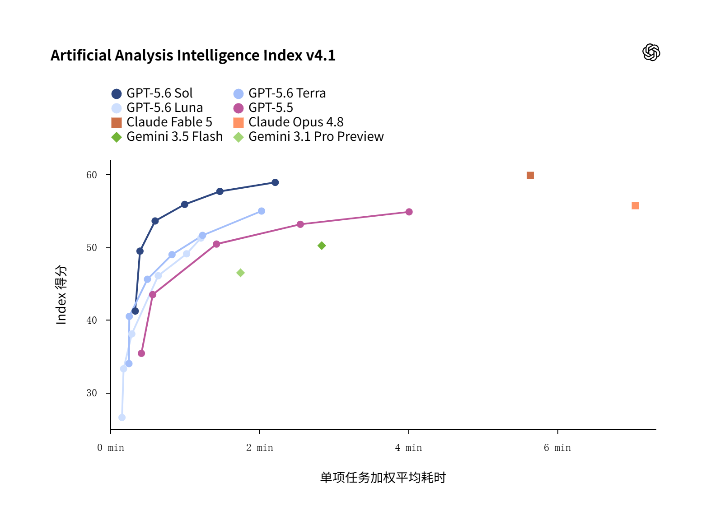

# GPT-5.6 来了：更强能力、更省Token！Sol、Terra、Luna 三档怎么选？

**更新日期 2026.7.19** 数据来源 [https://vibecoding.dreamfree.space](https://vibecoding.dreamfree.space)

> 一句话速览：OpenAI 于 **2026 年 7 月 9 日**正式推出 **GPT-5.6** 系列——旗舰 **Sol**、均衡 **Terra**、性价比 **Luna**；独立评测 Artificial Analysis 智能指数约 **59 / 55 / 51**，Sol 紧贴 Claude Fable 5；**Coding Index** 约 **77.4** 居首，**Agentic Index** 约 **54** 居首；Arena **Agent** 盲测第 **2**、**WebDev** 第 **3**；API 价约 **¥35/210、¥17.5/105、¥7/42**（每百万 tokens 输入/输出）。

2026 年 7 月 9 日，OpenAI 把新一代旗舰做成了「三件套」：不是只扔一个最强模型，而是用 **Sol / Terra / Luna** 覆盖顶尖、日常、便宜快三条赛道。官方说法很直白——每个 Token 更聪明，同样预算能干更多事；难题再加码开 **`max`**，再难就上 **`ultra`** 多智能体并行。下面依次说清：它是什么与能干嘛、强到哪、三档怎么选、和主流模型怎么比。

## 一、GPT-5.6 怎么样？Sol / Terra / Luna 是什么？

从 GPT-5.6 开始的新「太阳系」命名法。数字 **5.6** 表示代际；**Sol / Terra / Luna** 是三档能力：

| 档位 | 定位 | 适合谁 |
|------|--------|--------|
| **Sol** | 旗舰：编程、长任务、最难的活 | Plus 及以上、开发者、重度知识工作 |
| **Terra** | 均衡：接近上一代旗舰体验，更省 | 日常办公、免费/Go 用户默认档、要性价比的人 |
| **Luna** | 更快更便宜：够用就好 | 高频短任务、批量调用、预算紧 |

三个档位上下文均为 **100 万 tokens** ；均支持多模态（图像输入）。

之后预计会形成 GPT-5.7-Sol / GPT-5.7-Terra / GPT-5.7-Luna，GPT-5.8-Sol / GPT-5.8-Terra / GPT-5.8-Luna 这样的命名，类似 Anthropic 的 Fable / Opus / Sonnet 命名法。

### 三个档位和思考深度的关系

可以理解为三档能力对应的是三个模型，就像 DeepSeek V4 的 Pro / Flash 这样，Pro 和 Flash 是同一代不同档位的模型，不同的参数大小。Sol / Terra / Luna 也是类似的，其实是三个参数大小不同的模型，Sol 最大、Terra 中等、Luna 最小。每个档位都可以选择不同的思考深度（None / Low / Medium / High / Xhigh / Max）。

### 使用方法

目前可用入口包括：**ChatGPT 聊天**、**ChatGPT Work**、**Codex 桌面端/Cli**，以及 **API**。

> 7 月 9 日开始，ChatGPT 桌面端应用将“聊天” (Chat)、“工作”(Work) 与 Codex 融合为一个桌面应用。

### 能干嘛：编程、设计、办公一条龙

> [OpenAI 正式发布页](https://openai.com/zh-Hans-CN/index/gpt-5-6/)

#### 编程

官方自称「迄今最强编程模型」。Sol 被摆到编程 C 位：长仓库、终端流水线、多智能体拆活，是主战场。独立评测 **Coding Index** 约 **77.4** 居首，Terra 约 **76.7** 紧随其后；Luna 也能在更低成本下贴近上一代旗舰表现。开发者侧常见用法是 Codex、IDE 插件、Responses API 里的可编程工具调用——让模型自己写点胶水代码处理中间结果，而不是每一步都靠人回传。

#### 设计与「看见界面再改」

官方强调设计审美与计算机使用一起上了台阶：不只吐代码，还能检查渲染结果、修视觉和交互问题。发布页演示过一句话做出可玩的 3D 航海小游戏等案例——高层次需求 → 可交互成品，中间少了很多「只会写、不会看」的往返。

一句话生成可玩的 3D 航海小游戏——来自 [OpenAI 正式发布页](https://openai.com/zh-Hans-CN/index/gpt-5-6/)

#### 知识工作

从杂乱的资料、聊天记录、网盘文件里，整理成可分享的演示文稿、文档和表格，是另一条主线。官方称 Sol 在网页浏览、电脑操作类评测上刷新成绩；相对 GPT-5.5，做同样的事往往更少 Token、预估成本也更低。对普通人来说：同样交代一句「按这个模板改一版」，5.6 更少漏组件、更少排版翻车。

### 新增思考深度：`max` 与 `ultra`

默认就追求省 Token；遇到硬骨头，`max` 给单智能体更长推理、试错、自检时间；`ultra` 默认拉起约 **四个**智能体并行再汇总（严格说不是模型的思考深度，而是 Agent 的设定）——更贵，但往往更快出结果。

## 二、到底有多强：独立评测 + 盲测投票

### 1. Artificial Analysis：综合约第二，编程与 Agent 榜更亮

独立评测机构 Artificial Analysis（截至 2026 年 7 月 18 日）给出的 GPT-5.6 三档成绩大致如下：

| 指数 | Sol (max) | Terra (max) | Luna (max) | 简要说明 |
|------|-----------|-------------|------------|----------|
| **Intelligence Index** | **约 59**（约第 2） | 约 55 | 约 51 | 紧贴 Fable（约 60）；Terra 与 GPT-5.5 同档 |
| **Coding Index** | **约 77.4**（约第 1） | 约 76.7（约第 2） | 约 71.4 | 终端 + 科学编程加权；Sol/Terra 连拿前二 |
| **Agentic Index** | **约 54**（约第 1） | 约 47.4 | 约 45.6 | 真实工作 / 工具 Agent 平均；Sol 高于 Fable 约 52.8 |

和其他常比的模型放一起看：Kimi K3 智能约 57、Claude Opus 4.8 约 56——Sol 仍处在闭源第一梯队；Terra、Luna 则把中高水平做得更经济。看榜时注意：这里的 **Coding Index** 是 Artificial Analysis 的编程指数，网上别处还有名称相近的编程类榜单，口径不一样，分数不能直接横比。

#### Intelligence Index（综合智能）

把多套评测加权综合成一个总分，覆盖知识问答、科学推理、编程、真实工作 Agent 等，用来看「整体有多聪明」。当前榜上 Claude Fable 5 约 **60** 仍略高一截，Sol 约 **59** 紧随其后；再往后是 Kimi K3、Opus 4.8、Terra，Luna 大约落在五十出头。

综合智能榜：Sol 约 59、紧贴 Fable，Terra/Luna 跟在后面——[Artificial Analysis](https://artificialanalysis.ai/?intelligence=artificial-analysis-intelligence-index&omniscience=omniscience-index&models=mimo-v2-5-pro%2Ckimi-k2-6%2Cgpt-5-5%2Cclaude-sonnet-5%2Cminimax-m3%2Cgpt-5-6-luna%2Cqwen3-7-max%2Cgrok-4-5%2Cclaude-opus-4-8%2Cgpt-5-6-terra%2Cdeepseek-v4-pro%2Cclaude-fable-5%2Cdeepseek-v4-flash%2Cgpt-5-6-sol%2Cglm-5-2%2Ckimi-k3#intelligence-tabs)

#### Coding Index（编程）

更偏「写代码、改仓库、跑终端」一类能力，常见由 Terminal-Bench、SciCode 等加权。这里 Sol 约 **77.4**、Terra 约 **76.7**，前两名都是 GPT-5.6；Fable、Kimi K3、GPT-5.5 紧随其后。和综合榜不同：综合上 Fable 仍微微领先，编程榜上 Sol / Terra 更亮眼。

编程指数榜：Sol / Terra 连拿前二——[Artificial Analysis](https://artificialanalysis.ai/?intelligence=coding-index&omniscience=omniscience-index&models=mimo-v2-5-pro%2Ckimi-k2-6%2Cgpt-5-5%2Cclaude-sonnet-5%2Cminimax-m3%2Cgpt-5-6-luna%2Cqwen3-7-max%2Cgrok-4-5%2Cclaude-opus-4-8%2Cgpt-5-6-terra%2Cdeepseek-v4-pro%2Cclaude-fable-5%2Cdeepseek-v4-flash%2Cgpt-5-6-sol%2Cglm-5-2%2Ckimi-k3#intelligence-tabs)

#### Agentic Index（工具 Agent）

看的是多步工具调用、真实工作流一类表现，更接近「交给 Agent 自己干活」。Sol 约 **54** 居首，高于 Fable 约 **52.8**；Terra、Luna 大约四十多分，和「旗舰干活、中低档更省」的定位一致。

工具 Agent 榜：Sol 约 54 居首，高于 Fable——[Artificial Analysis](https://artificialanalysis.ai/?intelligence=agentic-index&omniscience=omniscience-index&models=mimo-v2-5-pro%2Ckimi-k2-6%2Cgpt-5-5%2Cclaude-sonnet-5%2Cminimax-m3%2Cgpt-5-6-luna%2Cqwen3-7-max%2Cgrok-4-5%2Cclaude-opus-4-8%2Cgpt-5-6-terra%2Cdeepseek-v4-pro%2Cclaude-fable-5%2Cdeepseek-v4-flash%2Cgpt-5-6-sol%2Cglm-5-2%2Ckimi-k3#intelligence-tabs)

### 2. Arena：Agent 第二，前端第三

[Arena](https://arena.ai/leaderboard) 是真人盲测投票的实测榜（不是 Artificial Analysis 那套题库自动评测）：用户不知道模型名字，只凭完成质量投票，和上面的指数榜互补。榜上分数通常带误差区间，名次也会随票数变动；下面按当时榜单的中心值来读。

| 榜单 | GPT-5.6 Sol | 备注 |
|------|-------------|------|
| **Agent** | **10.94%**，第 **2**（xHigh） | 同榜 GPT-5.5 xHigh 为 8.26%（第 4）；首位仍是 Fable 5 |
| **WebDev（前端）** | **1618**，第 **3**（sol-xhigh，codex-harness） | 前两名：kimi-k3 1679、Fable 1631 |

#### Agent 榜

看的是复杂 Agent 任务上的盲测表现（百分比得分，图上带 ± 误差区间）。Sol（xHigh）**10.94%**、第 **2**；同榜 Fable 5 High **13.94%** 仍更高，GPT-5.5 xHigh **8.26%**、第 4——同一生态里，5.6 比 5.5 明显靠前。

真人盲测 Agent 榜：Sol 第 2——[Arena](https://arena.ai/leaderboard)

#### WebDev 榜

看的是前端 / 网页开发类任务的盲测分（Elo 风格，同样有置信区间）。Sol（sol-xhigh，codex-harness）**1618**、第 **3**，前面是 kimi-k3 **1679**、Fable **1631**。这条带 **codex-harness** 标注，和没写 harness 的模型名次不好直接拿来比；票数还会继续涨，名次也可能动。

前端 WebDev 榜：Sol 第 3，前有 Kimi 与 Fable——[Arena](https://arena.ai/leaderboard/code/webdev)

## 三、三档 × 思考深度 怎么选？

实际使用里，大家更常纠结的是：**想达到某一档智力水平，该选 Sol / Terra / Luna 的哪一档、开多深的思考强度，怎么组合又快又省又好。**

下面这组对比，依据 OpenAI [正式发布页](https://openai.com/zh-Hans-CN/index/gpt-5-6/) 上两张 **Artificial Analysis Intelligence Index v4.1** 图（得分 vs API 成本、得分 vs 单项任务加权平均耗时）。图中的「成本 / 耗时」是跑完这套综合智能评测的**预估总花费（美元）**和**单项加权平均耗时（分钟）**，用来比较效率；和后文「每百万 tokens 标价」不是一回事。思考深度从浅到深大致为 **None / Low / Medium / High / Xhigh / Max**。成本统一用美元，方便直接横比。

得分与成本：三档各自随思考深度抬升，整体比 GPT-5.5 更「高分、相对更省」

得分与耗时：加深思考通常能提高分数，但单项平均等待也会变长

### 推荐组合

按照能力、任务速度和成本，配置的大致如下：

| 分数 | 大约什么概念 | 更值得默认 |
|------|--------------|------------|
| ≈59 | 新一代天花板（≈ Claude Fable 5 Max） | **Sol + Max** |
| ≈55 | 上一代天花板，新一代日常档（≈ GPT-5.5 xHigh、Opus 4.8 Max） | **Sol + High** |
| ≈53 | 上一代日常档（≈ GPT-5.5 High） | **Sol + Medium** |
| ≈50 | 上一代国产最强一带（≈ GPT-5.5 Medium、GLM-5.2） | **Sol + Low** |
| ≈45 | 上一代国产主力水平（≈ Qwen3.7 Max、DeepSeek V4 Pro、MiniMax M3） | **Terra + Medium** |
| ≈40 | 中模型水平（≈ DeepSeek V4 Flash） | **Terra + Low** |
| <40 | 轻量与批量 | **Luna + Low** |

归纳一句：Sol 使用 Max → Low 解决中高难度任务，Terra 使用 Medium → Low 解决中低难度任务，Luna 使用 Low → None 解决轻量、批量任务、格式转换等任务。

下面按七个常见目标分数展开说明，按需查看，可略过：

### 1. 约 59 分：≈ Claude Fable 5 Max，新一代天花板

Claude Fable 5 Max 约 **59.9**（约 **\$5631 / 5.6 分钟**）。GPT-5.6 里能摸到这一带的，主要是 Sol 顶配：

| 组合 | 得分 | 评测成本 | 耗时 |
|------|------|----------|------|
| **Sol + Max** | **约 58.9** | 约 **\$2839** | 约 **2.2 分钟** |
| Sol + Xhigh | 约 57.7 | 约 \$1558 | 约 1.5 分钟 |
| Terra / Luna | — | — | Max 分别约 55 / 51，够不到 59 |

**更合适的是 Sol + Max**：分数几乎贴着 Fable，评测成本大约只要 Fable 的 **一半**，耗时大约 **五分之二**。若还能接受略低一两分，**Sol + Xhigh** 更省。Terra、Luna 再怎么加深也到不了这一档。

### 2. 约 55 分：≈ GPT-5.5 xHigh、Opus 4.8 Max 上一代天花板

GPT-5.5 Xhigh 约 **54.8**（约 **\$2644 / 4.0 分钟**），Opus 4.8 Max 约 **55.7**（约 **\$3753 / 7.1 分钟**）。若目标落在这一带：

| 组合 | 得分 | 评测成本 | 耗时 |
|------|------|----------|------|
| **Sol + High** | **约 55.9** | 约 **\$970** | 约 **1.0 分钟** |
| Terra + Max | 约 55.0 | 约 \$1766 | 约 2.0 分钟 |
| Luna | — | — | Max 约 51，达不到 55 |

**更合适的是 Sol + High**：分数接近甚至略高于 5.5 xHigh / Opus Max，评测成本大约只要 5.5 xHigh 的约 **三分之一**，耗时大约 **四分之一**。Terra Max 也能达到，但更贵、更慢，通常没有必要。

### 3. 约 53 分：≈ GPT-5.5 High 此前个人日常档

GPT-5.5 High 约 **53.1**（约 **\$1663 / 2.6 分钟**）。GPT-5.5 High 是我个人编码最常用的档位（毕竟日常工作不可能一直开最高思考吧，又慢又贵，没必要），新一代 Sol 的 Medium 即可达到这一分数：

| 组合 | 得分 | 评测成本 | 耗时 |
|------|------|----------|------|
| **Sol + Medium** | **约 53.6** | 约 **\$608** | 约 **0.6 分钟** |
| Terra + Max | 约 55.0 | 约 \$1766 | 约 2.0 分钟 |
| Luna | — | — | 达不到 53 |

**更合适的是 Sol + Medium**：比原先常用的 5.5 High 分数略高，成本大约 **三分之一多**，耗时大约 **四分之一**。用 Terra Max 来打这个分位，偏浪费。

### 4. 约 50 分：≈ GPT-5.5 Medium、GLM-5.2 上一代国产最强

> 新一代国产最强已经是 Kimi K3，综合智能约 **57**，编程指数约 **75**，前端盲测约 **1679**（第 1，初步）。

GPT-5.5 Medium 约 **50.4**（约 **\$875 / 1.4 分钟**）。

| 组合 | 得分 | 评测成本 | 耗时 |
|------|------|----------|------|
| **Sol + Low** | **约 49.4** | 约 **\$368** | 约 **0.4 分钟** |
| Terra + Xhigh | 约 51.6 | 约 \$748 | 约 1.2 分钟 |
| Luna + Max | 约 51.2 | 约 \$876 | 约 1.2 分钟 |
| Luna + Xhigh | 约 49.1 | 约 \$483 | 约 1.0 分钟 |

**更合适的是 Sol + Low**：在接近五十分的组合里，成本和耗时都更有利。Terra Xhigh / Luna Max 也能到 50 附近，但花费接近甚至超过当年的 5.5 Medium，优势有限。

### 5. 约 45 分：≈ Qwen3.7 Max、DeepSeek V4 Pro、MiniMax M3 （约 44–46）上一代国产主要水平

| 组合 | 得分 | 评测成本 | 耗时 |
|------|------|----------|------|
| **Terra + Medium** | **约 45.6** | 约 **\$248** | 约 **0.5 分钟** |
| **Luna + High** | **约 46.1** | 约 **\$278** | 约 **0.7 分钟** |
| Sol + Low | 约 49.4 | 约 \$368 | 约 0.4 分钟 |

**更合适的是 Terra + Medium**；若更在意单价、可接受稍慢，可选 **Luna + High**。Sol 也能用，但对这一分位往往不是最经济的选择。

### 6. 约 40 分：≈ DeepSeek V4 Flash 一带（约 38–41）中模型大约分数

| 组合 | 得分 | 评测成本 | 耗时 |
|------|------|----------|------|
| **Terra + Low** | **约 40.5** | 约 **\$168** | 约 **0.3 分钟** |
| Luna + Medium | 约 38.1 | 约 \$109 | 约 0.3 分钟 |
| Sol + None | 约 41.2 | 约 \$256 | 约 0.3 分钟 |

**更合适的是 Terra + Low**；若再压成本、可接受略低于 40，可选 **Luna + Medium**。Sol None 约 41 分，但这一层通常不必上 Sol。

### 7. 低于 40 分：简单轻量任务与批量调用

分数再低一截，主要是 Luna / Terra 的浅档：

| 组合 | 得分 | 评测成本 | 耗时 |
|------|------|----------|------|
| **Luna + Medium** | **约 38.1** | 约 **\$109** | 约 **0.3 分钟** |
| **Luna + Low** | **约 33.3** | 约 **\$72** | 约 **0.2 分钟** |
| Terra + None | 约 34.0 | 约 \$131 | 约 0.3 分钟 |
| **Luna + None** | **约 26.6** | 约 **\$54** | 约 **0.2 分钟** |

**更合适的是 Luna + Medium / Low / None**：分数大约三十出头，成本与耗时都较低，适合高频短问答、粗加工和批量任务。

## 四、和其他模型对比

海外价按约 **1 美元 ≈ 7 元**折合。Arena WebDev 取 **2026 年 7 月 18 日** 的投票榜。

| 模型 | 一句话定位 | AA 智能指数 | Arena WebDev | API 输入/输出（元/M tokens） | 获取 |
|------|------------|-------------|--------------|-----------------------------------|------|
| Claude Fable 5 | 当前综合天花板之一 | ~60 | 1631（第 2） | 约 **70 / 350** | 闭源 |
| **GPT-5.6 Sol** | **又强又相对省的新旗舰** | **~59** | **1618（第 3）** | **约 35 / 210** | 闭源 |
| GPT-5.6 Terra | 日常均衡，约一半标价贴近上一代旗舰 | ~55 | — | 约 **17.5 / 105** | 闭源 |
| GPT-5.6 Luna | 更快更便宜，适合轻量与批量 | ~51 | — | 约 **7 / 42** | 闭源 |
| Kimi K3 | 接近国际顶尖的国产新T0旗舰 | ~57 | 1679（第 1，初步） | **20 / 100** | 即将开源 |
| Claude Opus 4.8 | 上一代顶尖 Claude，仍很强 | ~56 | 1562（第 5） | 约 **35 / 175** | 闭源 |
| GLM-5.2 | 上一代国产T0旗舰 | ~51 | 1587（第 4） | 约 **10 / 31** | 开源 |
| DeepSeek V4 Pro | 量大管饱能力强 | ~44 | 明显靠后 | 约 **3 / 6** | 开源 |
| MiniMax M3 | 更便宜的长上下文主力 | ~44 | 明显靠后 | **2.1 / 8.4** | 开源 |

- **对 Fable**：综合智能基本相同，但编程指数和成本上 Sol 更有优势，单价大约一半。
- **对 [Kimi K3](https://api.dreamfree.space/c/s/cpyqkimi)**：Sol 在 Artificial Analysis 综合分和编程指数上更突出；K3 前端盲测更靠前、人民币标价更友好，也走国产 / 开源路线。
- **对 Opus / GLM / DeepSeek / MiniMax**：要体验和生态选 Sol/Fable；单价更低选 [智谱 GLM-5.2](https://api.dreamfree.space/c/s/cpyqzhipu) / [DeepSeek V4 Pro/Flash](https://api.dreamfree.space/c/s/cpyqdeepseek) / [MiniMax M3](https://api.dreamfree.space/c/s/cpyqminimax)。

## 五、总结

OpenAI 把 GPT-5.6 旗舰拆成可选三档：**Sol 新一代T0；Terra 用 1/2 价格达到上一代T0；Luna 用 1/5 低价格应对轻量与批量任务。**

Sol 档位 Artificial Analysis 综合约第二，Coding / Agentic 第一；Arena Agent 第二、WebDev 第三。

选型上：中高分用 Sol 的 Max → Low，中低分用 Terra 的 Medium → Low，轻量与批量默认 Luna 的 Low → None。

接下来几周，各家 Coding Plan、投票榜和套餐活动还会继续变——欢迎收藏、关注 [DreamFree 网站](https://vibecoding.dreamfree.space)，及时获取更新。

> 数据来源 [https://vibecoding.dreamfree.space](https://vibecoding.dreamfree.space)
>
> 原文链接 [https://vibecoding.dreamfree.space/articles/news/20260719_gpt_5_6/](https://vibecoding.dreamfree.space/articles/news/20260719_gpt_5_6/)
>
> ChatGPT [https://chatgpt.com/#pricing](https://api.dreamfree.space/c/s/cpyqchatgpt)
