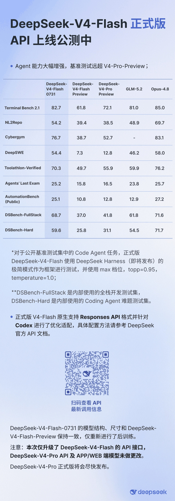
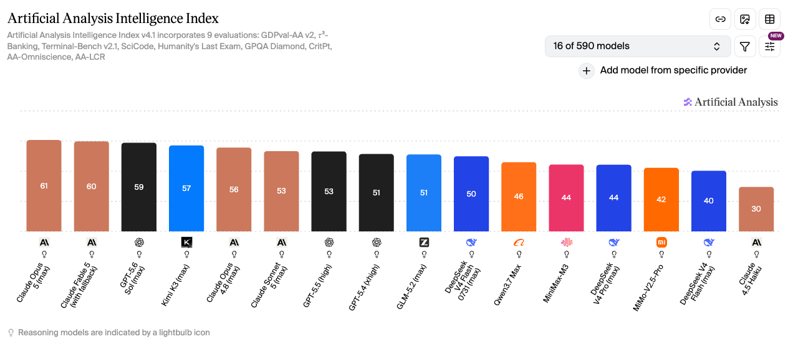
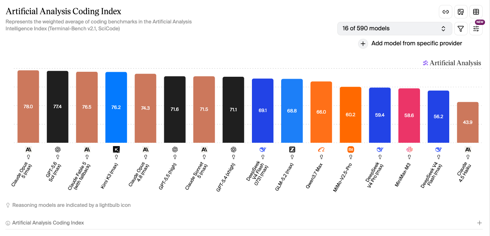
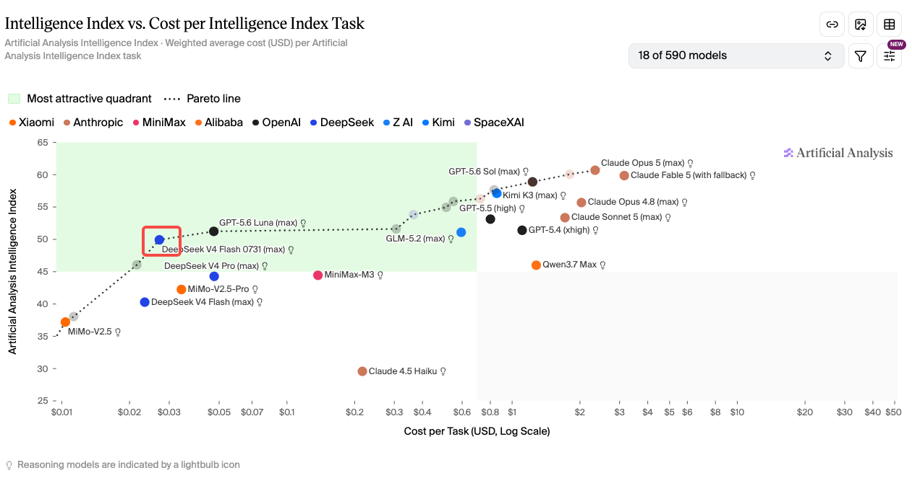

# DeepSeek-V4-Flash-0731 正式版上线：Agent / Coding 能力大涨，1 元输入 / 2 元输出依然低价
**更新日期 2026.8.3** 内容来源 [https://vibecoding.dreamfree.space](https://vibecoding.dreamfree.space)

> 本次核心更新：DeepSeek-V4-Flash-0731 已作为正式版上线 API 公测；模型结构与 preview 保持一致，但后训练后 Agent / Coding 能力明显增强；官方模型卡直接给出逐项 benchmark 对比表，正式版整体压过 V4-Pro-Preview；当前仅 Flash 正式版支持 Responses API，并已适配 Codex；价格仍维持缓存未命中输入 1 元、输出 2 元 / 百万 tokens，同时保留 1M 上下文、384K 最大输出和 2500 并发这套开发者最关心的基础规格。

2026 年 7 月底，DeepSeek 先发布了 **V4-Flash** 正式版，新版本的 V4-Flash-0731 **非常适合 Agent、 Coding以及大批量并发调用**，这两个场景本来就是当前大模型最常见的落地方向。价格依旧很低，接口能力更完整，官方强调的重点也明显落在软件工程和工具调用场景上。

## 一、这次正式版到底升级了什么

**DeepSeek-V4-Flash-0731 它沿用 preview 的结构和尺寸，在这个基础上做成了正式版。** 官方模型卡明确写的是 superseding the preview version（取代 preview 预览版），官方发布口径也说明了“结构与尺寸不变，主要是重新**后训练**”。

这次升级的重点在模型被重新打磨得更适合真实开发流程。官方对外反复强调的，也都是同一组关键词：

- agentic capabilities（智能体 / Agent 能力）明显增强
- software engineering benchmarks（软件工程基准评分）大幅提升
- 原生支持 Responses API，即针对 Codex 做了优化适配

对开发者来说，这比“实验室里的分数又涨了一点”更有意义。因为 Flash 的定位已经不只是廉价补全模型，在低成本区间里，它开始承担更完整的 **Agent 执行、工具调用、长任务推进** 角色。

**这次升级的只是 DeepSeek-V4-Flash，DeepSeek-V4-Pro 还没同步升级。** 官方预告 V4-Pro 正式版会在 8 月上线。

## 二、全面压过 V4-Pro-Preview，Coding 场景也压过 GLM-5.2

### 1. 官方评测详情

Hugging Face 官方模型卡没有只放一列成绩单，而是直接给出了一张对比表。官方写得很明确：**DeepSeek-V4-Flash-0731 在列出的 benchmark 上优于 DeepSeek-V4-Pro (Preview)，而且 activated parameter count 更小。**

这里讲的已经不只是“Flash 比上一版更强了”。**更轻的一档正式版 Flash，已经可以在官方列出的 Agent / Coding 基准上，压过当前公开的 V4-Pro-Preview。**

官方表中，Flash-0731 这一列的核心成绩如下：

| Benchmark | Flash-0731 |
| --- | --- |
| Terminal Bench 2.1 | 82.7 |
| NL2Repo | 54.2 |
| Cybergym | 76.7 |
| DeepSWE | 54.4 |
| Toolathlon-Verified | 70.3 |
| Agents' Last Exam | 25.2 |
| AutomationBench Public | 25.1 |
| DSBench-FullStack | 68.7 |
| DSBench-Hard | 59.6 |

DeepSeek 这次没有把 Flash 当成“便宜替补”，而是把它推到了 **可以承担主力 Agent 任务** 的位置。尤其是 Terminal Bench、Toolathlon、DSBench 这类任务，本来就更接近真实工具调用和软件工程流程，不是纯聊天问答。

Flash-0731 的优势也不只是“便宜”。如果它只是价格低，官方不会主动拿它去和 V4-Pro-Preview 做逐项 benchmark 对照。至少从这次模型卡的写法看，**Flash 正式版已经被放到了当前最值得优先落地的 DeepSeek 开发者主力模型位置上。**

### 2. Artificial Analysis 评测 综合能力

图片来源：[Artificial Analysis Intelligence Index](https://artificialanalysis.ai/?models=mimo-v2-5-pro%2Cclaude-sonnet-5%2Cminimax-m3%2Cqwen3-7-max%2Cclaude-opus-4-8%2Cclaude-4-5-haiku-reasoning%2Cgpt-5-4%2Cgpt-5-5-high%2Cclaude-opus-5%2Cdeepseek-v4-pro%2Cclaude-fable-5%2Cgpt-5-6-sol%2Cglm-5-2%2Ckimi-k3%2Cdeepseek-v4-flash%2Cdeepseek-v4-flash-0420#intelligence-tabs)

在这张 Intelligence Index 榜单里，DeepSeek V4 Flash 0731 拿到 **50**，明显高于同屏的 DeepSeek V4 Pro（**44**）和旧版 Flash（**40**），也已经贴到 GLM-5.2 的 **51**。第三方综合智能口径下，正式版 Flash 已经挤进开源权重模型的前排竞争带。

### 3. Artificial Analysis 评测 代码能力

图片来源：[Artificial Analysis Coding Index](https://artificialanalysis.ai/?models=mimo-v2-5-pro%2Cclaude-sonnet-5%2Cminimax-m3%2Cqwen3-7-max%2Cclaude-opus-4-8%2Cclaude-4-5-haiku-reasoning%2Cgpt-5-4%2Cgpt-5-5-high%2Cclaude-opus-5%2Cdeepseek-v4-pro%2Cclaude-fable-5%2Cgpt-5-6-sol%2Cglm-5-2%2Ckimi-k3%2Cdeepseek-v4-flash%2Cdeepseek-v4-flash-0420&intelligence=coding-index#intelligence-tabs)

Coding Index 上，Flash-0731 是 **69.1**，略高于 GLM-5.2 的 **68.8**，并明显压过 DeepSeek V4 Pro 的 **59.4** 和旧版 Flash 的 **56.2**。这和官方把升级重点放在软件工程、Agent、工具调用上是对得上的：Coding 这一档已经能跟国产开源强对手正面硬刚。

## 三、和 Flash Preview、V4-Pro-Preview、GLM-5.2、Opus 4.8 怎么比

下面这几组对比更值得看：它比旧 Flash 强了多少；为什么它比 V4-Pro 更值得使用；和 GLM-5.2 这种国产开源强对手差在哪；面对 Opus 4.8 这种高端闭源模型又该怎么看。

| 模型 | 当前可用口径 | 价格口径 | 能力定位 | 更适合谁 |
| --- | --- | --- | --- | --- |
| DeepSeek-V4-Flash-0731 | 官方 benchmark 强，AA Intelligence 50 | 官方 1 / 2 元 | 低价 Agent 工具型旗舰 | 高并发、重工作流、预算敏感开发者 |
| DeepSeek-V4-Flash-Preview | 2026-06-17 历史基线：42 / 38.7 / 61.3 | 无现行独立口径 | 正式版前的历史参考位 | 想看升级幅度的人 |
| DeepSeek-V4-Pro-Preview | 官方被 Flash-0731 逐项压制；AA Intelligence 44 | 约 3 / 6 元 | 大参数、更重、更贵 | 愿意为更重推理路线买单的人 |
| GLM-5.2 | AA Intelligence 51，Coding 68.8 同级 | 约 10 / 31 元 | 更快更强但更贵 | 不敏感价格、重吞吐和综合能力的人 |
| Claude Opus 4.8 | AA Intelligence 56，支持图像输入 | 约 35 / 175 元 | 闭源高端、多模态上限更高 | 追求上限、预算宽松团队 |

### 1. Flash-0731 vs Flash Preview：能力全面已经往上走了一截

DeepSeek V4 Flash 的 Intelligence / Coding / Agentic 大致是 **42 / 38.7 / 61.3**。而正式版 Flash-0731 当前在 AA 口径下已经到 **50**，官方 benchmark 也明显转向 Agent 与 Coding 强项。

所以这次升级不太像“同款模型例行小修”，更接近 **同一底座重新后训练之后，整体从够用档往上抬了一档，到了更适合直接部署的主力位。**

### 2. Flash-0731 vs V4-Pro-Preview：优先 Flash-0731

这是最关键的一组对比：正式版 Flash 已经全面超越了 V4-Pro-Preview；在价格只有约 1/3、模型参数规模不到 1/5 的情况下，优先选 Flash-0731 更顺理成章。

### 3. Flash-0731 vs GLM-5.2：GLM 综合更强一点，也更贵；V4-Flash-0731 Coding更强，也便宜得多

GLM-5.2 在 AA 口径下的 Intelligence Index 是 **51**，略高于 Flash-0731 的 **50**；截图里的 Coding Index 也能看到两者非常接近，GLM-5.2 为 **68.8**，Flash-0731 为 **69.1**，已经是同一竞争带。

但价格差距非常大。GLM-5.2 的公开价格大约是输入 **8 元**、输出 **38 元**、缓存命中 **2 元** / 百万 tokens，而 Flash-0731 是 **1 元 / 2 元 / 0.02 元**。如果你的任务是大批量工作流、反复调用、多轮 Agent 实验，这个价差会直接反映在月度成本上。

所以 GLM-5.2 更像“更快、更强、也更贵”的国产开源旗舰，而 Flash-0731 更像“没有那么奢侈，但足够强，而且特别适合高频调用”的开发者主力机。

### 4. Flash-0731 vs Opus 4.8：不是同一价格带，也不是同一选型逻辑

Claude Opus 4.8 的 AA Intelligence 是 **56**，支持图像输入，能力上限和多模态完整度仍然更高。但它的价格也大约来到输入 **35 元**、输出 **175 元** / 百万 tokens，和 Flash-0731 根本不在同一预算区间。

这组对比没必要对比“谁绝对更强”。更实际的问题是：**谁更适合你现在要做的事。** 如果你要的是极高上限、复杂多模态、预算不敏感，Opus 4.8 当然仍然很有吸引力；但如果你要的是 **Agent 能落地、成本能控制、并发也够高**，那 Flash-0731 的性价比就很难忽略。

图片来源：[Artificial Analysis Intelligence vs. Cost per Task](https://artificialanalysis.ai/?models=mimo-v2-5-pro%2Cclaude-sonnet-5%2Cminimax-m3%2Cqwen3-7-max%2Cclaude-opus-4-8%2Cclaude-4-5-haiku-reasoning%2Cgpt-5-4%2Cgpt-5-5-high%2Cclaude-opus-5%2Cdeepseek-v4-pro%2Cclaude-fable-5%2Cgpt-5-6-sol%2Cglm-5-2%2Ckimi-k3%2Cdeepseek-v4-flash%2Cdeepseek-v4-flash-0420%2Cgpt-5-6-luna%2Cmimo-v2-5-0424#intelligence-comparison-tabs)

## 四、要不要用

如果你属于下面这几类场景，Flash-0731 值得优先试：

- 在 Codex 中使用
- 做 Agent，但对调用成本非常敏感
- 需要长上下文和高并发，又不想一上来就上高价闭源模型
- 已经在用旧 Flash，可以无感迁移到正式版 Flash-0731

如果你更看重下面这些点，则可以使用其他模型：

- 想等更强能力、对更偏工程落地的 Flash 路线兴趣没那么大，更适合继续等 V4-Pro 正式版
- 需要更高上限的闭源旗舰，尤其是更完整的多模态能力

## 五、总结

DeepSeek-V4-Flash-0731 这次正式版上线，重点不只是名字从 preview 变成正式版。**DeepSeek 把一档本来就很适合开发者的低价模型，继续打磨成了更完整的 Agent 和 Coding 主力模型。**

它的优势也不是靠某一个点撑起来的。真正让它站住的，是一整套组合拳：官方 benchmark 里对 V4-Pro-Preview 的逐项优势、1M 上下文、384K 最大输出、2500 并发、Responses API / Codex 适配，以及仍然压在 1 元输入 / 2 元输出的价格。

如果你现在就要落地自动化工作流、批量 Agent 调用或者高频代码任务，Flash-0731 已经是一个非常值得先试的 DeepSeek 入口。如果你真正等的是更高参数、更重推理路线的 V4-Pro 正式版，那这次更新释放出的信号也很明确：**DeepSeek 已经先把开发者侧的第一落点交给 Flash 了。**

> 数据来源 [https://vibecoding.dreamfree.space](https://vibecoding.dreamfree.space)
>
> 相关体验 [DeepSeek 路线对比与使用入口](https://api.dreamfree.space/c/s/cpyqdeepseek)