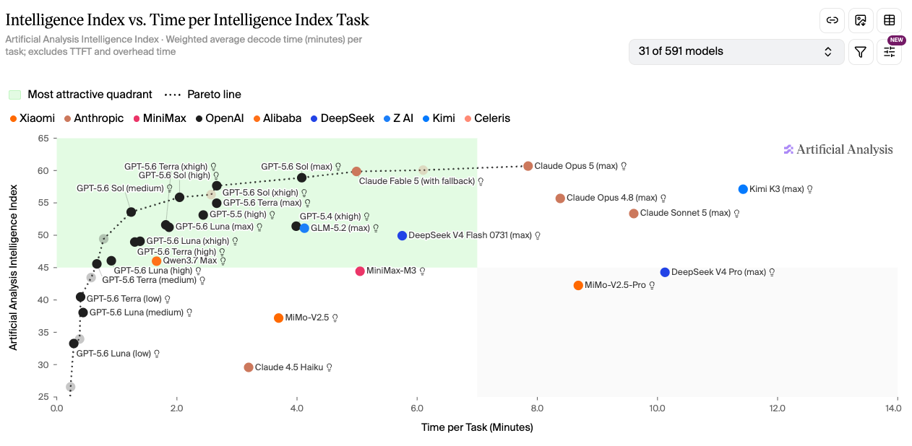
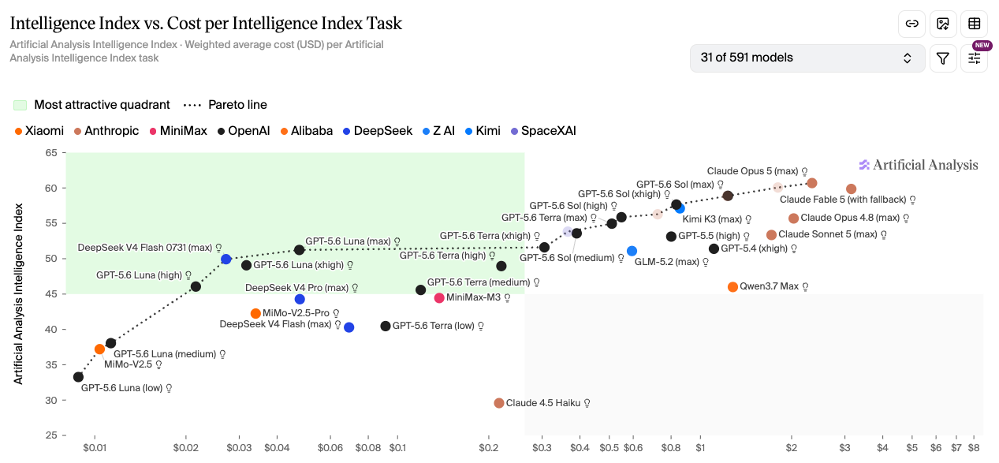

# GPT-5.6 Luna 降价 80%、Terra 降价 20%：选 Luna 还是 DeepSeek V4 Flash？

**更新日期 2026.7.30** 数据来源 [https://vibecoding.dreamfree.space](https://vibecoding.dreamfree.space)

本次核心更新：
* Luna API 标准价降 80%，输入 $0.20 / 输出 $1.20（约 ¥1.4 / ¥8.4，每百万 tokens）
* Terra API 标准价降 20%，输入 $2.00 / 输出 $12.00（约 ¥14 / ¥84）
* Sol 标准价不变；新增 Fast mode，最高 2.5 倍速度，定价为标准模式 2 倍
* ChatGPT Work / Codex 订阅价与月度额度不变，Terra / Luna 的 credit 消耗同步减少
* Luna 降价后更适合带工具调用、多步 Agent 的高频工作流

2026 年 7 月 30 日，OpenAI 下调了 GPT-5.6 Luna 和 Terra 的 API 价格。Luna 输入/输出降到原来的 20%，Terra 降到原来的 80%；Sol 标准价没有变动，但同日引入了 Fast mode。下文按降幅、受益场景、成本和耗时选型三部分展开。

## 一、这次降了多少

降价前后对比（每百万 tokens，标准模式）：

| 模型 | 降价前（输入 / 输出） | 降价后（输入 / 输出） | 降幅 |
| --- | --- | --- | --- |
| GPT-5.6 Luna | $1.00 / $6.00 | $0.20 / $1.20 | −80% |
| GPT-5.6 Terra | $2.50 / $15.00 | $2.00 / $12.00 | −20% |
| GPT-5.6 Sol | $5.00 / $30.00 | $5.00 / $30.00 | 不变 |

折算人民币（1 USD ≈ 7 CNY）：

| 模型 | 输入（约） | 输出（约） |
| --- | --- | --- |
| GPT-5.6 Luna | ¥1.4 | ¥8.4 |
| GPT-5.6 Terra | ¥14 | ¥84 |
| GPT-5.6 Sol | ¥35 | ¥210 |

Batch / Flex 价格同步下调：Luna 输入 $0.10 / 输出 $0.60，Terra 输入 $1.00 / 输出 $6.00。

Luna 降到 ¥1.4 / ¥8.4 之后，价格已经很低，但官方定位仍是能调工具、跑多步工作流的一档，不是只能做轻量补全的小模型。

## 二、为什么降价，谁最受益

OpenAI 对外说得很直接：这轮不是临时促销，而是把模型和系统层面的效率提升折进了价格。官方提到三层变化：模型更会走直接路径，token 生成效率提升超过 15%，agentic harness 也少做了不少上下文里的重复劳动。更硬的一条数字是，GPT-5.6 Sol 参与生产 GPU kernel 优化和 token 生成实验后，端到端服务成本下降了 20%。这些效率收益，是本轮下调的基础。

真正拉开差距的是 Luna 的 80%，Terra 的 20% 更像跟进微调。

Luna 本来就有 Agent 能力，以前贵在「常驻跑」不划算。降到 ¥1.4 / ¥8.4 后，一批后台任务的成本门槛明显下来了：

- 自动代码审查与验证
- 批量文档处理与分类
- 常驻巡检与监控工作流
- 大量中低风险改动和测试回归

ChatGPT Work 和 Codex 的订阅月费、月度额度总量都没变；Terra / Luna 的 credit 消耗减少，同样的月费能覆盖更多次工作流运行。

## 三、怎么选模型和思考深度

下面两张图来自 Artificial Analysis，分别从成本和耗时看 GPT-5.6 Sol、Terra、Luna 在各思考深度下的分布。

### 如果你更关心成本或者额度

图片来源：[Artificial Analysis](https://artificialanalysis.ai/?models=gpt-5-6-sol%2Cgpt-5-6-terra%2Cgpt-5-6-luna%2Cgpt-5-6-luna-high%2Cgpt-5-6-luna-xhigh%2Cgpt-5-6-luna-medium%2Cgpt-5-6-terra-high%2Cgpt-5-6-terra-xhigh%2Cgpt-5-6-terra-medium%2Cgpt-5-6-terra%2Cgpt-5-6-sol-xhigh%2Cgpt-5-6-sol-high%2Cgpt-5-6-sol-medium%2Cgpt-5-6-luna-low%2Cgpt-5-6-terra-low#intelligence-comparison-tabs)

横轴是每任务成本，纵轴是智能水平。Sol、Terra、Luna 三档各有 low / medium / high / xhigh / max 等思考深度变体，点位从左下的 Luna-low 一直拉到右上的 Sol-max。图上有 Pareto line：线上的点，在该价位仍值得看；被线压住的点，通常有更省或更强的替代。

只看「花多少钱换多少智能」，Luna 是这轮最大赢家：成本线上从 low 到 max 覆盖最完整。Terra 多数点位和 Sol 挤在一起；Sol 要到 medium 以上，才真正值得和前两档一起比。

选型顺序可以记成：

- 先用满 **Luna 全段**
- Luna 智能不够时，上 **Terra** 的 xhigh / max
- 再不够，再切 **Sol**，从 high 起用

预算有限、想多跑任务时，别一上来就盯 Sol；先把 Luna 用满，顶不住再往 Terra 高思考深度和 Sol 高思考深度走。

### 如果你更关心速度

图片来源：[Artificial Analysis](https://artificialanalysis.ai/?models=gpt-5-6-sol%2Cgpt-5-6-terra%2Cgpt-5-6-luna%2Cgpt-5-6-luna-high%2Cgpt-5-6-luna-xhigh%2Cgpt-5-6-luna-medium%2Cgpt-5-6-terra-high%2Cgpt-5-6-terra-xhigh%2Cgpt-5-6-terra-medium%2Cgpt-5-6-terra%2Cgpt-5-6-sol-xhigh%2Cgpt-5-6-sol-high%2Cgpt-5-6-sol-medium%2Cgpt-5-6-luna-low%2Cgpt-5-6-terra-low&intelligence-comparison=intelligence-vs-time-per-task#intelligence-comparison-tabs)

换成耗时维度：思考深度越高通常越慢。更稳的做法是用更强模型配浅思考深度，少用弱模型硬堆高思考深度。

选型顺序反过来：

- 先用 **Sol 各思考深度**
- 不需要 Sol Low 那档智能时，切 **Terra** 的 medium 或 low
- 不需要 Terra Low 那档智能时，再切 **Luna** 的 low

想尽快出结果时，优先把 Sol 用满；还慢，再往 Terra 中低思考深度走，最后才是 Luna 的 low。

### 实际用法

三档现在更好分工：Luna 管省钱和规模化，Terra 做均衡主力，Sol 保上限，也兼顾速度选项。

偏成本：Luna → Terra → Sol，尽量用更便宜的模型配更深思考深度，去够同一档能力。

偏速度：Sol → Terra → Luna，尽量用更强模型配更浅思考深度，把等待压下来。

## 总结

这轮最该盯的是 Luna 降了 80%。价格已经很低，同时还能调工具、跑多步流程。以前算不过账的常驻 Agent 任务，现在可以重新算一遍。

看成本：Luna 往上用，再看 Terra 高思考深度，最后才是 Sol。看速度：顺序基本反过来，优先更强模型配更浅思考深度。三档各自怎么用，比降价前清楚不少。

Luna 适合高频、量大、预算敏感的任务；Terra 更像日常主力；Sol 留给更复杂、更贵但也更值的任务。ChatGPT Work / Codex 用户月费没变，Terra / Luna 更省 credit，同样的钱能多跑几轮工作流。

> 数据来源 [https://vibecoding.dreamfree.space](https://vibecoding.dreamfree.space)
>
> 原文链接 [https://vibecoding.dreamfree.space/articles/news/20260803_gpt56_price/](https://vibecoding.dreamfree.space/articles/news/20260803_gpt56_price/)
>
> ChatGPT [https://chatgpt.com/#pricing](https://api.dreamfree.space/c/s/cpyqchatgpt)
