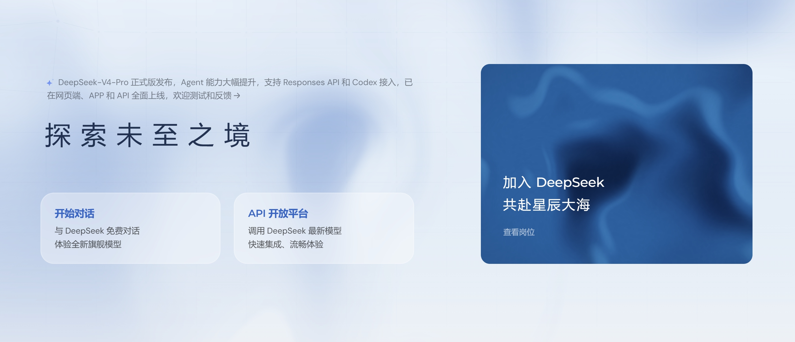
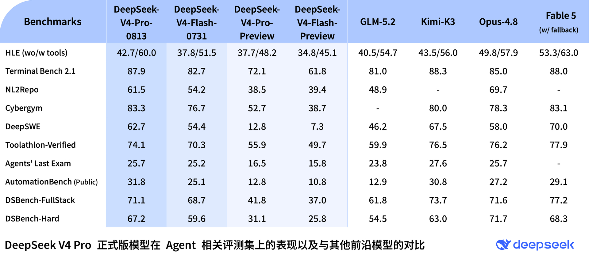
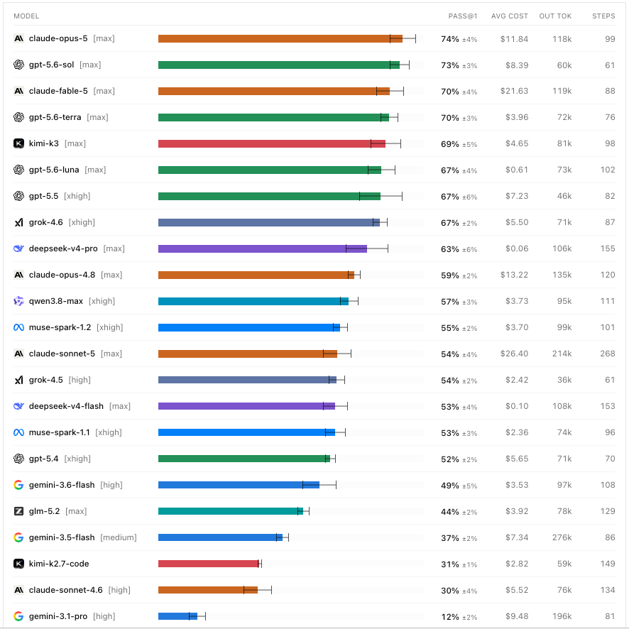
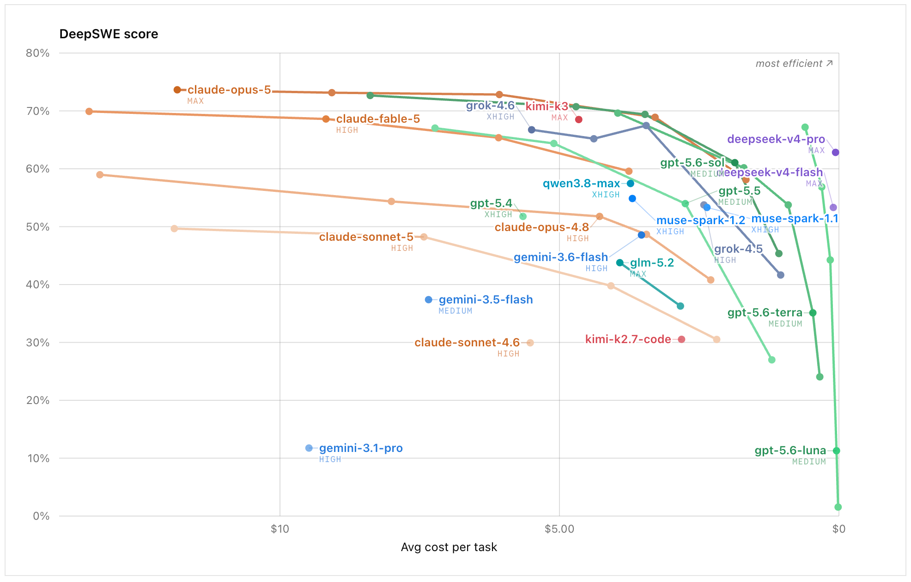
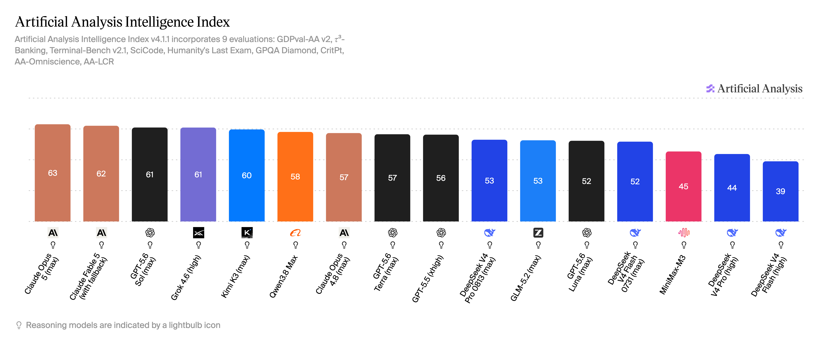
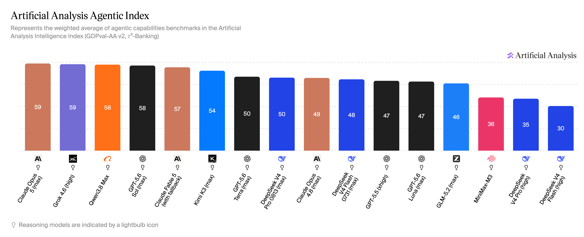

# DeepSeek V4 Pro 正式版全平台上线：Agent 与 Coding 能力接近顶级模型，8 月 17 日起调价
**更新日期 2026.8.13** 内容来源 [https://vibecoding.dreamfree.space](https://vibecoding.dreamfree.space)

- V4 Pro 正式版已同步上线 APP、网页和 API，网页和 APP 可在「专家模式」中使用。
- API 模型名仍为 `deepseek-v4-pro`，支持 Responses API、Tool Calls、Anthropic API，并适配 Codex。
- 思考模式支持 low / high / max 三档。
- 官方评测显示，V4 Pro 相比预览版提升明显，在 Agent / Coding 多数项目上高于 Claude Opus 4.8，整体接近 Claude Fable 5。
- DeepSWE 得分 63%；当前 API 价格为缓存命中输入 0.025 元、未命中输入 3 元、输出 6 元 / 百万 tokens。8 月 17 日 0 时起改为峰谷定价，高峰时段 Pro 未命中输入 9 元、输出 27 元。

8 月 13 日，DeepSeek 在官网确认 V4 Pro 正式版上线。APP、网页端和 API 同步更新，网页和 APP 可在「专家模式」中调用，API 模型名仍为 `deepseek-v4-pro`。发布公告和定价页同时带来了两个变化：正式版的 Agent / Coding 评测成绩公开了，API 峰谷定价也定了下来。当前 3 元的未命中输入价格只保留到 8 月 16 日。

图片来源：[DeepSeek官网](https://www.deepseek.com)

13 日下午，官网首页这则公告曾短暂撤下，晚上又重新出现。结合官网新闻页，APP、网页端和 API 全面上线已经是官方确认的信息。

## 一、正式版更新了什么

官方给出的改动主要集中在 Agent 能力和接口支持：V4 Pro 支持 Responses API，并针对 Codex 接入做了适配。API 文档还列出了 Tool Calls、JSON Output、Anthropic API 和对话前缀续写等能力，FIM 补全目前仅支持非思考模式。

基础规格为 1M 上下文、384K 最大输出，并发限制为 500。Flash 的并发限制是 2500，Pro 更适合复杂任务，Flash 则适合高并发、低单价请求。

思考模式现在可以按任务复杂度选档：简单任务用 low，日常 Agent 用 high，高度复杂的任务用 max。官方默认开启思考模式，effort 默认为 high，V4 Pro 和 V4 Flash 都支持这三档。13 日早些时候，社区反馈 max 思考深度出现异常，随后又反馈问题已经修复。官方没有发布故障说明；需要使用 max 的任务，仍建议先用小流量确认当前行为。

社区用户还反馈，正式版的思维链比过去更精简，常常省略不影响语义的连接词和解释。这只是用户实测印象，不能据此判断模型的写作能力。

## 二、官方评测表：正式版比预览版提升了多少

DeepSeek 发布的对比表覆盖 HLE、Terminal Bench 2.1、NL2Repo、Cybergym、DeepSWE、Toolathlon、Agents' Last Exam、AutomationBench 和两项 DSBench。Flash-0731 一列与官方模型卡逐项相符，表内数据可以作为比较依据。官方还注明，公开基准中的 Code Agent 任务使用 DeepSeek Harness 极简模式、max 档、topp=0.95、temperature=1.0 测试，换用其他框架后结果可能略有不同。

图片来源：[DeepSeek官网](https://api-docs.deepseek.com/zh-cn/news/news260813/)

下表保留 V4 Pro 与几个主要对手的关键分数，完整对比见配图：

| Benchmark | V4-Pro-0813 | V4-Pro-Preview | GLM-5.2 | Kimi-K3 | Opus-4.8 | Fable 5 |
| --- | ---: | ---: | ---: | ---: | ---: | ---: |
| HLE（无工具 / 有工具） | 42.7 / 60.0 | 37.7 / 48.2 | 40.5 / 54.7 | 43.5 / 56.0 | 49.8 / 57.9 | 53.3 / 63.0 |
| Terminal Bench 2.1 | 87.9 | 72.1 | 81.0 | 88.3 | 85.0 | 88.0 |
| NL2Repo | 61.5 | 38.5 | 48.9 | - | 69.7 | - |
| Cybergym | 83.3 | 52.7 | - | 80.0 | 78.3 | 83.1 |
| DeepSWE | 62.7 | 12.8 | 46.2 | 67.5 | 58.0 | 70.0 |
| Toolathlon-Verified | 74.1 | 55.9 | 59.9 | 76.5 | 76.2 | 77.9 |
| AutomationBench Public | 31.8 | 12.8 | 12.9 | 30.8 | 27.2 | 29.1 |
| DSBench-FullStack | 71.1 | 41.8 | 61.8 | 73.7 | 71.6 | 77.2 |
| DSBench-Hard | 67.2 | 31.1 | 54.5 | 63.0 | 71.7 | 68.3 |

### 正式版与预览版的差距

正式版相较预览版提升明显：DeepSWE 从 12.8 提升到 62.7，Terminal Bench 2.1 从 72.1 提升到 87.9，DSBench-Hard 从 31.1 提升到 67.2。Flash-0731 的 DeepSWE 是 54.4，Pro 正式版又高出 8.3 个百分点。

V4 Pro 这次升级的重点落在后训练和 Agent 工作流，长周期代码任务、终端操作、工具调用和企业自动化的分数都明显提高。

### V4 Pro 与 Fable 5 仍有差距

V4 Pro 在 Terminal Bench 2.1 上是 87.9，Fable 5 是 88.0，几乎持平；Cybergym 上 V4 Pro 为 83.3，反而高于 Fable 5 的 83.1；AutomationBench Public 也以 31.8 高于 Fable 5 的 29.1。

但在 DeepSWE、Toolathlon 和 DSBench-FullStack 上，V4 Pro 分别为 62.7、74.1 和 71.1，Fable 5 则是 70.0、77.9 和 77.2。**V4 Pro 已经接近 Fable 5，在少数 Agent 评测上反超，但整体仍有差距。**

### V4 Pro 在 Agent / Coding 评测中多数领先 Opus 4.8

V4 Pro 在 Terminal Bench、Cybergym、DeepSWE 和 AutomationBench 上高于 Opus 4.8，DSBench-FullStack 71.1 与 Opus 4.8 的 71.6 基本持平。HLE 的有工具成绩则是 V4 Pro 60.0 高于 Opus 4.8 的 57.9。

HLE 无工具、NL2Repo、Toolathlon 和 DSBench-Hard 上，Opus 4.8 仍然更高；Agents' Last Exam 两者同为 25.7。综合这些项目，V4 Pro 在 Agent / Coding 评测上多数领先 Opus 4.8，但在知识推理和部分工程任务上仍有差距。

### V4 Pro 与 Kimi K3 接近，领先 GLM-5.2

Kimi K3 在 DeepSWE、Toolathlon、Agents' Last Exam 和 DSBench-FullStack 上高于 V4 Pro，但 V4 Pro 在 Cybergym、AutomationBench 和 DSBench-Hard 上领先，Terminal Bench 也只差 0.4 分。两者分数接近，Kimi K3 整体略高。

与 Kimi K3 的差距不同，V4 Pro 在除 Cybergym 外的各项对比中都高于 GLM-5.2。Artificial Analysis 的 Intelligence Index 中两者同为 53，综合智能分数与 Agent 评测并不完全一致。

## 三、DeepSWE：更接近实际 Coding Agent 任务

DeepSWE 更接近 Cursor、Codex 这类工具的实际用法：给模型一个目标，让它在真实仓库里翻代码、改文件、跑验证，遇到问题再继续修改，多步完成一项工作。

DeepSWE 由 Datacurve 维护，测试长周期软件工程任务。当前 v1.1 有 113 个任务、91 个仓库和 5 种语言，所有模型统一使用 mini-swe-agent。任务全部从零开始，不从现成 commit / PR 改编；验证器由人工编写，检查任务行为是否正确，不要求实现方式与参考答案一致。相比短题榜或固定仓库修补任务，DeepSWE 的 prompt 约为 SWE-bench Pro 的一半长，但解决方案代码量是后者的 5.5 倍，输出 token 约 2 倍，更接近 Agent 在项目中连续写代码的场景。

图片来源：[DeepSWE](https://deepswe.datacurve.ai/)

在榜单的 max 配置下，V4 Pro 的 Pass@1 为 **63%±6%**，排在第 9 位，高于 Opus 4.8 的 59%±2%，低于 Fable 5 的 70%±4%、Kimi K3 的 69%±5% 和 Grok 4.6 的 67%±2%。官方对比表中的 DeepSWE 分数为 62.7，与榜单的 63%接近。V4 Pro 已经超过 Opus 4.8，但还没有追上 Fable 5 和 Kimi K3。

| 模型 | DeepSWE Pass@1 | DeepSWE 平均成本 / 任务 |
| --- | ---: | ---: |
| Claude Fable 5 | 70%±4% | \$21.63 |
| Kimi K3 | 69%±5% | \$4.65 |
| Claude Opus 4.8 | 59%±2% | \$13.22 |
| DeepSeek V4 Pro 0813 | **63%±6%** | **\$0.06** |
| DeepSeek V4 Flash 0731 | 53%±4% | \$0.10 |
| GLM-5.2 | 44%±2% | \$3.92 |

图片来源：[DeepSWE](https://deepswe.datacurve.ai/)

图的纵轴是 DeepSWE 分数，越高越好；横轴是每任务平均成本，而且刻度是反的：左边更贵，右边更便宜，最右侧接近 0。右上角标注了 most efficient，**越靠上、越靠右越好**。Claude Opus 5、Fable 5 的分数更高，但都落在左侧高价区；Kimi K3、Grok 4.6 位于中间。DeepSeek 的两个点明显贴近右侧：V4 Pro 每任务平均成本 \$0.06，全榜最低，Flash 是 \$0.10。V4 Pro 的分数不是榜首，63%也低于 Fable 5 的 70%，但它用接近 60%的完成率，换来了远低于其他高分模型的任务成本。这里的成本采用榜单评测口径，不能直接当成 8 月 17 日涨价后的 API 账单。

## 四、Artificial Analysis：综合智能与 Agent 能力分开看

Intelligence Index 看综合能力，Agentic Index 看 Agent 任务，两个分数对应不同维度。V4 Pro 0813 在 Intelligence Index 中与 GLM-5.2 并列，在 Agentic Index 中略高于 Opus 4.8、V4 Flash-0731 和 GLM-5.2。

| 模型 | Intelligence Index | Agentic Index |
| --- | ---: | ---: |
| Claude Fable 5 | 62 | 57 |
| Kimi K3 | 60 | 54 |
| Claude Opus 4.8 | 57 | 49 |
| DeepSeek V4 Pro 0813 | **53** | **50** |
| DeepSeek V4 Flash 0731 | 52 | 48 |
| GLM-5.2 | 53 | 46 |

两项分数放在一起看，V4 Pro 的优势主要落在 Agent 任务，而不是综合能力榜首。

图片来源：[Artificial Analysis Intelligence Index](https://artificialanalysis.ai/?capability-index=healthcare-and-medical&capability-models=inkling%2Ck-exaone-2-0-0803%2Cminimax-m3%2Cnemotron-3-5-lightning%2Ccommand-a-plus%2Cgpt-5-6-luna%2Cnvidia-nemotron-3-ultra-550b-a55b%2Cqwen3-8-max%2Cnvidia-nemotron-3-super-120b-a12b%2Csolar-open2-250b%2Ca-x-k2%2Cdeepseek-v4-pro%2Cclaude-4-5-haiku-reasoning%2Cmotif-3%2Cclaude-opus-5%2Cgpt-5-6-terra%2Cgrok-4-6%2Cclaude-fable-5%2Cgpt-5-6-sol%2Cmistral-medium-3-5%2Cgpt-oss-120b%2Cglm-5-2%2Ckimi-k3&text-to-image=nano-banana-2%2Copenai-gpt_image-1-5%2Cmai-image-2-5%2Cgemini_nano-banana-pro%2Cnano-banana-2-lite%2Cseedream-5-0-pro%2Cgrok-imagine-image-quality%2Cqwen-image-2-0-pro-alibaba-cloud-may-2026%2Cblack_forest_labs_flux-2-max%2Cmai-image-2-5-flash%2Chidream-o1-image-1-5%2Ckrea-2-medium-turbo%2Ckrea-2-large%2Creve-2-1%2Cgpt-image-2&models=minimax-m3%2Cgpt-5-6-luna%2Cqwen3-8-max%2Cdeepseek-v4-pro%2Cclaude-opus-5%2Cgpt-5-6-terra%2Cgrok-4-6%2Cclaude-fable-5%2Cgpt-5-6-sol%2Cglm-5-2%2Ckimi-k3%2Cdeepseek-v4-flash%2Cclaude-opus-4-8%2Cgpt-5-5%2Cdeepseek-v4-flash-0420-high%2Cdeepseek-v4-pro-0424-high#intelligence-tabs)

在 Artificial Analysis Intelligence Index v4.1.1 中，V4 Pro 0813 得分 53，与 GLM-5.2 并列，低于 Fable 5 的 62、Opus 5 的 63 和 Kimi K3 的 60，高于 V4 Pro 预览版的 44。和预览版相比，正式版的综合能力提升明显。

图片来源：[Artificial Analysis Agentic Index](https://artificialanalysis.ai/?capability-index=healthcare-and-medical&capability-models=inkling%2Ck-exaone-2-0-0803%2Cminimax-m3%2Cnemotron-3-5-lightning%2Ccommand-a-plus%2Cgpt-5-6-luna%2Cnvidia-nemotron-3-ultra-550b-a55b%2Cqwen3-8-max%2Cnvidia-nemotron-3-super-120b-a12b%2Csolar-open2-250b%2Ca-x-k2%2Cdeepseek-v4-pro%2Cclaude-4-5-haiku-reasoning%2Cmotif-3%2Cclaude-opus-5%2Cgpt-5-6-terra%2Cgrok-4-6%2Cclaude-fable-5%2Cgpt-5-6-sol%2Cmistral-medium-3-5%2Cgpt-oss-120b%2Cglm-5-2%2Ckimi-k3&text-to-image=nano-banana-2%2Copenai-gpt_image-1-5%2Cmai-image-2-5%2Cgemini_nano-banana-pro%2Cnano-banana-2-lite%2Cseedream-5-0-pro%2Cgrok-imagine-image-quality%2Cqwen-image-2-0-pro-alibaba-cloud-may-2026%2Cblack_forest_labs_flux-2-max%2Cmai-image-2-5-flash%2Chidream-o1-image-1-5%2Ckrea-2-medium-turbo%2Ckrea-2-large%2Creve-2-1%2Cgpt-image-2&models=minimax-m3%2Cgpt-5-6-luna%2Cqwen3-8-max%2Cdeepseek-v4-pro%2Cclaude-opus-5%2Cgpt-5-6-terra%2Cgrok-4-6%2Cclaude-fable-5%2Cgpt-5-6-sol%2Cglm-5-2%2Ckimi-k3%2Cdeepseek-v4-flash%2Cclaude-opus-4-8%2Cgpt-5-5%2Cdeepseek-v4-flash-0420-high%2Cdeepseek-v4-pro-0424-high&intelligence=agentic-index#intelligence-tabs)

Agentic Index 中，V4 Pro 0813 得分 50，高于 Opus 4.8 的 49、V4 Flash-0731 的 48 和 GLM-5.2 的 46，低于 Fable 5 的 57 和 Kimi K3 的 54。这个分数更能对应 V4 Pro 的使用场景：Agent、工具调用和长周期 Coding 任务。

## 五、价格：8 月 17 日起进入峰谷定价

当前官方 API 定价如下，单位是每百万 tokens，有效期到北京时间 8 月 17 日 0 时之前：

| 项目 | deepseek-v4-pro | deepseek-v4-flash |
| --- | ---: | ---: |
| 缓存命中输入 | 0.025 元 | 0.02 元 |
| 缓存未命中输入 | 3 元 | 1 元 |
| 输出 | 6 元 | 2 元 |
| 上下文长度 | 1M | 1M |
| 最大输出 | 384K | 384K |
| 并发限制 | 500 | 2500 |

8 月 17 日 0 时起，DeepSeek 对 V4 全系列实行峰谷定价。高峰时段是北京时间 9:00–12:00、14:00–18:00，其余为空闲时段；闲时价格是高峰的一半。

| 模型 | 时段 | 缓存命中输入 | 缓存未命中输入 | 输出 |
| --- | --- | ---: | ---: | ---: |
| deepseek-v4-pro | 闲时 | 0.15 元 | 4.5 元 | 13.5 元 |
| deepseek-v4-pro | 高峰 | 0.30 元 | 9.0 元 | 27.0 元 |
| deepseek-v4-flash | 闲时 | 0.05 元 | 1.5 元 | 4.5 元 |
| deepseek-v4-flash | 高峰 | 0.10 元 | 3.0 元 | 9.0 元 |

闲时价格并不会回到当前水平。Pro 未命中输入将从 3 元涨到闲时 4.5 元、高峰 9 元；输出从 6 元涨到闲时 13.5 元、高峰 27 元。Flash 也会一起上调：未命中输入从 1 元涨到闲时 1.5 元、高峰 3 元，输出从 2 元涨到闲时 4.5 元、高峰 9 元。

对 Agent 请求，输入通常占大头；如果 95% 的输入命中缓存，按 **1% 输出、99% 输入、输入侧 95% 缓存命中** 折算，每百万 tokens 的综合价如下：

| 模型 | 当前 | 8 月 17 日起闲时 | 8 月 17 日起高峰 |
| --- | ---: | ---: | ---: |
| deepseek-v4-pro | 0.23 元 | 0.50 元 | 1.00 元 |
| deepseek-v4-flash | 0.09 元 | 0.17 元 | 0.33 元 |

按这个用量结构，Pro 综合价约为当前的 2.2 倍（闲时）和 4.3 倍（高峰），Flash 约为 1.9 倍和 3.8 倍。综合价上涨的主要原因是缓存命中价格从 0.025 元提高到 0.15 / 0.30 元；在这个假设中，约 94% 的 token 都走缓存命中，输出只占 1%。

V4 Pro 当前的标价仍是 Flash 的 3 倍，并发只有 Flash 的五分之一。高频、低复杂度请求继续交给 Flash 更合适；需要复杂规划、长链路执行和高质量代码修改的任务，再考虑使用 Pro。涨价后，能错峰的 Agent 任务尽量放在闲时。

## 六、要不要用

日常 vibe coding、在 Codex 或 Responses API 中运行长链路 Agent，V4 Pro 值得优先测试。DeepSWE 已经高于 Opus 4.8，整体接近 Fable 5；按当前假设计算，每百万 tokens 综合价约 0.23 元，8 月 16 日前完成迁移和压测成本最低。并发不超过 500、任务以修改代码仓库为主时，Pro 更合适。

如果请求量大、需要接近 2500 并发，或者任务本身不需要 Pro 的完成率，Flash 更合适。它的 DeepSWE 分数低一截，但综合价约 0.09 元，涨价后闲时约 0.17 元，仍然便宜不少。

如果最看重单项上限和知识推理的稳定性，Fable 5、Opus 4.8 仍然更稳。V4 Pro 在 Agent / Coding 上接近它们，但没有每项都追上。

8 月 17 日之后，可以排队的任务放到闲时，Pro 综合价约 0.50 元，是高峰 1.00 元的一半。高峰必须使用 Pro 时，可以先用 high 档思考，避免所有任务都以 max 档运行。

## 七、总结

DeepSeek V4 Pro 正式版已经进入 Coding Agent 第一梯队，APP、网页端和 API 也已同步上线。公开数据中，V4 Pro 尚未全面超过 Fable 5；与 Opus 4.8 的比较也有胜有负，但它在 Terminal Bench、Cybergym、DeepSWE、AutomationBench 等 Agent / Coding 任务上占据优势，DeepSWE 单项和榜单都高于 Opus 4.8。

价格仍是 V4 Pro 的重要优势：按高缓存命中计算，当前每百万 tokens 综合价约 0.23 元。8 月 17 日 0 时起，同样口径下高峰综合价约 1.00 元。需要 Coding Agent 能力、又要控制成本的，可以在调价前完成测试；追求高并发和低成本的，Flash 仍然更合适，只是它也会同步涨价。

> 数据来源 [https://vibecoding.dreamfree.space](https://vibecoding.dreamfree.space)
>
> 相关体验 [DeepSeek 路线对比与使用入口](https://api.dreamfree.space/c/s/cpyqdeepseek)
>
> 原文链接 [DeepSeek-V4-Pro 正式版上线](https://api-docs.deepseek.com/zh-cn/news/news260813/)
