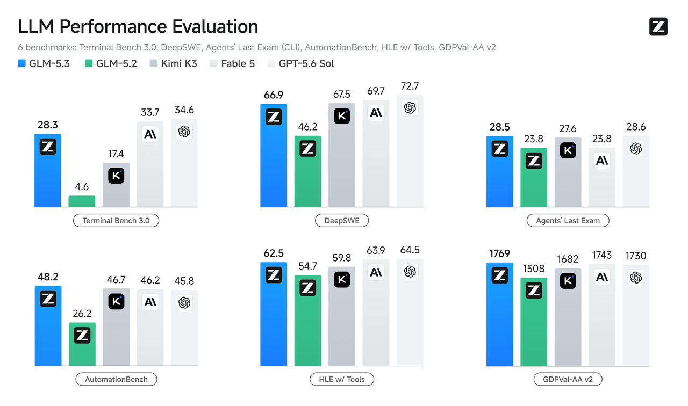
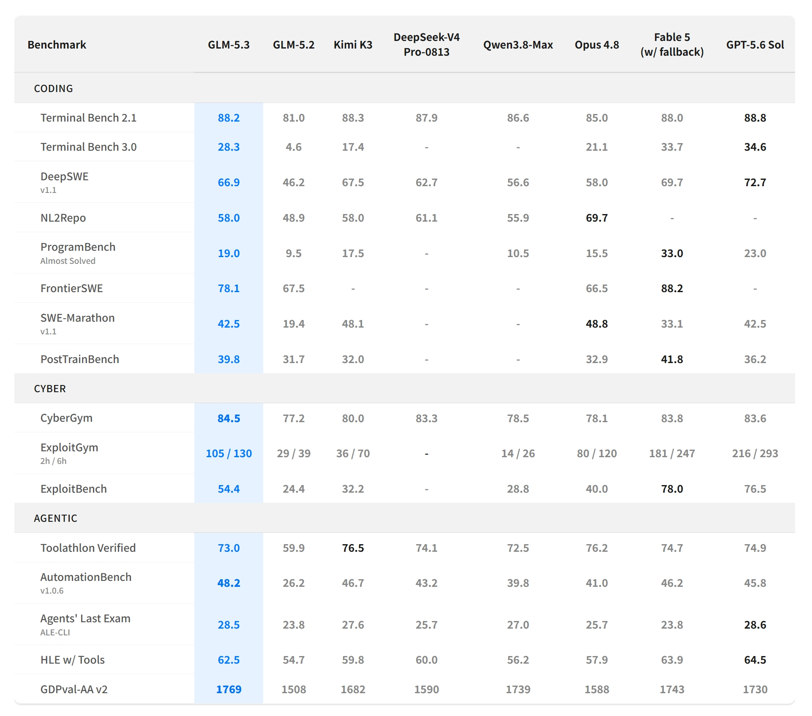
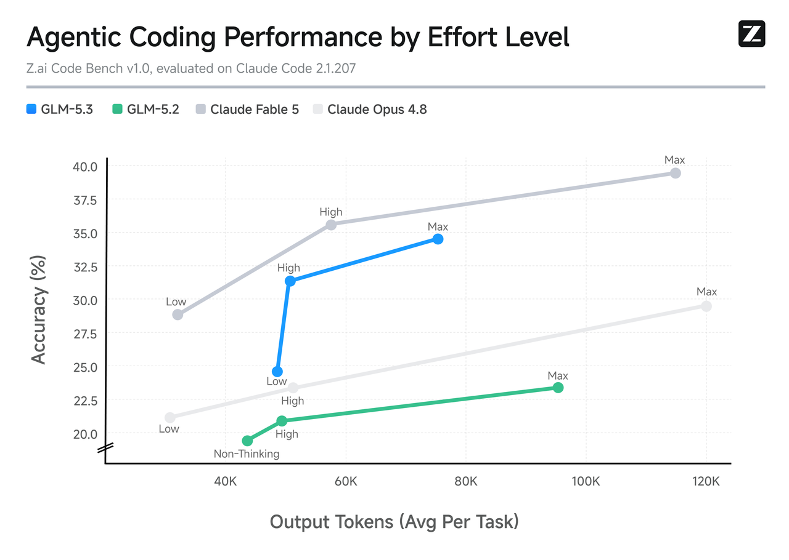
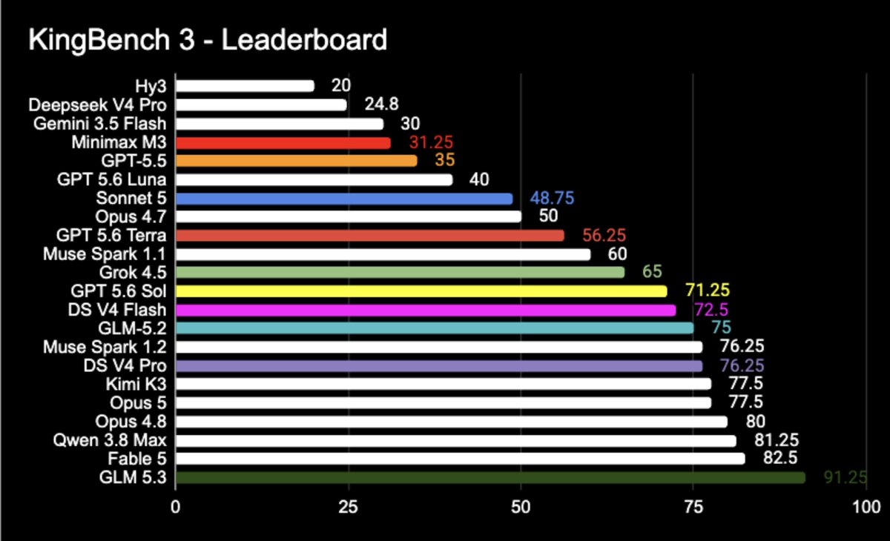

# GLM-5.3 发布：专注编程，极致后训练，用一半尺寸超越DeepSeek V4 Pro 0813 正式版
**更新日期 2026.8.15** 数据来源 [https://vibecoding.dreamfree.space](https://vibecoding.dreamfree.space)

> 本次核心更新：
>
> - GLM-5.3 与 GLM-5.2 使用相同基础模型，官方称全部提升来自后训练。
> - GLM-5.3 总参数约 744B，激活参数约 40B。作为对比，DeepSeek V4 Pro 总参数约 1.6T、激活参数约 49B；Kimi K3 总参数约 2.8T、激活参数约 104B。
> - 复杂 Coding、Terminal Agent 和长程任务能力明显增强，Terminal Bench 3.0 从 4.6 提升到 28.3，DeepSWE v1.1 从 46.2 提升到 66.9。
> - 官方 Coding Plan 已上线，模型 API 仍在等待开放；权重计划在发布两周后、完成安全评估和加固后开放。

8 月 14 日，智谱发布 [GLM-5.3](https://docs.bigmodel.cn/cn/guide/models/text/glm-5.3)。它没有换成更大的基础模型，沿用 GLM-5.2 的基座，把资源继续投到后训练、任务环境和长程 Agent 训练上。

[官方公开数据](https://z.ai/blog/glm-5.3)里，GLM-5.3 的整体能力已经进入第一梯队：国产里强于 DeepSeek V4 Pro、Qwen3.8-Max，和 Kimi K3 接近；海外里整体强于 Claude Opus 4.8，接近 Fable 5 和 GPT-5.6 Sol。编程上，长程终端、持续改代码和自动化已经打到开源前列，Agents' Last Exam 与 GPT-5.6 Sol 基本持平；更难的终端任务、高难编程仍落后于 Fable 5 和 GPT-5.6 Sol。社区实测里，3D 场景、复杂 UI 和长提示词项目的完成质量也跟着上去了。

## 一、相同基座，全部提升来自后训练

GLM-5.3 与 GLM-5.2 使用相同基础模型，[官方文档](https://docs.bigmodel.cn/cn/guide/models/text/glm-5.3)称全部提升来自后训练。GLM-5.2 已经搭好长程任务训练栈，5.3 继续在这套栈上加码：长程任务环境扩到数十倍，环境类型更多，后训练时间也更长。

[官方博客](https://z.ai/blog/glm-5.3)把这条路线叫做 post-training scaling（后训练规模化）。IndexShare 管长上下文，SAO 做长程任务强化学习，slime 跑大规模异步沙箱。短题对就是对、错就是错；复杂工程任务往往前面几十步都做对，最后改错一个名字，整条轨迹也会失败。后训练要解决的，就是让模型在终端和代码库里反复执行、试错、验证，并分清哪些步骤真正有用。

继续堆更大基座，和把现有基座的后训练做深，是两条路。GLM-5.3 选的是后者，也比较专注编程：目前只支持文本，仍然没有原生多模态。

尺寸按 GLM-5.2 [官方模型卡](https://github.com/zai-org/GLM-5.2) 的 `744B-A40B` 来理解：

| 参数口径 | GLM-5.3 | [DeepSeek V4 Pro](https://huggingface.co/deepseek-ai/DeepSeek-V4) | Kimi K3 |
| --- | ---: | ---: | ---: |
| 总参数 | 约 744B | 约 1.6T | 约 2.8T |
| 激活参数 | 约 40B | 约 49B | 约 104B |

总参数不到 DeepSeek V4 Pro 的一半，也明显小于 Kimi K3；激活参数约 40B，对 DeepSeek V4 Pro 的 49B 只差一截，对 Kimi K3 的 104B 则小很多。不能据此说推理成本也会减半。

## 二、官方跑分：从“能写代码”走向“能完成工程任务”

### 相对 GLM-5.2：长程任务提升最明显

相对上一代，六项全部上涨，涨幅最大的是长程终端和持续改代码：

| Benchmark | 评测目的 | GLM-5.2 | GLM-5.3 |
| --- | --- | ---: | ---: |
| Terminal Bench 3.0 | 看终端 Agent 能不能独立把任务做完 | 4.6 | **28.3** |
| DeepSWE v1.1 | 看软件工程任务能不能持续推进 | 46.2 | **66.9** |
| Agents' Last Exam（CLI） | 看长程 Agent 在真实专业场景里的完成度 | 23.8 | **28.5** |
| AutomationBench | 看自动化流程能不能闭环 | 26.2 | **48.2** |
| HLE w/ Tools | 看带工具时的高难度解题能力 | 54.7 | **62.5** |
| GDPval-AA v2 | 看专业工作任务的执行水平 | 1508 | **1769** |

图片来源：[智谱官方博客](https://z.ai/blog/glm-5.3)

AutomationBench 和 GDPval 已经是五家里最高；Agents' Last Exam 与 GPT-5.6 Sol 基本持平。Terminal Bench 3.0、DeepSWE、HLE 超过 Kimi K3，仍低于 Fable 5 和 GPT-5.6 Sol。

### 横向对比：编程、安全、Agent

官方横向表覆盖 Kimi K3、DeepSeek V4 Pro、Qwen3.8-Max、Claude Opus 4.8、Fable 5 和 GPT-5.6 Sol。

图片来源：[智谱官方博客](https://z.ai/blog/glm-5.3)

相对 GLM-5.2，Coding、Agent、Cyber 全面提升。
* 国产里，整体强于 DeepSeek V4 Pro 和 Qwen3.8-Max；和 Kimi K3 接近，多数项略高。
* 和 Opus 4.8 比，整体已经更强：终端、持续改代码、自动化、长程 Agent 都领先，从需求生成仓库、工具调用仍弱于 Opus。
* 和 Fable 5、GPT-5.6 Sol 比，自动化、专业任务执行、部分 Agent、漏洞发现已经到同一水平或略高；更难的终端任务、高难编程和漏洞利用仍落后。

### Token 效率也在改善

图片来源：[智谱官方博客](https://z.ai/blog/glm-5.3)

智谱内部的 Z.ai Code Bench 同时看任务完成率和平均输出 Token。相对 GLM-5.2，完成率更高、输出更短；相对 Opus 4.8，更短的轨迹也能拿到更高完成率；相对 Fable 5，准确率仍有差距。这里的 Token 是平均输出量，不是价格。

## 三、社区实测：复杂前端和交互任务

知乎上已经有人用 GLM-5.3 做复杂前端和 3D 项目。

### 三体 3D 场景

[van dark](https://www.zhihu.com/question/2071591447367770456/answer/2071593007758020845) 用 GLM-5.3 生成了一个讲述《三体》经典场景的交互式 3D 网页，要求包含完整情节、更多建模细节、剧情播放按钮和二向箔动画。页面能通过按钮触发剧情，二向箔效果是逐渐扩张、把行星压成二维的动画。

### Vista 风格桌面

同一组实测还要求复现 Windows Vista 风格的玻璃质感桌面，并加入类似 Windows 7 的 3D 窗口切换：按下按键后，多个窗口在三维空间中排列、倾斜并带虚化。窗口材质、颜色、层次、快捷键、空间切换和动效要一起稳住。van dark 还测了一个没有指定参考答案的新奇 UI，GLM-5.3 做出了带果冻弹跳效果的操作系统窗口。

这些项目能跑起来，还要持续维持一套视觉和交互目标。不少人会觉得 GLM-5.3 比 GLM-5.2 更“会做东西”，主要差在这里。

### 柴油机仿真、池核与长提示词

[MNACSTMSYSD](https://www.zhihu.com/question/2071591447367770456/answer/2071616276607382028) 的案例更偏工程可视化：四冲程柴油机高精度 3D 仿真、池核等。模型要处理三维场景、物理材质、交互逻辑和较长提示词，完成后还解释了渲染管线、材质体系和 InstancedMesh。

这些演示没有统一运行环境、完整提示词、人工修改记录和耗时 / 额度数据，也没有第三方复测。

### KingBench 3

[AICodeKing](https://x.com/aicodeking/status/2088131439892316259)（`@aicodeking`）在 X 上发布了 KingBench 3 榜单。

图片来源：[AICodeKing](https://x.com/aicodeking/status/2088131439892316259)

这张图的发布出处可以确认。任务样本、评分公式、测试设置和独立复测目前都没有完整公开，所以它反映的是社区讨论热度，不能替代 Terminal Bench、DeepSWE、Agents' Last Exam 这类公开基准。

## 四、网络安全能力上来了

后训练规模扩大后，模型更会发现孤立漏洞，也能在更长的利用链上组织步骤。

[官方评测](https://z.ai/blog/glm-5.3)里，CyberGym 看漏洞发现与验证，GLM-5.3 为 84.5%，GLM-5.2 为 77.2%。ExploitBench 更靠近利用阶段，GLM-5.3 为 54.4%，GLM-5.2 为 24.4%；Fable 5 和 GPT-5.6 Sol 仍更高。ExploitGym 两小时 / 六小时为 105 / 130，Fable 5 为 181 / 247。

官方还披露了真实代码库测试中的漏洞发现统计。这些结果经过专家复核、筛选和去重，不等于已经全部公开、可复现。

对开发者，价值首先在防御：代码审计、漏洞定位、补丁验证和历史项目扫描。官方把安全评估和模型加固放在权重发布之前。

## 五、开放情况

GLM-5.3 已经进入 [GLM Coding Plan](https://docs.bigmodel.cn/cn/guide/models/text/glm-5.3)，模型 API 仍在等待开放。权重计划在发布两周后、完成安全评估和加固后开放，见 [官方博客](https://z.ai/blog/glm-5.3)。

目前能确定的产品边界：

- 只支持文本模态，没有原生视觉输入；
- 上下文窗口 1M，最大输出 128K Tokens；
- 思考功能始终开启，提供 low、high、max 三档；
- 迁移到 GLM-5.3 时，原来关闭思考的调用方式需要改成 `thinking.type: "enabled"`，并设置 `reasoning_effort`；
- Coding Plan 采用积分配额，非高峰时段调用消耗标准积分的 50%。

适合复杂改代码、终端操作、长程 Agent、前端项目和代码审查，尤其是以前经常“前面都做对了，最后一步把项目搞坏”的任务。由于不支持多模态，依赖截图、设计稿、视频等原生视觉输入的，目前不合适。

## 六、总结

不换更大基座，把后训练做深，744B 级模型也能把 Coding Agent 推到前沿。总参数不到 DeepSeek V4 Pro 一半，整体已经强于 DeepSeek V4 Pro 和 Opus 4.8，接近 Fable 5 和 GPT-5.6 Sol。

社区里的三体 3D、Vista 桌面、果冻窗口、柴油机仿真和池核，说明提升开始落到复杂项目能不能一次搭出来。

接下来要看的是权重开放后的第三方复测、不同代码库上的稳定性、实际 Token 消耗、Coding Plan 配额，以及安全能力在开放环境中的边界。

> 数据来源 [https://vibecoding.dreamfree.space](https://vibecoding.dreamfree.space)
>
> 原文链接 [https://vibecoding.dreamfree.space/articles/news/20260814_glm_5_3/](https://vibecoding.dreamfree.space/articles/news/20260814_glm_5_3/)
