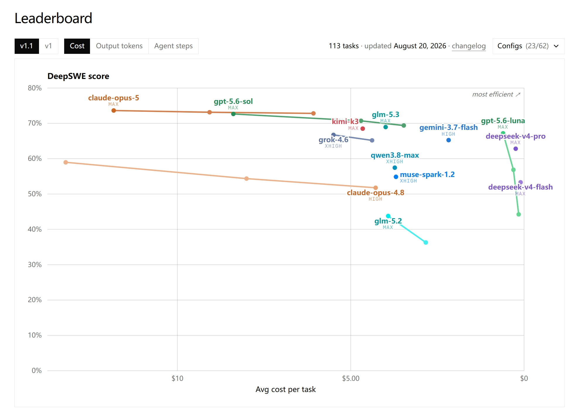
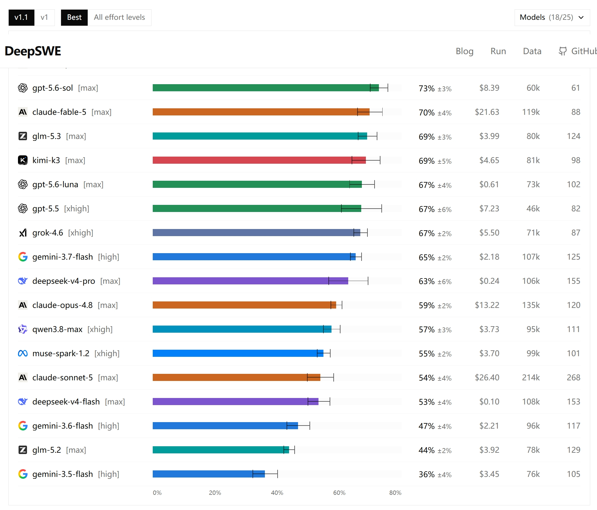
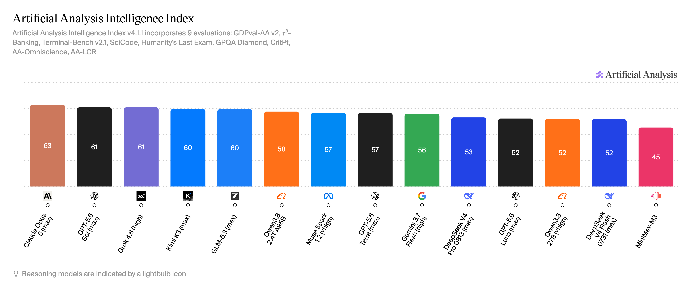
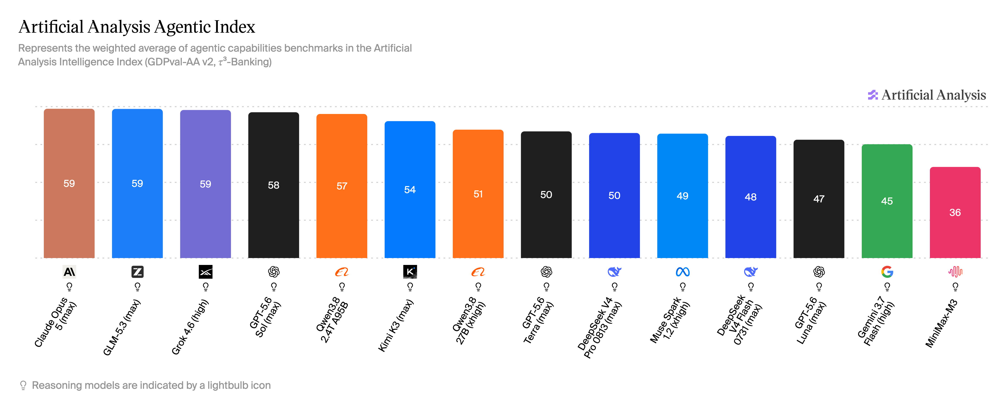

# GLM-5.3 在 AA 14 模型对比中综合第 5，Agentic 第 2：双榜成绩出炉

**更新日期 2026.8.23** 数据来源 [https://vibecoding.dreamfree.space](https://vibecoding.dreamfree.space)

> 本次核心更新：
>
> - Artificial Analysis 于 8 月 18 日收录 GLM-5.3（max）评测，当前榜单版本为 Intelligence Index（综合智能指数）v4.1.1。
> - 综合智能榜：GLM-5.3 显示 60 分，在这份 14 模型对比集内排第 5。
> - Agentic Index（智能体指数）：GLM-5.3 显示 59 分，在这份 14 模型对比集内排第 2，仅次于 Claude Opus 5。
> - 第三方 DeepSWE 实时榜单：GLM-5.3 为 69%±3%，与 Kimi K3 并列第一梯队。
> - API 已于 8 月 19 日开放，定价与 GLM-5.2 一致：输入 ¥8、输出 ¥28（每百万 tokens）；完整权重按官方计划于 8 月 28 日开源。

8 月 14 日智谱发布 GLM-5.3 后，独立评测机构 Artificial Analysis（下称 AA）在 8 月 18 日收录了 GLM-5.3（max）的评测结果。这是第三方视角的独立评测补充，不是模型再次发布。AA 把各家模型放进同一套任务里跑分，用 Intelligence Index 给出综合分数，再单独加权出更接近工具调用和长程任务表现的 Agentic Index。当前版本 v4.1.1 下，GLM-5.3 综合智能 60 分、Agentic 59 分，在 8 月 22 日截图的这份 14 模型对比集内分别排第 5 和第 2。

## 一、先回看 DeepSWE：第三方榜 69%±3%，并列第一梯队

在上一篇 [《GLM-5.3 发布》](https://vibecoding.dreamfree.space/articles/news/20260814_glm_5_3/) 里已经梳理过官方跑分：提升几乎全部来自后训练，最突出的是长程软件工程任务。官方口径里，DeepSWE v1.1 从 GLM-5.2 的 46.2 提升到 66.9，Terminal Bench 3.0 从 4.6 提升到 28.3，Agents' Last Exam（CLI）从 23.8 提升到 28.5。

第三方榜单 DeepSWE（[deepswe.datacurve.ai](https://deepswe.datacurve.ai/)）用统一环境重新跑了一遍：113 个任务、覆盖 91 个仓库、5 种语言，所有模型都跑在 mini-swe-agent 上，保证执行环境一致。榜单收录 25 个模型配置，截图展示其中 18 个；下面列出与本文相关的 11 个配置。对应 v1.1，更新于 8 月 20 日：

图片来源：[DeepSWE 实时榜单](https://deepswe.datacurve.ai/)

图片来源：[DeepSWE 实时榜单](https://deepswe.datacurve.ai/)

| 模型 | DeepSWE Pass@1 |
| --- | ---: |
| Claude Opus 5 (max) | 74%±4% |
| GPT-5.6 Sol (max) | 73%±3% |
| Fable 5 (max) | 70%±4% |
| GLM-5.3 (max) | 69%±3% |
| Kimi K3 (max) | 69%±5% |
| GPT-5.6 Luna (max) | 67%±4% |
| GPT-5.5 (xhigh) | 67%±6% |
| Grok 4.6 (xhigh) | 67%±2% |
| Gemini 3.7 Flash (high) | 65%±2% |
| DeepSeek V4 Pro (max) | 63%±6% |
| GLM-5.2 (max) | 44%±2% |

这份榜单里，第一梯队是 74%–69%：Claude Opus 5、GPT-5.6 Sol、Fable 5、GLM-5.3、Kimi K3。GLM-5.3 的 69%±3% 与 Kimi K3 的 69%±5% 同档；第二梯队则是 GPT-5.6 Luna、GPT-5.5、Grok 4.6、Gemini 3.7 Flash、DeepSeek V4 Pro，分数为 67%–63%。GLM-5.2 在同一环境里只有 44%±2%，与官方口径 46.2 → 66.9 的跃升方向一致。

成本上，GLM-5.3 单任务平均成本约 ¥28（\$3.99），是第一梯队五款里最低的；Kimi K3 约 ¥33（\$4.65），其余三款都在约 ¥56（\$8）以上。榜单上的 69%±3% 与官方 66.9 不是同一套环境：官方是智谱自测口径，Datacurve 用 mini-swe-agent 统一重跑，两者不能直接比较。

DeepSWE 这类基准考的不是「生成一段代码」，而是持续定位问题、修改、运行、再验证的完整闭环。长任务里，前面几十步都做对、最后一步改错，整条轨迹就会失败；GLM-5.3 的后训练路线正是围绕这类长程执行稳定性加码。AA 的 Agentic Index 测的是同一方向：工具使用、规划与复杂任务执行。66.9、69%±3% 与 59 分属不同基准、不同评分体系，不能直接比较数值。

## 二、综合智能榜：整数分 60，在这份对比集内第 5

AA 的 Intelligence Index v4.1.1 由 9 项评测加权得出，覆盖编程、数学、科学、长上下文等能力，包括 GDPval-AA v2、τ³-Banking、Terminal-Bench v2.1、SciCode、Humanity's Last Exam、GPQA Diamond 等。8 月 22 日截图的 14 个模型里，GLM-5.3 显示为 60 分：

| 模型 | Intelligence Index |
| --- | ---: |
| Claude Opus 5 (max) | 63 |
| GPT-5.6 Sol (max) | 61 |
| Grok 4.6 (high) | 61 |
| Kimi K3 (max) | 60 |
| GLM-5.3 (max) | 60 |
| Qwen3.8 2.4T A95B | 58 |
| Muse Spark 1.2 (xhigh) | 57 |
| GPT-5.6 Terra (max) | 57 |
| Gemini 3.7 Flash (high) | 56 |
| DeepSeek V4 Pro 0813 (max) | 53 |
| GPT-5.6 Luna (max) | 52 |
| Qwen3.8 27B (xhigh) | 52 |
| DeepSeek V4 Flash 0731 (max) | 52 |
| MiniMax-M3 | 45 |

图片来源：[Artificial Analysis · Intelligence Index](https://artificialanalysis.ai/?models=muse-spark-1-2%2Cminimax-m3%2Cgpt-5-6-luna%2Cdeepseek-v4-pro%2Cqwen3-8-2-4t-a95b%2Cqwen3-8-27b%2Cgemini-3-7-flash%2Cclaude-opus-5%2Cgpt-5-6-terra%2Cgrok-4-6%2Cglm-5-3%2Cgpt-5-6-sol%2Ckimi-k3%2Cdeepseek-v4-flash#intelligence-tabs)

Kimi K3 与 GLM-5.3 同为 60 分，Kimi K3 第 4、GLM-5.3 第 5。再往上是 Grok 4.6 和 GPT-5.6 Sol（均显示 61）、Claude Opus 5（63）。往下看，Qwen3.8 2.4T A95B 为 58，DeepSeek V4 Pro 0813 为 53。

在这份对比集内，国产模型里 GLM-5.3 紧贴 Kimi K3，明显高于 Qwen3.8 2.4T A95B 和 DeepSeek V4 Pro；整体落后于 Claude Opus 5、GPT-5.6 Sol、Grok 4.6 三款第一梯队。

## 三、Agentic Index：整数分 59，在这份对比集内第 2

Agentic Index 把工具使用、规划、自主执行和复杂工作任务相关的评测（GDPval-AA v2、τ³-Banking 等）加权成单一分数，和综合智能榜不是同一把尺子。GLM-5.3 显示 59 分：

| 模型 | Agentic Index |
| --- | ---: |
| Claude Opus 5 (max) | 59 |
| GLM-5.3 (max) | 59 |
| Grok 4.6 (high) | 59 |
| GPT-5.6 Sol (max) | 58 |
| Qwen3.8 2.4T A95B | 57 |
| Kimi K3 (max) | 54 |
| Qwen3.8 27B (xhigh) | 51 |
| GPT-5.6 Terra (max) | 50 |
| DeepSeek V4 Pro 0813 (max) | 50 |
| Muse Spark 1.2 (xhigh) | 49 |
| DeepSeek V4 Flash 0731 (max) | 48 |
| GPT-5.6 Luna (max) | 47 |
| Gemini 3.7 Flash (high) | 45 |
| MiniMax-M3 | 36 |

图片来源：[Artificial Analysis · Agentic Index](https://artificialanalysis.ai/?models=muse-spark-1-2%2Cminimax-m3%2Cgpt-5-6-luna%2Cdeepseek-v4-pro%2Cqwen3-8-2-4t-a95b%2Cqwen3-8-27b%2Cgemini-3-7-flash%2Cclaude-opus-5%2Cgpt-5-6-terra%2Cgrok-4-6%2Cglm-5-3%2Cgpt-5-6-sol%2Ckimi-k3%2Cdeepseek-v4-flash&intelligence=agentic-index#intelligence-tabs)

Claude Opus 5、GLM-5.3、Grok 4.6 都显示 59 分，Claude Opus 5 第 1、GLM-5.3 第 2、Grok 4.6 第 3。GLM-5.3 明显高于 Kimi K3（54）和 DeepSeek V4 Pro 0813（50）；其中 Kimi K3 在 Agentic 榜上的位置比综合榜更靠后。这类任务通常要求模型自己读仓库、跑命令、看报错再修正，评估方式与 Coding Agent 的实际使用更接近。

这与 DeepSWE 的提升方向一致：长程执行和 agentic 能力是 GLM-5.3 相对最突出的部分。对依赖工具调用、终端操作和长任务自动化的场景，这个位置比综合榜更有参考价值。Agentic 59 分不表示比综合 60 分差，两套指数考察范围不同，不能直接比大小。

## 四、三榜都在第一梯队

把 DeepSWE、AA 综合智能、AA Agentic 三张榜放在一起，GLM-5.3 都落在第一梯队：

| 榜单 | 第一梯队 | 第二梯队 | GLM-5.3 |
| --- | --- | --- | --- |
| DeepSWE（Datacurve 第三方榜） | 74%–69%：Claude Opus 5、GPT-5.6 Sol、Fable 5、GLM-5.3、Kimi K3 | 67%–63%：GPT-5.6 Luna、GPT-5.5、Grok 4.6、Gemini 3.7 Flash、DeepSeek V4 Pro | 69%±3%，并列第一梯队；单任务平均成本约 ¥28（\$3.99）第一梯队最低 |
| AA 综合智能 v4.1.1（14 模型） | 63–60：Claude Opus 5、GPT-5.6 Sol、Grok 4.6、Kimi K3、GLM-5.3 | 58–53：Qwen3.8 2.4T、Muse Spark 1.2、GPT-5.6 Terra、Gemini 3.7 Flash、DeepSeek V4 Pro | 60 分，第 5 |
| AA Agentic v4.1.1（14 模型） | 59：Claude Opus 5、GLM-5.3、Grok 4.6 | 58–50：GPT-5.6 Sol、Qwen3.8 2.4T、Kimi K3、Qwen3.8 27B、GPT-5.6 Terra、DeepSeek V4 Pro | 59 分，第 2 |

三张榜交叉看：综合智能和 DeepSWE 上，GLM-5.3 与 Kimi K3 基本同档；Agentic 榜上 GLM-5.3 领先 Kimi K3 一个身位（59 对 54）。成本是 DeepSWE 上最突出的优势，第一梯队里只有 GLM-5.3 和 Kimi K3 的单任务平均成本在约 ¥35（\$5）以内，GLM-5.3 的约 ¥28（\$3.99）最低。

两个前提需要记住：AA 分数绑定版本（当前 v4.1.1），版本更新后分数会变，不能拿旧版本分数判断涨跌；综合指数、Agentic Index、DeepSWE 是三套不同口径，不能互相比较绝对数值。

开放情况：GLM Coding Plan 已全量上线 GLM-5.3；API 已于 8 月 19 日开放（模型 ID `glm-5.3`，支持 OpenAI Chat Completion、OpenAI Response 与 Anthropic Message 三种协议），定价与 GLM-5.2 一致，输入 ¥8、输出 ¥28（每百万 tokens）；完整权重按官方计划于 8 月 28 日开源，官方把安全评估和模型加固放在权重发布之前，截至 8 月 23 日尚未放出。

想立刻在编辑器或 CLI 里跑 Coding Agent，现在就能通过 Coding Plan 或 API 上手；权重放出后再评估私有化部署。榜单给出的是相对位置，实际体验还要在自己的代码库和工作流里跑一遍。

## 五、总结

AA 双榜和 DeepSWE 第三方榜补上了两个第三方视角：综合智能在这份 14 模型对比集内第 5、Agentic 第 2、DeepSWE 69%±3% 并列第一梯队。整体能力和长程执行都稳在第一梯队，Agentic 与 DeepSWE 的位次比综合榜更靠前。

接下来值得关注的是权重开放后的第三方复测、AA 榜单版本更新，以及实际使用中的 Token 消耗和长期稳定性。

> 数据来源 [https://vibecoding.dreamfree.space](https://vibecoding.dreamfree.space)
>
> 原文链接 [https://vibecoding.dreamfree.space/articles/news/20260818_glm_5_3_aa/](https://vibecoding.dreamfree.space/articles/news/20260818_glm_5_3_aa/)
