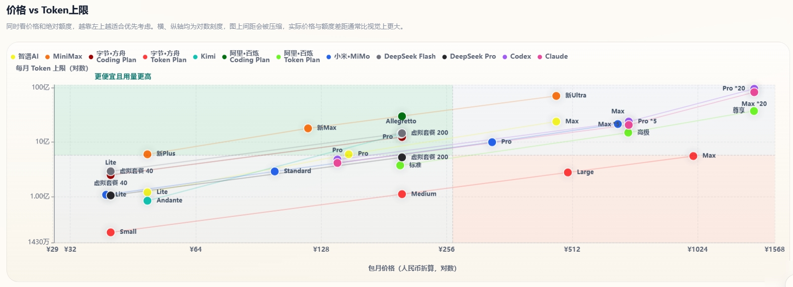

# 2026年6月28日 Coding Plan平台全面对比｜智谱、MiniMax、DeepSeek、GLM-5.2、Kimi-K2.7、字节方舟促销
> **更新日期 2026.6.28** 数据来源 [https://vibecoding.dreamfree.space](https://vibecoding.dreamfree.space)
>
> - 数据统计截至 2026.6.28，重点关注 6 月下半场模型与套餐变化。
> - 智谱 Coding Plan 已切换到 GLM-5.2 主力口径，仍需抢购，热门时段库存紧张。
> - Kimi 全线升级 Kimi-K2.7-Code，基础档位可买但实测月用量依旧偏保守。
> - 字节·方舟延续 6.8-8.8 首两月 2.5 折，且部分模型出现 2.5~4 倍用量活动。
> - 字节·方舟 Coding Plan 在 6 月下旬重新限购，Lite/Pro 抢购属性回归。
> - 优云智算新增 GLM-5.2，当前为限时 x2 倍率。
> - 联通云 Coding Plan 已下线，对比表已不再收录该平台套餐。

6 月底这轮更新，最大的变化不是“又多了几个新模型”，而是平台分层进一步清晰：高质量代码模型继续向 GLM-5.2 与 Kimi-K2.7-Code 靠拢，头部平台在促销和限购之间反复拉扯，真正稳定可买、长期可用的套餐反而更容易筛选。与其纠结名字叫 Coding Plan 还是 Token Plan，不如直接看三件事：**同价位可用量、是否要抢购、模型池是否覆盖你的实际开发场景**。本文按这个逻辑，把当期主流平台一次讲透。

## 一、三种常见计费方式

- **Coding Plan**：多数平台表面按请求次数计量，实际都在内部按模型倍率折算 token。优点是上手直观，缺点是高峰期倍率和限购风险更高。
- **Token Plan**：定价和上限更透明，适合能明确估算月用量的人群。不同平台对长上下文、工具调用和高阶模型的扣减速度差异很大。
- **API 按量计费**：不绑月套餐，按实际消耗结算，低频或波动型开发最灵活。关键是要看缓存命中价格和输出价格，不只看输入单价。

### 1）6月下半场动态

GLM-5.2 已从单点优势走向多平台覆盖，智谱、字节·方舟、优云智算都已接入；Kimi 也把主力档位升级到 Kimi-K2.7-Code。  
字节·方舟这期是典型“促销强、库存紧”：价格端给出 2.5 折和部分模型 2.5~4 倍用量，购买端却在 6 月下旬重新限购。  
智谱延续“代码质量标杆 + 需要抢购”的组合，适合重质量人群。  
阿里百炼继续强化 Token 体系，并补上 Qwen-3.7-Plus。  
**联通云 Coding Plan 已下线。**

### 2）实际用量与价格对比

说明：Coding Plan 展示实测 Token 上限，Token Plan 展示官方月 Token 上限；无完整数据的套餐未列入下表。

| 平台 | 套餐 | 类型 | 包月价格 | 实测5小时Token上限 | 月Token上限 |
|------|------|------|----------|--------------------|-------------|
| 智谱AI | Lite | Coding Plan | ¥49 | 6M | 120M |
| 智谱AI | Pro | Coding Plan | ¥149 | 30M | 600M |
| 智谱AI | Max | Coding Plan | ¥469 | 120M | 2400M |
| MiniMax | Plus | Token Plan | ¥49 | | 600M |
| MiniMax | Max | Token Plan | ¥119 | | 1800M |
| MiniMax | Ultra | Token Plan | ¥469 | | 7100M |
| 字节·方舟 | Lite | Coding Plan | ¥40（活动首月约¥9.4） | 17M | 250M |
| 字节·方舟 | Pro | Coding Plan | ¥200（活动首月约¥47.4） | 83M | 1249M |
| 字节·方舟 | Small | Token Plan | ¥40 | | 22M |
| 字节·方舟 | Medium | Token Plan | ¥200 | | 111M |
| 字节·方舟 | Large | Token Plan | ¥500 | | 278M |
| 字节·方舟 | Max | Token Plan | ¥1000 | | 556M |
| Kimi | Andante | Coding Plan | ¥49 | 15M | 84M |
| Kimi | Allegretto | Coding Plan | ¥199 | 65M | 1428M |
| 阿里·百炼 | Pro | Coding Plan | ¥200 | 200M | 3000M |
| 阿里·百炼 | 标准 | Token Plan | ¥198 | | 375M |
| 阿里·百炼 | 高级 | Token Plan | ¥698 | | 1500M |
| 阿里·百炼 | 尊享 | Token Plan | ¥1398 | | 3750M |
| 小米·MiMo | Lite | Token Plan | ¥39 | | 108M |
| 小米·MiMo | Standard | Token Plan | ¥99 | | 290M |
| 小米·MiMo | Pro | Token Plan | ¥329 | | 1002M |
| 小米·MiMo | Max | Token Plan | ¥659 | | 2162M |
| 腾讯云 | Lite | Token Plan | ¥39 | | 35M |
| 腾讯云 | Standard | Token Plan | ¥99 | | 100M |
| 腾讯云 | Pro | Token Plan | ¥299 | | 320M |
| 腾讯云 | Max | Token Plan | ¥599 | | 650M |

> 访问 [https://vibecoding.dreamfree.space](https://vibecoding.dreamfree.space) 可查看完整的价格 vs Token 上限对比图表、每元 Token 性价比密度图等可视化数据。

## 二、国内第一梯队平台核心特点

### [1. 智谱AI：GLM-5.2 代码质量标杆，依旧要抢购](https://api.dreamfree.space/c/s/cpyqzhipu)

跳转官网➡️ [智谱AI：GLM-5.2 代码质量标杆，依旧要抢购](https://api.dreamfree.space/c/s/cpyqzhipu)

**综合评分**：★★★★★  
**限购状态**：**全面限购，需要抢购**。每日 10:00 限量发售 Lite、Pro、Max 套餐，热门时段常在 1 分钟内售罄。续订或有效期内升级不受限售影响。  
**抢购辅助**：[油猴抢购脚本](https://greasyfork.org/zh-CN/scripts/571507-%E6%99%BA%E8%B0%B1-glm-coding-%E7%89%B9%E6%83%A0%E8%AE%A2%E8%B4%AD%E6%8A%A2%E8%B4%AD%E5%8A%A9%E6%89%8B)（打不开可查看 [GitHub 讨论](https://github.com/wmpeng/codingplan/discussions/22)）

**核心优势**：
- 主力模型已升级到 **GLM-5.2**，代码生成、调试与重构能力仍是国产模型第一梯队。
- 提供免费 MCP 次数，与主流开发工具集成顺畅。
- GLM-5.2 / GLM-5-Turbo 在高峰期按更高倍率扣减额度；非高峰期有 1 倍抵扣限时福利（以官方当期规则为准）。

**Coding Plan 价格体系**：
| 套餐 | 首月价格 | 连续包月 | 连续包季 | 连续包年 | 5小时请求数 | 月请求数 |
|------|----------|----------|----------|----------|--------------|----------|
| Lite | ¥46.55 | ¥49 | ¥132 | ¥470 | 1,200 | 24,000 |
| Pro | ¥141.55 | ¥149 | ¥402 | ¥1430 | 6,000 | 120,000 |
| Max | ¥445.55 | ¥469 | ¥1266 | ¥4502 | 24,000 | 480,000 |

**不足**：需要抢购；国际版折算后性价比因汇率波动较大。  
**适用人群**：对代码质量要求高、能接受抢购的专业开发者。

### [2. MiniMax：Token 大池稳定，M3 体系适合长期高频](https://api.dreamfree.space/c/s/cpyqminimax)

跳转官网➡️ [MiniMax：Token 大池稳定，M3 体系适合长期高频](https://api.dreamfree.space/c/s/cpyqminimax)

**综合评分**：★★★★★  
**订阅状态**：**不限购**。公开订阅为 Plus、Max、Ultra 三档 Token Plan；Starter 与 Plus-极速仅老用户可续订。

**核心优势**：
- 主力模型 **MiniMax-M3**，支持 1M 上下文、原生多模态与 Agent 工作流。
- Plus ¥49、Max ¥119、Ultra ¥469，横向对比仍是 Token 池最深的一档。
- 不限购，适合把 AI 编程当日常基础设施的个人开发者。

**当前公开订阅套餐**：
| 套餐 | 类型 | 连续包月 | 月Token上限 | 适合场景 |
|------|------|----------|-------------|----------|
| Plus | Token Plan | ¥49 | 600M | 轻量个人开发 |
| Max | Token Plan | ¥119 | 1800M | 高频 Agent 与多模态 |
| Ultra | Token Plan | ¥469 | 7100M | 重度长时开发 |

**不足**：M3 月度体感较旧版 M2.7 更保守；新用户无法再买 Starter 等低门槛老档。  
**适用人群**：预算有限、需要大 Token 池和多模态能力的个人开发者。

### [3. 字节·方舟：模型池最全，促销很强，但 Coding Plan 再度限购](https://api.dreamfree.space/c/s/cpyqfangzhou)

跳转官网➡️ [字节·方舟：模型池最全，促销很强，但 Coding Plan 再度限购](https://api.dreamfree.space/c/s/cpyqfangzhou)

**综合评分**：★★★★★  
**限购状态**：**6 月下旬 Coding Plan 重新限购**，Lite、Pro 需抢购。

**核心优势**：
- 唯一同时覆盖 **GLM-5.2、Kimi-K2.7-Code、MiniMax-M3、DeepSeek-V4** 等主流模型的全家桶平台。
- **6.8–8.8 首两月 2.5 折**（Lite 活动首月约 ¥9.4、Pro 约 ¥47.4），可与邀请折扣叠加；DeepSeek-V4-Pro、GLM-5.1、Kimi-K2.6 等部分模型限时 **2.5~4 倍用量**。
- 促销期实测月 Token 明显提升：Lite 约 **250M**、Pro 约 **1249M**。

**Coding Plan 价格体系**：
| 套餐 | 首月价格（活动） | 连续包月 | 5小时请求数 | 月请求数 |
|------|------------------|----------|--------------|----------|
| Lite | 约 ¥9.4 | ¥40 | 1,200 | 18,000 |
| Pro | 约 ¥47.4 | ¥200 | 6,000 | 90,000 |

**Token Plan 价格体系**：
| 套餐 | 连续包月 | 月Token上限 |
|------|----------|-------------|
| Small | ¥40 | 22M |
| Medium | ¥200 | 111M |
| Large | ¥500 | 278M |
| Max | ¥1000 | 556M |

**注意事项**：不同模型倍率差异大，实际可用量需按常用模型估算；Coding Plan 限购后购买确定性下降。  
**适用人群**：需要多模型切换、能抢到 Coding Plan 促销档的个人开发者。

### [4. Kimi：K2.7-Code 升级完成，体验均衡但基础档用量保守](https://api.dreamfree.space/c/s/cpyqkimi)

跳转官网➡️ [Kimi：K2.7-Code 升级完成，体验均衡但基础档用量保守](https://api.dreamfree.space/c/s/cpyqkimi)

**综合评分**：★★★★☆  
**限购状态**：**不限购**，全档位常态开放。

**核心优势**：
- 全档支持 **Kimi-K2.7-Code**，代码与 Agent 能力同步升级。
- 多模态与实验性专业数据库功能，适合特定垂直场景。
- Andante 及以上支持 Agent 加速权益。

**Coding Plan 价格体系**：
| 套餐 | 连续包月 | 连续包年 | 核心权益 |
|------|----------|----------|----------|
| Andante | ¥49 | ¥468 | Agent 4倍速 |
| Moderato | ¥99 | ¥948 | 4倍额度，Agent 多任务并行 |
| Allegretto | ¥199 | ¥1908 | 20倍额度，免费 Kimi-Claw |
| Allegro | ¥699 | ¥6708 | 60倍额度，免费 Kimi-Claw |

**不足**：官方未公开完整用量；Andante 实测月 Token 约 84M，在同价位中偏少。  
**适用人群**：需要多模态、数据库集成或复杂 Agent 任务，且能接受中等用量的开发者。

### [5. DeepSeek：纯 API 按量，适合成本精算与弹性负载](https://api.dreamfree.space/c/s/cpyqdeepseek)

跳转官网➡️ [DeepSeek：纯 API 按量，适合成本精算与弹性负载](https://api.dreamfree.space/c/s/cpyqdeepseek)

**综合评分**：★★★★★  
**计费模式**：**纯按量计费**，无 Coding Plan 或 Token Plan 订阅，用多少付多少。

**核心优势**：
- DeepSeek-V4 系列代码能力开源第一梯队，1M 上下文、384K 最大输出。
- V4-Flash / Pro 永久降价口径已在 6 月初确立，缓存命中输入极低价。
- 月均约 3 亿 tokens 用量，按 V4-Flash 测算成本约 ¥33 量级，低于多数订阅套餐。

**API 价格体系**：
| 模型 | 输入(缓存命中) | 输入(缓存未命中) | 输出 | 上下文 | 最大输出 |
|------|----------------|------------------|------|--------|----------|
| DeepSeek-V4-Flash | ¥0.02/1M | ¥1/1M | ¥2/1M | 1M | 384K |
| DeepSeek-V4-Pro | ¥0.025/1M | ¥3/1M | ¥6/1M | 1M | 384K |

**不足**：账单随用量波动，需自行控制缓存与并发。  
**适用人群**：用量波动大、追求极致性价比的个人开发者与团队。

### [6. 阿里·百炼：Qwen-3.7-Plus 加入后，Token 体系更完整](https://api.dreamfree.space/c/s/cpyqbailianc)

跳转官网➡️ [阿里·百炼：Qwen-3.7-Plus 加入后，Token 体系更完整](https://api.dreamfree.space/c/s/cpyqbailianc)

**综合评分**：★★★★☆  
**限购状态**：Coding Plan **仅存 Pro 档且限购**，每日放量不固定。

**核心优势**：
- 新增 **Qwen-3.7-Plus**，Coding Pro 与 Token 标准/高级/尊享均可调用。
- 默认长上下文，通义千问在中文项目与前端/Python 场景表现稳定。
- Pro 档月请求 90,000 次，适合大型代码库分析。

**Coding Plan 价格体系**：
| 套餐 | 连续包月 | 5小时请求数 | 月请求数 |
|------|----------|--------------|----------|
| Pro | ¥200 | 6,000 | 90,000 |

**Token Plan 价格体系**：
| 套餐 | 连续包月 | 月Token上限 |
|------|----------|-------------|
| 标准 | ¥198 | 375M |
| 高级 | ¥698 | 1500M |
| 尊享 | ¥1398 | 3750M |

**不足**：Coding Pro 需抢购；Token Plan 对低频用户性价比一般。  
**适用人群**：通义生态用户、长上下文需求较多的团队。

## 三、其他主流平台亮点

### [1. 讯飞·星火：39 元档位依然能打，不用抢购](https://api.dreamfree.space/c/s/cpyqxunfei)

跳转官网➡️ [讯飞·星火：39 元档位依然能打，不用抢购](https://api.dreamfree.space/c/s/cpyqxunfei)

**综合评分**：★★★★★  
**限购状态**：**不限购**，所有套餐均可随时购买。

**核心优势**：
- **¥39/月** 专业版即可使用 GLM-5.1，抢不到智谱时的首选平替。
- 支持 GLM-5.1、DeepSeek-V4-Pro/Flash、Kimi-K2.6 等多模型混用。
- 无忧版支持 Qwen3.5-35B-A3B 无次调用（约 20M/日），白嫖额度大方。
- 实测可用量在同价位中偏充裕，常规开发基本不限速。

**Coding Plan 价格体系**：
| 套餐 | 连续包月 | 5小时请求数 | 月请求数 |
|------|----------|--------------|----------|
| 专业版 | ¥39 | 1,200 | 18,000 |
| 高效版 | ¥199 | 6,000 | 90,000 |

**不足**：高效版相对智谱 Pro 性价比一般。  
**适用人群**：不想抢购、需要稳定使用 GLM 系模型的个人开发者。

### [2. 小米 MiMo：降价后的大用量备选仍成立](https://api.dreamfree.space/c/s/cpyqmimo)

跳转官网➡️ [小米 MiMo：降价后的大用量备选仍成立](https://api.dreamfree.space/c/s/cpyqmimo)

**综合评分**：★★★★☆  
**限购状态**：**不限购**。

**核心优势**：
- 5 月降价后 Token Plan 额度提升 5–8 倍，MiMo-V2.5-Pro 等模型覆盖完整。
- 无 5 小时硬限，适合集中消耗的大用量场景。

**Token Plan 价格体系**：
| 套餐 | 连续包月 | Credits 额度 | 换算 Token(约) |
|------|----------|--------------|----------------|
| Lite | ¥39 | 41 亿 | 108M |
| Standard | ¥99 | 110 亿 | 290M |
| Pro | ¥329 | 380 亿 | 1002M |
| Max | ¥659 | 820 亿 | 2162M |

**适用人群**：大规模测试、Agent 开发等 Token 敏感型个人开发者与团队。

### [3. 优云智算：GLM-5.2 限时 x2，不抢购但价格偏高](https://api.dreamfree.space/c/s/cpyqyyzs)

跳转官网➡️ [优云智算：GLM-5.2 限时 x2，不抢购但价格偏高](https://api.dreamfree.space/c/s/cpyqyyzs)

**综合评分**：★★★★☆  
**限购状态**：**不限购**。

**核心优势**：
- 全档位 Coding Plan 已支持 **GLM-5.2**，当前 **限时倍率 x2**。
- 各模型倍率公开标注，无隐藏扣费；3–10 并发。

**Coding Plan 价格体系**：
| 套餐 | 连续包月 | 5小时请求数 | 月请求数 |
|------|----------|--------------|----------|
| Mini | ¥49 | 300 | 1,900 |
| Lite | ¥99 | 600 | 3,800 |
| Basic | ¥199 | 1,200 | 7,600 |
| Pro | ¥499 | 3,000 | 19,000 |
| Max | ¥799 | 4,800 | 31,000 |
| Ultra | ¥999 | 6,000 | 39,000 |

**不足**：同请求次数下价格高于 MiniMax、讯飞等主流平台。  
**适用人群**：需要 GLM-5.2 且不想抢购、重视费率透明的开发者。

### [4. 腾讯云：Token 体系稳定，适合作为企业侧备份通道](https://api.dreamfree.space/c/s/cpyqtengxun)

跳转官网➡️ [腾讯云：Token 体系稳定，适合作为企业侧备份通道](https://api.dreamfree.space/c/s/cpyqtengxun)

**综合评分**：★★☆☆☆  
**限购状态**：**不限购**。Coding Plan 已全面下线，仅保留 Token Plan。

**Token Plan 价格体系**：
| 套餐 | 连续包月 | 月Token上限 |
|------|----------|-------------|
| Lite | ¥39 | 35M |
| Standard | ¥99 | 100M |
| Pro | ¥299 | 320M |
| Max | ¥599 | 650M |

**适用人群**：企业采购流程成熟、需要合规冗余通道的团队。

## 四、国际平台与特色工具

### [1. OpenCode Go：多模型聚合，首月半价](https://api.dreamfree.space/c/s/cpyqopencode)

跳转官网➡️ [OpenCode Go：多模型聚合，首月半价](https://api.dreamfree.space/c/s/cpyqopencode)

**综合评分**：★★★★★  
**限购状态**：**不限购**，所有套餐均可随时购买。

**核心优势**：
- 支持 GLM-5.1、Kimi-K2.6、Qwen-3.6-Plus、DeepSeek-V4-Pro、MiniMax-M2.7 等国内外主流模型，一个账户即可切换。
- 首月仅 $5，连续包月 $10，按美元 Credits 计费，灵活性高。
- 支持**支付宝直接付款**，**使用时无需科学上网**。
- 无隐藏倍率，消费透明。

**Token Plan 价格体系**：
| 套餐 | 首月价格 | 连续包月 | 核心权益 |
|------|----------|----------|----------|
| Go | $5 | $10 | 基础 12 美元 + 周 30 美元 + 月 60 美元额度 |

**不足**：只有基础套餐，如果有更大用量要求需要订阅多个账号切换使用。  
**适用人群**：需要多模型切换、希望国内直连与便捷支付的个人开发者。

### [2. Codex：OpenAI 原生编程代理，Token 计费更清晰](https://api.dreamfree.space/c/s/cpyqchatgpt)

跳转官网➡️ [Codex：OpenAI 原生编程代理，Token 计费更清晰](https://api.dreamfree.space/c/s/cpyqchatgpt)

**综合评分**：★★★★☆  
**限购状态**：**不限购**，官方订阅与额度档位可直接购买。  
**使用门槛**：需要**境外手机号**、**境外支付方式**和**科学上网**。

**核心优势**：
- 基于 OpenAI 生态，覆盖 GPT-5.5、GPT-5.4、GPT-5.3-Codex、GPT-5.2 等模型，适合已在用 ChatGPT 体系的开发者。
- 当前按 Token 计费口径管理，更适合愿意按实际用量来控制成本的用户。
- 官方支持按 5 小时与每周额度管理，必要时还可以购买额外积分，使用方式更灵活。

**Token Plan 价格体系**：
| 套餐 | 价格 | 核心权益 |
|------|------|----------|
| Plus | $20 | 基础额度 |
| Pro *5 | $100 | 5 倍 Plus 额度 |
| Pro *20 | $200 | 20 倍 Plus 额度 |

**适用人群**：重视 OpenAI 原生体验、又希望把用量和成本看清楚的**个人开发者**与团队。

### [3. Claude Code：原生体验最佳](https://api.dreamfree.space/c/s/cpyqclaudeup)

跳转官网➡️ [Claude Code：原生体验最佳](https://api.dreamfree.space/c/s/cpyqclaudeup)

**综合评分**：★★★★☆  
**限购状态**：**不限购**，所有套餐均可随时购买。  
**使用门槛**：需要**境外手机号**、**境外支付方式**和**科学上网**。

**核心优势**：
- 提供最接近原生 Claude Code 的体验，Claude Opus 4.7 的长上下文处理能力突出，可一次性分析整个代码库。
- 代码逻辑严谨，生成的代码 bug 率低，适合复杂系统设计与重构。

**Token Plan 价格体系**：
| 套餐 | 价格 | 核心权益 |
|------|------|----------|
| Pro | $20 | 基础额度 |
| Max *5 | $100 | 5 倍 Pro 额度 |
| Max *20 | $200 | 20 倍 Pro 额度 |

**不足**：套餐额度不可用于第三方编程 Agent；部分用户订阅时可能被要求实名认证。  
**适用人群**：有大型代码库处理需求、追求原生体验的**个人开发者**。

### [4. GitHub Copilot：IDE 集成标杆，学生福利丰厚](https://api.dreamfree.space/c/s/cpyqghcopilot)

跳转官网➡️ [GitHub Copilot：IDE 集成标杆，学生福利丰厚](https://api.dreamfree.space/c/s/cpyqghcopilot)

**综合评分**：学生版 ★★★★☆ | Pro 版 ★★★☆☆  
**更新**：目前已转向 Token 计费口径，性价比大幅降低。

**核心优势**：
- 学生认证后**完全免费**，是学生开发者的不错选择。
- 与 VS Code 等 IDE 深度集成，代码补全与实时建议体验最佳，大幅提升编码效率。
- Pro+ 版支持 GPT-5.5、Claude Opus 4.7 等顶级模型，代码质量出色。

**Token Plan 价格体系**：
| 套餐 | 价格 | 核心权益 |
|------|------|----------|
| 学生版 | $0 | 高级模型可对话 300 次 |
| Pro | $10 | 1000 积分 |
| Pro+ | $39 | 3900 积分 |

**适用人群**：学生开发者、习惯使用 IDE 集成工具的**个人开发者**。

## 五、免费平台推荐：零成本体验AI编程

### [1. GitHub 学生认证：IDE 集成免费编程助手](https://api.dreamfree.space/c/s/cpyqghstudent)

跳转官网➡️ [GitHub 学生认证：IDE 集成免费编程助手](https://api.dreamfree.space/c/s/cpyqghstudent)

**核心特点**：与 VS Code 等 IDE 深度集成，提供代码补全、实时建议和高级模型调用权限。  
**免费额度**：学生认证后**完全免费**，每月可调用高级模型 300 次。  
**申请方式**：通过 GitHub 学生包页面提交身份认证。  
**适用人群**：学生开发者、教育场景用户。

### [2. NVIDIA NIM：免费高并发模型 API](https://api.dreamfree.space/c/s/cpyqnvidia)

跳转官网➡️ [NVIDIA NIM：免费高并发模型 API](https://api.dreamfree.space/c/s/cpyqnvidia)

**核心特点**：预打包优化 AI 模型微服务，兼容 OpenAI 格式 API，国内可直连。  
**免费额度**：每分钟**40 次请求**，无 Token 限制。  
**申请方式**：注册 NVIDIA 账号，创建 API Key 即可调用。  
**适用场景**：个人项目开发、AI 助手搭建、编程学习。

### [3. OpenRouter：免费模型聚合平台（有条件限制）](https://api.dreamfree.space/c/s/cpyqopenrouter)

跳转官网➡️ [OpenRouter：免费模型聚合平台（有条件限制）](https://api.dreamfree.space/c/s/cpyqopenrouter)

**核心特点**：一个接口聚合多类模型，**免费使用存在严格限制**。

**免费使用限制详情**：
- 未充值用户每日仅**50 次免费请求**；充值 ≥10 美元后每日额度提升至 1000 次
- 统一限速**每分钟 20 次请求**
- 部分热门模型无免费版，部分模型限制国内 IP 访问
- 付费充值仅支持外币信用卡/加密货币，银联卡不可用

**推荐免费模型**：qwen/qwen3.6-plus-preview:free、deepseek/deepseek-r1-0528:free、llama-3.3-70b-instruct 等  
**适用场景**：多模型对比测试、低成本项目开发，适合有外币支付能力的用户。

## 六、分场景选型建议

### 1）综合推荐

- **[智谱AI](https://api.dreamfree.space/c/s/cpyqzhipu)**：代码质量优先，能接受抢购。
- **[讯飞·星火](https://api.dreamfree.space/c/s/cpyqxunfei)**：预算友好、稳定可买。
- **[MiniMax](https://api.dreamfree.space/c/s/cpyqminimax)**：高频开发与大用量更稳。
- **[字节·方舟](https://api.dreamfree.space/c/s/cpyqfangzhou)**：模型池最全，活动期性价比突出（但 Coding Plan 需抢购）。

### 2）包含 GLM-5.2

- **[智谱AI](https://api.dreamfree.space/c/s/cpyqzhipu)**：GLM-5.2 主场，代码向体验最稳。
- **[智谱国际版](https://api.dreamfree.space/c/s/cpyqzai)**：适合跨境支付与海外节点需求。
- **[字节·方舟](https://api.dreamfree.space/c/s/cpyqfangzhou)**：GLM-5.2 与多模型混用灵活。
- **[优云智算](https://api.dreamfree.space/c/s/cpyqyyzs)**：GLM-5.2 限时 x2，且无需抢购。

### 3）量大管饱

- **[MiniMax](https://api.dreamfree.space/c/s/cpyqminimax)**：Ultra/Max 的 token 上限仍是第一梯队。
- **[字节·方舟](https://api.dreamfree.space/c/s/cpyqfangzhou)**：活动期 Lite/Pro 的实测月用量显著提升。
- **[讯飞·星火](https://api.dreamfree.space/c/s/cpyqxunfei)**：高效版适合稳定高频开发。
- **[DeepSeek](https://api.dreamfree.space/c/s/cpyqdeepseek)**：缓存命中高时，按量成本非常可控。

### 4）不抢购

- **[讯飞·星火](https://api.dreamfree.space/c/s/cpyqxunfei)**：买得到、用得稳、价格低。
- **[MiniMax](https://api.dreamfree.space/c/s/cpyqminimax)**：公开档长期可购，适合持续开发。
- **[优云智算](https://api.dreamfree.space/c/s/cpyqyyzs)**：不限购，适合需要可预期采购的人群。
- **[Kimi](https://api.dreamfree.space/c/s/cpyqkimi)**：档位可直接购买，适合多模态与工具协同需求。

## 七、总结

2026 年 6 月底的真实格局可以概括成一句话：**模型能力继续上探，套餐购买门槛重新抬升，稳定可买的平台价值更高**。  
如果你追求代码质量并能接受抢购，优先看智谱；如果你追求长期大用量和稳定可买，MiniMax 与讯飞更稳；如果你需要多模型混合且能接受抢购成本，字节·方舟在促销窗口里很有吸引力；如果你更看重成本弹性，DeepSeek 按量方案依旧值得长期配置为基础通道。

> 数据来源 [https://vibecoding.dreamfree.space](https://vibecoding.dreamfree.space)
>
> 原文链接 [https://www.codingplan.fyi](https://www.codingplan.fyi)
