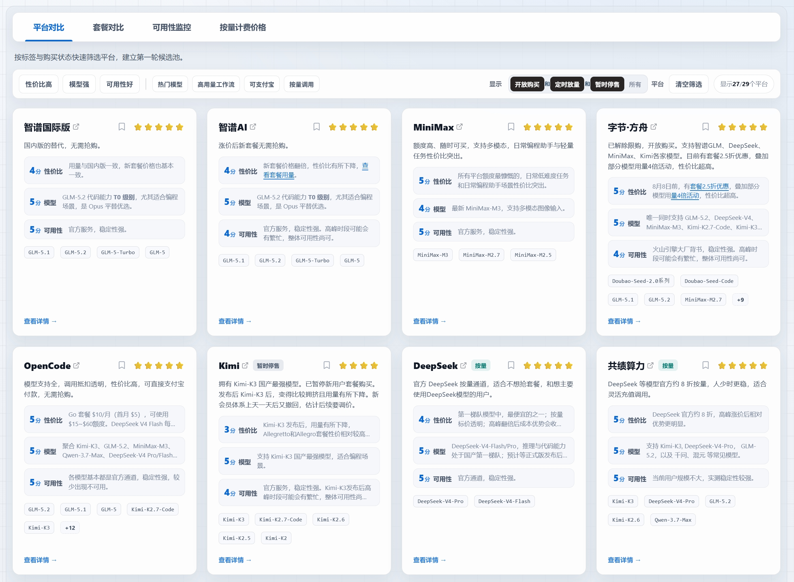

# 2026年8月10日 Coding Plan平台全面对比｜智谱新套餐涨价、Kimi限购、DeepSeek新模型、字节方舟2.5折持续
**更新日期 2026.8.10** 数据来源 [https://vibecoding.dreamfree.space](https://vibecoding.dreamfree.space)

> 本期关键更新：
>
> - 数据统计截至 2026.8.10，重点关注 8 月初的模型与套餐变化。
> - 智谱国内与国际版上线新套餐，国内版价格较此前档位翻倍级上涨，购买方式从抢购转为开放购买。
> - Kimi-K3 已覆盖 Kimi 全档位，会员购买收紧为「需预约，近期长期不放量」。
> - 字节·方舟模型倍率活动已结束，6.8–11.8 首两月 2.5 折继续，已解除限购、开放购买。
> - 阿里发布 Qwen-3.8-Max，Token Plan 全档可调用，有限时折扣活动。
> - 讯飞·星火 39 元专业版已下架，已明显下滑，当前不推荐。

8 月这轮更新，主线是「定价再平衡」：智谱把旗舰模型的购买门槛从抢购改成直接购买，代价是价格翻倍；Kimi 发布 Kimi-K3 后反而收紧供应；字节·方舟活动退潮，只剩 2.5 折在延续。对个人开发者来说，选平台的判断标准没有变：**同价位可用量、是否要抢购、模型池是否覆盖你的实际开发场景**。本文按这个逻辑，把本期主流平台逐一过一遍。

## 一、三种常见计费方式

- **Coding Plan**：本质是包月套餐，表面按请求次数计量，实际内部按模型倍率折算 token 消耗。这类平台的问题是高峰期倍率和限购风险更高，用着用着容易撞上额度上限。
- **Token Plan**：按消耗的 token 量计费，用量上限在购买时写明。现在很多平台都从 Coding Plan 转成了这种模式。
- **API 按量计费**：不绑月套餐，按实际消耗结算，低频或波动型开发最灵活。关键是要看缓存命中价格和输出价格，不只看输入单价。

### 1）8 月初动态

1. 智谱把新套餐（新 Lite / 新 Pro / 新 Max）做成 Token Plan 并在国内、国际版同步上线，国内版本价格约为此前档位的两倍以上，同时取消了购买限制。
2. Kimi-K3 于 7 月中旬发布后已覆盖 Kimi 全档位，[字节·方舟](https://api.dreamfree.space/c/s/cpyqfangzhou) Token Plan 与 [OpenCode](https://api.dreamfree.space/c/s/cpyqopencode) 也同步接入；但 Kimi 会员购买随之收紧，官方表态**需预约，近期长期不放量**。
3. 字节·方舟的活动结构发生变化：模型倍率活动已结束，6.8–11.8 首两月 2.5 折继续，已解除限购、开放购买。
4. 阿里发布 **Qwen-3.8-Max**，Token Plan 全档可调用，有限时折扣活动。
5. **讯飞·星火已明显下滑，当前不推荐**：39 元专业版已下架，仅剩高效版（199 元，限购且高峰期拥挤）与性价比偏低的速通版（699 元）。
6. 联通云 Coding Plan 已下线，对比表不再收录。

### 2）实际用量与价格对比

> 访问 [https://vibecoding.dreamfree.space](https://vibecoding.dreamfree.space) 可查看完整的价格 vs Token 上限对比图表、每元 Token 性价比密度图等可视化数据。

说明：月 Token 上限与综合价格综合了实测、官网说明与社区反馈。

| 平台 | 套餐 | 类型 | 包月价格 | 月Token上限大约 | 综合价格 |
|------|------|------|----------|-------------|----------|
| [智谱AI](https://api.dreamfree.space/c/s/cpyqzhipu) | 新Lite | Token Plan | ¥118 | 260M | ¥0.45 |
| [智谱AI](https://api.dreamfree.space/c/s/cpyqzhipu) | 新Pro | Token Plan | ¥538 | 1580M | ¥0.34 |
| [智谱AI](https://api.dreamfree.space/c/s/cpyqzhipu) | 新Max | Token Plan | ¥1078 | 3680M | ¥0.29 |
| [MiniMax](https://api.dreamfree.space/c/s/cpyqminimax) | Plus | Token Plan | ¥49 | 600M | ¥0.08 |
| [MiniMax](https://api.dreamfree.space/c/s/cpyqminimax) | Max | Token Plan | ¥119 | 1800M | ¥0.07 |
| [MiniMax](https://api.dreamfree.space/c/s/cpyqminimax) | Ultra | Token Plan | ¥469 | 7100M | ¥0.07 |
| [字节·方舟](https://api.dreamfree.space/c/s/cpyqfangzhou) | Lite | Coding Plan | ¥40（活动首月约¥9.4） | 250M | ¥0.16 |
| [字节·方舟](https://api.dreamfree.space/c/s/cpyqfangzhou) | Pro | Coding Plan | ¥200（活动首月约¥47.4） | 1249M | ¥0.16 |
| [Kimi](https://api.dreamfree.space/c/s/cpyqkimi) | Andante | Coding Plan | ¥49 | 28M | ¥1.75 |
| [Kimi](https://api.dreamfree.space/c/s/cpyqkimi) | Moderato | Coding Plan | ¥99 | 108M | ¥0.92 |
| [Kimi](https://api.dreamfree.space/c/s/cpyqkimi) | Allegretto | Coding Plan | ¥199 | 540M | ¥0.37 |
| [Kimi](https://api.dreamfree.space/c/s/cpyqkimi) | Allegro | Coding Plan | ¥699 | 1600M | ¥0.44 |
| [阿里·百炼](https://api.dreamfree.space/c/s/cpyqbailianc) | Pro | Coding Plan | ¥200 | 3000M | ¥0.07 |
| [阿里·百炼](https://api.dreamfree.space/c/s/cpyqbailianc) | 标准 | Token Plan | ¥198 | 375M | ¥0.53 |
| [阿里·百炼](https://api.dreamfree.space/c/s/cpyqbailianc) | 高级 | Token Plan | ¥698 | 1500M | ¥0.47 |
| [阿里·百炼](https://api.dreamfree.space/c/s/cpyqbailianc) | 尊享 | Token Plan | ¥1398 | 3750M | ¥0.37 |
| [OpenCode](https://api.dreamfree.space/c/s/cpyqopencode) | Go | Token Plan | \$10（约¥68） | 146M | ¥0.47 |
| [小米·MiMo](https://api.dreamfree.space/c/s/cpyqmimo) | Lite | Token Plan | ¥39 | 108M | ¥0.36 |
| [小米·MiMo](https://api.dreamfree.space/c/s/cpyqmimo) | Standard | Token Plan | ¥99 | 290M | ¥0.34 |
| [小米·MiMo](https://api.dreamfree.space/c/s/cpyqmimo) | Pro | Token Plan | ¥329 | 1002M | ¥0.33 |
| [小米·MiMo](https://api.dreamfree.space/c/s/cpyqmimo) | Max | Token Plan | ¥659 | 2162M | ¥0.30 |
| [优云智算](https://api.dreamfree.space/c/s/cpyqyyzs) | Mini | Coding Plan | ¥49 | 65M | ¥0.75 |
| [优云智算](https://api.dreamfree.space/c/s/cpyqyyzs) | Lite | Coding Plan | ¥99 | 130M | ¥0.76 |
| [优云智算](https://api.dreamfree.space/c/s/cpyqyyzs) | Basic | Coding Plan | ¥199 | 260M | ¥0.77 |
| [优云智算](https://api.dreamfree.space/c/s/cpyqyyzs) | Pro | Coding Plan | ¥499 | 650M | ¥0.77 |
| [优云智算](https://api.dreamfree.space/c/s/cpyqyyzs) | Max | Coding Plan | ¥799 | 1040M | ¥0.77 |
| [优云智算](https://api.dreamfree.space/c/s/cpyqyyzs) | Ultra | Coding Plan | ¥999 | 1300M | ¥0.77 |
| [Codex](https://api.dreamfree.space/c/s/cpyqchatgpt) | Plus | Token Plan | \$20（约¥136） | 480M | ¥0.28 |
| [Codex](https://api.dreamfree.space/c/s/cpyqchatgpt) | Pro *5 | Token Plan | \$100（约¥680） | 2400M | ¥0.28 |
| [Codex](https://api.dreamfree.space/c/s/cpyqchatgpt) | Pro *20 | Token Plan | \$200（约¥1360） | 9600M | ¥0.14 |
| [Claude](https://api.dreamfree.space/c/s/cpyqclaudeup) | Pro | Token Plan | \$20（约¥136） | 416M | ¥0.33 |
| [Claude](https://api.dreamfree.space/c/s/cpyqclaudeup) | Max *5 | Token Plan | \$100（约¥680） | 2080M | ¥0.33 |
| [Claude](https://api.dreamfree.space/c/s/cpyqclaudeup) | Max *20 | Token Plan | \$200（约¥1360） | 8320M | ¥0.16 |
| [Ollama](https://api.dreamfree.space/c/s/cpyqollama) | Pro | Token Plan | \$20（约¥136） | 500M | ¥0.27 |
| [Ollama](https://api.dreamfree.space/c/s/cpyqollama) | Max | Token Plan | \$100（约¥680） | 2500M | ¥0.27 |

## 二、前沿模型官方平台

> 访问 [https://vibecoding.dreamfree.space](https://vibecoding.dreamfree.space) 可查看各平台推荐评分、限购状态与模型覆盖详情，支持按性价比、可用性等标签筛选，并进入套餐对比与可用性监控页面。

### [1. 智谱AI：新套餐开放购买，价格翻倍](https://api.dreamfree.space/c/s/cpyqzhipu)

跳转官网➡️ [智谱AI：新套餐开放购买，价格翻倍](https://api.dreamfree.space/c/s/cpyqzhipu)

**综合评分**：★★★★★  
**限购状态**：新套餐（新 Lite / 新 Pro / 新 Max）**无需抢购**，可直接购买。

**核心优势**：

- 主力模型 **GLM-5.2** 代码能力仍在国产模型第一梯队。

**新套餐（Token Plan）价格体系**：

| 套餐 | 连续包月 | 连续包季 | 连续包年 | 月Token上限大约 |
|------|----------|----------|----------|-------------|
| 新Lite | ¥118 | ¥283.2 | ¥991.2 | 260M |
| 新Pro | ¥538 | ¥1291.2 | ¥4519.2 | 1580M |
| 新Max | ¥1078 | ¥2587.2 | ¥9055.2 | 3680M |

**不足**：新套餐价格较此前翻倍级上涨，预算有限的话按量方案或国际版更合算；国际版按美元计价，折算后与国内版相当，汇率波动时实际性价比会有波动。  
**适用人群**：追求 GLM-5.2 代码质量、愿意为「不用抢购」付出溢价的专业开发者。

### [2. MiniMax：Token 大池稳定，M3 体系适合长期高频](https://api.dreamfree.space/c/s/cpyqminimax)

跳转官网➡️ [MiniMax：Token 大池稳定，M3 体系适合长期高频](https://api.dreamfree.space/c/s/cpyqminimax)

**综合评分**：★★★★★  
**订阅状态**：**不限购**。公开订阅为 Plus、Max、Ultra 三档 Token Plan；Starter 与 Plus-极速仅老用户可续订。

**核心优势**：

- 主力模型 **MiniMax-M3**，支持 1M 上下文、原生多模态与 Agent 工作流。
- Plus ¥49、Max ¥119、Ultra ¥469，依旧是 Token 价格最低的平台。
- 不限购，适合需要大量额度的 AI 编程、Agent、酒馆等场景的个人用户。

**当前公开订阅套餐**：

| 套餐 | 类型 | 连续包月 | 月Token上限大约 | 适合场景 |
|------|------|----------|-------------|----------|
| Plus | Token Plan | ¥49 | 600M | 轻量使用者 |
| Max | Token Plan | ¥119 | 1800M | 高频 Agent 与多模态 |
| Ultra | Token Plan | ¥469 | 7100M | 重度长时并行开发 |

**不足**：M3 单月实际可用量比旧版 M2.7 略有缩减；新用户无法再买 Starter 等低门槛老档。  
**适用人群**：预算有限、需要大 Token 池和多模态能力的个人开发者。

### [3. 字节·方舟：模型池最全，2.5 折延续，已解除限购](https://api.dreamfree.space/c/s/cpyqfangzhou)

跳转官网➡️ [字节·方舟：模型池最全，2.5 折延续，已解除限购](https://api.dreamfree.space/c/s/cpyqfangzhou)

**综合评分**：★★★★★  
**限购状态**：**已解除限购**，Coding Plan 与 Token Plan 均开放购买。

**核心优势**：

- 唯一同时覆盖 **GLM-5.2、DeepSeek-V4、MiniMax-M3、Kimi-K3** 等主流模型的全家桶平台。
- **6.8–11.8 首两月 2.5 折继续**，与邀请折扣叠加后 Lite 活动首月约 ¥9.4、Pro 约 ¥47.4；模型倍率活动已结束。
- Token Plan 全档位支持 **Kimi-K3**；Coding Plan 暂不支持。
- 活动期间实测月 Token 上限：Lite 约 **250M**、Pro 约 **1249M**。

**Coding Plan 价格体系**：

| 套餐 | 首月价格（活动） | 连续包月 | 5小时请求数 | 月请求数 | 月Token上限大约 |
|------|------------------|----------|--------------|----------|-------------|
| Lite | 约 ¥9.4 | ¥40 | 1,200 | 18,000 | 250M |
| Pro | 约 ¥47.4 | ¥200 | 6,000 | 90,000 | 1249M |

**注意事项**：不同模型倍率差异大，实际可用量需按常用模型估算。

**适用人群**：想尝试各家最新模型、进行多模型切换的个人使用者。

### [4. Kimi：Kimi-K3 旗舰模型上线，会员需预约](https://api.dreamfree.space/c/s/cpyqkimi)

跳转官网➡️ [Kimi：Kimi-K3 旗舰模型上线，会员需预约](https://api.dreamfree.space/c/s/cpyqkimi)

**综合评分**：★★★★  
**限购状态**：**需预约，近期长期不放量**。

**核心优势**：

- 全档支持 **Kimi-K3**，代码与 Agent 能力同步升级。
- 多模态与知识库功能，适合特定垂直场景。
- Andante 及以上支持 Agent 加速权益。

**Coding Plan 价格体系**：

| 套餐 | 连续包月 | 连续包年 | 月Token上限大约 | 核心权益 |
|------|----------|----------|-------------|----------|
| Andante | ¥49 | ¥468 | 28M | Agent 4倍速 |
| Moderato | ¥99 | ¥948 | 108M | 4倍额度，Agent 多任务并行 |
| Allegretto | ¥199 | ¥1908 | 540M | 20倍额度，免费 Kimi-Claw |
| Allegro | ¥699 | ¥6708 | 1600M | 60倍额度，免费 Kimi-Claw |

**不足**：Kimi-K3 发布后会员购买收紧，短期内新用户很难买到；实测用量在 K3 切换后进一步下降，Andante 月 Token 约 28M，在同价位中偏少。  
**适用人群**：老会员续订、或对 Kimi-K3 能力有强需求的开发者（需要等待放量）。

### [5. DeepSeek：纯 API 按量，适合成本精算与弹性负载](https://api.dreamfree.space/c/s/cpyqdeepseek)

跳转官网➡️ [DeepSeek：纯 API 按量，适合成本精算与弹性负载](https://api.dreamfree.space/c/s/cpyqdeepseek)

**综合评分**：★★★★★  
**计费模式**：**纯按量计费**，无 Coding Plan 或 Token Plan 订阅，用多少付多少。

**核心优势**：

- **DeepSeek-V4-Flash-0731 正式版已上线**，相比预览版有明显提升。
- DeepSeek-V4 系列代码能力开源第一梯队，1M 上下文、384K 最大输出。
- V4-Pro 缓存命中输入仅 ¥0.025/1M，日常开发大量重复上下文时成本极低。
- 官方已计划近期整体上调 API 定价，预计涨幅较大，具体方案以正式通知为准。

**API 价格体系**：

| 模型 | 输入(缓存命中) | 输入(缓存未命中) | 输出 | 上下文 | 最大输出 |
|------|----------------|------------------|------|--------|----------|
| DeepSeek-V4-Pro | ¥0.025/1M | ¥3/1M | ¥6/1M | 1M | 384K |
| DeepSeek-V4-Flash-0731 | ¥0.02/1M | ¥1/1M | ¥2/1M | 1M | 384K |

**不足**：账单随用量波动，需自行控制缓存与并发；官方预告的整体上调若落地，成本优势会进一步收窄。  
**适用人群**：用量波动大、追求极致性价比的个人开发者与团队。

### [6. 阿里·百炼：Qwen-3.8-Max 上线，Token 体系更完整](https://api.dreamfree.space/c/s/cpyqbailianc)

跳转官网➡️ [阿里·百炼：Qwen-3.8-Max 上线，Token 体系更完整](https://api.dreamfree.space/c/s/cpyqbailianc)

**综合评分**：★★★★  
**限购状态**：Token Plan **不限购**；Coding Plan Pro 档**限量购买**，每日放量不固定。

**核心优势**：

- 8 月新增 **Qwen-3.8-Max**，Token Plan 全档可调用，有限时折扣活动；夜间另有额外折扣。
- Coding Plan 仅存 Pro 档（¥200），且模型更新较慢，限量购买、每日放量不固定。

**Coding Plan 价格体系**：

| 套餐 | 连续包月 | 5小时请求数 | 月请求数 | 月Token上限大约 |
|------|----------|--------------|----------|-------------|
| Pro | ¥200 | 6,000 | 90,000 | 3000M |

**Token Plan 价格体系**：

| 套餐 | 连续包月 | 月Token上限大约 |
|------|----------|-------------|
| 标准 | ¥198 | 375M |
| 高级 | ¥698 | 1500M |
| 尊享 | ¥1398 | 3750M |

**不足**：Coding Pro 需限量抢购，除自家 Qwen 外对其他家模型支持稍差。  
**适用人群**：通义生态用户、主力使用 Qwen 模型的用户。

## 三、其他主流平台

### [1. 共绩算力：DeepSeek 官方约 8 折的按量通道](https://api.dreamfree.space/c/s/cpyqgongji)

跳转官网➡️ [共绩算力：DeepSeek 官方约 8 折的按量通道](https://api.dreamfree.space/c/s/cpyqgongji)

**综合评分**：★★★★★  
**限购状态**：**不限购**，按充值用量消费。

**核心优势**：

- DeepSeek、GLM-5.2 等主流模型均为官方价格的 **8 折**。
- 支持 **Kimi-K3**、GLM-5.2、DeepSeek-V4-Pro 等最新模型。
- 不提供传统 Coding / Token Plan 档位，按量调用灵活充值；通过邀请链接进入可锁定 8 折资格与额外额度。

**按量价格体系（官方 8 折）**：

| 模型 | 输入(缓存命中) | 输入(缓存未命中) | 输出 |
|------|----------------|------------------|------|
| DeepSeek-V4-Pro | ¥0.02/1M | ¥2.4/1M | ¥4.8/1M |
| DeepSeek-V4-Flash | ¥0.016/1M | ¥0.8/1M | ¥1.6/1M |
| GLM-5.2 | ¥1.6/1M | ¥6.4/1M | ¥22.4/1M |

**不足**：平台体量相对较小，建议关注公告与限流；部分模型价格以平台公示为准。  
**适用人群**：主要用 DeepSeek、不想抢套餐的按量用户。

### [2. 优云智算：GLM-5.2 与 Flash 正式版全档支持，按调用量计费](https://api.dreamfree.space/c/s/cpyqyyzs)

跳转官网➡️ [优云智算：GLM-5.2 与 Flash 正式版全档支持，按调用量计费](https://api.dreamfree.space/c/s/cpyqyyzs)

**综合评分**：★★★★☆  
**限购状态**：**不限购**。

**核心优势**：

- 全档位 Coding Plan 支持 **GLM-5.2** 与 **DeepSeek-V4-Flash-0731 正式版**，当前 GLM-5.2 有限时优惠倍率。
- 各模型倍率公开标注，无隐藏扣费；按真实接口调用量计费。

**Coding Plan 价格体系**：

| 套餐 | 连续包月 | 5小时请求数 | 月请求数 | 月Token上限大约 |
|------|----------|--------------|----------|-------------|
| Mini | ¥49 | 300 | 1,900 | 65M |
| Lite | ¥99 | 600 | 3,800 | 130M |
| Basic | ¥199 | 1,200 | 7,600 | 260M |
| Pro | ¥499 | 3,000 | 19,000 | 650M |
| Max | ¥799 | 4,800 | 31,000 | 1040M |
| Ultra | ¥999 | 6,000 | 39,000 | 1300M |

**不足**：同价位调用量偏少，适合低频但在意费率透明度的场景。  
**适用人群**：需要 GLM-5.2、重视费率透明的开发者。

### [3. 小米 MiMo：经历一轮降价，量大管饱](https://api.dreamfree.space/c/s/cpyqmimo)

跳转官网➡️ [小米 MiMo](https://api.dreamfree.space/c/s/cpyqmimo)

**综合评分**：★★★★☆  
**限购状态**：**不限购**。

**核心优势**：

- 同价位里 Token 额度偏多，无 5 小时限制，适合集中大量使用的场景。

**Token Plan 价格体系**：

| 套餐 | 连续包月 | Credits 额度 | 月Token上限大约 |
|------|----------|--------------|----------------|
| Lite | ¥39 | 41 亿 | 108M |
| Standard | ¥99 | 110 亿 | 290M |
| Pro | ¥329 | 380 亿 | 1002M |
| Max | ¥659 | 820 亿 | 2162M |

**适用人群**：大规模测试、Agent 开发等 Token 敏感型个人开发者与团队。

## 四、推荐国际平台

### [1. OpenCode Go：多模型聚合，首月半价](https://api.dreamfree.space/c/s/cpyqopencode)

跳转官网➡️ [OpenCode Go：多模型聚合，首月半价](https://api.dreamfree.space/c/s/cpyqopencode)

**综合评分**：★★★★★  
**限购状态**：**不限购**，所有套餐均可随时购买。  
**使用门槛**：国内网络可直接使用，支持支付宝付款。

**核心优势**：

- 支持 **Kimi-K3**、GLM-5.2、MiniMax-M3、Qwen-3.7-Max、DeepSeek-V4-Pro、**DeepSeek-V4-Flash-0731 正式版**、**GPT-5.6-Luna** 等国内外主流模型，一个账户即可切换；使用 DeepSeek-V4-Flash-0731 时每月用量上限超 100 亿 token。
- 首月仅 \$5，连续包月 \$10，按美元 Credits 计费，灵活性高。
- 支持**支付宝直接付款**，**使用时无需科学上网**。
- 无隐藏倍率，消费透明。

**Token Plan 价格体系**：

| 套餐 | 首月价格 | 连续包月 | 月Token上限大约 | 核心权益 |
|------|----------|----------|-------------|----------|
| Go | \$5 | \$10 | 146M | 5小时 12 美元 / 周 30 美元 / 月 60 美元 |

**不足**：只有 Go 一个档位，用量不够只能开多个账号轮换。  
**适用人群**：需要多模型切换、希望国内直连与便捷支付的个人开发者。

### [2. Codex：OpenAI 原生编程代理，Token 计费更清晰](https://api.dreamfree.space/c/s/cpyqchatgpt)

跳转官网➡️ [Codex：OpenAI 原生编程代理，Token 计费更清晰](https://api.dreamfree.space/c/s/cpyqchatgpt)

**综合评分**：★★★★★  
**限购状态**：**不限购**，官方订阅与额度档位可直接购买。  
**使用门槛**：需要**境外手机号**和**海外支付渠道**（外币信用卡或 PayPal），无需科学上网，国内网络可用。

**核心优势**：

- 基于 OpenAI 生态，支持 **GPT-5.6**、GPT-5.5 等模型，适合已在用 ChatGPT 体系的开发者。
- 已取消 5 小时限制，仅保留周额度管理，使用更灵活；必要时可购买额外积分。
- 性价比高，Pro *20 档位的大用量成本优势明显。

**Token Plan 价格体系**：

| 套餐 | 价格 | 月Token上限大约 | 核心权益 |
|------|------|-------------|----------|
| Plus | \$20 | 480M | 基础额度 |
| Pro *5 | \$100 | 2400M | 5 倍 Plus 额度 |
| Pro *20 | \$200 | 9600M | 20 倍 Plus 额度 |

**适用人群**：重视 OpenAI 原生体验、又希望把用量和成本看清楚的**个人开发者**与团队。

### [3. Claude Code：原生体验最佳](https://api.dreamfree.space/c/s/cpyqclaudeup)

跳转官网➡️ [Claude Code：原生体验最佳](https://api.dreamfree.space/c/s/cpyqclaudeup)

**综合评分**：★★★★  
**限购状态**：**不限购**，所有套餐均可随时购买。  
**使用门槛**：需要**海外支付渠道**（外币信用卡或 PayPal）和**境外网络环境**。

**核心优势**：

- 原生 Claude Code 体验，长上下文处理能力突出，面对大型代码库时更稳定。
- 代码逻辑严谨，复杂系统设计与重构场景下表现相对更好。

**Token Plan 价格体系**：

| 套餐 | 价格 | 月Token上限大约 | 核心权益 |
|------|------|-------------|----------|
| Pro | \$20 | 416M | 基础额度 |
| Max *5 | \$100 | 2080M | 5 倍 Pro 额度 |
| Max *20 | \$200 | 8320M | 20 倍 Pro 额度 |

**不足**：中国大陆访问限制较多，需要海外支付渠道与境外网络环境。  
**适用人群**：有大型代码库处理需求、追求原生体验的**个人开发者**。

### [4. Ollama：开源模型聚合，覆盖广](https://api.dreamfree.space/c/s/cpyqollama)

跳转官网➡️ [Ollama：开源模型聚合，覆盖广](https://api.dreamfree.space/c/s/cpyqollama)

**综合评分**：★★★★  
**限购状态**：**不限购**。  
**使用门槛**：需要**海外支付渠道**（外币信用卡或 PayPal），国内网络可用。

**核心优势**：

- 覆盖 Kimi、GLM、DeepSeek、Qwen、Gemini 等各家开源模型，即将支持 Kimi-K3。
- 性价比高，模型选择灵活。

**会员价格体系**：

| 套餐 | 价格 | 月Token上限大约 | 核心权益 |
|------|------|-------------|----------|
| Pro | \$20 | 500M | 基础额度 |
| Max | \$100 | 2500M | 更大用量额度 |

**不足**：不支持支付宝/微信付款；高峰时段可能略拥挤。  
**适用人群**：需要开源模型组合、能接受外币支付的个人开发者。

## 五、分场景选型建议

### 1）综合推荐

- **[MiniMax](https://api.dreamfree.space/c/s/cpyqminimax)**：性价比最高，支持 M3 多模态，适合自动化、Agent 与高强度 Coding。
- **[字节·方舟](https://api.dreamfree.space/c/s/cpyqfangzhou)**：模型池最全，2.5 折期间性价比远超平时，已解除限购。
- **[OpenCode](https://api.dreamfree.space/c/s/cpyqopencode)**：支持 Kimi-K3、GLM-5.2、DeepSeek-V4-Pro、GPT-5.6-Luna，首月半价，无需抢购。
- **[智谱AI](https://api.dreamfree.space/c/s/cpyqzhipu)**：GLM-5.2 代码能力第一梯队，新套餐无需抢购。

### 2）包含 DeepSeek-V4-Flash-0731 正式版

- **[DeepSeek](https://api.dreamfree.space/c/s/cpyqdeepseek)**：官方 DeepSeek-V4-Flash-0731 正式版，推理与代码能力处于国产第一梯队；按量标价透明，适合不想抢套餐的用户。
- **[OpenCode](https://api.dreamfree.space/c/s/cpyqopencode)**：支持 DeepSeek-V4-Flash-0731 正式版、Kimi-K3、GLM-5.2 等最新模型；首月半价 \$5，只有 Go 一种套餐，够尝鲜、不够重度使用；无需抢购，可支付宝付款。
- **[字节·方舟](https://api.dreamfree.space/c/s/cpyqfangzhou)**：Coding Plan / Token Plan 均支持 DeepSeek-V4-Flash，同时覆盖 GLM-5.2、DeepSeek-V4-Pro/Flash、MiniMax-M3，是国内模型最全的全家桶平台；已解除限购，开放购买。

### 3）包含 Kimi-K3

- **[Kimi](https://api.dreamfree.space/c/s/cpyqkimi)**：官方原生平台，模型体验最稳定（当前需预约）。
- **[OpenCode](https://api.dreamfree.space/c/s/cpyqopencode)**：已接入 Kimi-K3，无需抢购。
- **[共绩算力](https://api.dreamfree.space/c/s/cpyqgongji)**：按量调用，支持 Kimi-K3。
- **[字节·方舟](https://api.dreamfree.space/c/s/cpyqfangzhou)**：Token Plan 全档支持 Kimi-K3，Coding Plan 尚未支持。

### 4）包含 GLM-5.2

- **[OpenCode](https://api.dreamfree.space/c/s/cpyqopencode)**：无需抢购，可支付宝。
- **[共绩算力](https://api.dreamfree.space/c/s/cpyqgongji)**：按量调用，邀请链接锁定 8 折。
- **[智谱国际版](https://api.dreamfree.space/c/s/cpyqzai)**：无需抢购，跨境支付友好。
- **[优云智算](https://api.dreamfree.space/c/s/cpyqyyzs)**：全档位 GLM-5.2，限时优惠倍率，无需抢购。

### 5）不抢购 / 稳定大用量

- **[MiniMax](https://api.dreamfree.space/c/s/cpyqminimax)**：公开档长期可购，Token 池最深。
- **[OpenCode](https://api.dreamfree.space/c/s/cpyqopencode)**：无需抢购，模型覆盖最全。
- **[小米·MiMo](https://api.dreamfree.space/c/s/cpyqmimo)**：无 5 小时硬限，适合集中消耗。
- **[DeepSeek](https://api.dreamfree.space/c/s/cpyqdeepseek)**：按量计费，缓存命中高时成本非常可控。
- **[共绩算力](https://api.dreamfree.space/c/s/cpyqgongji)**：按量 8 折通道，适合不想被套餐绑定的用户。

## 六、总结

8 月初这轮调整，大方向是：模型在涨、价格在涨、最好的仍然抢不到。

想长期稳定用、不操心抢购，[MiniMax](https://api.dreamfree.space/c/s/cpyqminimax) 和 [DeepSeek](https://api.dreamfree.space/c/s/cpyqdeepseek) 是最省心的选择，[OpenCode Go](https://api.dreamfree.space/c/s/cpyqopencode) 的 DeepSeek V4 Flash 用量也相当大。想多模型混着用，[字节·方舟](https://api.dreamfree.space/c/s/cpyqfangzhou)头两个月 2.5 折且已经开放购买，[OpenCode](https://api.dreamfree.space/c/s/cpyqopencode) 首月 \$5 也是低门槛试水的方式。有特定模型需求就先看官方原版，买不到再考虑 [OpenCode](https://api.dreamfree.space/c/s/cpyqopencode) 和 [字节·方舟](https://api.dreamfree.space/c/s/cpyqfangzhou)。只盯成本的话，[DeepSeek](https://api.dreamfree.space/c/s/cpyqdeepseek) 按量和 [共绩算力](https://api.dreamfree.space/c/s/cpyqgongji) 8 折通道，缓存命中率高的场景下能把价格压得相当低。

> 数据来源 [https://vibecoding.dreamfree.space](https://vibecoding.dreamfree.space)
>
> 原文链接 [https://www.codingplan.fyi](https://www.codingplan.fyi)
