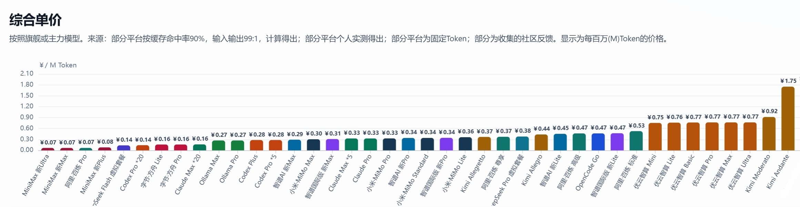

# 2026年8月24日 AI Coding Plan 与 API 平台对比：智谱 GLM-5.3、MiniMax、DeepSeek 视觉版和 OpenCode 调整后怎么选

> 更新时间：2026年8月24日  
> 数据来源：[https://vibecoding.dreamfree.space](https://vibecoding.dreamfree.space)  
> 本文比较面向 AI 编程的订阅套餐与按量 API。价格、在售状态和模型阵容变化很快，下单前仍应以平台结算页为准。

8 月下旬这轮变化，不只是某个平台又加了一个模型。智谱把 GLM-5.3 纳入新套餐，DeepSeek 同时调整了峰谷价格并推出视觉实验版，OpenCode 的模型池和套餐展示也发生变化。与此同时，Kimi 仍无法新订阅、Ollama Max 仍停售，阿里百炼的 Coding Plan 仍然很难抢。

如果只想先看结论：国内用户优先从智谱、MiniMax和字节方舟里选稳定可买的订阅，重视透明倍率时再补看优云智算；想用多家模型，可重点看 OpenCode；只在业务程序里调用模型，则直接比较 DeepSeek 等 API 的输入、输出价格；有境外支付方式和相应网络条件，再考虑 Codex、Claude Code 与 Ollama。

单看模型能力，GLM-5.3、Kimi-K3、Codex 使用的 GPT-5.6，以及 Claude Code 对应的 Claude 系列，都属于当前代码与 Agent 能力最强的一批模型。它们之间更实际的差异，主要落在可购买状态、额度、支付与网络门槛上。

本期最值得注意的变化有六项：

- 智谱新套餐已全面支持 GLM-5.3，国内 Lite、Pro、Max 分别为 118 元、538 元和 1078 元。
- DeepSeek 自 8 月 17 日启用峰谷计费，V4 Flash、V4 Pro 在不同时段价格不同。
- DeepSeek-V4-Flash-Vision-Exp 于 8 月 21 日上线，开始支持视觉输入，但仍是实验版本。
- OpenCode Go 当前结算页显示首期约 5 美元、续费 10 美元；这更适合视为当前结算优惠，而不是长期固定价。
- 共绩算力已下架 DeepSeek V4 Pro、V4 Flash 正式版，目前只剩预览版，不应再按旧价表推荐正式版。
- Kimi 仍不能新订阅；字节方舟已不限购；阿里百炼 Token Plan 不限购，但 Coding Plan 仍限量且放量较少。

## 一、先分清两种计费方式

市场上的产品名称很多，但真正影响选择的只有两类。

| 类型 | 常见产品 | 怎么收费 | 更适合谁 |
|---|---|---|---|
| 订阅套餐 | Coding Plan、Token Plan、OpenCode Go | 按月付费，通常附带 5 小时、每周或每月用量上限 | 高频使用 Claude Code、OpenCode、Cline、Roo Code 等编程工具的个人开发者 |
| 按量 API | DeepSeek API、OpenCode Zen、共绩算力等 | 按实际输入、缓存命中和输出 Token 结算 | 要接入自己程序、团队网关，或使用频率不稳定的用户 |

订阅套餐的优势是预算容易控制，但“每月多少 Token”通常只是依据平台限额和典型消耗得到的估算，并不等于硬性承诺。按量 API 则更透明，不过输出 Token 往往明显贵于输入 Token，复杂 Agent 任务也可能因为多轮调用迅速放大成本。

因此，不要只比较月费。还应同时看模型是否适合自己的工具、5 小时和每周限制、是否能够正常购买，以及平台是否会频繁调整模型倍率。

### 主要平台与套餐总表

下面这张表先把主流档位放在一起。月 Token 是便于横向比较的参考估算，不是平台承诺；OpenCode、DeepSeek 和共绩算力的可用量随模型或实际调用变化，因此不强行换算成一个固定月上限。

| 平台 | 套餐 | 类型 | 月费 / 计费方式 | 参考月 Token | 当前购买状态 |
|---|---|---|---:|---:|---|
| [智谱 AI](https://api.dreamfree.space/c/s/cpyqzhipu) | 新 Lite | 订阅 | ¥118 | 260M | 可购买 |
| [智谱 AI](https://api.dreamfree.space/c/s/cpyqzhipu) | 新 Pro | 订阅 | ¥538 | 1580M | 可购买 |
| [智谱 AI](https://api.dreamfree.space/c/s/cpyqzhipu) | 新 Max | 订阅 | ¥1078 | 3680M | 可购买 |
| [OpenCode](https://api.dreamfree.space/c/s/cpyqopencode) | Go | 订阅 | 当前首期约 \$5，之后 \$10/月 | 按模型差异较大 | 可购买 |
| [MiniMax](https://api.dreamfree.space/c/s/cpyqminimax) | Plus | 订阅 | ¥49 | 600M | 可购买 |
| [MiniMax](https://api.dreamfree.space/c/s/cpyqminimax) | Max | 订阅 | ¥119 | 1800M | 可购买 |
| [MiniMax](https://api.dreamfree.space/c/s/cpyqminimax) | Ultra | 订阅 | ¥469 | 7100M | 可购买 |
| [Kimi](https://api.dreamfree.space/c/s/cpyqkimi) | Andante / Moderato | 订阅 | ¥49 / ¥99 | 28M / 108M | 不能新订阅 |
| [Kimi](https://api.dreamfree.space/c/s/cpyqkimi) | Allegretto / Allegro | 订阅 | ¥199 / ¥699 | 540M / 1600M | 不能新订阅 |
| [字节方舟](https://api.dreamfree.space/c/s/cpyqfangzhou) | Coding Plan Lite / Pro | 订阅 | ¥40 / ¥200 | 按模型倍率折算 | 可购买 |
| [字节方舟](https://api.dreamfree.space/c/s/cpyqfangzhou) | Token Plan Small / Medium / Large / Max | 订阅 | ¥40 / ¥200 / ¥500 / ¥1000 | 按套餐额度 | 可购买 |
| [优云智算](https://api.dreamfree.space/c/s/cpyqyyzs) | Mini / Lite / Basic | 订阅 | ¥49 / ¥99 / ¥199 | 65M / 130M / 260M | 可购买 |
| [优云智算](https://api.dreamfree.space/c/s/cpyqyyzs) | Pro / Max / Ultra | 订阅 | ¥499 / ¥799 / ¥999 | 650M / 1040M / 1300M | 可购买 |
| [DeepSeek](https://api.dreamfree.space/c/s/cpyqdeepseek) | V4 Flash / V4 Pro / Vision Exp | API 按量 | 峰谷计价 | 随实际调用 | 可使用 |
| [Codex](https://api.dreamfree.space/c/s/cpyqchatgpt) | Plus / Pro×5 / Pro×20 | 订阅 | \$20 / \$100 / \$200 | 按档位倍率 | 需境外条件 |
| [Claude Code](https://api.dreamfree.space/c/s/cpyqclaudeup) | Pro / Max×5 / Max×20 | 订阅 | \$20 / \$100 / \$200 | 按档位倍率 | 需境外条件 |
| [Ollama](https://api.dreamfree.space/c/s/cpyqollama) | Pro | 订阅 | \$20 | 按套餐额度 | 可购买，需境外支付 |
| [Ollama](https://api.dreamfree.space/c/s/cpyqollama) | Max | 订阅 | \$100 | 按套餐额度 | 仍停售 |
| [阿里百炼](https://api.dreamfree.space/c/s/cpyqbailianc) | Coding Plan Pro | 订阅 | ¥200 | 3000M | 限购、放量少 |
| [阿里百炼](https://api.dreamfree.space/c/s/cpyqbailianc) | Token Plan 标准 / 高级 / 尊享 | 订阅 | ¥198 / ¥698 / ¥1398 | 375M / 1500M / 3750M | 不限购 |
| [小米 MiMo](https://api.dreamfree.space/c/s/cpyqmimo) | Lite / Standard / Pro / Max | 订阅 | ¥39 / ¥99 / ¥329 / ¥659 | 108M / 290M / 1002M / 2162M | 下单前确认 |
| [共绩算力](https://api.dreamfree.space/c/s/cpyqgongji) | V4 Pro / V4 Flash 预览版等 | API 按量 | 按实际调用 | 随实际调用 | 正式版已下架 |

## 二、平台与套餐逐一对比

| 平台 | 评分 | 一句话特点 |
|---|---|---|
| [智谱 AI](https://api.dreamfree.space/c/s/cpyqzhipu) | ★★★★☆ | GLM-5.3 模型强，但套餐额度偏少 |
| [OpenCode](https://api.dreamfree.space/c/s/cpyqopencode) | ★★★★★ | 一个订阅切换多家模型，适合混合使用 |
| [MiniMax](https://api.dreamfree.space/c/s/cpyqminimax) | ★★★★★ | 入门价格低，Token 额度充足 |
| [Kimi](https://api.dreamfree.space/c/s/cpyqkimi) | ★★★★☆ | Kimi-K3 能力强，但当前不能新订阅 |
| [字节方舟](https://api.dreamfree.space/c/s/cpyqfangzhou) | ★★★★★ | 国内多模型平台，Coding Plan 与 Token Plan 均可购买 |
| [优云智算](https://api.dreamfree.space/c/s/cpyqyyzs) | ★★★★☆ | 套餐档位完整，模型倍率相对透明 |
| [DeepSeek](https://api.dreamfree.space/c/s/cpyqdeepseek) | ★★★★★ | 官方 API 峰谷计费，并提供视觉实验版 |
| [Codex](https://api.dreamfree.space/c/s/cpyqchatgpt) | ★★★★★ | GPT-5.6 与原生代码 Agent，境外使用门槛较高 |
| [Claude Code](https://api.dreamfree.space/c/s/cpyqclaudeup) | ★★★★☆ | 长任务和大型代码库能力强，账号风险需注意 |
| [Ollama](https://api.dreamfree.space/c/s/cpyqollama) | ★★★★☆ | 本地与云端模型统一入口，Max 仍停售 |
| [阿里百炼](https://api.dreamfree.space/c/s/cpyqbailianc) | ★★★★☆ | Token Plan 不限购，Coding Plan 仍较难买 |

> 平台格局与主要特点可通过图片快速浏览；图中平台卡片不作为当前价格、模型和购买状态的依据，相关信息以本文表格及平台结算页为准。
>
> 图片来源：[Vibe Coding 套餐对比](https://vibecoding.dreamfree.space)

> **综合价格口径**：订阅套餐按“月费 ÷ 参考月 Token”计算；美元套餐按本期结算页汇率 `1 USD = 6.9916 CNY` 换算。API 按总 Token 中输出占 0.5%、输入占 99.5%计算，输入部分再按 95%缓存命中、5%未命中加权，即：`99.5% ×（95% × 缓存命中输入价 + 5% × 未命中输入价）+ 0.5% × 输出价`。结果统一为元/M Tokens，四舍五入保留两位小数。

### [1. 智谱 AI：GLM-5.3 新套餐已经落地](https://api.dreamfree.space/c/s/cpyqzhipu)

跳转入口 ➡️ [智谱 GLM Coding Plan](https://api.dreamfree.space/c/s/cpyqzhipu)

**综合评分**：★★★★☆  
**购买状态**：新套餐可直接购买，无需抢购。  
**计费方式**：订阅，采用积分额度，并同时受 5 小时和每周限额约束。

智谱的特点很鲜明：**模型好，但额度偏少**。新一代 Coding Plan 已全面支持 GLM-5.3，模型能力是它最重要的购买理由；与 MiniMax 等大额度方案相比，同价位可用量不占优势。

**核心优势**：

- GLM-5.3 是智谱当前旗舰文本模型，处于当前代码模型第一梯队，也是目前最强的国产代码模型之一。
- 100 万上下文、最高 12.8 万输出，支持 low、high、max 三档思考强度。
- 国内付款和使用路径相对直接，新套餐当前不需要抢购。

**国内套餐价格**：

| 套餐 | 月费 | 参考月 Token | 综合价格（元/M Tokens） | 额度机制 |
|---|---:|---:|---:|---|
| 新 Lite | ¥118 | 260M | 0.45 | 5 小时 + 每周积分上限 |
| 新 Pro | ¥538 | 1580M | 0.34 | 5 小时 + 每周积分上限 |
| 新 Max | ¥1078 | 3680M | 0.29 | 5 小时 + 每周积分上限 |

国际版对应为 \$18、\$80 和 \$168。国内外档位都应结合自己的支付方式和实际使用路径选择，不必只按汇率机械换算。

GLM-5.3 是文本模型，提供 100 万上下文、最高 12.8 万输出，默认持续思考，并提供 low、high、max 三档思考强度。它适合长代码库理解、复杂修改和需要较长输出的任务，但不能把“长上下文”直接等同于每次任务都会完整塞入 100 万 Token。

**不足**：同价位额度偏少，高强度 Agent、多轮长上下文任务更容易碰到周期限额。  
**适用人群**：更看重 GLM-5.3 代码质量和长上下文能力，而不是单纯追求最大 Token 数的开发者。

### [2. OpenCode：一个订阅覆盖多家模型](https://api.dreamfree.space/c/s/cpyqopencode)

跳转入口 ➡️ [OpenCode Go / Zen](https://api.dreamfree.space/c/s/cpyqopencode)

**综合评分**：★★★★★  
**购买状态**：Go 可订阅，Zen 可按量使用。  
**计费方式**：Go 是订阅；Zen 是 API 按量，二者不要混为同一个套餐。

OpenCode 的核心价值不是单个模型最低价，而是可以在同一个工具和账户里切换多家模型。Go 套餐长期标价为每月 10 美元；当前结算页显示首期约 34.96 元、下期约 69.92 元，折合首期约 5 美元、续费约 10 美元。首期价格可能随结算活动变化，不宜当作永久承诺。

**Go 套餐**：

| 套餐 | 当前首期 | 后续月费 | 5 小时 Usage | 每周 Usage | 每月 Usage | 综合价格（元/M Tokens） |
|---|---:|---:|---:|---:|---:|---|
| Go | 约 ¥34.96（\$5） | 约 ¥69.92（\$10） | \$12 | \$30 | \$60 | 按模型变化，无法统一换算 |

这里的 Usage 是订阅内的模型使用额度，不是月费之外继续扣款。

**核心优势**：

- 一个账户覆盖国产与国际模型，适合按任务切换模型。
- 当前同时提供高质量复杂任务模型、低成本高频模型和视觉实验模型。
- Go 额度耗尽后仍可关注免费模型；Zen 则适合低频或不固定用量。

当前模型池包括 GLM-5.3、GPT-5.6 Luna、Kimi K3、DeepSeek V4 Pro、V4 Flash、V4 Flash Vision Exp、MiMo V2.5 和 Ox Alpha Free 等。套餐用量同时设有 5 小时 12 美元、每周 30 美元、每月 60 美元的使用上限；这些“美元用量”是平台计量额度，不是订阅费之外再扣一笔钱。

**不同模型的典型月用量**：

| 模型 | 月 Usage | 典型月请求数 | 更适合的任务 |
|---|---:|---:|---|
| GPT 5.6 Luna | \$15 | 约 10,250 次 | 复杂代码与综合任务 |
| DeepSeek V4 Pro | \$15 | 约 5,200 次 | 质量优先的复杂任务 |
| DeepSeek V4 Flash | \$30 | 约 37,800 次 | 低成本、大量文本调用 |
| DeepSeek V4 Flash Vision Exp | \$15 | 约 18,900 次 | 截图、界面和视觉 Agent 尝试 |
| MiMo-V2.5 | \$60 | 约 150,400 次 | 高频低成本调用 |
| GLM-5.3 | \$15 | 约 1,080 次 | 高质量代码任务，额度明显较少 |

实际消耗会随上下文、输出长度和 Agent 调用次数变化，典型请求数不是保证值。

如果不想订阅，OpenCode Zen 还提供按量模式。免费列表目前包括 MiMo-V2.5 Free 和 Ox Alpha Free；Ox Alpha 是匿名模型，尚不能证实就是 GLM，因此不建议按传言给它贴具体厂商标签。旧的 DeepSeek 免费入口也不再适合作为推荐理由。

**不足**：Go 只有一个订阅档位，高消耗模型会更快触发周限额；模型很多，也增加了选错模型和用量规划的难度。  
**适用人群**：希望一个入口切换多家模型、又愿意按任务管理模型消耗的个人开发者。

### [3. MiniMax：低门槛、高额度仍然突出](https://api.dreamfree.space/c/s/cpyqminimax)

跳转入口 ➡️ [MiniMax Token Plan](https://api.dreamfree.space/c/s/cpyqminimax)

**综合评分**：★★★★★  
**购买状态**：公开档位可正常购买。  
**计费方式**：订阅。

**核心优势**：

- 49 元即可进入，三档套餐的 Token 池都比较宽裕。
- 支持 M3、M2.7、M2.5，M3 具备多模态能力。
- 适合高频补全、批量生成和 Agent 工作流，不需要为了限购等待。

**套餐价格**：

| 套餐 | 月费 | 参考月 Token | 综合价格（元/M Tokens） | 适合场景 |
|---|---:|---:|---:|---|
| Plus | ¥49 | 600M | 0.08 | 日常编程与轻量 Agent |
| Max | ¥119 | 1800M | 0.07 | 高频开发与多模态任务 |
| Ultra | ¥469 | 7100M | 0.07 | 重度、长时间使用 |

它的优势是入门价低、额度相对宽裕，适合高频补全、批量生成和中等复杂度的 Agent 任务。需要注意的是，估算 Token 不能与其他平台简单一比一兑换：模型倍率、上下文长度和工具调用方式都会改变真实可用次数。当前套餐可正常购买，无需为限购焦虑。

**不足**：总 Token 多不代表所有模型都以相同倍率消耗，复杂代码质量也需要结合实际项目验证。  
**适用人群**：预算有限但使用频率高，希望用一个国产订阅支撑大量日常任务的开发者。

### [4. Kimi：K3 有吸引力，但仍不能新订阅](https://api.dreamfree.space/c/s/cpyqkimi)

跳转入口 ➡️ [Kimi Code](https://api.dreamfree.space/c/s/cpyqkimi)

**综合评分**：★★★★☆  
**购买状态**：当前仍不能新订阅。  
**计费方式**：订阅。

**核心优势**：

- 原生支持 Kimi-K3；Kimi-K3 处于当前代码模型第一梯队，也是目前综合能力最强的代码模型之一。
- 套餐从 49 元到 699 元，覆盖轻度到重度使用。
- 已有订阅资格的用户可以继续在原生环境使用。

**套餐价格**：

| 套餐 | 月费 | 参考月 Token | 综合价格（元/M Tokens） | 购买状态 |
|---|---:|---:|---:|---|
| Andante | ¥49 | 28M | 1.75 | 不能新订阅 |
| Moderato | ¥99 | 108M | 0.92 | 不能新订阅 |
| Allegretto | ¥199 | 540M | 0.37 | 不能新订阅 |
| Allegro | ¥699 | 1600M | 0.44 | 不能新订阅 |

问题不在纸面套餐，而在购买状态：截至本期，Kimi 仍不能新订阅。已有资格的用户可以继续评估 K3 的代码和长上下文表现；新用户则不应把它当作立即可买的主方案，应准备 MiniMax、智谱或字节方舟作为替代。

**不足**：新用户当前买不到，低档位参考用量也不占优势。  
**适用人群**：已有会员资格、明确偏好 Kimi-K3 的用户。

### [5. 字节方舟：Coding Plan 与 Token Plan 都已不限购](https://api.dreamfree.space/c/s/cpyqfangzhou)

跳转入口 ➡️ [字节方舟 Coding Plan / Token Plan](https://api.dreamfree.space/c/s/cpyqfangzhou)

**综合评分**：★★★★★  
**购买状态**：Coding Plan 与 Token Plan 均已不限购。  
**计费方式**：订阅。

**核心优势**：

- 同时覆盖 GLM-5.3、DeepSeek V4、MiniMax M3 和 Kimi 系列。
- Coding Plan 适合现成编程工具，Token Plan 适合更稳定的 Token 预算。
- 当前开放购买，不需要等待放量。

**Coding Plan**：

| 套餐 | 月费 | 参考月 Token | 综合价格（元/M Tokens） | 适合场景 |
|---|---:|---:|---:|---|
| Lite | ¥40 | 250M | 0.16 | 低成本体验多模型 |
| Pro | ¥200 | 1249M | 0.16 | 高频使用、多模型切换 |

**Token Plan**：

| 套餐 | 月费 | 综合价格（元/M Tokens） | 套餐定位 |
|---|---:|---|---|
| Small | ¥40 | 暂无统一用量口径 | 轻量 Token 预算 |
| Medium | ¥200 | 暂无统一用量口径 | 日常开发主力 |
| Large | ¥500 | 暂无统一用量口径 | 高频或团队使用 |
| Max | ¥1000 | 暂无统一用量口径 | 大用量需求 |

平台覆盖 GLM-5.3、DeepSeek V4、MiniMax M3 和 Kimi 系列，适合希望在国内平台统一调用多家模型的用户。当前已经不限购，选择时应回到模型覆盖、倍率和额度本身，不必为了短期购买资格抢单。Coding Plan 更适合现成编程工具，Token Plan 更适合需要稳定 Token 预算或团队接入的用户。

**不足**：模型池越多，倍率和实际用量差异越需要提前看清；同一月费在不同模型上的可用次数可能差很多。  
**适用人群**：希望国内付款、同时切换多家主流模型的个人或团队。

### [6. 优云智算：档位完整，倍率相对透明](https://api.dreamfree.space/c/s/cpyqyyzs)

跳转入口 ➡️ [优云智算 Coding Plan](https://api.dreamfree.space/c/s/cpyqyyzs)

**综合评分**：★★★★☆  
**购买状态**：当前可购买。  
**计费方式**：订阅。

**核心优势**：

- 从 49 元到 999 元共六档，预算跨度完整。
- 模型倍率公开程度较高，方便估算实际消耗。
- 全档支持 DeepSeek V4 Flash 正式版和 GLM-5.2。

**套餐价格**：

| 套餐 | 月费 | 参考月 Token | 综合价格（元/M Tokens） |
|---|---:|---:|---:|
| Mini | ¥49 | 65M | 0.75 |
| Lite | ¥99 | 130M | 0.76 |
| Basic | ¥199 | 260M | 0.77 |
| Pro | ¥499 | 650M | 0.77 |
| Max | ¥799 | 1040M | 0.77 |
| Ultra | ¥999 | 1300M | 0.77 |

它的特点是档位跨度大、模型倍率展示较透明，所有套餐支持 DeepSeek V4 Flash 正式版和 GLM-5.2。对于希望按预算逐级扩容、又在意用量可解释性的用户，这种设计比只给一个模糊“请求次数”更容易规划。最终仍应以结算页显示的当期模型和倍率为准。

**不足**：同价位参考用量通常不如 MiniMax，优势主要在透明度和档位完整。  
**适用人群**：希望按预算逐级扩容，并重视模型倍率和消耗可解释性的开发者。

### [7. DeepSeek：峰谷价格与视觉实验版是本期重点](https://api.dreamfree.space/c/s/cpyqdeepseek)

跳转入口 ➡️ [DeepSeek API](https://api.dreamfree.space/c/s/cpyqdeepseek)

**综合评分**：★★★★★  
**购买状态**：API 可直接充值使用。  
**计费方式**：API 按量，无固定月费。

**核心优势**：

- 官方 API 直接提供 V4 Flash、V4 Pro 和视觉实验版。
- 输入、缓存命中和输出分别定价，成本结构清楚。
- 闲时价格为高峰的一半，适合可调度的批处理和自动化任务。

DeepSeek 更适合作为按量 API，而不是虚构成固定月费套餐。从 8 月 17 日起，V4 Flash 与 V4 Pro 按北京时间划分峰谷：工作日 9:00—12:00、14:00—18:00 为高峰，其余时段为低峰。

| 模型与时段 | 缓存命中输入 | 未命中输入 | 输出 | 综合价格（元/M Tokens） |
|---|---:|---:|---:|---:|
| V4 Flash / Vision Exp 低峰 | 0.05 元/百万 Token | 1.5 元/百万 Token | 4.5 元/百万 Token | 0.14 |
| V4 Flash / Vision Exp 高峰 | 0.10 元/百万 Token | 3 元/百万 Token | 9 元/百万 Token | 0.29 |
| V4 Pro 低峰 | 0.15 元/百万 Token | 4.5 元/百万 Token | 13.5 元/百万 Token | 0.43 |
| V4 Pro 高峰 | 0.30 元/百万 Token | 9 元/百万 Token | 27 元/百万 Token | 0.87 |

8 月 21 日上线的视觉实验版全名为 DeepSeek-V4-Flash-Vision-Exp，API 标识为 `deepseek-v4-flash-vision-exp`。官方口径是纯文本能力与 V4 Flash 正式版一致，同时增加图片输入；图片输入最多按 384 Token 处理。它适合低成本尝试截图、界面和图表理解，但“Exp”意味着仍应先做兼容性和稳定性测试，再用于重要生产链路。

**不足**：账单随调用量波动，输出较多、缓存命中率低或在高峰运行时，成本会明显上升；视觉版仍是实验模型。  
**适用人群**：用量波动大、能够管理缓存和任务调度，或需要低成本尝试视觉输入的个人和团队。

### [8. Codex：能力强，但使用门槛不只在价格](https://api.dreamfree.space/c/s/cpyqchatgpt)

跳转入口 ➡️ [Codex](https://api.dreamfree.space/c/s/cpyqchatgpt)

**综合评分**：★★★★★  
**购买状态**：订阅档位可购买。  
**使用门槛**：需要境外支付方式和相应网络条件。  
**计费方式**：订阅。

**核心优势**：

- OpenAI 原生代码 Agent 生态，覆盖代码阅读、编辑、终端和多步骤任务。
- 可使用 GPT-5.6 等模型；GPT-5.6 属于当前综合代码能力最强的一批模型，适合复杂工程协作。
- 三档额度覆盖个人体验到重度使用。

**订阅价格**：

| 套餐 | 月费 | 参考月 Token | 综合价格（元/M Tokens） | 套餐定位 |
|---|---:|---:|---:|---|
| Plus | \$20 | 480M | 0.29 | 基础使用 |
| Pro×5 | \$100 | 2400M | 0.29 | 5 倍额度 |
| Pro×20 | \$200 | 9600M | 0.15 | 20 倍额度 |

Codex 在代码理解、修改、终端协作和多步骤任务上有完整生态，适合对 Agent 工作流要求较高的开发者。

国内用户需要同时考虑境外支付方式和相应网络条件，不能只看美元价格。团队使用还应先确认账号、账单和数据管理要求。具备这些条件且重视综合能力时，Codex 值得优先体验；否则国内套餐往往更省心。

**不足**：支付和网络门槛会增加实际使用成本，美元订阅也需要考虑汇率。  
**适用人群**：已经具备境外支付方式和网络条件，重视 OpenAI 原生 Agent 能力的开发者与团队。

### [9. Claude Code：成熟的代码 Agent，账号风险需计入成本](https://api.dreamfree.space/c/s/cpyqclaudeup)

跳转入口 ➡️ [Claude Code](https://api.dreamfree.space/c/s/cpyqclaudeup)

**综合评分**：★★★★☆  
**购买状态**：订阅档位可购买。  
**使用门槛**：需要境外支付方式和相应网络条件。  
**计费方式**：订阅。

**核心优势**：

- Claude 系列属于当前代码与长任务能力最强的一批模型，原生代码 Agent 体验成熟，适合代码库阅读、规划、重构和长任务。
- 三档订阅结构直观，可以按使用强度升级。
- 对大型代码库和复杂系统修改有较完整的工作流。

**订阅价格**：

| 套餐 | 月费 | 参考月 Token | 综合价格（元/M Tokens） | 套餐定位 |
|---|---:|---:|---:|---|
| Pro | \$20 | 416M | 0.34 | 基础额度 |
| Max×5 | \$100 | 2080M | 0.34 | 5 倍额度 |
| Max×20 | \$200 | 8320M | 0.17 | 20 倍额度 |

Claude Code 在代码库阅读、规划和长任务执行方面有较成熟的体验，但国内用户也需要境外支付方式与相应网络条件。

此外，账号风控和封禁风险相对较高。这里的“成本”不只是订阅费，还包括账号连续性、支付稳定性和工作中断风险。适合已经具备稳定使用条件、并愿意为长任务体验付费的人；不适合作为无法接受账号中断用户的唯一方案。

**不足**：除支付和网络门槛外，还需要把账号风控、封禁和工作中断风险计入成本。  
**适用人群**：具备境外支付与网络条件，偏好 Claude 原生长任务体验，并有备用工作流的开发者。

### [10. Ollama：Pro 可买，Max 仍停售](https://api.dreamfree.space/c/s/cpyqollama)

跳转入口 ➡️ [Ollama](https://api.dreamfree.space/c/s/cpyqollama)

**综合评分**：★★★★☆  
**购买状态**：Pro 可买，Max 仍停售。  
**使用门槛**：付费订阅需要境外支付方式。  
**计费方式**：订阅，也可免费使用本地运行方式。

**核心优势**：

- 本地与云端模型可以放在同一套 Ollama 工具链中管理。
- 适合已经围绕 Ollama 搭建开发环境的用户。
- 只使用本地开源模型时，不一定需要购买订阅。

**会员价格**：

| 套餐 | 月费 | 参考月 Token | 综合价格（元/M Tokens） | 当前状态 |
|---|---:|---:|---:|---|
| Pro | \$20 | 500M | 0.28 | 可购买 |
| Max | \$100 | 2500M | 0.28 | 仍停售 |

Ollama Pro 适合已经使用 Ollama 工具链、希望在本地与云端模型之间切换的用户。它的吸引力在于统一入口和模型聚合，而不是所有模型都绝对便宜。

每月 100 美元的 Max 仍处于停售状态，因此不要按旧套餐表把它列为可购买选项。选择 Ollama 前还要确认目标模型的实际可用性、区域与支付条件；只需要本地开源模型时，也可以先使用免费的本地运行方式，不必为了品牌入口订阅。

**不足**：Max 当前买不到，付费版也不是所有模型的最低成本入口。  
**适用人群**：已经使用 Ollama、本地和云端模型都需要统一管理，并具备境外支付方式的用户。

### [11. 阿里百炼：Coding Plan 难抢，Token Plan 更现实](https://api.dreamfree.space/c/s/cpyqbailianc)

跳转入口 ➡️ [阿里百炼](https://api.dreamfree.space/c/s/cpyqbailianc)

**综合评分**：★★★★☆  
**购买状态**：Coding Plan 限购且放量少；Token Plan 不限购。  
**计费方式**：订阅。

**核心优势**：

- Token Plan 可使用 Qwen 3.8 Max，适合通义和阿里云生态用户。
- Token Plan 三档均不限购，比等待 Coding Plan 更确定。
- 企业控制台、模型接入和预算管理可以放在同一生态内完成。

**Coding Plan**：

| 套餐 | 月费 | 参考月 Token | 综合价格（元/M Tokens） | 当前状态 |
|---|---:|---:|---:|---|
| Pro | ¥200 | 3000M | 0.07 | 限购、放量很少 |

**Token Plan**：

| 套餐 | 月费 | 参考月 Token | 综合价格（元/M Tokens） | 当前状态 |
|---|---:|---:|---:|---|
| 标准 | ¥198 | 375M | 0.53 | 不限购 |
| 高级 | ¥698 | 1500M | 0.47 | 不限购 |
| 尊享 | ¥1398 | 3750M | 0.37 | 不限购 |

阿里百炼 Coding Plan Pro 仍然限购，而且放量很少。对新用户来说，它不是一个能随时下单的确定选项。

Token Plan 的 Standard、Advanced、Premium 分别为 198 元、698 元和 1398 元，目前不限购，并可使用 Qwen 3.8 Max。若目标是阿里模型生态、企业控制台和稳定 Token 预算，Token Plan 比等待 Coding Plan 更现实；若只是个人轻量编程，则需要比较最低档实际额度与其他 40—118 元入门方案的差距。

**不足**：Coding Plan 购买不确定；Token Plan 入门价接近 200 元，对轻量个人用户不算低。  
**适用人群**：主要使用 Qwen、已经在阿里云生态内，或需要企业化控制台的用户。

### [补充一：共绩算力——按量付费，但旧价表已经失效](https://api.dreamfree.space/c/s/cpyqgongji)

跳转入口 ➡️ [共绩算力](https://api.dreamfree.space/c/s/cpyqgongji)

**综合评分**：★★★☆☆  
**购买状态**：按量充值，无订阅费。  
**计费方式**：API 按量。

| 当前模型状态 | 是否可用 | 综合价格（元/M Tokens） | 说明 |
|---|---|---|---|
| DeepSeek V4 Pro 正式版 | 否 | 不计算 | 已下架 |
| DeepSeek V4 Flash 正式版 | 否 | 不计算 | 已下架 |
| V4 Pro / V4 Flash 预览版 | 是 | 当前价格未确认 | 具体模型名和价格以控制台为准 |

**核心优势**：没有固定月费，适合不想绑定订阅、用量不稳定的用户。

公开价格页面仍可能残留旧的正式版信息，因此本期不引用其旧价格，也不编造预览版 API 标识。只有在控制台确认当前模型名和价格后，才适合用于新项目。

**不足**：正式版已下架，公开页和控制台状态可能不同，不能直接沿用旧价表。  
**适用人群**：愿意先核对控制台、只把预览版作为补充测试通道的按量用户。

### [补充二：小米 MiMo——额度高，但先确认当期购买页](https://api.dreamfree.space/c/s/cpyqmimo)

跳转入口 ➡️ [小米 MiMo](https://api.dreamfree.space/c/s/cpyqmimo)

**综合评分**：★★★★☆  
**购买状态**：本期下单前需确认当期购买页。  
**计费方式**：订阅。

**核心优势**：同价位参考 Token 较多，没有固定 5 小时窗口时，更适合集中跑大量任务。

**套餐价格**：

| 套餐 | 月费 | 参考月 Token | 综合价格（元/M Tokens） | 适合场景 |
|---|---:|---:|---:|---|
| Lite | ¥39 | 108M | 0.36 | 轻量体验 |
| Standard | ¥99 | 290M | 0.34 | 日常开发 |
| Pro | ¥329 | 1002M | 0.33 | 高频 Agent |
| Max | ¥659 | 2162M | 0.30 | 大量集中调用 |

MiMo 适合作为高额度补充选项，但本期没有把购买状态作为已确认事实；准备下单时应直接检查当前结算页。

**不足**：本期购买状态未作为已确认事实，不能只看套餐数字就直接下单。  
**适用人群**：Token 消耗较大、愿意在购买前核对当前结算页的开发者。

## 三、价格与用量横向看

> 这张图用于快速理解价格与用量的比较方式；图内单价采用图片中标注的计算假设，本文表格则统一按 95% 缓存命中率、0.5% 输出占比重新计算，具体套餐、价格和购买状态以本文表格及平台结算页为准。
>
> 图片来源：[Vibe Coding 套餐对比](https://vibecoding.dreamfree.space)

把常见入门档放在一起，最便宜不一定最适合：

| 需求 | 优先观察 | 关键判断 |
|---|---|---|
| 40—50 元入门 | 字节方舟、MiniMax、MiMo | 目标模型是否可用，额度是否按高倍率消耗 |
| 100—120 元主力订阅 | 智谱 Lite、MiniMax Max、优云智算 Lite | 更看重单模型能力还是总调用量 |
| 多模型切换 | OpenCode Go、字节方舟 | 模型池、每周上限和单模型消耗差异 |
| 高强度国产模型 | 智谱 Pro/Max、MiniMax Ultra、优云智算高档 | 先用低档验证工作流，再决定是否升级 |
| 自建程序或团队网关 | DeepSeek API、OpenCode Zen | 输入输出比例、缓存命中率和峰谷调度 |
| 国际一线 Agent | Codex、Claude Code | 境外支付、网络、账号稳定性和美元预算 |

如果任务可以延迟，DeepSeek 低峰价只有高峰的一半，批处理和自动化任务应优先调度到低峰。若任务大量输出代码，不能只盯着缓存输入价，因为输出往往才是主要成本。订阅用户则应先用一周记录真实请求量，再根据触发的 5 小时和周限制判断是否升档。

## 四、按使用场景给出选择顺序

### 想要一个省心的国产主力套餐

先看[智谱 AI](https://api.dreamfree.space/c/s/cpyqzhipu)，再比较[MiniMax](https://api.dreamfree.space/c/s/cpyqminimax)、[字节方舟](https://api.dreamfree.space/c/s/cpyqfangzhou)和[优云智算](https://api.dreamfree.space/c/s/cpyqyyzs)。智谱偏最新旗舰模型与长上下文，MiniMax 偏低价高额度，方舟偏多模型，优云智算偏档位和倍率透明。

### 想用一个入口切换多家模型

优先看[OpenCode](https://api.dreamfree.space/c/s/cpyqopencode)。它的优势是模型组合，不是每个模型都最低价。购买后应观察一周的模型级用量，避免高消耗模型快速触发周限额。

### 只想按量调用，成本越透明越好

优先使用[DeepSeek API](https://api.dreamfree.space/c/s/cpyqdeepseek)，并尽量利用低峰时段和缓存。共绩算力可作为补充，但当前正式版已下架，必须先在控制台确认预览版名称和价格。

### 有境外支付方式和网络条件

在境外支付方式和网络条件都具备时，再按工作流选择[Codex](https://api.dreamfree.space/c/s/cpyqchatgpt)或[Claude Code](https://api.dreamfree.space/c/s/cpyqclaudeup)。如果账号连续性是刚需，不要只准备一个国际平台，应同时保留国内模型作为备用。

## 五、结论

2026 年 8 月下旬，选择 AI 编程套餐的关键已经从“谁家有模型”变成“谁家能稳定买、模型倍率是否清楚、额度是否适合自己的 Agent 工作流”。

对大多数国内个人开发者，推荐顺序是：先从智谱、OpenCode、MiniMax 中找主方案，再根据 Kimi 的购买状态、字节方舟的多模型能力和 DeepSeek 的按量价格补足需求；优云智算更适合作为重视透明倍率时的补充选择。具备境外条件后，再把 Codex、Claude Code、Ollama 纳入比较；阿里百炼则优先看不限购的 Token Plan。

最稳妥的购买方法不是直接上最高档，而是先用最低可用档跑一周真实项目，记录模型、请求次数、上下文长度和限额触发情况，再决定升级或分流。这样比只看宣传页上的 Token 总量更接近真实成本。

套餐与价格的持续更新可查看：[https://vibecoding.dreamfree.space](https://vibecoding.dreamfree.space)。
