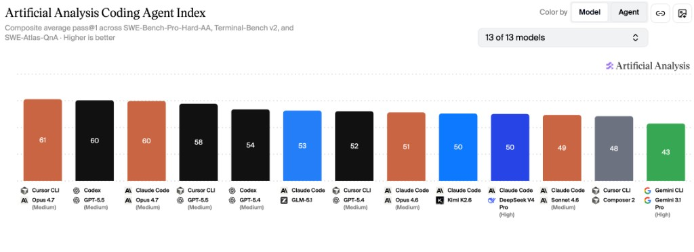

# 国产大模型核心能力评测：智谱、DeepSeek、MiniMax、Kimi、千问 Qwen、小米 MiMo
基于独立评测机构Artificial Analysis发布的最新AI模型基准测试结果，本文围绕**Agentic智能指数**与**Coding Agent指数**两大核心维度展开横向对比。这两项指标与日常代码开发需求和OpenClaw、Harness等通用Agent场景高度契合：
* Agentic能力直接决定模型自主规划复杂任务、调度外部工具、驱动自动化流程的水平
* Coding Agent能力则是评估模型代码生成、调试优化、代码库理解效率的核心依据。

从测试数据来看，国产头部大模型已全面跻身全球第一梯队，与OpenAI、Anthropic等海外厂商的顶尖产品差距显著缩小，且在性价比、国内生态适配性方面具备独特优势。

## 一、整体格局：国产第一梯队全面对标海外顶尖水平
### 1. Agentic智能指数（通用Agent核心指标）

[Artificial Analysis Agentic指数](https://artificialanalysis.ai/?intelligence=agentic-index&models=gpt-5-5%2Cgpt-5-5-pro%2Cmuse-spark%2Cgemini-3-1-pro-preview%2Cgemini-3-flash-reasoning%2Cclaude-opus-4-7%2Cclaude-sonnet-4-6-adaptive%2Cdeepseek-v4-flash%2Cdeepseek-v4-pro%2Cgrok-4-3%2Cminimax-m2-7%2Ckimi-k2-6%2Cmimo-v2-5-pro%2Cglm-5-1%2Cqwen3-6-max%2Cqwen3-6-plus%2Cgpt-5-4%2Cdeepseek-v3-2-reasoning#intelligence-tabs)

该指数综合GDPval-AA真实世界任务执行能力与τ²-Bench Telecom工具调用能力两大基准，量化评估模型自主完成多步骤复杂任务的表现，是衡量OpenClaw自动化运营潜力的核心标准。
- 全球头部阵营：GPT-5.5（74分）、Claude Opus 4.7（71分）占据前二
- 国产第一梯队（65分及以上）：**MiMo-V2.5-Pro、DeepSeek V4 Pro (Max)、GLM-5.1** 以67分并列全球第四，**Kimi K2.6（66分）、Qwen3.6 Max Preview（65分）** 紧随其后，与GPT-5.4的差距仅为1-3分。超过 Claude Sonnect 4.6。
- 国产第二梯队：Qwen3.6 Plus（62分）、MiniMax-M2.7（61分）、DeepSeek V4 Flash (Max)（61分）。与Claude Sonnect 4.6基本持平。

### 2. Coding Agent指数（代码核心指标）

[Artificial Analysis Coding Agent指数](https://artificialanalysis.ai/agents/coding-agents?coding-agents-performance-chart=index&agents=claude-code-opus-4-7-medium%2Cclaude-code-sonnet-4-6-medium%2Cclaude-code-deepseek-v4-pro-high%2Cclaude-code-glm-5-1%2Cclaude-code-kimi-k2-6%2Ccodex-gpt-5-5-medium%2Ccursor-cli-opus-4-7-medium%2Ccursor-cli-composer-2%2Ccursor-cli-gpt-5-5-medium%2Cgemini-cli-gemini-3-1-pro-high%2Cclaude-code-opus-4-6-medium%2Ccodex-gpt-5-4-medium%2Ccursor-cli-gpt-5-4-medium)

该指数整合SWE-Bench-Pro-Hard-AA代码生成修复、Terminal-Bench v2终端工具使用、SWE-Atlas-QnA代码库理解三大测试维度，全面评估模型端到端完成软件工程任务的能力。
- 全球头部阵营：Cursor CLI Opus 4.7（61分）、Codex GPT-5.5（60分）、Claude Code Opus 4.7（60分）位列前三
- 国产第一梯队：**GLM-5.1** 以53分排名全球第五，为国产模型首位。与GPT-5.4和Opus 4.6基本持平。
- 国产第二梯队：**Kimi K2.6、DeepSeek V4 Pro (High)** 以50分并列全球第七
- 注：本次编码代理指数共评测13款模型/代理组合，MiniMax、Qwen、MiMo对应版本未纳入本次评测范围。待Artificial Analysis更新评测结果后，将更新本文。

## 二、国产核心厂商模型深度解析
### 1. GLM-5.1（智谱AI）：编码能力领跑国产，综合实力均衡
作为国产编码能力的标杆，GLM-5.1在Claude Code框架下的代码生成、漏洞修复及大型代码库解读能力均领先其他国产模型，是技术开发场景的首选方案。其Agentic智能指数同样达到国产顶尖水平，能够同时支撑OpenClaw复杂流程的自主调度与底层工具的开发搭建。定价处于行业中等偏上水平，但如果能够购买Coding Plan个人使用，则依然划算，综合适配运营与开发双重核心需求。
缺点是算力瓶颈比较严重，Coding Plan需要抢购，很难买到。

### 2. MiniMax-M2.7（稀宇科技）：低幻觉高可靠，响应效率优异
MiniMax-M2.7的核心优势模型参数量比其他模型小，使得CodingPlan套餐最实惠、额度限制最小、倍率最高的。 极速版套餐模型输出Token速率高，很少出现429，可用性高于其他平台套餐。日常交互体验出色，适合作为OpenClaw等Agent场景中完成日常任务，作为辅助工具承担日常信息汇总、流程记录、常规咨询答疑等标准化任务。

### 3. DeepSeek（深度求索）：全梯度产品线覆盖，兼顾性能与成本
DeepSeek构建了完整的产品矩阵，能够满足不同层级的需求。旗舰款V4 Pro (Max)综合能力均衡，Agentic与编码能力均处于国产第一梯队，可胜任代码开发工作及OpenClaw核心复杂任务与调度；轻量款V4 Flash (Max)输出速度高达75 tokens/s，成本极低，适合高并发、低延迟的常规任务调度。
同时由于DeepSeek独特的缓存技术，使得缓存命中率高，缓存价格低，按用量计费首选。

### 4. Kimi K2.6（月之暗面）：长上下文能力突出，编码功底扎实
Kimi K2.6能力均衡，支持图像输入，模型代码能力优，较高强度的日常开发够用。购买CodingPlan送专属龙虾。 Allegretto` ￥199/月性价比高最高，适合作为代码开发场景主力使用。

### 5. Qwen（通义千问，阿里）：企业级生态完善，定制化能力强
Qwen3.6 Max Preview的Agentic表现优秀，指令遵循能力与多场景适配性突出。性价比款Qwen3.6 Plus则进一步降低了使用门槛，适合大规模日常应用。但目前只剩下Token Plan套餐，性价比较低，个人使用不推荐。

### 6. MiMo-V2.5-Pro（小米）：Agentic能力国产顶尖，性价比优势显著
MiMo-V2.5-Pro的Agentic智能指数与DeepSeek V4 Pro、GLM-5.1并列国产第一，在多工具协同调度、复杂自主流程执行方面表现接近GPT-5.4，是驱动OpenClaw全流程自动化的最优选择之一。

## 三、个人使用选型参考指南
结合代码开发需求及OpenClaw场景，可根据具体场景针对性选择：
- **复杂代码开发与生产级系统搭建**：首选GLM-5.1，其编码能力全面领先；Kimi K2.6与DeepSeek V4 Pro可作为备选，满足常规开发与调试需求。
- **OpenClaw核心与复杂任务**：优先选择GLM-5.1、DeepSeek V4 Pro、Kimi K2.6，三者Agentic能力均处于国产顶尖水平，能稳定支撑多工具协同与自主流程执行。
- **OpenClaw日常任务**：优先选择MiniMax-M2.7和DeepSeek V4 Flash，其流畅的响应和高用量限制，能够满足标准化的日常助力需求。
- **其他专业需求综合**：MiniMax-M2.7是理想选择，便宜的价格和全天候流畅的响应在使用感受上最好。
- **日常聊天**：其实推荐直接用豆包、千问，没必要自己搭建。
