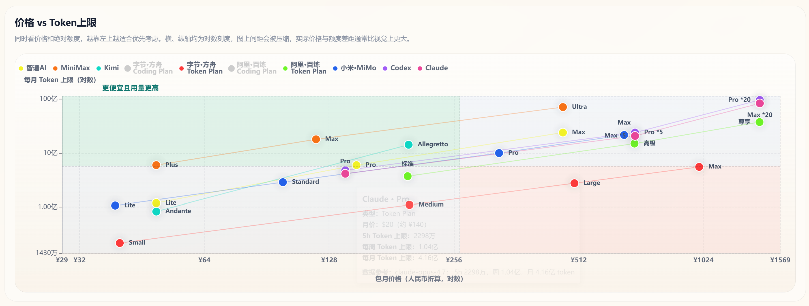

# 2026年6月主流Coding Plan平台全面对比｜MiniMax、Deepseek、Copilot、Mimo更新
> **更新日期 2026.6.3** 数据来源 [https://vibecoding.dreamfree.space](https://vibecoding.dreamfree.space)
> 
> 本次核心更新：MiniMax 上线 MiniMax-M3，并切换到 Plus、Max、Ultra 三档公开订阅；明确 M3 只有标准版，想要极速响应仍看 M2.7-highspeed；补充 Starter / Plus-极速 老用户保留档与 Max-极速 停售迁移说明；校正 GitHub Copilot、DeepSeek 等时效性表述

2026年6月初，AI编程订阅市场继续快速洗牌：阿里、字节、腾讯等头部厂商仍在用 Token Plan 替代传统 Coding Plan，MiniMax 也已把主力模型升级到 M3，并同步调整订阅套餐结构。对个人开发者来说，**现在很多所谓 Coding Plan 和 Token Plan 的边界其实已经越来越模糊**，不少套餐虽然名字不同，实际也都是按 token 消耗在记录和限制用量。与其只看它叫 Coding Plan 还是 Token Plan，不如直接进入平台，看套餐真实用量 ➡️[https://vibecoding.dreamfree.space](https://vibecoding.dreamfree.space)。对照本文整理的**实测可用量、价格和限制规则**一起看，判断哪个套餐更适合自己的使用频率和预算。本文梳理 25 大主流平台的核心差异，帮助你更快看清哪些套餐真正划算、哪些更适合日常开发。

## 一、三种常见计费方式
现在平台上的 AI 编程产品，最常见的其实已经不是简单的“二选一”，而是三种方式并存：
- **Coding Plan**：明面上按请求次数计用量，通常会搭配平台自己的可用量窗口来控制使用节奏。现在真实按照请求来计数的套餐几乎绝迹，几乎所有平台在套餐使用量中都计算了token消耗。截至6月初，智谱AI、字节·方舟、阿里·百炼三大头部平台均已限购，阿里更是仅保留高端Pro套餐且每日放量不固定。
- **Token Plan**：明确按照消耗 Token 量计用量，不同平台的倍率和限制规则差异比较大。有些平台的实际额度较高，有些和api计费几乎接近，所以需要看平台实际情况。
- **直接 API 按量计费**：不买订阅，直接按实际 token 消耗付费，**最适合低频使用、用量波动大、或者希望把成本精确控制住的用户**。仅推荐 DeepSeek、Mimo这种模型定价低、缓存命中率高、缓存免费或定价极低的平台，个人使用才合适。且同时具备灵活的特点，按需调用、用多少算多少，适合不想被套餐绑定的人。

### 1. 最新动态

近期行业动态丰富：

MiniMax 已上线 MiniMax-M3，并将公开订阅档位调整为 Plus、Max、Ultra 三档 Token Plan；需要注意的是，M3 只有标准版，没有 highspeed，想要 TPS 100 的极速响应仍要选择 M2.7-highspeed。
Starter 与 Plus-极速转为老用户保留档，Max-极速已停售并迁移至新版 Max。

DeepSeek作为行业"价格屠夫"，仍坚持纯按量计费模式，无任何订阅套餐，价格永久将为原本1/4。

小米MiMo于5月27日完成史上最大幅度降价，api价格调整为原本1/4，且Token Plan用量提升至原来的5-8倍。

GitHub Copilot 也已转向 Token 计费口径，用量大幅降低，不足之前十分之一。

字节方舟Coding Plan已于5月8日开始限购，腾讯云已全面下线Coding Plan，Coding Plan 正逐步成为稀缺资源。

### 2. 实际用量对比
以下为各平台主流套餐的Token用量对比，数据基于日常开发场景（缓存命中率90%、输入输出99:1）统计。Coding Plan显示实测月Token量，Token Plan显示官方月Token上限：

| 平台 | 套餐 | 类型 | 包月价格 | 实测5小时Token上限 | 月Token上限 |
|------|------|------|----------|--------------------|-------------|
| 智谱AI | Lite | Coding Plan | ¥49 | 6M | 120M |
| 智谱AI | Pro | Coding Plan | ¥149 | 30M | 600M |
| 智谱AI | Max | Coding Plan | ¥469 | 120M | 2400M |
| MiniMax | Starter（保留档） | Coding Plan | ¥29 | 24M | 960M |
| MiniMax | Plus | Token Plan | ¥49 | - | 600M |
| MiniMax | Max | Token Plan | ¥119 | - | 1800M |
| MiniMax | Ultra | Token Plan | ¥469 | - | 7100M |
| MiniMax | Plus-极速（保留档） | Coding Plan | ¥98 | 60M | 2400M |
| MiniMax | Max-极速（停售迁移） | Coding Plan | ¥199 | 180M | 7200M |
| 讯飞·星火 | 专业版 | Coding Plan | ¥39 | - | - |
| 讯飞·星火 | 高效版 | Coding Plan | ¥199 | - | - |
| Kimi | Andante | Coding Plan | ¥49 | 15M | 84M |
| Kimi | Moderato | Coding Plan | ¥99 | - | - |
| Kimi | Allegretto | Coding Plan | ¥199 | 65M | 1428M |
| Kimi | Allegro | Coding Plan | ¥699 | - | - |
| 字节·方舟 | Lite | Coding Plan | ¥40 | 6M | 83M |
| 字节·方舟 | Pro | Coding Plan | ¥200 | 28M | 416M |
| 字节·方舟 | Small | Token Plan | ¥40 | - | 22M |
| 字节·方舟 | Medium | Token Plan | ¥200 | - | 111M |
| 字节·方舟 | Large | Token Plan | ¥500 | - | 278M |
| 字节·方舟 | Max | Token Plan | ¥1000 | - | 556M |
| 阿里·百炼 | 标准 | Token Plan | ¥198 | - | 375M |
| 阿里·百炼 | 高级 | Token Plan | ¥698 | - | 1500M |
| 阿里·百炼 | 尊享 | Token Plan | ¥1398 | - | 3750M |
| 阿里·百炼 | Pro | Coding Plan | ¥200 | 200M | 3000M |
| 小米·MiMo | Lite | Token Plan | ¥39 | - | 108M |
| 小米·MiMo | Standard | Token Plan | ¥99 | - | 290M |
| 小米·MiMo | Pro | Token Plan | ¥329 | - | 1002M |
| 小米·MiMo | Max | Token Plan | ¥659 | - | 2162M |
| 联通云 | Lite | Coding Plan | ¥40 | - | - |
| 联通云 | Pro | Coding Plan | ¥200 | - | - |
| 联通云 | 个人Lite | Token Plan | ¥15 | - | 6M |
| 联通云 | 个人Pro | Token Plan | ¥30 | - | 12M |
| 联通云 | 个人Max | Token Plan | ¥45 | - | 18M |
| 联通云 | 团队Lite | Token Plan | ¥198 | - | 200M |
| 联通云 | 团队Pro | Token Plan | ¥698 | - | 800M |
| 联通云 | 团队Max | Token Plan | ¥1398 | - | 2000M |
| 百度·千帆 | Lite | Coding Plan | ¥40 | - | - |
| 百度·千帆 | Pro | Coding Plan | ¥200 | - | - |
| 京东云 | Lite | Coding Plan | ¥40 | - | - |
| 京东云 | Pro | Coding Plan | ¥200 | - | - |
| 腾讯云 | Lite | Token Plan | ¥39 | - | 35M |
| 腾讯云 | Standard | Token Plan | ¥99 | - | 100M |
| 腾讯云 | Pro | Token Plan | ¥299 | - | 320M |
| 腾讯云 | Max | Token Plan | ¥599 | - | 650M |
| 优云智算 | Mini | Coding Plan | ¥49 | - | - |
| 优云智算 | Lite | Coding Plan | ¥99 | - | - |
| 优云智算 | Basic | Coding Plan | ¥199 | - | - |
| 优云智算 | Pro | Coding Plan | ¥499 | - | - |
| 优云智算 | Max | Coding Plan | ¥799 | - | - |
| 优云智算 | Ultra | Coding Plan | ¥999 | - | - |

> 图片来源：[https://vibecoding.dreamfree.space](https://vibecoding.dreamfree.space)，访问该网站可查看完整的价格vs Token上限对比图表、每元Token性价比密度图等更多可视化数据。

## 二、国内第一梯队平台核心特点
### [1. 智谱AI：代码能力天花板，Opus平替首选](https://api.dreamfree.space/c/s/cpyqzhipu)

跳转官网➡️ [智谱AI：代码能力天花板，Opus平替首选](https://api.dreamfree.space/c/s/cpyqzhipu)

**综合评分**：★★★★★
**限购状态**：**全面限购**，每日10:00限量发售Lite、Pro、Max套餐，1分钟内售罄。续订或有效期内升级不受限售影响。
**抢购辅助**：[油猴抢购脚本](https://greasyfork.org/zh-CN/scripts/571507-%E6%99%BA%E8%B0%B1-glm-coding-%E7%89%B9%E6%83%A0%E8%AE%A2%E8%B4%AD%E6%8A%A2%E8%B4%AD%E5%8A%A9%E6%89%8B)（打不开可查看[GitHub讨论](https://github.com/wmpeng/codingplan/discussions/22)）

**核心优势**：
- 模型能力处于T0级别，主打GLM-5.1和GLM-5-Turbo，代码生成、调试与重构能力突出，是国产模型中代码场景的标杆。
- 提供免费MCP（模型上下文协议）次数，支持与各类开发工具无缝集成。

**Coding Plan价格体系**：
| 套餐 | 首月价格 | 连续包月 | 连续包季 | 连续包年 | 5小时请求数 | 月请求数 |
|------|----------|----------|----------|----------|--------------|----------|
| Lite | ¥46.55   | ¥49      | ¥132      | ¥470      | 1,200        | 24,000   |
| Pro  | ¥141.55  | ¥149     | ¥402      | ¥1430     | 6,000        | 120,000  |
| Max  | ¥445.55  | ¥469     | ¥1266     | ¥4502     | 24,000       | 480,000  |

**不足**：需要抢购，热门时段库存紧张；国际版价格近期大幅上涨，性价比有所下降。
**适用人群**：对代码质量要求高、能接受抢购的专业开发者与团队。

### [2. MiniMax：性价比之王，日常编程首选](https://api.dreamfree.space/c/s/cpyqminimax)

跳转官网➡️ [MiniMax：性价比之王，日常编程首选](https://api.dreamfree.space/c/s/cpyqminimax)

**综合评分**：★★★★★
**订阅状态**：**不限购**。当前公开订阅为 Plus、Max、Ultra 三档 Token Plan；Starter 与 Plus-极速仅老用户可续订，Max-极速已停售并迁移至新版 Max。虽然M3上线后整体用量较M2.7更保守，但对大多数个人开发者依然足够，并且横向对比依然是量最大的平台。

**核心优势**：
模型最新介绍参考[MiniMax-M3 重磅升级：原生多模态、Ultra 套餐登场、性价比再封王](https://vibecoding.dreamfree.space/articles/news/20260602_minimax_m3)。

- 最新主力模型已升级为 MiniMax-M3，主打 1M 上下文、原生多模态与 Agent 工作流，代码和长上下文场景比旧版 M2.7 更值得关注；如果你看重 TPS 100 的极速响应，当前对应的仍是 M2.7-highspeed，而不是 M3。
- 订阅档位价格仍然划算：Plus ¥49/月、Max ¥119/月、Ultra ¥469/月，覆盖从轻量个人开发到重度 Agent 工作流。
- 套餐采用 5 小时固定窗口与周窗口双重控制，用量规则比过去更清晰；M3 的月度可用量会比老用户熟悉的 M2.7 体感更保守一些，但对大多数个人开发者依然够用，不够时也能切回按量 API Key 继续使用。
- MiniMax 依旧是少数把编程、Agent、多模态放在同一订阅池里的平台，适合需要频繁切模型和工具调用的用户。

**一句话结论**：M3 上线后，MiniMax 虽然不像旧 M2.7 那样给人“特别能用”的第一印象，但 Plus ¥49、Max ¥119 这两个主力档放到全市场横向对比里，依然属于最便宜量大的一档，也是最值得优先考虑的平台。

**当前公开订阅套餐**：
| 套餐 | 类型 | 连续包月 | 月Token上限 | 适合场景 |
|------|------|----------|-------------|----------|
| Plus | Token Plan | ¥49 | 600M | 轻量个人开发与日常试用 |
| Max | Token Plan | ¥119 | 1800M | 高频编程 Agent 与多模态调用 |
| Ultra | Token Plan | ¥469 | 7100M | 重度 Agent 工作流与更长时间使用 |

**老套餐状态**：
| 套餐 | 当前状态 | 原连续包月 | 参考用量 |
|------|----------|------------|----------|
| Starter | 老用户保留档 | ¥29 | 600次/5小时，24000次/月 |
| Plus-极速 | 老用户保留档 | ¥98 | 1500次/5小时，60000次/月 |
| Max-极速 | 已停售并迁移至新版Max | ¥199 | 4500次/5小时，180000次/月 |

**不足**：官方公开订阅已切到 Token Plan，不再是过去那种“低价无上限”的 Coding Plan 叙事；新用户无法再买 Starter 等低门槛老档。
**适用人群**：预算有限但又需要多模态、长上下文和 Agent 工作流的**个人开发者**；重度用户可直接看 Max / Ultra。

### [3. Kimi：多模态与Agent能力突出](https://api.dreamfree.space/c/s/cpyqkimi)

跳转官网➡️ [Kimi：多模态与Agent能力突出](https://api.dreamfree.space/c/s/cpyqkimi)

**综合评分**：★★★★☆
**限购状态**：**不限购**，所有套餐均可随时购买。

**核心优势**：
- 支持最新Kimi-K2.6模型，代码能力均衡，同时具备强大的多模态能力，支持图像输入解析，可直接根据设计图生成前端代码。
- 提供实验性专业数据库功能，可直接连接数据库进行代码生成与查询。
- Agent能力出色，Andante版支持4倍速Agent运行，Allegretto及以上版本提供免费Kimi-Claw。

**Coding Plan价格体系**：
| 套餐 | 连续包月 | 连续包年 | 5小时请求数 | 核心权益 |
|------|----------|----------|--------------|----------|
| Andante | ¥49 | ¥468 | 未公开 | Agent 4倍速 |
| Moderato | ¥99 | ¥948 | 未公开 | 4倍额度，Agent多任务并行 |
| Allegretto | ¥199 | ¥1908 | 未公开 | 20倍额度，免费Kimi-Claw |
| Allegro | ¥699 | ¥6708 | 未公开 | 60倍额度，免费Kimi-Claw |

**不足**：官方未公开具体用量限制，推测比其他平台少；社区反馈存在429错误、响应慢等问题。
**适用人群**：需要多模态支持、数据库集成或复杂Agent任务的**个人开发者**。

### [4. DeepSeek：纯按量计费，代码能力开源第一](https://platform.deepseek.com)

跳转官网➡️ [DeepSeek：纯按量计费，代码能力开源第一](https://platform.deepseek.com)

**综合评分**：★★★★★
**计费模式**：**纯按量计费**，无任何Coding Plan或Token Plan订阅套餐，用多少付多少，无最低消费。
**价格说明**：DeepSeek-V4-Flash / Pro 此前的降价已转为永久价格，当前公开口径下缓存命中输入依然明显更便宜。

**核心优势**：
- 代码能力开源第一，DeepSeek-V4-Pro在Codeforces评分达3206分，超越GPT-5.4和Gemini-3.1-Pro，在SWE-bench Verified中解决了80.6%的问题。
- 价格极具竞争力，是国内最便宜的大模型API，月均3亿tokens用量仅需约33元，比大多数Coding Plan更划算。
- 支持1M上下文窗口和384K最大输出，可一次性分析整个大型代码库。
- 智能体与工具调用能力显著增强，在Terminal Bench 2.0等智能体专项评测中表现优异。
- 提供V4 Pro和V4 Flash两个版本，Flash版响应速度达81 tokens/s，适合日常高频使用。

**API价格体系（本文测算口径）**：
| 模型 | 输入(缓存命中) | 输入(缓存未命中) | 输出 | 上下文窗口 | 最大输出 |
|------|----------------|------------------|------|------------|----------|
| DeepSeek-V4-Flash | ¥0.02/1M | ¥1/1M | ¥2/1M | 1M | 384K |
| DeepSeek-V4-Pro | ¥0.025/1M | ¥3/1M（永久价格） | ¥6/1M（永久价格） | 1M | 384K |

**不足**：纯按量计费模式对用量不可控的用户存在账单风险；纯知识问答领域能力略逊于顶尖闭源模型。
**适用人群**：用量波动大、追求极致性价比的**个人开发者**与团队，以及需要大规模部署AI应用的企业用户。

### [5. 字节·方舟：多模型生态完善，Coding Plan开始限购](https://api.dreamfree.space/c/s/cpyqfangzhou)

跳转官网➡️ [字节·方舟：多模型生态完善，Coding Plan开始限购](https://api.dreamfree.space/c/s/cpyqfangzhou)

**综合评分**：Coding Plan ★★★☆☆
**限购状态**：**全面限购**，已于5月8日开始限购，Lite和Pro套餐均需抢购，后续可能全面下线。

**核心优势**：
- 支持模型种类最丰富，包括Doubao‑Seed‑2.0、DeepSeek‑V4‑Pro、GLM‑5.1、Kimi‑K2.6等几乎所有主流模型，可按需切换。
- Pro版及以上提供免费ArkClaw，支持复杂编程Agent任务。

**不足**：
套餐用量虚标记非常严重，需要谨慎评估用量。

**Coding Plan价格体系**：
| 套餐 | 首月价格 | 连续包月 | 5小时请求数 | 月请求数 |
|------|----------|----------|--------------|----------|
| Lite | ¥36 | ¥40 | 1,200 | 18,000 |
| Pro | ¥160 | ¥200 | 6,000 | 90,000 |

**Token Plan价格体系**：
| 套餐 | 首月价格 | 连续包月 | 月Token上限 |
|------|----------|----------|-------------|
| Small | ¥40 | ¥40 | 22M |
| Medium | ¥200 | ¥200 | 111M |
| Large | ¥500 | ¥500 | 278M |
| Max | ¥1000 | ¥1000 | 556M |

**注意事项**：模型倍率差异大（豆包1倍、DeepSeek 2倍、GLM-5.1 5倍），实际用量较低；**不推荐订阅版Token Plan，低频使用可直接调用API按量付费**。
**适用人群**：需要同时使用多个模型、能赶上限购的**个人开发者**。

### [6. 阿里·百炼：通义千问专属，长上下文处理专家](https://api.dreamfree.space/c/s/cpyqbailianc)

跳转官网➡️ [阿里·百炼：通义千问专属，长上下文处理专家](https://api.dreamfree.space/c/s/cpyqbailianc)

**综合评分**：Coding Plan ★★★★☆
**限购状态**：**仅存Pro套餐且限购**，Lite版已永久停售并停止续费，目前仅保留200元/月的Pro套餐，每日限量抢购且放量不固定。

**核心优势**：
- 主打最新Qwen‑3.7‑Max和Qwen‑3.6‑Plus模型，默认支持100万token上下文窗口，代码生成效率高，尤其擅长前端与Python开发，对中文项目的理解能力突出。
- 在SWE‑bench、Terminal‑Bench 2.0等权威编程基准测试中表现优异，代码修复能力接近Claude Opus 4.5，终端操作能力甚至超越后者。
- 提供Coding Plan Pro套餐，每月90000次请求，Token无上限，适合大型代码库分析与重构。

**Coding Plan价格体系**：
| 套餐 | 连续包月 | 5小时请求数 | 月请求数 |
|------|----------|--------------|----------|
| Pro | ¥200 | 6,000 | 90,000 |

**Token Plan价格体系**：
| 套餐 | 首月价格 | 连续包月 | 月Token上限 |
|------|----------|----------|-------------|
| 标准 | ¥198 | ¥198 | 375M |
| 高级 | ¥698 | ¥698 | 1500M |
| 尊享 | ¥1398 | ¥1398 | 3750M |

**不足**：仅存高端Pro套餐，对轻度用户不友好；支持的第三方模型种类较少；**不推荐订阅版Token Plan，低频使用可直接调用API按量付费**。
**适用人群**：主要使用通义千问模型、有大量长上下文处理需求的**个人开发者**与团队。

## 三、其他主流平台亮点
### [1. 讯飞·星火：无需抢购，智谱最佳平替](https://api.dreamfree.space/c/s/cpyqxunfei)

跳转官网➡️ [讯飞·星火：无需抢购，智谱最佳平替](https://api.dreamfree.space/c/s/cpyqxunfei)

**综合评分**：★★★★★
**限购状态**：**不限购**，所有套餐均可随时购买。

**核心优势**：
- 无需抢购，39元/月即可使用GLM‑5.1模型，且用量比字节方舟更多，是抢不到智谱套餐的最优替代。
- 支持多模型混合调用，包括GLM-5.1、Kimi-K2.6、Qwen-3.5-Plus、MiniMax-M2.5等主流模型，灵活性高。
- GLM‑5.1已恢复200K上下文窗口，可处理大型代码库与长文档。
- 无忧版支持无次调用Qwen3.5-35B-A3B（20M/日）。

**Coding Plan价格体系**：
| 套餐 | 连续包月 | 5小时请求数 | 月请求数 |
|------|----------|--------------|----------|
| 专业版 | ¥39 | 1,200 | 18,000 |
| 高效版 | ¥199 | 6,000 | 90,000 |

**不足**：高效版价格偏高，与智谱Pro相比性价比一般。
**适用人群**：不想参与抢购、需要稳定使用GLM‑5.1的**个人开发者**。

### [2. 小米 MiMo：价格体系永久降价，用量提升5-8倍](https://api.dreamfree.space/c/s/cpyqmimo)

跳转官网➡️ [小米 MiMo：价格体系永久降价，用量提升5-8倍](https://api.dreamfree.space/c/s/cpyqmimo)

**综合评分**：★★★★☆
**限购状态**：**不限购**，所有套餐均可随时购买。

**核心优势**：
- 5月27日完成史上最大幅度降价，Token Plan用量提升至原来的5-8倍，性价比显著提升。
- 支持MiMo-V2.5-Pro、MiMo-V2.5等最新模型，TTS功能限时免费。
- 无5小时限额，支持集中消耗，适合大用量场景。
- 现有Token Plan用户额度已于5月27日0:00全量重置，并按新计费规则执行。

**换算说明**：按MiMo-V2.5-Pro模型、缓存命中率90%、输入输出99:1计算，1B Credits≈26.37M Token；MiMo-V2.5模型实际可用Token量更高。

**新版Token Plan价格体系**：
| 套餐 | 首月价格 | 连续包月 | 连续包年 | Credits额度 | 换算后Token(约) |
|------|----------|----------|----------|-------------|-----------------|
| Lite | ¥34.32 | ¥39 | ¥412 | 41亿 | 108M |
| Standard | ¥87.12 | ¥99 | ¥1045 | 110亿 | 290M |
| Pro | ¥289.52 | ¥329 | ¥3474 | 380亿 | 1,002M |
| Max | ¥579.92 | ¥659 | ¥6959 | 820亿 | 2,162M |

**最新活动**：百万亿Token创造者激励计划已于5月26日16:08提前收官，100万亿Tokens已全部发放完毕。
**适用人群**：有大规模模型测试、Agent开发需求的**个人开发者**与团队。

### [3. 联通云：新势力崛起，价格透明](https://api.dreamfree.space/c/s/cpyqunicomcp)

跳转官网➡️ [联通云：新势力崛起，价格透明](https://api.dreamfree.space/c/s/cpyqunicomcp)

**综合评分**：Coding Plan ★★★☆☆
**限购状态**：**不限购**，所有套餐均可随时购买。

**核心优势**：
- Coding Plan价格亲民，Lite版¥40/月，Pro版¥200/月，支持DeepSeek‑V4‑Flash、GLM‑5.1等主流模型。
- 整体稳定性较好，服务响应速度快。

**Coding Plan价格体系**：
| 套餐 | 连续包月 | 5小时请求数 | 月请求数 |
|------|----------|--------------|----------|
| Lite | ¥40 | 1,200 | 18,000 |
| Pro | ¥200 | 6,000 | 90,000 |

**Token Plan价格体系**：
| 套餐 | 连续包月 | 月Token上限 |
|------|----------|-------------|
| 个人Lite | ¥15 | 6M |
| 个人Pro | ¥30 | 12M |
| 个人Max | ¥45 | 18M |
| 团队Lite | ¥198 | 200M |
| 团队Pro | ¥698 | 800M |
| 团队Max | ¥1398 | 2000M |

**不足**：不同云区域可用模型略有差异；**不推荐订阅版Token Plan，低频使用可直接调用API按量付费**。
**适用人群**：预算有限、对模型多样性要求不高的**个人开发者**。

### [4. 优云智算：费率透明，无隐藏消费](https://api.dreamfree.space/c/s/cpyqyyzs)

跳转官网➡️ [优云智算：费率透明，无隐藏消费](https://api.dreamfree.space/c/s/cpyqyyzs)

**综合评分**：★★★☆☆
**限购状态**：**不限购**，所有套餐均可随时购买。

**核心优势**：
- 明确标注各模型调用倍率（如DeepSeek‑V3.2 x1，GLM‑5.1 x6），无隐藏扣费，消费完全可控。
- 限流宽松，支持3‑10并发，适合多任务并行处理。
- 提供从入门到企业级的全档位套餐，可按需选择。

**Coding Plan价格体系**：
| 套餐 | 连续包月 | 5小时请求数 | 月请求数 | 并发数 |
|------|----------|--------------|----------|--------|
| Mini 迷你版 | ¥49 | 300 | 1,900 | 3 |
| Lite 入门版 | ¥99 | 600 | 3,800 | 5 |
| Basic 基础版 | ¥199 | 1,200 | 7,600 | 10 |
| Pro 增强版 | ¥499 | 3,000 | 19,000 | 10 |
| Max 高级版 | ¥799 | 4,800 | 31,000 | 10 |
| Ultra 旗舰版 | ¥999 | 6,000 | 39,000 | 10 |

**不足**：相同请求次数下，价格略高于主流平台。
**适用人群**：对消费透明度要求高、有一定并发需求的**个人开发者**与小团队。

## 四、国际平台与特色工具

### [1. OpenCode Go：多模型聚合，首月半价](https://api.dreamfree.space/c/s/cpyqopencode)

跳转官网➡️ [OpenCode Go：多模型聚合，首月半价](https://api.dreamfree.space/c/s/cpyqopencode)

**综合评分**：★★★★★
**限购状态**：**不限购**，所有套餐均可随时购买。

**核心优势**：
- 支持几乎所有国内外主流模型，包括GPT‑5.5、Claude Opus、GLM‑5.1、Kimi-K2.6、MiMo-V2.5-Pro、DeepSeek-V4-Pro等，一个平台即可满足所有需求。
- 首月仅$5，连续包月$10，按美元Credits计费，灵活性高。
- 无隐藏倍率，消费透明。

**Coding Plan价格体系**：
| 套餐 | 首月价格 | 连续包月 | 核心权益 |
|------|----------|----------|----------|
| Go | $5 | $10 | 基础12美元+周30美元+月60美元额度 |

**不足**：具体请求次数未公开；国内访问速度一般。
**适用人群**：需要同时使用国内外模型的跨境**个人开发者**。

### [2. Codex：OpenAI 原生编程代理，Token 计费更清晰](https://api.dreamfree.space/c/s/cpyqchatgpt)

跳转官网➡️ [Codex：OpenAI 原生编程代理，Token 计费更清晰](https://api.dreamfree.space/c/s/cpyqchatgpt)

**综合评分**：★★★★☆
**限购状态**：**不限购**，官方订阅与额度档位可直接购买。

**核心优势**：
- 基于 OpenAI 生态，覆盖 GPT-5.5、GPT-5.4、GPT-5.3-Codex、GPT-5.2 等模型，适合已经在用 ChatGPT 体系的开发者。
- 当前按 Token 计费口径管理，更适合愿意按实际用量来控制成本的用户。
- 官方支持按 5 小时与每周额度管理，必要时还可以购买额外积分，使用方式更灵活。
- 能力强大，个人实测，代码场景，Codex比Claude略胜一筹

**Token Plan价格体系**：
| 套餐 | 价格 | 核心权益 |
|------|------|----------|
| Plus | $20 | 基础额度 |
| Pro *5 | $100 | 5 倍 Plus 额度 |
| Pro *20 | $200 | 20 倍 Plus 额度 |

**适用人群**：重视 OpenAI 原生体验、又希望把用量和成本看清楚的**个人开发者**与团队。

### [3. Claude Code：原生体验最佳](https://api.dreamfree.space/c/s/cpyqclaudeup)

跳转官网➡️ [Claude Code：原生体验最佳](https://api.dreamfree.space/c/s/cpyqclaudeup)

**综合评分**：★★★★☆
**限购状态**：**不限购**，所有套餐均可随时购买。

**核心优势**：
- 提供最接近原生Claude Code的体验，Claude Opus 4.7的长上下文处理能力突出，可一次性分析整个代码库。
- 代码逻辑严谨，生成的代码bug率低，适合复杂系统设计与重构。

**Token Plan价格体系**：
| 套餐 | 价格 | 核心权益 |
|------|------|----------|
| Pro | $20 | 基础额度 |
| Max *5 | $100 | 5倍Pro额度 |
| Max *20 | $200 | 20倍Pro额度 |

**不足**：套餐额度不可用于第三方编程Agent；部分用户订阅时可能被要求实名认证。
**适用人群**：有大型代码库处理需求、追求原生体验的**个人开发者**。

### [4. GitHub Copilot：IDE集成标杆，学生福利丰厚](https://api.dreamfree.space/c/s/cpyqghcopilot)

跳转官网➡️ [GitHub Copilot：IDE集成标杆，学生福利丰厚](https://api.dreamfree.space/c/s/cpyqghcopilot)

**综合评分**：学生版 ★★★★☆ | Pro版 ★★★☆☆
**更新**：目前已转向Token计费口径，性价比大幅降低。

**核心优势**：
- 学生认证后**完全免费**，是学生开发者的不错选择。
- 与VS Code等IDE深度集成，代码补全与实时建议体验最佳，大幅提升编码效率。
- Pro+版支持GPT‑5.5、Claude Opus 4.7等顶级模型，代码质量出色。

**Coding Plan价格体系**：
| 套餐 | 价格 | 月高级模型调用次数 |
|------|------|--------------------|
| 学生版 | $0 | 300 |
| Pro | $10 | 300 |
| Pro+ | $39 | 1,500 |

**适用人群**：学生开发者、习惯使用IDE集成工具的**个人开发者**。

## 五、免费平台推荐：零成本体验AI编程
### [1. GitHub 学生认证：IDE集成免费编程助手](https://api.dreamfree.space/c/s/cpyqghstudent)

跳转官网➡️ [GitHub 学生认证：IDE集成免费编程助手](https://api.dreamfree.space/c/s/cpyqghstudent)

**核心特点**：与VS Code等IDE深度集成，提供代码补全、实时建议和高级模型调用权限。
**免费额度**：学生认证后**完全免费**，每月可调用高级模型300次。
**申请方式**：通过GitHub学生包页面提交身份认证。
**适用人群**：学生开发者、教育场景用户。

### [2. NVIDIA NIM：免费高并发模型API](https://api.dreamfree.space/c/s/cpyqnvidia)

跳转官网➡️ [NVIDIA NIM：免费高并发模型API](https://api.dreamfree.space/c/s/cpyqnvidia)

**核心特点**：预打包优化AI模型微服务，兼容OpenAI格式API，国内可直连。
**免费额度**：每分钟**40次请求**，无Token限制。
**申请方式**：注册NVIDIA账号，创建API Key即可调用。
**适用场景**：个人项目开发、AI助手搭建、编程学习。

### [3. OpenRouter：免费模型聚合平台（有条件限制）](https://api.dreamfree.space/c/s/cpyqopenrouter)

跳转官网➡️ [OpenRouter：免费模型聚合平台（有条件限制）](https://api.dreamfree.space/c/s/cpyqopenrouter)

**核心特点**：一个接口聚合多类模型，**免费使用存在严格限制**。

**免费使用限制详情**：
- 未充值用户每日仅**50次免费请求**；充值≥10美元后每日额度提升至1000次
- 统一限速**每分钟20次请求**
- 部分热门模型无免费版，部分模型限制国内IP访问
- 付费充值仅支持外币信用卡/加密货币，银联卡不可用

**推荐免费模型**：qwen/qwen3.6‑plus‑preview:free、deepseek/deepseek‑r1‑0528:free、llama‑3.3‑70b‑instruct等
**适用场景**：多模型对比测试、低成本项目开发，适合有外币支付能力的用户。

### [4. 摩尔线程 Free Trial：国产全栈AI Coding免费体验](https://api.dreamfree.space/c/s/cpyqmoorefree)

跳转官网➡️ [摩尔线程 Free Trial：国产全栈AI Coding免费体验](https://api.dreamfree.space/c/s/cpyqmoorefree)

**核心特点**：首个基于国产全功能GPU算力底座构建的智能开发解决方案，融合硅基流动推理加速引擎，集成GLM‑4.7顶尖代码模型。
**免费额度**：新用户享**30天免费体验期**，每天上午10:00发放，限量100名。
**申请方式**：访问官网直接注册申请，与主流编程工具即插即用适配。
**适用场景**：国产AI生态尝鲜、轻量级代码生成与调试。

### [5. 商汤·日日新 Free：限时免费Token Plan](https://api.dreamfree.space/c/s/cpyqsensenova)

跳转官网➡️ [商汤·日日新 Free：限时免费Token Plan](https://api.dreamfree.space/c/s/cpyqsensenova)

**核心特点**：支持新一代轻量化多模态智能体模型SenseNova 6.7 Flash‑Lite，Token消耗更低。
**免费额度**：公测期每5小时**1500次免费调用配额**，零门槛接入AI能力。
**申请方式**：登录官网注册即可领取。
**适用场景**：多模态编程、自动化办公、数据分析等轻量级任务。

## 六、选型建议：按需选择，性价比优先，模型需求有限
本文不再把 Coding Plan 和 Token Plan 绝对对立起来看，**更重要的是看实际用量、价格和限制规则**。低频零散使用优先选择 API 按量调用或免费额度；高频稳定开发则优先看还能买到的订阅档位。特别提醒：智谱AI、字节·方舟、阿里·百炼三大头部平台均已限购，阿里仅存200元/月的Pro套餐且每日放量不固定，建议有高频使用需求的开发者尽早购买：
1.  **追求极致代码质量、高频开发**：优先抢智谱AI（可使用油猴脚本辅助抢购），抢不到选讯飞·星火专业版（无需抢购）。
2.  **预算有限、日常高频使用**：MiniMax Plus/Max 依旧是绝对首选；若你本来就持有 Starter 或其他老套餐，也很值得继续保留，升级后能力较M2.7也提升明显。
3.  **用量波动大、追求极致灵活性**：DeepSeek/小米MiMo 纯按量计费，月均3亿tokens仅需约33元，比大多数订阅套餐更划算。
4.  **需要多模型切换、高频开发**：字节·方舟订阅档位（趁还能买）或OpenCode Go（不限购）。
5.  **学生开发者**：GitHub Copilot学生版（免费），备用选 MiniMax Plus。
6.  **国际用户、能翻墙**：OpenCode Go > Codex Pro > Claude Code Max 5x > GitHub Copilot。

## 七、总结
2026年AI Coding Plan市场正快速变革，Coding Plan稀缺性持续提升。智谱AI、字节·方舟、阿里·百炼三大头部平台处限购状态，腾讯已完全下架Coding Plan，GitHub Copilot 也已切入 Token 计费口径，未来或有更多平台跟进下线该模式。

对个人开发者而言，**高频稳定开发优先选Coding Plan/Token Plan，用量波动大或低频使用优先API按量调用或免费额度**，按需选择更贴合自身需求。目前MiniMax和讯飞·星火仍是综合性价比最高且不限购的首选，但要注意 MiniMax 的公开订阅已切到 M3 驱动的 Token Plan 体系，M3 的月度可用量也会比很多老用户熟悉的 M2.7 更保守一些；即便如此，MiniMax 仍然靠 Plus / Max 两个主力档维持着主流平台里最低的一档价格。智谱AI适合追求代码质量但能接受抢购的用户；DeepSeek作为行业"价格屠夫"，纯按量计费模式对用量波动大的用户极具吸引力；阿里·百炼则适合有长上下文处理需求的开发者。小米MiMo近期大幅降价，Token Plan性价比显著提升，可作为大用量场景的备选方案。建议结合自身使用频率，合理选择订阅、API或免费方案，避免不必要的成本浪费。

> 数据来源 [https://vibecoding.dreamfree.space](https://vibecoding.dreamfree.space)
>
> 原文链接 [https://www.codingplan.fyi](https://www.codingplan.fyi)
> 